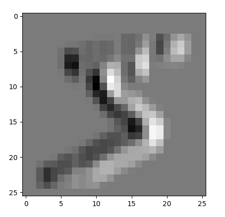
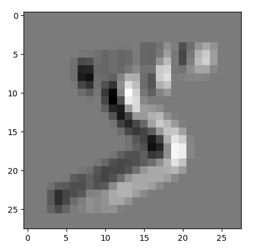
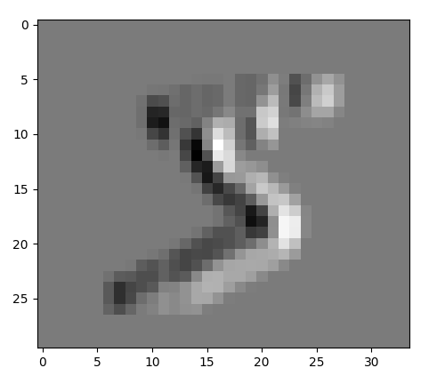
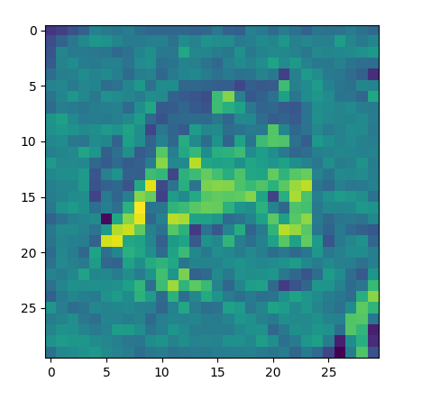
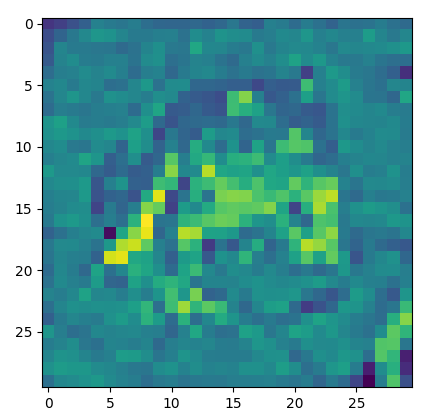
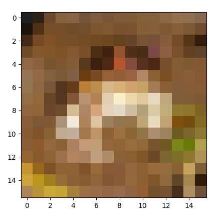

# Convolutions and Pooling
## Resources
* [Image Kernels](https://setosa.io/ev/image-kernels/)
* [Undrestanding Convolutional Layers](https://github.com/Machinelearninguru/Image-Processing-Computer-Vision/blob/master/Convolutional%20Neural%20Network/Convolutional%20Layers/README.md)
* [A Comprehensive Guide to Convolutional Neural Networks — the ELI5 way](https://towardsdatascience.com/a-comprehensive-guide-to-convolutional-neural-networks-the-eli5-way-3bd2b1164a53)
* [What is max pooling in convolutional neural networks?](https://www.quora.com/What-is-max-pooling-in-convolutional-neural-networks)
* [Edge Detection Examples](https://www.youtube.com/watch?v=XuD4C8vJzEQ&list=PLkDaE6sCZn6Gl29AoE31iwdVwSG-KnDzF&index=3)
* [Padding](https://www.youtube.com/watch?v=smHa2442Ah4&list=PLkDaE6sCZn6Gl29AoE31iwdVwSG-KnDzF&index=5)
* [Strided Convolutions](https://www.youtube.com/watch?v=tQYZaDn_kSg&list=PLkDaE6sCZn6Gl29AoE31iwdVwSG-KnDzF&index=6)
* [Convolutions over Volumes](https://www.youtube.com/watch?v=KTB_OFoAQcc&list=PLkDaE6sCZn6Gl29AoE31iwdVwSG-KnDzF&index=7)
* [Pooling Layers](https://www.youtube.com/watch?v=8oOgPUO-TBY&list=PLkDaE6sCZn6Gl29AoE31iwdVwSG-KnDzF&index=10)
* [Convolution](https://en.wikipedia.org/wiki/Convolution)
* [Kernel (image processing)](https://en.wikipedia.org/wiki/Kernel_(image_processing))
* [numpy.pad](https://numpy.org/doc/stable/reference/generated/numpy.pad.html)
* [A guide to convolution arithmetic for deep learning - paper](https://arxiv.org/pdf/1603.07285)
## General
* What is a convolution?
* What is max pooling? average pooling?
* What is a kernel/filter?
* What is padding?
* What is “same” padding? “valid” padding?
* What is a stride?
* What are channels?
* How to perform a convolution over an image
* How to perform max/average pooling over an image

You are not allowed to use np.convolve

# Tasks
## 0. Valid Convolution
Write a function `def convolve_grayscale_valid(images, kernel):` that performs a valid convolution on grayscale images:

* `images` is a `numpy.ndarray` with shape `(m, h, w)` containing multiple grayscale images
    * `m` is the number of images
    * `h` is the height in pixels of the images
    * `w` is the width in pixels of the images
* `kernel` is a `numpy.ndarray` with shape `(kh, kw)` containing the kernel for the convolution
    * `kh` is the height of the kernel
    * `kw` is the width of the kernel
* You are only allowed to use two `for` loops; any other loops of any kind are not allowed
* Returns: a `numpy.ndarray` containing the convolved images
```python
#!/usr/bin/env python3

import matplotlib.pyplot as plt
import numpy as np
convolve_grayscale_valid = __import__('0-convolve_grayscale_valid').convolve_grayscale_valid


if __name__ == '__main__':

    dataset = np.load('MNIST.npz')
    images = dataset['X_train']
    print(images.shape)
    kernel = np.array([[1 ,0, -1], [1, 0, -1], [1, 0, -1]])
    images_conv = convolve_grayscale_valid(images, kernel)
    print(images_conv.shape)

    plt.imshow(images[0], cmap='gray')
    plt.show()
    plt.imshow(images_conv[0], cmap='gray')
    plt.show()
```
```txt
(50000, 28, 28)
(50000, 26, 26)
```


## 1. Same Convolution
Write a function `def convolve_grayscale_same(images, kernel):` that performs a same convolution on grayscale images:
* `images` is a `numpy.ndarray` with shape `(m, h, w)` containing multiple grayscale images
    * `m` is the number of images
    * `h` is the height in pixels of the images
    * `w` is the width in pixels of the images
* `kernel` is a `numpy.ndarray` with shape `(kh, kw)` containing the kernel for the convolution
* `kh` is the height of the kernel
* `kw` is the width of the kernel
* if necessary, the image should be padded with 0’s
* You are only allowed to use two `for` loops; any other loops of any kind are not allowed
* Returns: a `numpy.ndarray` containing the convolved images
```python
#!/usr/bin/env python3

import matplotlib.pyplot as plt
import numpy as np
convolve_grayscale_same = __import__('1-convolve_grayscale_same').convolve_grayscale_same


if __name__ == '__main__':

    dataset = np.load('MNIST.npz')
    images = dataset['X_train']
    print(images.shape)
    kernel = np.array([[1 ,0, -1], [1, 0, -1], [1, 0, -1]])
    images_conv = convolve_grayscale_same(images, kernel)
    print(images_conv.shape)

    plt.imshow(images[0], cmap='gray')
    plt.show()
    plt.imshow(images_conv[0], cmap='gray')
    plt.show()
```
```txt
(50000, 28, 28)
(50000, 28, 28)
```


## 2. Convolution with Padding
Write a function `def convolve_grayscale_padding(images, kernel, padding):` that performs a convolution on grayscale images with custom padding:

* `images` is a `numpy.ndarray` with shape `(m, h, w)` containing multiple grayscale images
    * `m` is the number of images
    * `h` is the height in pixels of the images
    * `w` is the width in pixels of the images
* `kernel` is a `numpy.ndarray` with shape `(kh, kw)` containing the kernel for the convolution
    * `kh` is the height of the kernel
    * `kw` is the width of the kernel
* `padding` is a tuple of `(ph, pw)`
    * `ph` is the padding for the height of the image
    * `pw` is the padding for the width of the image
    * the image should be padded with 0’s
* You are only allowed to use two `for` loops; any other loops of any kind are not allowed
* Returns: a `numpy.ndarray` containing the convolved images
```python
#!/usr/bin/env python3

import matplotlib.pyplot as plt
import numpy as np
convolve_grayscale_padding = __import__('2-convolve_grayscale_padding').convolve_grayscale_padding


if __name__ == '__main__':

    dataset = np.load('MNIST.npz')
    images = dataset['X_train']
    print(images.shape)
    kernel = np.array([[1 ,0, -1], [1, 0, -1], [1, 0, -1]])
    images_conv = convolve_grayscale_padding(images, kernel, (2, 4))
    print(images_conv.shape)

    plt.imshow(images[0], cmap='gray')
    plt.show()
    plt.imshow(images_conv[0], cmap='gray')
    plt.show()
```
```txt
(50000, 28, 28)
(50000, 30, 34)
```


## 3. Strided Convolution

Write a function `def convolve_grayscale(images, kernel, padding='same', stride=(1, 1)):` that performs a convolution on grayscale images:

* `images` is a `numpy.ndarray` with shape `(m, h, w)` containing multiple grayscale images
    * `m` is the number of images
    * `h` is the height in pixels of the images
    * `w` is the width in pixels of the images
* `kernel` is a `numpy.ndarray` with shape `(kh, kw)` containing the kernel for the convolution
    * `kh` is the height of the kernel
    * `kw` is the width of the kernel
* `padding` is either a tuple of `(ph, pw)`, ‘same’, or ‘valid’
    * if ‘same’, performs a same convolution
    * if ‘valid’, performs a valid convolution
    * if a tuple:
        * `ph` is the padding for the height of the image
        * `pw` is the padding for the width of the image
    * the image should be padded with 0’s
* `stride` is a tuple of `(sh, sw)`
    * `sh` is the stride for the height of the image
    * `sw` is the stride for the width of the image
* You are only allowed to use two `for` loops; any other loops of any kind are not allowed *Hint: loop over `i` and `j`*
* Returns: a `numpy.ndarray` containing the convolved images
```python
#!/usr/bin/env python3

import matplotlib.pyplot as plt
import numpy as np
convolve_grayscale = __import__('3-convolve_grayscale').convolve_grayscale


if __name__ == '__main__':

    dataset = np.load('MNIST.npz')
    images = dataset['X_train']
    print(images.shape)
    kernel = np.array([[1 ,0, -1], [1, 0, -1], [1, 0, -1]])
    images_conv = convolve_grayscale(images, kernel, padding='valid', stride=(2, 2))
    print(images_conv.shape)

    plt.imshow(images[0], cmap='gray')
    plt.show()
    plt.imshow(images_conv[0], cmap='gray')
    plt.show()
```
```txt
(50000, 28, 28)
(50000, 13, 13)
```


## 4. Convolution with Channels
Write a function `def convolve_channels(images, kernel, padding='same', stride=(1, 1)):` that performs a convolution on images with channels:

* `images` is a `numpy.ndarray` with shape `(m, h, w, c)` containing multiple images
    * `m` is the number of images
    * `h` is the height in pixels of the images
    * `w` is the width in pixels of the images
    * `c` is the number of channels in the image
* `kernel` is a `numpy.ndarray` with shape `(kh, kw, c)` containing the kernel for the convolution
    * `kh` is the height of the kernel
    * `kw` is the width of the kernel
* `padding` is either a tuple of `(ph, pw)`, ‘same’, or ‘valid’
    * if ‘same’, performs a same convolution
    * if ‘valid’, performs a valid convolution
    * if a tuple:
        * `ph` is the padding for the height of the image
        * `pw` is the padding for the width of the image
    * the image should be padded with 0’s
* `stride` is a tuple of `(sh, sw)`
    * `sh` is the stride for the height of the image
    * `sw` is the stride for the width of the image
* You are only allowed to use two `for` loops; any other loops of any kind are not allowed
* Returns: a `numpy.ndarray` containing the convolved images
```python
#!/usr/bin/env python3

import matplotlib.pyplot as plt
import numpy as np
convolve_channels = __import__('4-convolve_channels').convolve_channels


if __name__ == '__main__':

    dataset = np.load('animals_1.npz')
    images = dataset['data']
    print(images.shape)
    kernel = np.array([[[0, 0, 0], [-1, -1, -1], [0, 0, 0]], [[-1, -1, -1], [5, 5, 5], [-1, -1, -1]], [[0, 0, 0], [-1, -1, -1], [0, 0, 0]]])
    images_conv = convolve_channels(images, kernel, padding='valid')
    print(images_conv.shape)

    plt.imshow(images[0])
    plt.show()
    plt.imshow(images_conv[0])
    plt.show()
```
```txt
(10000, 32, 32, 3)
(10000, 30, 30)
```


## 5. Multiple Kernels
Write a function `def convolve(images, kernels, padding='same', stride=(1, 1)):` that performs a convolution on images using multiple kernels:

* `images` is a `numpy.ndarray` with shape `(m, h, w, c)` containing multiple images
    * `m` is the number of images
    * `h` is the height in pixels of the images
    * `w` is the width in pixels of the images
    * `c` is the number of channels in the image
* `kernels` is a `numpy.ndarray` with shape `(kh, kw, c, nc)` containing the kernels for the convolution
    * `kh` is the height of a kernel
    * `kw` is the width of a kernel
    * `nc` is the number of kernels
* `padding` is either a tuple of `(ph, pw)`, ‘same’, or ‘valid’
    * if ‘same’, performs a same convolution
    * if ‘valid’, performs a valid convolution
    * if a tuple:
        * `ph` is the padding for the height of the image
        * `pw` is the padding for the width of the image
    * the image should be padded with 0’s
* `stride` is a tuple of `(sh, sw)`
    * `sh` is the stride for the height of the image
    * `sw` is the stride for the width of the image
* You are only allowed to use three `for` loops; any other loops of any kind are not allowed
* Returns: a `numpy.ndarray` containing the convolved images
```python
#!/usr/bin/env python3

import matplotlib.pyplot as plt
import numpy as np
convolve = __import__('5-convolve').convolve


if __name__ == '__main__':

    dataset = np.load('animals_1.npz')
    images = dataset['data']
    print(images.shape)
    kernels = np.array([[[[0, 1, 1], [0, 1, 1], [0, 1, 1]], [[-1, 0, 1], [-1, 0, 1], [-1, 0, 1]], [[0, -1, 1], [0, -1, 1], [0, -1, 1]]],
                       [[[-1, 1, 0], [-1, 1, 0], [-1, 1, 0]], [[5, 0, 0], [5, 0, 0], [5, 0, 0]], [[-1, -1, 0], [-1, -1, 0], [-1, -1, 0]]],
                       [[[0, 1, -1], [0, 1, -1], [0, 1, -1]], [[-1, 0, -1], [-1, 0, -1], [-1, 0, -1]], [[0, -1, -1], [0, -1, -1], [0, -1, -1]]]])

    images_conv = convolve(images, kernels, padding='valid')
    print(images_conv.shape)

    plt.imshow(images[0])
    plt.show()
    plt.imshow(images_conv[0, :, :, 0])
    plt.show()
    plt.imshow(images_conv[0, :, :, 1])
    plt.show()
    plt.imshow(images_conv[0, :, :, 2])
    plt.show()
```
```txt
(10000, 32, 32, 3)
(10000, 30, 30, 3)
```




## 6. Pooling
Write a function `def pool(images, kernel_shape, stride, mode='max'):` that performs pooling on images:

* `images` is a `numpy.ndarray` with shape `(m, h, w, c)` containing multiple images
    * `m` is the number of images
    * `h` is the height in pixels of the images
    * `w` is the width in pixels of the images
    * `c` is the number of channels in the image
* `kernel_shape` is a tuple of `(kh, kw)` containing the kernel shape for the pooling
    * `kh` is the height of the kernel
    * `kw` is the width of the kernel
* `stride` is a tuple of `(sh, sw)`
    * `sh` is the stride for the height of the image
    * `sw` is the stride for the width of the image
* `mode` indicates the type of pooling
    * `max` indicates max pooling
    * `avg` indicates average pooling
* You are only allowed to use two `for` loops; any other loops of any kind are not allowed
* Returns: a `numpy.ndarray` containing the pooled images
```python
#!/usr/bin/env python3

import matplotlib.pyplot as plt
import numpy as np
pool = __import__('6-pool').pool


if __name__ == '__main__':

    dataset = np.load('animals_1.npz')
    images = dataset['data']
    print(images.shape)
    images_pool = pool(images, (2, 2), (2, 2), mode='avg')
    print(images_pool.shape)

    plt.imshow(images[0])
    plt.show()
    plt.imshow(images_pool[0] / 255)
    plt.show()
```
```txt
(10000, 32, 32, 3)
(10000, 16, 16, 3)
```

