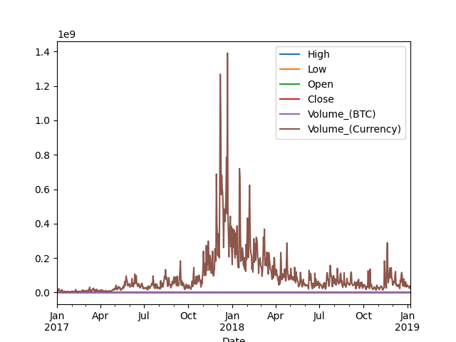

# Pandas


## Resources


**Read or watch:**


* [10 minutes to Pandas](https://pandas.pydata.org/docs/user_guide/10min.html "10 minutes to Pandas")
* [Complete Python Pandas Data Science Tutorial! (Reading CSV/Excel files, Sorting, Filtering, Groupby)](https://www.youtube.com/watch?v=vmEHCJofslg "Complete Python Pandas Data Science Tutorial! (Reading CSV/Excel files, Sorting, Filtering, Groupby)")


## Learning Objectives


At the end of this project, you are expected to be able to [explain to anyone](/rltoken/kn78lu57Jn3EbJ-XjVxZ0w "explain to anyone"), **without the help of Google**:


### General


* What is `pandas`?
* What is a `pd.DataFrame`? How do you create one?
* What is a `pd.Series`? How do you create one?
* How to load data from a file
* How to perform indexing on a `pd.DataFrame`
* How to use hierarchical indexing with a `pd.DataFrame`
* How to slice a `pd.DataFrame`
* How to reassign columns
* How to sort a `pd.DataFrame`
* How to use boolean logic with a `pd.DataFrame`
* How to merge/concatenate/join `pd.DataFrame`s
* How to get statistical information from a `pd.DataFrame`
* How to visualize a `pd.DataFrame`


## Requirements


### General


* Allowed editors: `vi`, `vim`, `emacs`
* All your files will be interpreted/compiled on Ubuntu 20\.04 LTS using `python3` (version 3\.9\)
* Your files will be executed with `numpy` (version 1\.25\.2\) and `pandas` (version 2\.2\.2\)
* All your files should end with a new line
* The first line of all your files should be exactly `#!/usr/bin/env python3`
* All of your files must be executable
* A `README.md` file, at the root of the folder of the project, is mandatory
* Unless otherwise noted, you can only use `import pandas as pd`
* Your code should follow the `pycodestyle` style (version 2\.11\.1\)
* All your modules should have documentation (`python3 -c 'print(__import__("my_module").__doc__)'`)
* All your classes should have documentation (`python3 -c 'print(__import__("my_module").MyClass.__doc__)'`)
* All your functions (inside and outside a class) should have documentation (`python3 -c 'print(__import__("my_module").my_function.__doc__)'` and `python3 -c 'print(__import__("my_module").MyClass.my_function.__doc__)'`)


## Pandas Installation


```
pip install --user pandas==2.2.2
  
```

## Datasets


For this project, we will be using the [coinbase](/rltoken/qxNSNQUc-7AyTu4exzUxIg "coinbase") and [bitstamp](/rltoken/EAG7kiX_FfApWPkb2dsd6Q "bitstamp") datasets, as seen previously in [Time Series Forecasting](../../unsupervised_learning/time_series/README.md "Time Series Forecasting")


## Tasks


### 0\. From Numpy


Write a function `def from_numpy(array):` that creates a `pd.DataFrame` from a `np.ndarray`:


* `array` is the `np.ndarray` from which you should create the `pd.DataFrame`
* The columns of the `pd.DataFrame` should be labeled in alphabetical order and capitalized. There will not be more than 26 columns.
* Returns: the newly created `pd.DataFrame`


```
$ cat 0-main.py
  #!/usr/bin/env python3
  
  import numpy as np
  from_numpy = __import__('0-from_numpy').from_numpy
  
  np.random.seed(0)
  A = np.random.randn(5, 8)
  print(from_numpy(A))
  B = np.random.randn(9, 3)
  print(from_numpy(B))
  $ ./0-main.py
            A         B         C         D         E         F         G         H
  0  1.764052  0.400157  0.978738  2.240893  1.867558 -0.977278  0.950088 -0.151357
  1 -0.103219  0.410599  0.144044  1.454274  0.761038  0.121675  0.443863  0.333674
  2  1.494079 -0.205158  0.313068 -0.854096 -2.552990  0.653619  0.864436 -0.742165
  3  2.269755 -1.454366  0.045759 -0.187184  1.532779  1.469359  0.154947  0.378163
  4 -0.887786 -1.980796 -0.347912  0.156349  1.230291  1.202380 -0.387327 -0.302303
            A         B         C
  0 -1.048553 -1.420018 -1.706270
  1  1.950775 -0.509652 -0.438074
  2 -1.252795  0.777490 -1.613898
  3 -0.212740 -0.895467  0.386902
  4 -0.510805 -1.180632 -0.028182
  5  0.428332  0.066517  0.302472
  6 -0.634322 -0.362741 -0.672460
  7 -0.359553 -0.813146 -1.726283
  8  0.177426 -0.401781 -1.630198
  $
  
```


### 1\. From Dictionary


Write a python script that creates a `pd.DataFrame` from a dictionary:


* The first column should be labeled `First` and have the values `0.0`, `0.5`, `1.0`, and `1.5`
* The second column should be labeled `Second` and have the values `one`, `two`, `three`, `four`
* The rows should be labeled `A`, `B`, `C`, and `D`, respectively
* The `pd.DataFrame` should be saved into the variable `df`


```
$ cat 1-main.py
  #!/usr/bin/env python3
  
  df = __import__('1-from_dictionary').df
  
  print(df)
  $ ./1-main.py
     First Second
  A    0.0    one
  B    0.5    two
  C    1.0  three
  D    1.5   four
  $
  
```


### 2\. From File


Write a function `def from_file(filename, delimiter):` that loads data from a file as a `pd.DataFrame`:


* `filename` is the file to load from
* `delimiter` is the column separator
* Returns: the loaded `pd.DataFrame`


```
$ cat 2-main.py
  #!/usr/bin/env python3
  
  from_file = __import__('2-from_file').from_file
  
  df1 = from_file('coinbaseUSD_1-min_data_2014-12-01_to_2019-01-09.csv', ',')
  print(df1.head())
  df2 = from_file('bitstampUSD_1-min_data_2012-01-01_to_2020-04-22.csv', ',')
  print(df2.tail())
  $ ./2-main.py
      Timestamp   Open   High    Low  Close  Volume_(BTC)  Volume_(Currency)  Weighted_Price
  0  1417411980  300.0  300.0  300.0  300.0          0.01                3.0           300.0
  1  1417412040    NaN    NaN    NaN    NaN           NaN                NaN             NaN
  2  1417412100    NaN    NaN    NaN    NaN           NaN                NaN             NaN
  3  1417412160    NaN    NaN    NaN    NaN           NaN                NaN             NaN
  4  1417412220    NaN    NaN    NaN    NaN           NaN                NaN             NaN
            Timestamp     Open     High      Low    Close  Volume_(BTC)  Volume_(Currency)  Weighted_Price
  4363452  1587513360  6847.97  6856.35  6847.97  6856.35      0.125174         858.128697     6855.498790
  4363453  1587513420  6850.23  6856.13  6850.23  6850.89      1.224777        8396.781459     6855.763449
  4363454  1587513480  6846.50  6857.45  6846.02  6857.45      7.089168       48533.089069     6846.090966
  4363455  1587513540  6854.18  6854.98  6854.18  6854.98      0.012231          83.831604     6854.195090
  4363456  1587513600  6850.60  6850.60  6850.60  6850.60      0.014436          98.896906     6850.600000
  $
  
```

### 3\. Rename


 


Write a function `def rename(df):` that takes a `pd.DataFrame` as input and performs the following:


* `df` is a `pd.DataFrame` containing a column named `Timestamp`.
* The function should rename the `Timestamp` column to `Datetime`.
* Convert the timestamp values to datatime values
* Display only the `Datetime` and `Close` column
* Returns: the modified `pd.DataFrame`


```
$ cat 3-main.py
  #!/usr/bin/env python3
  
  from_file = __import__('2-from_file').from_file
  rename = __import__('3-rename').rename
  
  df = from_file('coinbaseUSD_1-min_data_2014-12-01_to_2019-01-09.csv', ',')
  
  df = rename(df)
  
  print(df.tail())
  $ ./3-main.py
                     Datetime    Close
  2099755 2019-01-07 22:02:00  4006.01
  2099756 2019-01-07 22:03:00  4006.01
  2099757 2019-01-07 22:04:00  4006.01
  2099758 2019-01-07 22:05:00  4005.50
  2099759 2019-01-07 22:06:00  4005.99
  $
  
```


### 4\. To Numpy


Write a function `def array(df):` that takes a `pd.DataFrame` as input and performs the following:


* `df` is a `pd.DataFrame` containing columns named `High` and `Close`.
* The function should select the last 10 rows of the `High` and `Close` columns.
* Convert these selected values into a `numpy.ndarray`.
* Returns: the `numpy.ndarray`


```
$ cat 4-main.py
  #!/usr/bin/env python3
  
  from_file = __import__('2-from_file').from_file
  array = __import__('4-array').array
  
  df = from_file('coinbaseUSD_1-min_data_2014-12-01_to_2019-01-09.csv', ',')
  
  A = array(df)
  
  print(A)
  $ ./4-main.py
  [[4009.54 4007.01]
   [4007.01 4003.49]
   [4007.29 4006.57]
   [4006.57 4006.56]
   [4006.57 4006.01]
   [4006.57 4006.01]
   [4006.57 4006.01]
   [4006.01 4006.01]
   [4006.01 4005.5 ]
   [4006.01 4005.99]]
  $
  
```


### 5\. Slice


Write a function `def slice(df):` that takes a `pd.DataFrame` and:


* Extracts the columns `High`, `Low`, `Close`, and `Volume_BTC`.
* Selects every `60th` row from these columns.
* Returns: the sliced `pd.DataFrame`


```
$ cat 5-main.py
  #!/usr/bin/env python3
  
  from_file = __import__('2-from_file').from_file
  slice = __import__('5-slice').slice
  
  df = from_file('coinbaseUSD_1-min_data_2014-12-01_to_2019-01-09.csv', ',')
  
  df = slice(df)
  
  print(df.tail())
  $ ./5-main.py
              High      Low    Close  Volume_(BTC)
  2099460  4020.08  4020.07  4020.08      4.704989
  2099520  4020.94  4020.93  4020.94      2.111411
  2099580  4020.00  4019.01  4020.00      4.637035
  2099640  4017.00  4016.99  4017.00      2.362372
  2099700  4014.78  4013.50  4014.72      1.291557
  $
  
```

### 6\. Flip it and Switch it


Write a function `def flip_switch(df):` that takes a `pd.DataFrame` and:


* Sorts the data in reverse chronological order.
* Transposes the sorted dataframe.
* Returns: the transformed `pd.DataFrame`.


```
$ cat 6-main.py
  #!/usr/bin/env python3
  
  from_file = __import__('2-from_file').from_file
  flip_switch = __import__('6-flip_switch').flip_switch
  
  df = from_file('coinbaseUSD_1-min_data_2014-12-01_to_2019-01-09.csv', ',')
  
  df = flip_switch(df)
  
  print(df.tail(8))
  $ ./6-main.py
                          2099759       2099758       2099757  ...       2             1             0
  Timestamp          1.546899e+09  1.546899e+09  1.546899e+09  ...  1.417412e+09  1.417412e+09  1.417412e+09
  Open               4.005510e+03  4.006010e+03  4.006010e+03  ...           NaN           NaN  3.000000e+02
  High               4.006010e+03  4.006010e+03  4.006010e+03  ...           NaN           NaN  3.000000e+02
  Low                4.005510e+03  4.005500e+03  4.006000e+03  ...           NaN           NaN  3.000000e+02
  Close              4.005990e+03  4.005500e+03  4.006010e+03  ...           NaN           NaN  3.000000e+02
  Volume_(BTC)       1.752778e+00  2.699700e+00  1.192123e+00  ...           NaN           NaN  1.000000e-02
  Volume_(Currency)  7.021184e+03  1.081424e+04  4.775647e+03  ...           NaN           NaN  3.000000e+00
  Weighted_Price     4.005746e+03  4.005720e+03  4.006004e+03  ...           NaN           NaN  3.000000e+02
  
  [8 rows x 2099760 columns]
  $
  
```


### 7\. Sort


Write a function `def high(df):` that takes a `pd.DataFrame` and:


* Sorts it by the `High` price in descending order.
* Returns: the sorted `pd.DataFrame`.


```
$ cat 7-main.py
  #!/usr/bin/env python3
  
  from_file = __import__('2-from_file').from_file
  high = __import__('7-high').high
  
  df = from_file('coinbaseUSD_1-min_data_2014-12-01_to_2019-01-09.csv', ',')
  
  df = high(df)
  
  print(df.head())
  $ ./7-main.py
            Timestamp      Open      High       Low     Close  Volume_(BTC)  Volume_(Currency)  Weighted_Price
  1543350  1513514220  19891.99  19891.99  19891.98  19891.98      3.323210       66105.250870    19891.984712
  1543352  1513514340  19891.99  19891.99  19891.98  19891.98      9.836946      195676.363110    19891.983294
  1543351  1513514280  19891.99  19891.99  19891.98  19891.98      8.172155      162560.403740    19891.987528
  1543349  1513514160  19891.00  19891.99  19890.99  19891.99      1.336512       26584.930278    19891.272886
  1543353  1513514400  19891.99  19891.99  19876.22  19884.99     19.925151      396292.881750    19889.078007
  $
  
```


### 8\. Prune


Write a function `def prune(df):` that takes a `pd.DataFrame` and:


* Removes any entries where `Close` has `NaN` values.
* Returns: the modified `pd.DataFrame`.


```
$ cat 8-main.py
  #!/usr/bin/env python3
  
  from_file = __import__('2-from_file').from_file
  prune = __import__('8-prune').prune
  
  df = from_file('coinbaseUSD_1-min_data_2014-12-01_to_2019-01-09.csv', ',')
  
  df = prune(df)
  
  print(df.head())
  $ ./8-main.py
         Timestamp   Open   High    Low  Close  Volume_(BTC)  Volume_(Currency)  Weighted_Price
  0     1417411980  300.0  300.0  300.0  300.0      0.010000            3.00000           300.0
  7     1417412400  300.0  300.0  300.0  300.0      0.010000            3.00000           300.0
  51    1417415040  370.0  370.0  370.0  370.0      0.010000            3.70000           370.0
  77    1417416600  370.0  370.0  370.0  370.0      0.026556            9.82555           370.0
  1436  1417498140  377.0  377.0  377.0  377.0      0.010000            3.77000           377.0
  $
  
```


### 9\. Fill


Write a function `def fill(df):` that takes a `pd.DataFrame` and:


* Removes the `Weighted_Price` column.
* Fills missing values in the `Close` column with the previous row’s value.
* Fills missing values in the `High`, `Low`, and `Open` columns with the corresponding `Close` value in the same row.
* Sets missing values in `Volume_(BTC)` and `Volume_(Currency)` to `0`.
* Returns: the modified `pd.DataFrame`.


```
$ cat 9-main.py
  #!/usr/bin/env python3
  
  from_file = __import__('2-from_file').from_file
  fill = __import__('9-fill').fill
  
  df = from_file('coinbaseUSD_1-min_data_2014-12-01_to_2019-01-09.csv', ',')
  
  df = fill(df)
  
  print(df.head())
  print(df.tail())
  $ ./9-main.py
      Timestamp   Open   High    Low  Close  Volume_(BTC)  Volume_(Currency)
  0  1417411980  300.0  300.0  300.0  300.0          0.01                3.0
  1  1417412040  300.0  300.0  300.0  300.0          0.00                0.0
  2  1417412100  300.0  300.0  300.0  300.0          0.00                0.0
  3  1417412160  300.0  300.0  300.0  300.0          0.00                0.0
  4  1417412220  300.0  300.0  300.0  300.0          0.00                0.0
            Timestamp     Open     High      Low    Close  Volume_(BTC)  Volume_(Currency)
  2099755  1546898520  4006.01  4006.57  4006.00  4006.01      3.382954       13553.433078
  2099756  1546898580  4006.01  4006.57  4006.00  4006.01      0.902164        3614.083168
  2099757  1546898640  4006.01  4006.01  4006.00  4006.01      1.192123        4775.647308
  2099758  1546898700  4006.01  4006.01  4005.50  4005.50      2.699700       10814.241898
  2099759  1546898760  4005.51  4006.01  4005.51  4005.99      1.752778        7021.183546
  $
  
```


### 10\. Indexing


Write a function `def index(df):` that takes a `pd.DataFrame` and:


* Sets the `Timestamp` column as the index of the dataframe.
* Returns: the modified `pd.DataFrame`.


```
$ cat 10-main.py
  #!/usr/bin/env python3
  
  from_file = __import__('2-from_file').from_file
  index = __import__('10-index').index
  
  df = from_file('coinbaseUSD_1-min_data_2014-12-01_to_2019-01-09.csv', ',')
  
  df = index(df)
  
  print(df.tail())
  $ ./10-main.py
                 Open     High      Low    Close  Volume_(BTC)  Volume_(Currency)  Weighted_Price
  Timestamp
  1546898520  4006.01  4006.57  4006.00  4006.01      3.382954       13553.433078     4006.390309
  1546898580  4006.01  4006.57  4006.00  4006.01      0.902164        3614.083168     4006.017232
  1546898640  4006.01  4006.01  4006.00  4006.01      1.192123        4775.647308     4006.003635
  1546898700  4006.01  4006.01  4005.50  4005.50      2.699700       10814.241898     4005.719991
  1546898760  4005.51  4006.01  4005.51  4005.99      1.752778        7021.183546     4005.745614
  $
  
```


### 11\. Concat


Write a function `def concat(df1, df2):` that takes two `pd.DataFrame` objects and:


* Indexes both dataframes on their `Timestamp` columns.
* Includes all timestamps from `df2` (bitstamp) up to and including timestamp `1417411920`.
* Concatenates the selected rows from `df2` to the top of `df1` (coinbase).
* Adds keys to the concatenated data, labeling the rows from `df2` as `bitstamp` and the rows from `df1` as `coinbase`.
* You should use `index = __import__('10-index').index`
* Returns the concatenated `pd.DataFrame`.


```
$ cat 11-main.py
  #!/usr/bin/env python3
  
  from_file = __import__('2-from_file').from_file
  concat = __import__('11-concat').concat
  
  df1 = from_file('coinbaseUSD_1-min_data_2014-12-01_to_2019-01-09.csv', ',')
  df2 = from_file('bitstampUSD_1-min_data_2012-01-01_to_2020-04-22.csv', ',')
  
  df = concat(df1, df2)
  
  print(df)
  $ ./11-main.py
                          Open     High      Low    Close  Volume_(BTC)  Volume_(Currency)  Weighted_Price
           Timestamp
  bitstamp 1325317920     4.39     4.39     4.39     4.39      0.455581           2.000000        4.390000
           1325317980      NaN      NaN      NaN      NaN           NaN                NaN             NaN
           1325318040      NaN      NaN      NaN      NaN           NaN                NaN             NaN
           1325318100      NaN      NaN      NaN      NaN           NaN                NaN             NaN
           1325318160      NaN      NaN      NaN      NaN           NaN                NaN             NaN
  ...                      ...      ...      ...      ...           ...                ...             ...
  coinbase 1546898520  4006.01  4006.57  4006.00  4006.01      3.382954       13553.433078     4006.390309
           1546898580  4006.01  4006.57  4006.00  4006.01      0.902164        3614.083168     4006.017232
           1546898640  4006.01  4006.01  4006.00  4006.01      1.192123        4775.647308     4006.003635
           1546898700  4006.01  4006.01  4005.50  4005.50      2.699700       10814.241898     4005.719991
           1546898760  4005.51  4006.01  4005.51  4005.99      1.752778        7021.183546     4005.745614
  
  [3634661 rows x 7 columns]
  $
  
```


### 12\. Hierarchy


Based on `11-concat.py`, write a function `def hierarchy(df1, df2):` that takes two `pd.DataFrame` objects and:


* Rearranges the MultiIndex so that `Timestamp` is the first level.
* Concatenates the bitstamp and coinbase tables from timestamps `1417411980` to `1417417980`, inclusive.
* Adds keys to the data, labeling rows from `df2` as `bitstamp` and rows from `df1` as `coinbase`.
* Ensures the data is displayed in chronological order.
* You should use `index = __import__('10-index').index.`
* Returns: the concatenated `pd.DataFrame`.


```
$ cat 12-main.py
  #!/usr/bin/env python3
  
  from_file = __import__('2-from_file').from_file
  hierarchy = __import__('12-hierarchy').hierarchy
  
  df1 = from_file('coinbaseUSD_1-min_data_2014-12-01_to_2019-01-09.csv', ',')
  df2 = from_file('bitstampUSD_1-min_data_2012-01-01_to_2020-04-22.csv', ',')
  
  df = hierarchy(df1, df2)
  
  print(df)
  $ ./12-main.py
                         Open   High     Low   Close  Volume_(BTC)  Volume_(Currency)  Weighted_Price
  Timestamp
  1417411980 bitstamp  379.99  380.0  379.99  380.00      3.901265        1482.461708      379.995162
             coinbase  300.00  300.0  300.00  300.00      0.010000           3.000000      300.000000
  1417412040 bitstamp  380.00  380.0  380.00  380.00     35.249895       13394.959997      380.000000
             coinbase     NaN    NaN     NaN     NaN           NaN                NaN             NaN
  1417412100 bitstamp  380.00  380.0  380.00  380.00      3.712000        1410.560000      380.000000
  ...                     ...    ...     ...     ...           ...                ...             ...
  1417417860 coinbase     NaN    NaN     NaN     NaN           NaN                NaN             NaN
  1417417920 bitstamp  380.09  380.1  380.09  380.10      1.503000         571.285290      380.096667
             coinbase     NaN    NaN     NaN     NaN           NaN                NaN             NaN
  1417417980 bitstamp  380.10  380.1  378.85  378.85     26.599796       10079.364182      378.926376
             coinbase     NaN    NaN     NaN     NaN           NaN                NaN             NaN
  
  [202 rows x 7 columns]
  $
  
```


### 13\. Analyze


Write a function `def analyze(df):` that takes a `pd.DataFrame` and:


* Computes descriptive statistics for all columns except the `Timestamp` column.
* Returns a new `pd.DataFrame` containing these statistics.


```
$ cat 13-main.py
  #!/usr/bin/env python3
  
  from_file = __import__('2-from_file').from_file
  analyze = __import__('13-analyze').analyze
  
  df = from_file('coinbaseUSD_1-min_data_2014-12-01_to_2019-01-09.csv', ',')
  
  stats = analyze(df)
  
  print(stats)
  $ ./13-main.py
                 Open          High           Low         Close  Volume_(BTC)  Volume_(Currency)  Weighted_Price
  count  1.990691e+06  1.990691e+06  1.990691e+06  1.990691e+06  1.990691e+06       1.990691e+06    1.990691e+06
  mean   3.246403e+03  3.247829e+03  3.244856e+03  3.246403e+03  7.849139e+00       3.600157e+04    3.246341e+03
  std    3.799154e+03  3.801394e+03  3.796761e+03  3.799150e+03  1.873222e+01       1.401879e+05    3.799078e+03
  min    6.000000e-02  6.000000e-02  6.000000e-02  6.000000e-02  1.000000e-08       2.641700e-06    6.000000e-02
  25%    4.195800e+02  4.196400e+02  4.195000e+02  4.195700e+02  9.024000e-01       6.440031e+02    4.195645e+02
  50%    1.014580e+03  1.014890e+03  1.014150e+03  1.014530e+03  2.692900e+00       3.695642e+03    1.014512e+03
  75%    6.322630e+03  6.324010e+03  6.321090e+03  6.322670e+03  7.600965e+00       1.972392e+04    6.322550e+03
  max    1.989199e+04  1.989199e+04  1.989198e+04  1.989199e+04  1.563267e+03       1.997076e+07    1.989199e+04
  $
  
```


### 14\. Visualize


Complete the following script to visualize the `pd.DataFrame`:


* The column `Weighted_Price` should be removed
* Rename the column `Timestamp` to `Date`
* Convert the timestamp values to date values
* Index the data frame on `Date`
* Missing values in `Close` should be set to the previous row value
* Missing values in `High`, `Low`, `Open` should be set to the same row’s `Close` value
* Missing values in `Volume_(BTC)` and `Volume_(Currency)` should be set to `0`
* Plot the data from 2017 and beyond at daily intervals and group the values of the same day such that:


	+ `High`: max
	+ `Low`: min
	+ `Open`: mean
	+ `Close`: mean
	+ `Volume(BTC)`: sum
	+ `Volume(Currency)`: sum
* Return the transformed `pd.DataFrame` before plotting.


```
$ cat 14-visualize.py
  #!/usr/bin/env python3
  
  import matplotlib.pyplot as plt
  import pandas as pd
  from_file = __import__('2-from_file').from_file
  
  df = from_file('coinbaseUSD_1-min_data_2014-12-01_to_2019-01-09.csv', ',')
  
  # YOUR CODE HERE
  
  $ ./14-visualize.py
                 High      Low         Open        Close  Volume_(BTC)  Volume_(Currency)
  Date
  2017-01-01  1000.00   964.37   979.546833   979.547736   4421.502883       4.358723e+06
  2017-01-02  1034.39   990.52  1013.108889  1013.123771   7723.635752       7.816476e+06
  2017-01-03  1036.99  1006.71  1019.497944  1019.524174   8615.260058       8.798077e+06
  2017-01-04  1147.00  1018.00  1082.870194  1083.022799  16222.230267       1.767928e+07
  2017-01-05  1175.00   880.00  1056.222931  1056.177729  20446.405615       2.112913e+07
  ...             ...      ...          ...          ...           ...                ...
  2019-01-03  3893.80  3758.07  3829.991333  3829.922118   8840.254922       3.382343e+07
  2019-01-04  3849.00  3730.00  3785.379042  3785.405590   8950.110359       3.387391e+07
  2019-01-05  3874.12  3775.00  3834.627896  3834.609424   6057.934757       2.322994e+07
  2019-01-06  4088.00  3756.01  3874.269319  3874.451625   9506.268897       3.763788e+07
  2019-01-07  4070.00  3968.79  4025.103866  4025.089887   8876.737621       3.569372e+07
  
  [737 rows x 6 columns]
  
```



