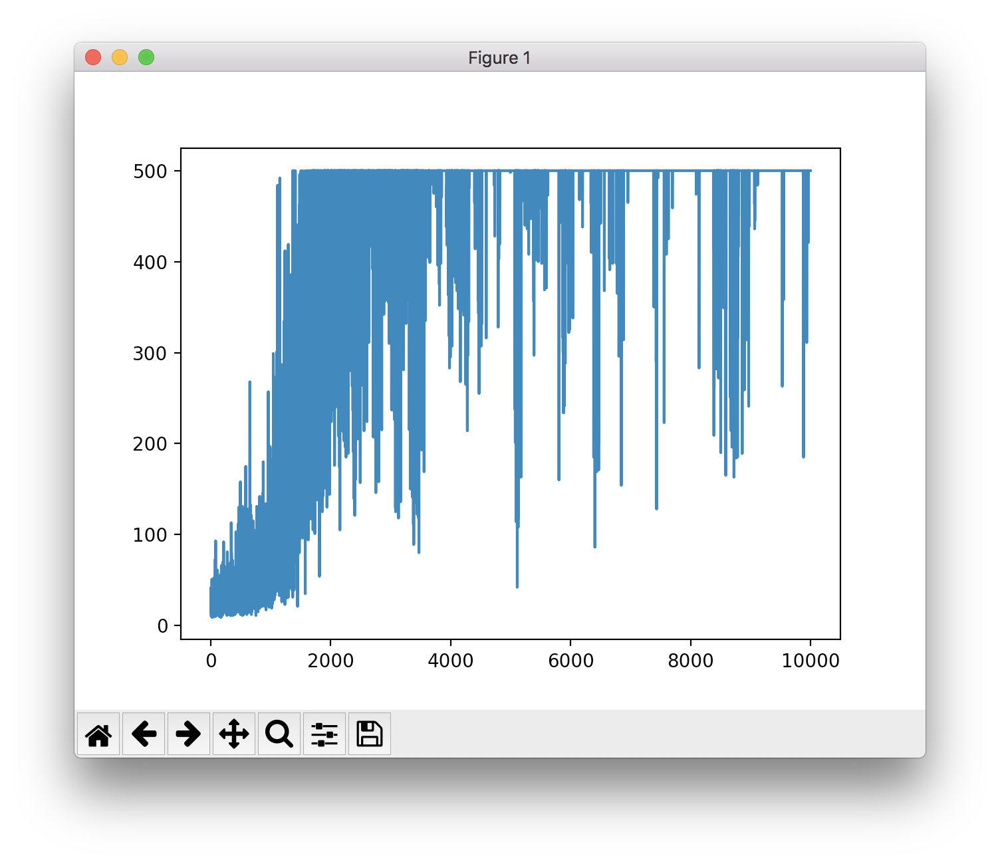
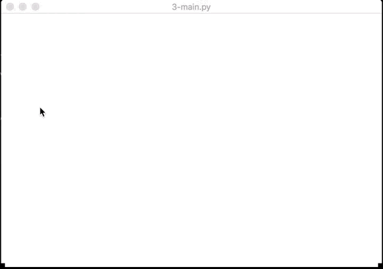
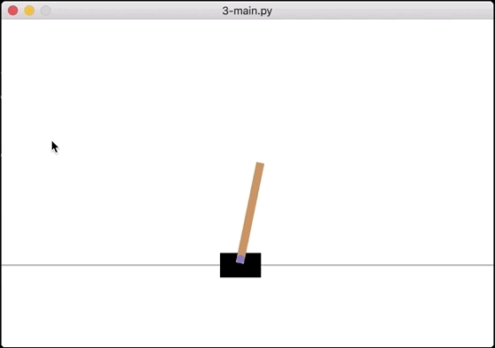
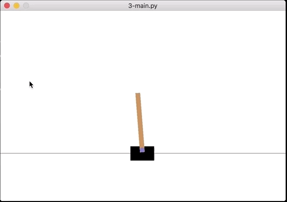

# Policy Gradients


In this project, you will implement your own Policy Gradient in your loop of reinforcement learning (by using the Monte\-Carlo policy gradient algorithm \- also called `REINFORCE`).


## Resources


**Read or watch:**


* [How Policy Gradient Reinforcement Learning Works](https://www.youtube.com/watch?v=A_2U6Sx67sE "How Policy Gradient Reinforcement Learning Works")
* [Policy Gradients in a Nutshell](https://towardsdatascience.com/policy-gradients-in-a-nutshell-8b72f9743c5d "Policy Gradients in a Nutshell")
* [RL Course by David Silver \- Lecture 7: Policy Gradient Methods](https://www.youtube.com/watch?v=KHZVXao4qXs "RL Course by David Silver - Lecture 7: Policy Gradient Methods")
* [Reinforcement Learning 6: Policy Gradients and Actor Critics](https://www.youtube.com/watch?v=bRfUxQs6xIM "Reinforcement Learning 6: Policy Gradients and Actor Critics")
* [Policy Gradient Algorithms](https://lilianweng.github.io/posts/2018-04-08-policy-gradient/ "Policy Gradient Algorithms")


## Learning Objectives


* What is Policy?
* How to calculate a Policy Gradient?
* What and how to use a Monte\-Carlo policy gradient?


## Requirements


### General


* Allowed editors: `vi`, `vim`, `emacs`
* All your files will be interpreted/compiled on Ubuntu 20\.04 LTS using `python3` (version 3\.9\)
* Your files will be executed with `numpy` (version 1\.25\.2\), and `gymnasium` (version 0\.29\.1\)
* All your files should end with a new line
* The first line of all your files should be exactly `#!/usr/bin/env python3`
* A `README.md` file, at the root of the folder of the project, is mandatory
* Your code should use the `pycodestyle` style (version 2\.11\.1\)
* All your modules should have documentation (`python3 -c 'print(__import__("my_module").__doc__)'`)
* All your classes should have documentation (`python3 -c 'print(__import__("my_module").MyClass.__doc__)'`)
* All your functions (inside and outside a class) should have documentation (`python3 -c 'print(__import__("my_module").my_function.__doc__)'` and `python3 -c 'print(__import__("my_module").MyClass.my_function.__doc__)'`)
* All your files must be executable
* **Your code should use the minimum number of operations**


## Tasks


### 0\. Simple Policy function

 


Write a function `def policy(matrix, weight):` that computes the policy with a weight of a matrix.


```
$ cat 0-main.py
  #!/usr/bin/env python3
  
  import numpy as np
  policy = __import__('policy_gradient').policy
  
  
  weight = np.ndarray((4, 2), buffer=np.array([
      [4.17022005e-01, 7.20324493e-01], 
      [1.14374817e-04, 3.02332573e-01], 
      [1.46755891e-01, 9.23385948e-02], 
      [1.86260211e-01, 3.45560727e-01]
      ]))
  state = np.ndarray((1, 4), buffer=np.array([
      [-0.04428214,  0.01636746,  0.01196594, -0.03095031]
      ]))
  
  res = policy(state, weight)
  print(res)
  
  $ ./0-main.py
  [[0.50351642 0.49648358]]
  $
  
```


### 1\. Compute the Monte\-Carlo policy gradient


By using the previous function created `policy`, write a function `def policy_gradient(state, weight):` that computes the Monte\-Carlo policy gradient based on a state and a weight matrix.


* `state`: matrix representing the current observation of the environment
* `weight`: matrix of random weight
* Return: the action and the gradient (in this order)


```
$ cat 1-main.py
  #!/usr/bin/env python3
  
  import gymnasium as gym
  import numpy as np
  import random
  policy_gradient = __import__('policy_gradient').policy_gradient
  
  def set_seed(env, seed=0):
      env.reset(seed=seed)
      np.random.seed(seed)
      random.seed(seed)
  
  env = gym.make('CartPole-v1')
  set_seed(env, 0)
  
  weight = np.random.rand(4, 2)
  state , _ = env.reset()
  print(weight)
  print(state)
  
  action, grad = policy_gradient(state, weight)
  print(action)
  print(grad)
  
  env.close()
  
  $ ./1-main.py
  [[0.5488135  0.71518937]
   [0.60276338 0.54488318]
   [0.4236548  0.64589411]
   [0.43758721 0.891773  ]]
  [0.03132702 0.04127556 0.01066358 0.02294966]
  1
  [[-0.01554121  0.01554121]
   [-0.02047664  0.02047664]
   [-0.00529016  0.00529016]
   [-0.01138523  0.01138523]]
  $ 
  
```


### 2\. Implement the training


Write a function `def train(env, nb_episodes, alpha=0.000045, gamma=0.98):` that implements a full training.


* `env`: initial environment
* `nb_episodes`: number of episodes used for training
* `alpha`: the learning rate
* `gamma`: the discount factor
* You should use `policy_gradient = __import__('policy_gradient').policy_gradient`
* Return: all values of the score (sum of all rewards during one episode loop)


You need print the current episode number and the score after each loop in a format: `Episode: {} Score: {}`


```
$ cat 2-main.py
  #!/usr/bin/env python3
  
  import gymnasium as gym
  import matplotlib.pyplot as plt
  import numpy as np
  import random
  train = __import__('train').train
  
  def set_seed(env, seed=0):
      env.reset(seed=seed)
      np.random.seed(seed)
      random.seed(seed)
  
  env = gym.make('CartPole-v1')
  set_seed(env, 0)
  
  scores = train(env, 10000)
  
  plt.plot(np.arange(len(scores)), scores)
  plt.show()
  env.close()
  
  $ ./2-main.py
  Episode: 0 Score: 22.0
  Episode: 1 Score: 62.0
  Episode: 2 Score: 48.0
  Episode: 3 Score: 17.0
  Episode: 4 Score: 30.0
  Episode: 5 Score: 19.0
  Episode: 6 Score: 19.0
  Episode: 7 Score: 29.0
  Episode: 8 Score: 28.0
  Episode: 9 Score: 26.0
  Episode: 10 Score: 24.0
  
  
  ....
  
  
  Episode: 9990 Score: 500.0
  Episode: 9991 Score: 371.0
  Episode: 9992 Score: 500.0
  Episode: 9993 Score: 500.0
  Episode: 9994 Score: 500.0
  Episode: 9995 Score: 500.0
  Episode: 9996 Score: 500.0
  Episode: 9997 Score: 500.0
  Episode: 9998 Score: 500.0
  Episode: 9999 Score: 500.0
  
```




*Note:* we highly encourage you to modify the values of `alpha` and `gamma` to change the trend of the plot


### 3\. Animate iteration


In the file `train.py`, update the function `def train(env, nb_episodes, alpha=0.000045, gamma=0.98, show_result=False)` by adding a last optional parameter `show_result` (default: `False`).


When this parameter is set to `True`, you should render the environment every 1000 episodes computed.


```
$ cat 3-main.py
  #!/usr/bin/env python3
  
  import gymnasium as gym
  import matplotlib.pyplot as plt
  import numpy as np
  import random
  train = __import__('train').train
  
  def set_seed(env, seed=0):
      env.reset(seed=seed)
      np.random.seed(seed)
      random.seed(seed)
  
  env = gym.make('CartPole-v1', render_mode="human")
  set_seed(env, 0)
  
  scores = train(env, 10000, 0.000045, 0.98, True)
  
  env.close()
  
  $ ./3-main.py
  
```

**Result after few episodes:**





**Result after more episodes:**





**Result after 10000 episodes:**




