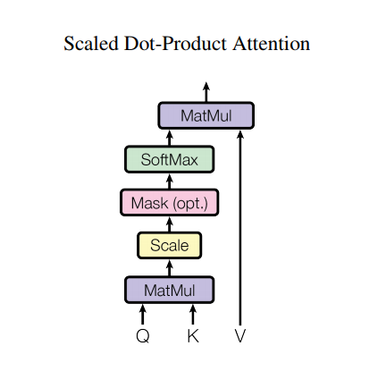

# Attention

## Resources:


**Read or watch:**


* [Attention Model Intuition](https://www.youtube.com/watch?v=SysgYptB198 "Attention Model Intuition")
* [Attention Model](https://www.youtube.com/watch?v=quoGRI-1l0A "Attention Model")
* [How Transformers work in deep learning and NLP: an intuitive introduction](https://theaisummer.com/transformer/ "How Transformers work in deep learning and NLP: an intuitive introduction")
* [Transformers](https://towardsdatascience.com/transformers-explained-visually-part-1-overview-of-functionality-95a6dd460452 "Transformers")
* [Bert, GPT : The Illustrated GPT\-2 \- Visualizing Transformer Language Models](https://jalammar.github.io/illustrated-gpt2/ "Bert, GPT : The Illustrated GPT-2 - Visualizing Transformer Language Models")
* [SQuAD](https://rajpurkar.github.io/SQuAD-explorer/ "SQuAD")
* [Glue](https://mccormickml.com/2019/11/05/GLUE/ "Glue")
* [Self supervised learning](https://lilianweng.github.io/posts/2019-11-10-self-supervised/ "Self supervised learning")


## Learning Objectives


At the end of this project, you are expected to be able to [explain to anyone](/rltoken/kR284vgOAH-KujtFur8DaA "explain to anyone"), **without the help of Google**:


### General


* What is the attention mechanism?
* How to apply attention to RNNs
* What is a transformer?
* How to create an encoder\-decoder transformer model
* What is GPT?
* What is BERT?
* What is self\-supervised learning?
* How to use BERT for specific NLP tasks
* What is SQuAD? GLUE?


#### Question \#0


What is the Attention mechanism?


* An RNN
* A transformer
* ***A method for determining which terms are most important in a sequence***
* None of the above


#### Question \#1


A Transformer:


* ***Is a novel neural network***
* ***Utilizes the Attention mechanism***
* Utilizes RNNs
* ***Utilizes Fully Connected Networks***
* Utilizes CNNs
* ***Utilizes dropout***
* ***Utilizes layer normalization***


#### Question \#2


BERT was novel because:


* It used transformers for the first time
* ***It introduced self\-supervised learning techniques***
* It utilized layer normalization for the first time
* ***It can be fine tuned for various NLP tasks***


#### Question \#3


The database to use for Question\-Answering is:


* GLUE
* ***SQuAD***
* Penn Treebank
* WikiText


#### Question \#4


Layer Normalization is different from Batch Normalization because:


* ***It normalizes the layer output for each example instead of across the batch***
* It normalizes the layer output across the batch instead of for each example
* It learns the gamma and beta constants
* It does not need to learn the gamma and beta constants


## Tasks


### 0\. RNN Encoder


**Resources:**


* [Encoder\-Decoder Architecture](https://web.stanford.edu/~jurafsky/slp3/old_dec21/10.pdf "Encoder-Decoder Architecture")


Create a class `RNNEncoder` that inherits from `tensorflow.keras.layers.Layer` to encode for machine translation:


* Class constructor `def __init__(self, vocab, embedding, units, batch):`
    + `vocab` is an integer representing the size of the input vocabulary
    + `embedding` is an integer representing the dimensionality of the embedding vector
    + `units` is an integer representing the number of hidden units in the RNN cell
    + `batch` is an integer representing the batch size
    + Sets the following public instance attributes:
        - `batch` \- the batch size
        - `units` \- the number of hidden units in the RNN cell
        - `embedding` \- a `keras` Embedding layer that converts words from the vocabulary into an embedding vector
        - `gru` \- a `keras` GRU layer with `units` units
            * Should return both the full sequence of outputs as well as the last hidden state
            * Recurrent weights should be initialized with `glorot_uniform`
* Public instance method `def initialize_hidden_state(self):`
    + Initializes the hidden states for the RNN cell to a tensor of zeros
    + Returns: a tensor of shape `(batch, units)`containing the initialized hidden states
* Public instance method `def call(self, x, initial):`
    + `x` is a tensor of shape `(batch, input_seq_len)` containing the input to the encoder layer as word indices within the vocabulary
    + `initial` is a tensor of shape `(batch, units)` containing the initial hidden state
    + Returns: `outputs, hidden`
        - `outputs` is a tensor of shape `(batch, input_seq_len, units)`containing the outputs of the encoder
        - `hidden` is a tensor of shape `(batch, units)` containing the last hidden state of the encoder


```
$ cat 0-main.py
  #!/usr/bin/env python3
  
  import os
  import random
  import numpy as np
  import tensorflow as tf
  RNNEncoder = __import__('0-rnn_encoder').RNNEncoder
  
  SEED = 0
  
  os.environ['PYTHONHASHSEED'] = str(SEED)
  os.environ['TF_ENABLE_ONEDNN_OPTS']= '0'
  random.seed(SEED)
  np.random.seed(SEED)
  tf.random.set_seed(SEED)
  
  encoder = RNNEncoder(1024, 128, 256, 32)
  print(encoder.batch)
  print(encoder.units)
  print(type(encoder.embedding))
  print(type(encoder.gru))
  
  initial = encoder.initialize_hidden_state()
  print(initial)
  x = tf.convert_to_tensor(np.random.choice(1024, 320).reshape((32, 10)))
  outputs, hidden = encoder(x, initial)
  print(outputs)
  print(hidden)
  
  $ ./0-main.py
  32
  256
  <class 'keras.src.layers.core.embedding.Embedding'>
  <class 'keras.src.layers.rnn.gru.GRU'>
  tf.Tensor(
  [[0. 0. 0. ... 0. 0. 0.]
   [0. 0. 0. ... 0. 0. 0.]
   [0. 0. 0. ... 0. 0. 0.]
   ...
   [0. 0. 0. ... 0. 0. 0.]
   [0. 0. 0. ... 0. 0. 0.]
   [0. 0. 0. ... 0. 0. 0.]], shape=(32, 256), dtype=float32)
  tf.Tensor(
  [[[-1.74142271e-02 -3.89235141e-03 -8.51056259e-03 ...  1.49093680e-02
      4.63607861e-03 -9.50032566e-03]
    [-5.84721565e-04 -3.91376554e-04 -2.93731736e-03 ...  1.15313074e-02
     -7.68443570e-03 -3.75221833e-03]
    [-9.24797729e-03  1.67387016e-02  6.24627667e-03 ...  1.55981146e-02
      2.26214388e-03 -9.24688391e-03]
    ...
    [ 1.34258457e-02  8.30825977e-03 -7.51758285e-04 ...  1.90226361e-04
      1.30655989e-02  2.49108020e-03]
    [ 4.78143152e-03 -8.10730271e-04 -1.00142392e-03 ... -1.56135252e-02
      2.89195986e-03 -3.54669173e-04]
    [ 4.26594540e-03  1.33996131e-04  7.95928389e-03 ...  3.99613706e-03
      4.48268326e-03  1.42817274e-02]]
  
   [[ 7.52532436e-03 -1.35537540e-03 -1.28698545e-02 ... -5.14904317e-03
      2.68403906e-03  1.04913488e-02]
    [ 9.11259279e-03 -6.77481527e-03 -9.17317811e-04 ...  8.76265019e-03
     -2.68179132e-03  1.20133627e-02]
    [ 8.17885343e-03 -5.05809765e-03 -2.12020217e-03 ...  2.47152708e-03
     -7.26442412e-03 -7.63968425e-03]
    ...
    [ 6.57141162e-03 -2.25669704e-04 -7.60185253e-03 ... -1.48501331e-02
      1.37939379e-02 -3.89854237e-03]
    [-5.47449803e-03 -1.33437477e-03 -6.83795754e-03 ... -6.68091979e-03
      1.15233706e-02 -3.17198667e-03]
    [-3.55886039e-03  4.21073288e-03 -9.21770371e-03 ... -2.97956401e-03
      1.39657464e-02  1.53261574e-03]]
  
   [[-7.19928974e-03 -1.00736588e-03 -8.34278390e-03 ... -7.29498826e-03
      1.56773499e-03 -7.77953910e-03]
    [ 7.78230838e-04  3.65802879e-03 -8.34519975e-03 ... -1.49406707e-02
      4.18565236e-03 -9.79836006e-03]
    [ 9.74294450e-03 -2.95141013e-03 -5.76773193e-03 ... -7.20661227e-03
      4.05754847e-03 -3.77799198e-03]
    ...
    [-1.09697524e-02 -1.03750955e-02  7.75756361e-03 ...  1.13604795e-02
      5.32619841e-03 -5.72749879e-04]
    [-6.10416755e-05 -4.34501050e-03  1.05241481e-02 ...  4.36363276e-03
     -5.62157575e-03 -9.19129141e-03]
    [ 5.39145386e-03  2.62276083e-03  9.23258439e-03 ...  6.02420373e-03
      1.13695650e-03 -5.17539633e-03]]
  
   ...
  
   [[-6.79599447e-03  3.11575853e-03  8.97119113e-04 ... -7.52710039e-03
     -8.28311138e-04  6.72761025e-03]
    [-1.13246497e-04 -1.29621197e-02 -1.28611512e-02 ... -2.99650826e-03
      2.54572020e-03 -6.43039402e-03]
    [-1.43136200e-03 -7.40902731e-03 -1.19427890e-02 ... -4.15645353e-03
     -3.06429085e-03 -6.67242426e-03]
    ...
    [-1.86468307e-02  8.25729221e-05  4.88887541e-03 ...  1.70315616e-02
      1.16138887e-02  5.58980647e-03]
    [-2.35942211e-02  4.85955598e-03  1.10336617e-02 ...  1.28208399e-02
      2.58452375e-03  2.73110345e-03]
    [-2.07302142e-02  6.64734468e-03  5.04746288e-03 ...  9.56790242e-03
      1.00734713e-03  5.69596421e-03]]
  
   [[-9.47472267e-03 -1.70626137e-02  2.48293462e-03 ...  1.29151074e-02
     -8.63068271e-03  1.05677098e-02]
    [-1.24788247e-02 -1.27956532e-02  1.95848267e-03 ...  1.95153002e-02
      3.90491448e-03  1.48390662e-02]
    [-7.68601988e-03 -5.64213749e-03 -3.33623332e-03 ...  1.01357289e-02
      6.94351038e-03  5.83107024e-03]
    ...
    [-4.30166628e-03  7.51455221e-03 -1.04957279e-02 ... -2.88447295e-03
     -1.42362788e-02 -2.68716458e-03]
    [-1.40348263e-02  6.42398279e-03 -9.30832699e-03 ... -1.12284031e-02
     -8.88590608e-03 -3.61560704e-03]
    [-1.58205163e-02  9.33581963e-03  2.75502773e-03 ... -5.35997469e-03
     -2.38720588e-02  3.06660077e-03]]
  
   [[ 7.73729803e-03 -4.44842130e-03  5.63857518e-03 ...  3.18730809e-03
     -4.92696883e-03  1.11598885e-02]
    [ 7.35040195e-03  8.61594919e-03  3.87694687e-04 ...  7.80755654e-05
      2.45569716e-03  8.40273034e-03]
    [ 2.92819180e-02  3.31264082e-03 -7.53348134e-03 ... -3.33810388e-03
      3.58300656e-03  1.39219426e-02]
    ...
    [-1.69593524e-02 -1.01030637e-02  3.99637548e-03 ...  7.14730192e-03
     -6.44843373e-03 -1.46967429e-03]
    [-6.37400430e-03 -1.14012649e-03 -2.91527808e-03 ...  5.04813716e-03
     -7.53194978e-03  2.39911885e-03]
    [-6.77434355e-03  2.09403643e-03  5.91345876e-03 ...  8.03208165e-03
     -1.16485041e-02 -1.14040822e-02]]], shape=(32, 10, 256), dtype=float32)
  tf.Tensor(
  [[ 0.00426595  0.000134    0.00795928 ...  0.00399614  0.00448268
     0.01428173]
   [-0.00355886  0.00421073 -0.0092177  ... -0.00297956  0.01396575
     0.00153262]
   [ 0.00539145  0.00262276  0.00923258 ...  0.0060242   0.00113696
    -0.0051754 ]
   ...
   [-0.02073021  0.00664734  0.00504746 ...  0.0095679   0.00100735
     0.00569596]
   [-0.01582052  0.00933582  0.00275503 ... -0.00535997 -0.02387206
     0.0030666 ]
   [-0.00677434  0.00209404  0.00591346 ...  0.00803208 -0.0116485
    -0.01140408]], shape=(32, 256), dtype=float32)
  $
  
```


### 1\. Self Attention


Create a class `SelfAttention` that inherits from `tensorflow.keras.layers.Layer` to calculate the attention for machine translation based on [this paper](/rltoken/0yNFuFthNFiq6PgLqEGT6w "this paper"):


* Class constructor `def __init__(self, units):`
    + `units` is an integer representing the number of hidden units in the alignment model
    + Sets the following public instance attributes:
        - `W` \- a Dense layer with `units` units, to be applied to the previous decoder hidden state
        - `U` \- a Dense layer with `units` units, to be applied to the encoder hidden states
        - `V` \- a Dense layer with `1` units, to be applied to the tanh of the sum of the outputs of `W` and `U`
* Public instance method `def call(self, s_prev, hidden_states):`
    + `s_prev` is a tensor of shape `(batch, units)` containing the previous decoder hidden state
    + `hidden_states` is a tensor of shape `(batch, input_seq_len, units)`containing the outputs of the encoder
    + Returns: `context, weights`
        - `context` is a tensor of shape `(batch, units)` that contains the context vector for the decoder
        - `weights` is a tensor of shape `(batch, input_seq_len, 1)` that contains the attention weights


```
$ cat 1-main.py
  #!/usr/bin/env python3
  import os
  import random
  import numpy as np
  import tensorflow as tf
  SelfAttention = __import__('1-self_attention').SelfAttention
  
  SEED = 0
  
  os.environ['PYTHONHASHSEED'] = str(SEED)
  os.environ['TF_ENABLE_ONEDNN_OPTS']= '0'
  random.seed(SEED)
  np.random.seed(SEED)
  tf.random.set_seed(SEED)
  
  attention = SelfAttention(256)
  print(attention.W)
  print(attention.U)
  print(attention.V)
  s_prev = tf.convert_to_tensor(np.random.uniform(size=(32, 256)), dtype='float32')
  hidden_states = tf.convert_to_tensor(np.random.uniform(size=(32, 10, 256)), dtype='float32')
  context, weights = attention(s_prev, hidden_states)
  print(context)
  print(weights)
  
  $ ./1-main.py
  <keras.src.layers.core.dense.Dense object at 0x7ffa2d4ac790>
  <keras.src.layers.core.dense.Dense object at 0x7ffa2d4ac880>
  <keras.src.layers.core.dense.Dense object at 0x7ffa2d4acca0>
  tf.Tensor(
  [[0.50068104 0.35999915 0.5753905  ... 0.8286368  0.5798173  0.56727207]
   [0.47350612 0.62482584 0.3285846  ... 0.42682472 0.49858013 0.672496  ]
   [0.22056103 0.46804088 0.432721   ... 0.54883766 0.42714238 0.35001016]
   ...
   [0.53201735 0.6531013  0.5120029  ... 0.31989235 0.43202806 0.59810686]
   [0.50376165 0.45158604 0.46058592 ... 0.43019643 0.58157706 0.5190387 ]
   [0.57854825 0.4963132  0.55556387 ... 0.44325104 0.404953   0.548978  ]], shape=(32, 256), dtype=float32)
  tf.Tensor(
  [[[0.14724821]
    [0.10781321]
    [0.11434454]
    [0.1132399 ]
    [0.07801075]
    [0.10650859]
    [0.07545592]
    [0.08692006]
    [0.09276024]
    [0.07769857]]
  
   [[0.10400047]
    [0.07279713]
    [0.09810076]
    [0.07453301]
    [0.1240024 ]
    [0.10683238]
    [0.11495142]
    [0.07774312]
    [0.09166444]
    [0.13537486]]
  
   [[0.07755483]
    [0.0852491 ]
    [0.12072365]
    [0.12271   ]
    [0.07241778]
    [0.17065749]
    [0.1026929 ]
    [0.0784734 ]
    [0.07494164]
    [0.0945792 ]]
  
   [[0.09826168]
    [0.07952462]
    [0.0950299 ]
    [0.10500778]
    [0.0723196 ]
    [0.10094673]
    [0.12895694]
    [0.13719358]
    [0.07645486]
    [0.10630436]]
  
   [[0.11565278]
    [0.05762318]
    [0.10614143]
    [0.11899449]
    [0.11896697]
    [0.11451253]
    [0.09891988]
    [0.11219256]
    [0.09748574]
    [0.05951046]]
  
   [[0.07356521]
    [0.09898358]
    [0.12263406]
    [0.08155078]
    [0.0678113 ]
    [0.11519608]
    [0.12043938]
    [0.07367557]
    [0.10019817]
    [0.14594583]]
  
   [[0.0692794 ]
    [0.14381956]
    [0.15188614]
    [0.09404032]
    [0.11011412]
    [0.07663297]
    [0.10377767]
    [0.04066544]
    [0.12163248]
    [0.08815192]]
  
   [[0.08394238]
    [0.10298291]
    [0.12356355]
    [0.09895544]
    [0.09427334]
    [0.13146912]
    [0.08105513]
    [0.07745896]
    [0.09604127]
    [0.11025794]]
  
   [[0.06945458]
    [0.1514634 ]
    [0.07433216]
    [0.05686743]
    [0.07809442]
    [0.12101213]
    [0.12945329]
    [0.09417004]
    [0.13311951]
    [0.09203313]]
  
   [[0.15463622]
    [0.09353263]
    [0.06904189]
    [0.07243785]
    [0.13020346]
    [0.0913386 ]
    [0.10541885]
    [0.07700983]
    [0.10857236]
    [0.09780822]]
  
   [[0.0638803 ]
    [0.05486979]
    [0.11300313]
    [0.09371817]
    [0.07165667]
    [0.14315923]
    [0.12971611]
    [0.12307677]
    [0.1159331 ]
    [0.09098681]]
  
   [[0.12167089]
    [0.07490992]
    [0.09525193]
    [0.11255455]
    [0.08126828]
    [0.06460188]
    [0.13472053]
    [0.08922141]
    [0.08435662]
    [0.14144398]]
  
   [[0.10423127]
    [0.12219117]
    [0.09000731]
    [0.06884094]
    [0.08655863]
    [0.09046154]
    [0.12694399]
    [0.1500637 ]
    [0.06027255]
    [0.10042884]]
  
   [[0.12176964]
    [0.13417652]
    [0.08125137]
    [0.08762369]
    [0.11616139]
    [0.0842796 ]
    [0.10698344]
    [0.07356922]
    [0.07775143]
    [0.11643363]]
  
   [[0.10722716]
    [0.05625595]
    [0.07732907]
    [0.08102682]
    [0.10180298]
    [0.1422218 ]
    [0.06462744]
    [0.15195264]
    [0.10365744]
    [0.11389866]]
  
   [[0.10684143]
    [0.08546161]
    [0.09708846]
    [0.09142581]
    [0.09428932]
    [0.08590844]
    [0.1426583 ]
    [0.09193917]
    [0.09060359]
    [0.11378375]]
  
   [[0.07269415]
    [0.08272386]
    [0.13226907]
    [0.07378723]
    [0.10133978]
    [0.1478557 ]
    [0.10764401]
    [0.12228185]
    [0.09061841]
    [0.06878605]]
  
   [[0.08485384]
    [0.10637045]
    [0.07873966]
    [0.18311842]
    [0.08747162]
    [0.07879652]
    [0.09650286]
    [0.0957003 ]
    [0.08079659]
    [0.10764971]]
  
   [[0.08501881]
    [0.09087761]
    [0.08991265]
    [0.08467881]
    [0.09974873]
    [0.08450591]
    [0.18423901]
    [0.11831332]
    [0.06473418]
    [0.0979709 ]]
  
   [[0.05516191]
    [0.09160107]
    [0.11611438]
    [0.07898078]
    [0.08232855]
    [0.07532827]
    [0.11784155]
    [0.17345215]
    [0.12345934]
    [0.08573199]]
  
   [[0.1402591 ]
    [0.10216264]
    [0.06680074]
    [0.10797368]
    [0.0778444 ]
    [0.11733831]
    [0.11620195]
    [0.08017281]
    [0.10879207]
    [0.08245433]]
  
   [[0.07969382]
    [0.05549245]
    [0.117069  ]
    [0.12156182]
    [0.08158664]
    [0.11611962]
    [0.07629369]
    [0.13078874]
    [0.13031922]
    [0.09107494]]
  
   [[0.07915786]
    [0.08489184]
    [0.1711769 ]
    [0.10882694]
    [0.07595528]
    [0.0996822 ]
    [0.09506348]
    [0.08704641]
    [0.08686324]
    [0.11133577]]
  
   [[0.0516939 ]
    [0.12500669]
    [0.07551295]
    [0.12825708]
    [0.08155235]
    [0.07588466]
    [0.16207492]
    [0.1334027 ]
    [0.07565004]
    [0.09096475]]
  
   [[0.09239732]
    [0.06419629]
    [0.11824801]
    [0.08470549]
    [0.1649418 ]
    [0.12018687]
    [0.09169098]
    [0.07683938]
    [0.11621942]
    [0.07057454]]
  
   [[0.07049764]
    [0.09099092]
    [0.09589216]
    [0.11414758]
    [0.17559461]
    [0.10744226]
    [0.06097679]
    [0.06486844]
    [0.11498308]
    [0.10460657]]
  
   [[0.09778619]
    [0.07347592]
    [0.12651655]
    [0.08021829]
    [0.09066951]
    [0.1044469 ]
    [0.1468272 ]
    [0.08358257]
    [0.08419735]
    [0.11227953]]
  
   [[0.09187843]
    [0.09316279]
    [0.05442771]
    [0.09407877]
    [0.0977243 ]
    [0.10862106]
    [0.10766959]
    [0.10324799]
    [0.12891473]
    [0.12027452]]
  
   [[0.14318813]
    [0.10382833]
    [0.07923939]
    [0.06164904]
    [0.11623345]
    [0.12432601]
    [0.11872908]
    [0.09875827]
    [0.08656292]
    [0.06748541]]
  
   [[0.10562424]
    [0.13663028]
    [0.0717572 ]
    [0.08802442]
    [0.08641439]
    [0.12051433]
    [0.07993656]
    [0.07815708]
    [0.07900238]
    [0.15393914]]
  
   [[0.12210173]
    [0.10181221]
    [0.07216708]
    [0.15174533]
    [0.08198113]
    [0.13001503]
    [0.08337153]
    [0.11040616]
    [0.07464323]
    [0.07175656]]
  
   [[0.10515954]
    [0.12850212]
    [0.10353024]
    [0.09855691]
    [0.11759118]
    [0.08227032]
    [0.06299188]
    [0.08707691]
    [0.1536208 ]
    [0.06070012]]], shape=(32, 10, 1), dtype=float32)
  $
  
```


### 2\. RNN Decoder


Create a class `RNNDecoder` that inherits from `tensorflow.keras.layers.Layer` to decode for machine translation:


* Class constructor `def __init__(self, vocab, embedding, units, batch):`
    + `vocab` is an integer representing the size of the output vocabulary
    + `embedding` is an integer representing the dimensionality of the embedding vector
    + `units` is an integer representing the number of hidden units in the RNN cell
    + `batch` is an integer representing the batch size
    + Sets the following public instance attributes:
        - `embedding` \- a `keras` Embedding layer that converts words from the vocabulary into an embedding vector
        - `gru` \- a `keras` GRU layer with `units` units
            * Should return both the full sequence of outputs as well as the last hidden state
            * Recurrent weights should be initialized with `glorot_uniform`
        - `F` \- a Dense layer with `vocab` units
* Public instance method `def call(self, x, s_prev, hidden_states):`
    + `x` is a tensor of shape `(batch, 1)` containing the previous word in the target sequence as an index of the target vocabulary
    + `s_prev` is a tensor of shape `(batch, units)` containing the previous decoder hidden state
    + `hidden_states` is a tensor of shape `(batch, input_seq_len, units)`containing the outputs of the encoder
    + You should use `SelfAttention = __import__('1-self_attention').SelfAttention`
    + You should concatenate the context vector with x in that order
    + Returns: `y, s`
        - `y` is a tensor of shape `(batch, vocab)` containing the output word as a one hot vector in the target vocabulary
        - `s` is a tensor of shape `(batch, units)` containing the new decoder hidden state


```
$ cat 2-main.py
  #!/usr/bin/env python3
  
  import os
  import random
  import numpy as np
  import tensorflow as tf
  RNNDecoder = __import__('2-rnn_decoder').RNNDecoder
  
  SEED = 0
  
  os.environ['PYTHONHASHSEED'] = str(SEED)
  os.environ['TF_ENABLE_ONEDNN_OPTS']= '0'
  random.seed(SEED)
  np.random.seed(SEED)
  tf.random.set_seed(SEED)
  
  decoder = RNNDecoder(2048, 128, 256, 32)
  print(decoder.embedding)
  print(decoder.gru)
  print(decoder.F)
  x = tf.convert_to_tensor(np.random.choice(2048, 32).reshape((32, 1)))
  s_prev = tf.convert_to_tensor(np.random.uniform(size=(32, 256)).astype('float32'))
  hidden_states = tf.convert_to_tensor(np.random.uniform(size=(32, 10, 256)).astype('float32'))
  y, s = decoder(x, s_prev, hidden_states)
  print(y)
  print(s)
  
  $ ./2-main.py
  <keras.src.layers.core.embedding.Embedding object at 0x7f21fea4fa00>
  <keras.src.layers.rnn.gru.GRU object at 0x7f21fea4feb0>
  <keras.src.layers.core.dense.Dense object at 0x7f21fea4fb50>
  tf.Tensor(
  [[ 0.07594122 -0.06683134 -0.00353443 ... -0.01380132 -0.07430409
     0.05436545]
   [ 0.05964783 -0.06427805  0.00594195 ... -0.00375755 -0.07529657
     0.0459756 ]
   [ 0.08342346 -0.05243419  0.02600938 ... -0.02954697 -0.07255351
     0.04031987]
   ...
   [ 0.03871213 -0.0549646   0.03641395 ... -0.01287442 -0.0811441
     0.04819249]
   [ 0.05545232 -0.05567571  0.0187438  ... -0.03115362 -0.07046242
    -0.01458246]
   [ 0.03299018 -0.0449543  -0.00972849 ... -0.02007155 -0.06619234
     0.03725915]], shape=(32, 2048), dtype=float32)
  tf.Tensor(
  [[-0.08166491 -0.11155219 -0.11592583 ...  0.25933605 -0.35460776
    -0.11886868]
   [-0.09068521 -0.08201759 -0.1762234  ...  0.24496002 -0.34050915
    -0.11312985]
   [-0.10241994 -0.08012351 -0.10885644 ...  0.30567974 -0.34038642
    -0.1400544 ]
   ...
   [-0.06005613 -0.12483618 -0.1268834  ...  0.18011253 -0.36066085
    -0.17498502]
   [-0.07998676 -0.08068365 -0.16094378 ...  0.22919011 -0.4265315
    -0.12306477]
   [-0.05149366 -0.10878316 -0.16772477 ...  0.21175046 -0.33020326
    -0.11319841]], shape=(32, 256), dtype=float32)
  $
  
```


### 3\. Positional Encoding


Write the function `def positional_encoding(max_seq_len, dm):` that calculates the positional encoding for a transformer:


* `max_seq_len` is an integer representing the maximum sequence length
* `dm` is the model depth
* Returns: a `numpy.ndarray` of shape `(max_seq_len, dm)` containing the positional encoding vectors
* You should use `import numpy as np`


```
$ cat 4-main.py
  #!/usr/bin/env python3
  
  import numpy as np
  positional_encoding = __import__('4-positional_encoding').positional_encoding
  
  PE = positional_encoding(30, 512)
  print(PE.shape)
  print(PE)
  $ ./4-main.py
  (30, 512)
  [[ 0.00000000e+00  1.00000000e+00  0.00000000e+00 ...  1.00000000e+00
     0.00000000e+00  1.00000000e+00]
   [ 8.41470985e-01  5.40302306e-01  8.21856190e-01 ...  9.99999994e-01
     1.03663293e-04  9.99999995e-01]
   [ 9.09297427e-01 -4.16146837e-01  9.36414739e-01 ...  9.99999977e-01
     2.07326584e-04  9.99999979e-01]
   ...
   [ 9.56375928e-01 -2.92138809e-01  7.91416314e-01 ...  9.99995791e-01
     2.79890525e-03  9.99996083e-01]
   [ 2.70905788e-01 -9.62605866e-01  9.53248145e-01 ...  9.99995473e-01
     2.90256812e-03  9.99995788e-01]
   [-6.63633884e-01 -7.48057530e-01  2.94705106e-01 ...  9.99995144e-01
     3.00623096e-03  9.99995481e-01]]
  $
  
```


### 4\. Scaled Dot Product Attention





Write the function `def sdp_attention(Q, K, V, mask=None)` that calculates the scaled dot product attention:


* `Q` is a tensor with its last two dimensions as `(..., seq_len_q, dk)` containing the query matrix
* `K` is a tensor with its last two dimensions as `(..., seq_len_v, dk)` containing the key matrix
* `V` is a tensor with its last two dimensions as `(..., seq_len_v, dv)` containing the value matrix
* `mask` is a tensor that can be broadcast into `(..., seq_len_q, seq_len_v)` containing the optional mask, or defaulted to `None`
    + if `mask` is not `None`, multiply `-1e9` to the mask and add it to the scaled matrix multiplication
* The preceding dimensions of `Q`, `K`, and `V` are the same
* Returns: `output, weights`
    + `output`a tensor with its last two dimensions as `(..., seq_len_q, dv)` containing the scaled dot product attention
    + `weights` a tensor with its last two dimensions as `(..., seq_len_q, seq_len_v)` containing the attention weights


```
$ cat 5-main.py
  #!/usr/bin/env python3
  
  import os
  import random
  import numpy as np
  import tensorflow as tf
  sdp_attention = __import__('5-sdp_attention').sdp_attention
  
  SEED = 0
  
  os.environ['PYTHONHASHSEED'] = str(SEED)
  os.environ['TF_ENABLE_ONEDNN_OPTS']= '0'
  random.seed(SEED)
  np.random.seed(SEED)
  tf.random.set_seed(SEED)
  
  Q = tf.convert_to_tensor(np.random.uniform(size=(50, 10, 256)).astype('float32'))
  K = tf.convert_to_tensor(np.random.uniform(size=(50, 15, 256)).astype('float32'))
  V = tf.convert_to_tensor(np.random.uniform(size=(50, 15, 512)).astype('float32'))
  output, weights = sdp_attention(Q, K, V)
  print(output)
  print(weights)
  
  $ ./5-main.py
  tf.Tensor(
  [[[0.52602476 0.63305104 0.39105487 ... 0.503818   0.3139783  0.5435243 ]
    [0.5326586  0.6363231  0.38520002 ... 0.50928146 0.32074794 0.5295449 ]
    [0.5256398  0.6435194  0.39035168 ... 0.51243436 0.31304798 0.53604084]
    ...
    [0.5228019  0.64872926 0.39359713 ... 0.5152777  0.31817788 0.5334744 ]
    [0.523515   0.64202905 0.39964774 ... 0.5046137  0.31423992 0.53647566]
    [0.5354594  0.6390406  0.3939686  ... 0.51529115 0.33709148 0.5237254 ]]
  
   [[0.56073505 0.5006992  0.4356553  ... 0.56711316 0.6240922  0.48981497]
    [0.5641952  0.49763635 0.43044987 ... 0.5685781  0.61222744 0.48184517]
    [0.5606692  0.4981955  0.4321674  ... 0.5569761  0.6272035  0.48412377]
    ...
    [0.57303303 0.5003186  0.4242203  ... 0.56882024 0.61663824 0.49447   ]
    [0.5682367  0.49352264 0.4131574  ... 0.55753684 0.6130289  0.47994372]
    [0.5613553  0.48653772 0.42484856 ... 0.5619513  0.62081414 0.47832364]]
  
   [[0.7025377  0.6050627  0.4367122  ... 0.42608917 0.54443926 0.37897173]
    [0.69927514 0.59888864 0.42939883 ... 0.43232343 0.544492   0.37536138]
    [0.7081644  0.6081345  0.42690748 ... 0.4270886  0.53528196 0.38357607]
    ...
    [0.69683343 0.60813004 0.42366228 ... 0.43789807 0.5407649  0.37804338]
    [0.7094766  0.61822134 0.4267332  ... 0.4235402  0.5468287  0.37565255]
    [0.7018702  0.6009647  0.42163122 ... 0.44308093 0.5451352  0.37584642]]
  
   ...
  
   [[0.54274017 0.55322194 0.51306427 ... 0.48199368 0.55808663 0.42930394]
    [0.56089985 0.54772353 0.50424147 ... 0.4826231  0.55346245 0.44748476]
    [0.5472033  0.53741276 0.5015748  ... 0.48345485 0.559634   0.44288316]
    ...
    [0.550317   0.5470272  0.4943997  ... 0.4914166  0.5439843  0.4463856 ]
    [0.54126143 0.55198085 0.50804245 ... 0.47970566 0.5538593  0.43696305]
    [0.54572886 0.56896436 0.505143   ... 0.48057818 0.5599982  0.4302545 ]]
  
   [[0.4799527  0.5100339  0.5462184  ... 0.5820798  0.5473486  0.5365639 ]
    [0.48361108 0.5099954  0.5301611  ... 0.5744918  0.55238765 0.5357528 ]
    [0.4787047  0.5128744  0.5350819  ... 0.5807635  0.55455893 0.5287215 ]
    ...
    [0.485692   0.5185557  0.52765113 ... 0.56333923 0.5374458  0.5381404 ]
    [0.4845507  0.5055651  0.5326183  ... 0.57197523 0.55349493 0.52729696]
    [0.48519212 0.5142199  0.544242   ... 0.5710808  0.54709464 0.5372726 ]]
  
   [[0.4127779  0.52275294 0.408732   ... 0.47027463 0.44156486 0.38912165]
    [0.41299862 0.5253192  0.4149088  ... 0.47701535 0.43706247 0.38952333]
    [0.41592228 0.5346544  0.41219917 ... 0.48161653 0.43787813 0.3925515 ]
    ...
    [0.4176696  0.5246175  0.40685236 ... 0.46955898 0.45170647 0.39105713]
    [0.41247886 0.5243775  0.41685227 ... 0.4802271  0.43835685 0.39118168]
    [0.39776433 0.5239698  0.39901355 ... 0.46348625 0.44653586 0.3835825 ]]], shape=(50, 10, 512), dtype=float32)
  tf.Tensor(
  [[[0.05747645 0.06372688 0.07961766 ... 0.06773182 0.06879825 0.06750209]
    [0.06385131 0.05926834 0.06914534 ... 0.07004024 0.07495441 0.06601513]
    [0.06615742 0.06291156 0.06941017 ... 0.07846093 0.08216266 0.06167598]
    ...
    [0.06432781 0.05953028 0.06566171 ... 0.06924982 0.07715576 0.07116532]
    [0.07097633 0.06562162 0.067275   ... 0.06190146 0.07136749 0.06474491]
    [0.0639073  0.06399637 0.06683359 ... 0.0894964  0.06345277 0.08068315]]
  
   [[0.06167933 0.06756181 0.06692738 ... 0.05943755 0.06113582 0.07553294]
    [0.06028167 0.06889632 0.07396711 ... 0.07046806 0.06308763 0.06348613]
    [0.07235043 0.06883418 0.07884171 ... 0.06225076 0.06303795 0.07420202]
    ...
    [0.05799916 0.06249383 0.07658647 ... 0.06157805 0.06288025 0.07477135]
    [0.0631256  0.06814098 0.08416418 ... 0.06636997 0.07142495 0.06012341]
    [0.07210932 0.07139985 0.06687157 ... 0.05975612 0.07890198 0.06475323]]
  
   [[0.07380513 0.06065309 0.07163461 ... 0.04355196 0.10245587 0.07155021]
    [0.07420148 0.05372793 0.06393997 ... 0.04826191 0.09912008 0.08020144]
    [0.08215743 0.06249476 0.07202116 ... 0.05402032 0.0925697  0.07716864]
    ...
    [0.07405664 0.05800029 0.05884972 ... 0.06822369 0.08682592 0.0855972 ]
    [0.07794133 0.05850714 0.06877114 ... 0.0564301  0.10531943 0.07123382]
    [0.07362355 0.04340661 0.06870168 ... 0.0593456  0.09257056 0.06778359]]
  
   ...
  
   [[0.06430291 0.07173726 0.06000954 ... 0.06867947 0.06663977 0.0685768 ]
    [0.06345265 0.07476585 0.0654313  ... 0.06826521 0.05566118 0.06462144]
    [0.06041236 0.07654066 0.07604241 ... 0.07577395 0.06419857 0.05583267]
    ...
    [0.05513643 0.07376103 0.0728935  ... 0.06959164 0.07767837 0.0663451 ]
    [0.06474953 0.06200786 0.06490539 ... 0.07864971 0.07173879 0.06216607]
    [0.06139708 0.06485596 0.06706909 ... 0.05706038 0.06033475 0.07405536]]
  
   [[0.05736552 0.08896152 0.0751487  ... 0.06784086 0.07893378 0.04980289]
    [0.06226588 0.0928518  0.06383356 ... 0.0627     0.07146592 0.05461694]
    [0.05954041 0.09551187 0.05904439 ... 0.06896569 0.07033826 0.05058166]
    ...
    [0.06606079 0.09496784 0.06873915 ... 0.05659967 0.06069246 0.05936281]
    [0.05150069 0.09925248 0.05824476 ... 0.06311911 0.06792571 0.04967246]
    [0.0604107  0.10163556 0.06725224 ... 0.07251322 0.07478119 0.04964384]]
  
   [[0.05551237 0.07867253 0.0650571  ... 0.08090825 0.05664629 0.05778079]
    [0.05219174 0.06973514 0.06533504 ... 0.078656   0.06487647 0.05779628]
    [0.05759448 0.06036389 0.07039176 ... 0.07936198 0.06222914 0.04924813]
    ...
    [0.05004732 0.07064635 0.06901565 ... 0.07795537 0.05310345 0.06313733]
    [0.05970601 0.06734003 0.06407156 ... 0.07299846 0.05878945 0.05612334]
    [0.05442357 0.07557689 0.06472676 ... 0.06223008 0.06921905 0.06195656]]], shape=(50, 10, 15), dtype=float32)
  $
  
```


### 5\. Multi Head Attention


**Read:**


* [Why multi\-head self attention works: math, intuitions and 10\+1 hidden insights](https://theaisummer.com/self-attention/ "Why multi-head self attention works: math, intuitions and 10+1 hidden insights")


Create a class `MultiHeadAttention` that inherits from `tensorflow.keras.layers.Layer` to perform multi head attention:


* Class constructor `def __init__(self, dm, h):`
    + `dm` is an integer representing the dimensionality of the model
    + `h` is an integer representing the number of heads
    + `dm` is divisible by `h`
    + Sets the following public instance attributes:
        - `h` \- the number of heads
        - `dm` \- the dimensionality of the model
        - `depth` \- the depth of each attention head
        - `Wq` \- a Dense layer with `dm` units, used to generate the query matrix
        - `Wk` \- a Dense layer with `dm` units, used to generate the key matrix
        - `Wv` \- a Dense layer with `dm` units, used to generate the value matrix
        - `linear` \- a Dense layer with `dm` units, used to generate the attention output
* Public instance method `def call(self, Q, K, V, mask):`
    + `Q` is a tensor of shape `(batch, seq_len_q, dk)` containing the input to generate the query matrix
    + `K` is a tensor of shape `(batch, seq_len_v, dk)` containing the input to generate the key matrix
    + `V` is a tensor of shape `(batch, seq_len_v, dv)` containing the input to generate the value matrix
    + `mask` is always `None`
    + Returns: `output, weights`
        - `output`a tensor with its last two dimensions as `(..., seq_len_q, dm)` containing the scaled dot product attention
        - `weights` a tensor with its last three dimensions as `(..., h, seq_len_q, seq_len_v)` containing the attention weights
* You should use `sdp_attention = __import__('5-sdp_attention').sdp_attention`


```
$ cat 6-main.py
  #!/usr/bin/env python3
  
  import os
  import random
  import numpy as np
  import tensorflow as tf
  MultiHeadAttention = __import__('6-multihead_attention').MultiHeadAttention
  
  SEED = 0
  
  os.environ['PYTHONHASHSEED'] = str(SEED)
  os.environ['TF_ENABLE_ONEDNN_OPTS']= '0'
  random.seed(SEED)
  np.random.seed(SEED)
  tf.random.set_seed(SEED)
  
  mha = MultiHeadAttention(512, 8)
  print(mha.dm)
  print(mha.h)
  print(mha.depth)
  print(mha.Wq)
  print(mha.Wk)
  print(mha.Wv)
  print(mha.linear)
  Q = tf.convert_to_tensor(np.random.uniform(size=(50, 15, 256)).astype('float32'))
  K = tf.convert_to_tensor(np.random.uniform(size=(50, 15, 256)).astype('float32'))
  V = tf.convert_to_tensor(np.random.uniform(size=(50, 15, 256)).astype('float32'))
  output, weights = mha(Q, K, V, None)
  print(output)
  print(weights)
  
  $ ./6-main.py
  512
  8
  64
  <keras.src.layers.core.dense.Dense object at 0x7f8ea914ea30>
  <keras.src.layers.core.dense.Dense object at 0x7f8ea914ebb0>
  <keras.src.layers.core.dense.Dense object at 0x7f8ea914efd0>
  <keras.src.layers.core.dense.Dense object at 0x7f8ea8862460>
  tf.Tensor(
  [[[ 0.0377818  -0.74648875 -0.6992944  ... -0.84670585  0.3999572
     -0.5980494 ]
    [ 0.03779396 -0.74897987 -0.70421195 ... -0.84297335  0.4005335
     -0.6013217 ]
    [ 0.03895456 -0.7504966  -0.70176965 ... -0.84422624  0.39898148
     -0.5944141 ]
    ...
    [ 0.03211614 -0.7499758  -0.70362383 ... -0.8452455   0.4017262
     -0.60094464]
    [ 0.03775305 -0.74525434 -0.70183253 ... -0.83869255  0.39986986
     -0.5955286 ]
    [ 0.03601405 -0.7512982  -0.7091288  ... -0.8484197   0.39263806
     -0.6024233 ]]
  
   [[-0.13091686 -0.57459337 -0.7014425  ... -0.81168866  0.43433025
     -0.7758001 ]
    [-0.13070728 -0.5842761  -0.7045883  ... -0.8129318   0.4316094
     -0.77448   ]
    [-0.1293085  -0.57781905 -0.7077483  ... -0.81449634  0.43630296
     -0.7750068 ]
    ...
    [-0.1368505  -0.5770955  -0.7090046  ... -0.8179587   0.43309253
     -0.77253515]
    [-0.13499624 -0.5769358  -0.7033104  ... -0.8178141   0.43566316
     -0.7758933 ]
    [-0.13073073 -0.5735371  -0.70261997 ... -0.819876    0.43618244
     -0.7801123 ]]
  
   [[-0.04500282 -0.60495734 -0.5962776  ... -0.57824427  0.3567911
     -0.6302333 ]
    [-0.0446192  -0.59507406 -0.601079   ... -0.573148    0.35320628
     -0.63211304]
    [-0.03358987 -0.61090636 -0.59317243 ... -0.5733157   0.35975003
     -0.6304308 ]
    ...
    [-0.03884748 -0.6110875  -0.59163535 ... -0.5732073   0.3624667
     -0.6273782 ]
    [-0.04694599 -0.6027889  -0.5965266  ... -0.57481855  0.3626781
     -0.6280483 ]
    [-0.04025728 -0.60607046 -0.5966213  ... -0.5768807   0.35748523
     -0.63702726]]
  
   ...
  
   [[ 0.03563309 -0.63461745 -0.63482046 ... -0.83621526  0.3330912
     -0.7524694 ]
    [ 0.03478184 -0.63164186 -0.6327127  ... -0.84223336  0.32092303
     -0.7523443 ]
    [ 0.03273302 -0.6339543  -0.63580656 ... -0.83856654  0.32597867
     -0.7489572 ]
    ...
    [ 0.0346615  -0.63699657 -0.6340604  ... -0.83489656  0.32832906
     -0.7573197 ]
    [ 0.03433263 -0.6354298  -0.63932455 ... -0.8367816   0.32990617
     -0.758346  ]
    [ 0.03924185 -0.6361945  -0.6385393  ... -0.8372862   0.32726502
     -0.7558219 ]]
  
   [[ 0.0786663  -0.5743894  -0.5854012  ... -0.855703    0.40294424
     -0.63263017]
    [ 0.07454565 -0.573747   -0.58929205 ... -0.85463864  0.40198472
     -0.64454037]
    [ 0.07317993 -0.5751749  -0.5833889  ... -0.85438466  0.40102252
     -0.6414351 ]
    ...
    [ 0.07549065 -0.5737913  -0.5844021  ... -0.8601015   0.40230927
     -0.63853365]
    [ 0.07279801 -0.57406086 -0.58261025 ... -0.8536464   0.40256798
     -0.63996005]
    [ 0.07471678 -0.57224655 -0.5923111  ... -0.8592205   0.41113484
     -0.6450025 ]]
  
   [[-0.05830443 -0.66469866 -0.71123874 ... -0.9213348   0.48987824
     -0.58326757]
    [-0.05462128 -0.6635057  -0.7139033  ... -0.92407703  0.48902142
     -0.5766695 ]
    [-0.05722746 -0.65727526 -0.7126471  ... -0.9136194   0.4916071
     -0.58679   ]
    ...
    [-0.05672982 -0.65876234 -0.7127858  ... -0.9180308   0.48529795
     -0.58257526]
    [-0.05745718 -0.6617659  -0.70735234 ... -0.9163246   0.4981572
     -0.58360255]
    [-0.05585548 -0.66178274 -0.70885605 ... -0.9196015   0.49107802
     -0.5806514 ]]], shape=(50, 15, 512), dtype=float32)
  tf.Tensor(
  [[[[0.05646802 0.06982345 0.06455798 ... 0.06906994 0.06061598
      0.07750662]
     [0.05875909 0.07294535 0.06477755 ... 0.07136725 0.06454359
      0.07083494]
     [0.06149491 0.07617328 0.06687506 ... 0.06505194 0.06748751
      0.07236616]
     ...
     [0.06415278 0.06931031 0.06233521 ... 0.06952008 0.07015389
      0.07497686]
     [0.06046544 0.07351083 0.06923506 ... 0.06879666 0.06489814
      0.07479291]
     [0.05792003 0.07720453 0.06424341 ... 0.06412999 0.05651018
      0.07372973]]
  
    [[0.06580273 0.0644248  0.08385889 ... 0.05964045 0.07342707
      0.05909214]
     [0.06283438 0.06548981 0.08461124 ... 0.06166034 0.07390311
      0.06102222]
     [0.06924696 0.0648093  0.07836686 ... 0.06344903 0.07463672
      0.05773252]
     ...
     [0.06351826 0.06393078 0.08405899 ... 0.06267938 0.06860777
      0.05661774]
     [0.06208805 0.06578963 0.08568538 ... 0.06324131 0.06963937
      0.05656052]
     [0.06919141 0.06510015 0.08474012 ... 0.06348678 0.07412325
      0.06466997]]
  
    [[0.06574009 0.06193311 0.06254424 ... 0.06618039 0.06944497
      0.04737638]
     [0.07272577 0.06200657 0.06271762 ... 0.06510706 0.06728739
      0.05299741]
     [0.07011899 0.06088907 0.06559467 ... 0.06190932 0.07550154
      0.0545437 ]
     ...
     [0.06893495 0.06164018 0.05638491 ... 0.06801376 0.06634665
      0.0469628 ]
     [0.06915639 0.06001567 0.05909403 ... 0.06112703 0.07194427
      0.05076006]
     [0.06842869 0.0628248  0.05978651 ... 0.06400781 0.07377738
      0.05495682]]
  
    ...
  
    [[0.06563798 0.06336337 0.06494755 ... 0.06478475 0.07137039
      0.0517277 ]
     [0.06545199 0.06371821 0.07302094 ... 0.06051262 0.06857046
      0.04959564]
     [0.06839723 0.05213213 0.05865617 ... 0.06266423 0.07321765
      0.05211862]
     ...
     [0.06679046 0.0604571  0.0728799  ... 0.05614912 0.06829055
      0.0529416 ]
     [0.06430033 0.0634361  0.06081474 ... 0.06332901 0.07209526
      0.04813667]
     [0.06169923 0.05467843 0.0713305  ... 0.06461557 0.07295537
      0.04761557]]
  
    [[0.06490836 0.05796147 0.07688314 ... 0.0604441  0.06203811
      0.07048918]
     [0.05873596 0.06061729 0.06862822 ... 0.06420443 0.06009265
      0.07602839]
     [0.06105855 0.06060789 0.07620151 ... 0.04946623 0.06875467
      0.06933916]
     ...
     [0.05543277 0.05409465 0.06743059 ... 0.05755804 0.05978443
      0.06760353]
     [0.06406111 0.05625051 0.07547742 ... 0.06097243 0.06299314
      0.06908593]
     [0.06242134 0.05466646 0.06853818 ... 0.05570906 0.06429452
      0.06547263]]
  
    [[0.07051175 0.06418528 0.06310106 ... 0.05666536 0.06971794
      0.07003778]
     [0.06811801 0.06797937 0.06504291 ... 0.04988193 0.06981239
      0.07036222]
     [0.0650477  0.06615917 0.06243457 ... 0.05836249 0.07432621
      0.07324591]
     ...
     [0.05949945 0.07206929 0.06870175 ... 0.05006309 0.0684577
      0.07527357]
     [0.07460997 0.07336032 0.0577574  ... 0.05354514 0.07701553
      0.07064972]
     [0.05628655 0.07622565 0.0676783  ... 0.05255926 0.06888388
      0.06330477]]]
  
  
   [[[0.07048621 0.06200431 0.08562341 ... 0.06423596 0.063016
      0.06562541]
     [0.07257127 0.06365982 0.09080213 ... 0.05903515 0.06488451
      0.05904178]
     [0.07195982 0.06654439 0.07270297 ... 0.06547324 0.06819786
      0.06270874]
     ...
     [0.06617955 0.06276372 0.0903715  ... 0.0585794  0.06455468
      0.0634988 ]
     [0.06900261 0.06368611 0.09161174 ... 0.06124752 0.06056997
      0.05914436]
     [0.07885914 0.0672636  0.08105996 ... 0.05956978 0.0662455
      0.0614256 ]]
  
    [[0.05472445 0.073109   0.06185    ... 0.06159025 0.05582875
      0.05904982]
     [0.05336361 0.081308   0.05786903 ... 0.05771223 0.05877713
      0.06822319]
     [0.05184625 0.07762821 0.06470631 ... 0.05317979 0.05790831
      0.0622614 ]
     ...
     [0.05542561 0.07202705 0.06008955 ... 0.06515136 0.06459137
      0.06918525]
     [0.04749213 0.07348052 0.06430905 ... 0.05643809 0.06370942
      0.05823769]
     [0.05323279 0.07154296 0.0677063  ... 0.0571705  0.06291164
      0.05804004]]
  
    [[0.06591243 0.05848425 0.06728221 ... 0.06958446 0.0689502
      0.06208191]
     [0.06243129 0.06137917 0.05928941 ... 0.0765347  0.07601283
      0.06039258]
     [0.06995749 0.06133704 0.06301716 ... 0.06414767 0.0688701
      0.06233419]
     ...
     [0.06919423 0.06394062 0.06237007 ... 0.07796322 0.07444166
      0.05834861]
     [0.0711268  0.05881671 0.06255969 ... 0.06972466 0.08009063
      0.06163133]
     [0.06079992 0.0677729  0.07057991 ... 0.07147148 0.06702235
      0.06497981]]
  
    ...
  
    [[0.07040441 0.0751678  0.06574403 ... 0.0660703  0.08114459
      0.06589931]
     [0.06889854 0.07442543 0.06676795 ... 0.06389025 0.0751469
      0.06627021]
     [0.06449005 0.0753977  0.07026524 ... 0.06050522 0.07718696
      0.06707807]
     ...
     [0.06729226 0.08143021 0.07023103 ... 0.06611105 0.08533987
      0.06270086]
     [0.06635893 0.07934398 0.06347764 ... 0.06641278 0.07655893
      0.07080237]
     [0.06939904 0.08098788 0.06266569 ... 0.07012386 0.08220375
      0.06279802]]
  
    [[0.06382096 0.0695234  0.0745436  ... 0.06049552 0.06374905
      0.06733524]
     [0.06838972 0.07622942 0.07063904 ... 0.06230024 0.06267363
      0.06666348]
     [0.06038218 0.07702149 0.07668699 ... 0.05496327 0.06051612
      0.06238149]
     ...
     [0.063761   0.07688319 0.0710024  ... 0.0609812  0.05339266
      0.06918002]
     [0.06541637 0.07994333 0.07251215 ... 0.05896145 0.06228661
      0.05659817]
     [0.06827769 0.06642804 0.07558692 ... 0.05801587 0.06605834
      0.06376018]]
  
    [[0.06962973 0.07154652 0.0596902  ... 0.06010407 0.07287315
      0.0794604 ]
     [0.06263297 0.07097835 0.05439467 ... 0.06288292 0.06569448
      0.0777248 ]
     [0.070636   0.06678879 0.05420853 ... 0.05940251 0.0749414
      0.08176108]
     ...
     [0.06308042 0.07278094 0.05464561 ... 0.0594142  0.06507558
      0.07959834]
     [0.06370874 0.07582492 0.0556402  ... 0.05558258 0.0723449
      0.07588515]
     [0.062869   0.06849865 0.05100271 ... 0.05836867 0.07312727
      0.07830743]]]
  
  
   [[[0.06965005 0.06626785 0.06122566 ... 0.06153802 0.06043256
      0.06424023]
     [0.06641414 0.07156508 0.05841482 ... 0.07460118 0.0620092
      0.06782923]
     [0.06749154 0.06967563 0.06821395 ... 0.07460285 0.06147432
      0.06556225]
     ...
     [0.07152695 0.06195655 0.06917233 ... 0.06868082 0.05956631
      0.06741175]
     [0.06600352 0.06334554 0.06614172 ... 0.06699539 0.06134071
      0.06231172]
     [0.0698373  0.05934407 0.06694948 ... 0.0677471  0.06297502
      0.06591462]]
  
    [[0.07538357 0.06299125 0.06603534 ... 0.08245052 0.0615768
      0.06140328]
     [0.07531607 0.06901115 0.06334657 ... 0.07309156 0.056102
      0.0704979 ]
     [0.07269109 0.07147521 0.06150052 ... 0.07308226 0.05656817
      0.06721165]
     ...
     [0.06949083 0.06698477 0.06251944 ... 0.08042699 0.06159703
      0.06616691]
     [0.07702352 0.07428845 0.060403   ... 0.07627374 0.06149255
      0.06787258]
     [0.07079632 0.065066   0.06229187 ... 0.07680362 0.05698102
      0.07458113]]
  
    [[0.06225632 0.06792922 0.06599319 ... 0.06951044 0.07474777
      0.07298745]
     [0.06709301 0.06750472 0.06406279 ... 0.06780984 0.06878228
      0.07353268]
     [0.06427868 0.07176223 0.06584663 ... 0.06754933 0.07014196
      0.06463237]
     ...
     [0.06816459 0.06633925 0.06358632 ... 0.06622788 0.06825092
      0.0732045 ]
     [0.06687525 0.06570806 0.06401709 ... 0.06932711 0.07253299
      0.07222293]
     [0.05894694 0.07886846 0.06156137 ... 0.06704774 0.07207772
      0.07204189]]
  
    ...
  
    [[0.05781348 0.07532116 0.06606668 ... 0.07411083 0.0672272
      0.06936932]
     [0.06158145 0.0819434  0.0633289  ... 0.07505891 0.06702869
      0.06448305]
     [0.06057978 0.07788011 0.06287295 ... 0.07491334 0.06539495
      0.06054226]
     ...
     [0.05492873 0.07158823 0.06445182 ... 0.08294435 0.06462038
      0.06807574]
     [0.05930813 0.07955361 0.06340805 ... 0.0788015  0.06137919
      0.06162151]
     [0.05534029 0.07721496 0.06581033 ... 0.07592858 0.06816345
      0.07538959]]
  
    [[0.06179855 0.06859964 0.06657997 ... 0.07745551 0.06565823
      0.07087933]
     [0.06135486 0.06854858 0.06671181 ... 0.07855736 0.06544068
      0.07230064]
     [0.05620787 0.06808341 0.06117479 ... 0.07835513 0.06707566
      0.06370001]
     ...
     [0.05841879 0.06862817 0.06110299 ... 0.07329281 0.06897881
      0.06558231]
     [0.05656096 0.07023358 0.06598991 ... 0.08108088 0.0632261
      0.06406096]
     [0.06349023 0.06470169 0.06083945 ... 0.08351979 0.06623622
      0.06751922]]
  
    [[0.06888428 0.07125437 0.06162828 ... 0.06064068 0.07206756
      0.07745399]
     [0.06837688 0.0758087  0.05815845 ... 0.0619371  0.06973653
      0.07413615]
     [0.07569595 0.06459223 0.06098648 ... 0.05998813 0.06260616
      0.0728605 ]
     ...
     [0.06776822 0.06934734 0.06268501 ... 0.05831267 0.06969853
      0.07531224]
     [0.07007036 0.07218277 0.06481437 ... 0.05858402 0.06372212
      0.06783149]
     [0.06445061 0.06861202 0.05766959 ... 0.05707604 0.0657133
      0.08206187]]]
  
  
   ...
  
  
   [[[0.06234568 0.06181354 0.05751657 ... 0.0849594  0.06491949
      0.06281314]
     [0.06499799 0.06609832 0.06390327 ... 0.0754023  0.07169708
      0.06919976]
     [0.06312574 0.05975145 0.06238792 ... 0.08176012 0.06705935
      0.07518173]
     ...
     [0.06436978 0.0663467  0.06261039 ... 0.07062628 0.06243641
      0.06497623]
     [0.0689455  0.05872842 0.05894858 ... 0.07804008 0.06968941
      0.06744917]
     [0.0666684  0.05903375 0.06180203 ... 0.07345213 0.06689931
      0.06924805]]
  
    [[0.06807133 0.06279989 0.07373892 ... 0.0606794  0.05967632
      0.06073409]
     [0.07324749 0.06609119 0.06705858 ... 0.06353624 0.06830928
      0.05743326]
     [0.07408486 0.06109267 0.06963114 ... 0.06187725 0.06728304
      0.05631376]
     ...
     [0.07101732 0.06193398 0.0650214  ... 0.06893446 0.05915711
      0.05796596]
     [0.07281475 0.06179995 0.06661399 ... 0.06559077 0.06187219
      0.05778186]
     [0.06590471 0.0675161  0.0668953  ... 0.06845514 0.06895398
      0.05660758]]
  
    [[0.06281438 0.06433451 0.06965803 ... 0.06050178 0.06376632
      0.06070466]
     [0.05997751 0.07049467 0.07339197 ... 0.0607245  0.06020114
      0.05724394]
     [0.06939673 0.07039998 0.07283185 ... 0.06096368 0.06195707
      0.06670293]
     ...
     [0.06462186 0.06761465 0.07563687 ... 0.05498783 0.06011773
      0.06408352]
     [0.06940392 0.0680446  0.07203988 ... 0.06182386 0.06170317
      0.06633728]
     [0.0701409  0.07236791 0.06905159 ... 0.05911565 0.06407484
      0.06505124]]
  
    ...
  
    [[0.07039021 0.06491654 0.07424434 ... 0.06850276 0.06285109
      0.07489592]
     [0.07212987 0.06934512 0.06608359 ... 0.06909431 0.05808986
      0.06612744]
     [0.06706987 0.07370789 0.07535983 ... 0.06853811 0.05395361
      0.06382809]
     ...
     [0.06922441 0.06931301 0.07077288 ... 0.07215507 0.06218505
      0.06484065]
     [0.07646842 0.07287573 0.0727846  ... 0.07339985 0.06196938
      0.0647392 ]
     [0.07105328 0.07311162 0.08197802 ... 0.06889271 0.06798516
      0.05984909]]
  
    [[0.06049794 0.07562294 0.05945313 ... 0.0672491  0.06519648
      0.0744637 ]
     [0.05230376 0.06696054 0.06465488 ... 0.06990612 0.06499117
      0.0686852 ]
     [0.05664593 0.06780227 0.06046017 ... 0.07035475 0.067358
      0.0765906 ]
     ...
     [0.05852057 0.07419794 0.06064826 ... 0.06499226 0.08036441
      0.06916992]
     [0.06186336 0.06849993 0.06006638 ... 0.06760065 0.07412783
      0.07333889]
     [0.05942534 0.07936504 0.06070404 ... 0.06679765 0.06708804
      0.0752609 ]]
  
    [[0.06548519 0.07515611 0.06836958 ... 0.07077945 0.05935586
      0.0682038 ]
     [0.06715237 0.07042239 0.06680968 ... 0.06034697 0.06171856
      0.06853531]
     [0.06415808 0.06802679 0.06429677 ... 0.06629453 0.06452836
      0.06340544]
     ...
     [0.07133837 0.07325881 0.07293284 ... 0.0651177  0.05242284
      0.07308302]
     [0.06848617 0.06748648 0.07440124 ... 0.06542683 0.06188193
      0.06920878]
     [0.06343848 0.07173795 0.07050656 ... 0.06777653 0.05797169
      0.06789774]]]
  
  
   [[[0.08046489 0.06442758 0.06935449 ... 0.05996297 0.06908906
      0.06886455]
     [0.08341423 0.0630114  0.06518343 ... 0.06054325 0.07042786
      0.06678381]
     [0.0734105  0.06716688 0.0689179  ... 0.06434692 0.07097834
      0.06932127]
     ...
     [0.08042359 0.06020106 0.07419719 ... 0.06431956 0.07325564
      0.06712507]
     [0.07832259 0.06214533 0.06905473 ... 0.06397522 0.06238562
      0.06840233]
     [0.07295828 0.06834015 0.07957322 ... 0.06157225 0.06444925
      0.06336974]]
  
    [[0.06727797 0.07462517 0.06774115 ... 0.06014311 0.07416784
      0.0596209 ]
     [0.07183769 0.06963804 0.06419418 ... 0.06083003 0.08289108
      0.05493692]
     [0.0702024  0.0732911  0.06865986 ... 0.06472795 0.07537865
      0.05605524]
     ...
     [0.06711894 0.07813393 0.06502778 ... 0.06258031 0.07191311
      0.06192404]
     [0.06940785 0.07289169 0.0588678  ... 0.05760312 0.07705233
      0.05805369]
     [0.06863818 0.07524014 0.06500796 ... 0.05938296 0.08271489
      0.05913132]]
  
    [[0.07180163 0.06988927 0.05800641 ... 0.0597964  0.05750595
      0.0643858 ]
     [0.06610204 0.07340118 0.05359206 ... 0.05857737 0.05967275
      0.05861535]
     [0.07449588 0.06864059 0.05345389 ... 0.06284515 0.06427941
      0.06331714]
     ...
     [0.06536683 0.06853771 0.05915832 ... 0.06302945 0.061351
      0.06167527]
     [0.06320852 0.06440713 0.06162941 ... 0.06317417 0.06159245
      0.06599568]
     [0.07019082 0.06739379 0.05859337 ... 0.05982584 0.05996432
      0.06430214]]
  
    ...
  
    [[0.0650814  0.07066338 0.06152567 ... 0.06714714 0.06145281
      0.06746351]
     [0.07118651 0.07280598 0.06331467 ... 0.06987507 0.05406499
      0.05357883]
     [0.06659376 0.07628563 0.05933659 ... 0.06688857 0.05985806
      0.0582468 ]
     ...
     [0.06688767 0.0669038  0.05374799 ... 0.06915613 0.0594886
      0.05215455]
     [0.06837279 0.07064621 0.06431291 ... 0.0679187  0.05606589
      0.05663899]
     [0.06843659 0.06982549 0.06399604 ... 0.06612402 0.0573771
      0.05667415]]
  
    [[0.06573241 0.07598323 0.06753907 ... 0.06442512 0.08242033
      0.05728468]
     [0.07181702 0.0674463  0.07018805 ... 0.05533812 0.08169983
      0.066158  ]
     [0.07103979 0.07089213 0.06882321 ... 0.0577651  0.08209328
      0.073169  ]
     ...
     [0.06750123 0.0702855  0.06757651 ... 0.06072953 0.07881218
      0.05724065]
     [0.06684197 0.06883881 0.06494123 ... 0.05712309 0.08290557
      0.06367639]
     [0.07064948 0.07136836 0.06245097 ... 0.05074231 0.09469922
      0.06170707]]
  
    [[0.06751636 0.06932855 0.06204749 ... 0.05636875 0.06475186
      0.07087489]
     [0.06655901 0.06541479 0.06073436 ... 0.06352708 0.06098883
      0.06131335]
     [0.07222495 0.07405461 0.06549271 ... 0.05664838 0.05860823
      0.06781436]
     ...
     [0.07403772 0.06729297 0.06360471 ... 0.05459171 0.05846395
      0.06504299]
     [0.07188717 0.06960753 0.05715039 ... 0.05969063 0.05830143
      0.06394397]
     [0.07093713 0.06440015 0.06131772 ... 0.05675368 0.06076423
      0.06171882]]]
  
  
   [[[0.05741613 0.06545213 0.05446831 ... 0.06572773 0.0722623
      0.06981755]
     [0.05845885 0.05741468 0.05945314 ... 0.06489864 0.07023346
      0.07275061]
     [0.06235761 0.06551837 0.05494967 ... 0.0613344  0.06880274
      0.07758774]
     ...
     [0.062746   0.05420809 0.05581293 ... 0.06313131 0.07684842
      0.07056918]
     [0.06457595 0.05487835 0.05820048 ... 0.07055153 0.07406017
      0.07258911]
     [0.06470104 0.05694332 0.05729219 ... 0.06384697 0.07282594
      0.07261473]]
  
    [[0.07532184 0.07774259 0.0582322  ... 0.06456573 0.0605622
      0.06478071]
     [0.0767393  0.06760307 0.06185141 ... 0.07268925 0.06105167
      0.06118806]
     [0.07275056 0.07302747 0.06706208 ... 0.06710362 0.06234216
      0.06087803]
     ...
     [0.07296415 0.07536941 0.0610067  ... 0.06872912 0.06167341
      0.06296311]
     [0.07978329 0.07112111 0.0667465  ... 0.06745932 0.0592407
      0.06299965]
     [0.07122825 0.07791429 0.06206243 ... 0.06646761 0.06381603
      0.06222591]]
  
    [[0.07193964 0.05188787 0.0778067  ... 0.05462067 0.06245594
      0.05353622]
     [0.07067493 0.04619334 0.07425462 ... 0.05771847 0.0527565
      0.06277916]
     [0.07018083 0.05483143 0.07344347 ... 0.06132818 0.06076889
      0.06294988]
     ...
     [0.0741169  0.0500943  0.07628372 ... 0.06432205 0.05927603
      0.06211176]
     [0.07712904 0.04556238 0.08417964 ... 0.0631248  0.05524755
      0.06496379]
     [0.07832548 0.04849515 0.07079374 ... 0.06633686 0.05994596
      0.0608465 ]]
  
    ...
  
    [[0.06774672 0.05824815 0.0788263  ... 0.06884467 0.0584328
      0.06174266]
     [0.07102202 0.05608549 0.07555387 ... 0.06620499 0.06464633
      0.06165107]
     [0.07235283 0.05809855 0.07150235 ... 0.07070833 0.06122956
      0.06278719]
     ...
     [0.07162618 0.05342456 0.07123078 ... 0.06703833 0.0617978
      0.0680667 ]
     [0.07744648 0.0544478  0.068361   ... 0.06831073 0.05832696
      0.06602948]
     [0.07326917 0.05554318 0.07441594 ... 0.06889867 0.05752861
      0.06610894]]
  
    [[0.06700299 0.06475329 0.06307752 ... 0.06916407 0.07488835
      0.06596216]
     [0.07184281 0.0683617  0.06352192 ... 0.06773173 0.06905521
      0.06441708]
     [0.06579952 0.06665958 0.0599058  ... 0.07633314 0.06879716
      0.06399801]
     ...
     [0.06310613 0.07691501 0.05760573 ... 0.07018611 0.06977032
      0.06982314]
     [0.06871243 0.06490768 0.05855735 ... 0.07939246 0.06876173
      0.07234526]
     [0.06805891 0.07131083 0.06048799 ... 0.07621195 0.07225274
      0.06931759]]
  
    [[0.06992529 0.06311553 0.06408741 ... 0.06813242 0.07358363
      0.06359577]
     [0.06656928 0.06998042 0.07179587 ... 0.06542154 0.07658367
      0.06399516]
     [0.07158245 0.06325284 0.06449805 ... 0.06684282 0.07180925
      0.06316543]
     ...
     [0.0683987  0.06841658 0.06754243 ... 0.06909032 0.0777906
      0.06306227]
     [0.06793166 0.06330911 0.06871404 ... 0.06984805 0.07600114
      0.06492084]
     [0.07373409 0.06063985 0.07013968 ... 0.07454912 0.0696618
      0.06296556]]]], shape=(50, 8, 15, 15), dtype=float32)
  $
  
```


### 6\. Transformer Encoder Block


Create a class `EncoderBlock` that inherits from `tensorflow.keras.layers.Layer` to create an encoder block for a transformer:


* Class constructor `def __init__(self, dm, h, hidden, drop_rate=0.1):`
    + `dm` \- the dimensionality of the model
    + `h` \- the number of heads
    + `hidden` \- the number of hidden units in the fully connected layer
    + `drop_rate` \- the dropout rate
    + Sets the following public instance attributes:
        - `mha` \- a `MultiHeadAttention` layer
        - `dense_hidden` \- the hidden dense layer with `hidden` units and `relu` activation
        - `dense_output` \- the output dense layer with `dm` units
        - `layernorm1` \- the first layer norm layer, with `epsilon=1e-6`
        - `layernorm2` \- the second layer norm layer, with `epsilon=1e-6`
        - `dropout1` \- the first dropout layer
        - `dropout2` \- the second dropout layer
* Public instance method `call(self, x, training, mask=None):`
    + `x` \- a tensor of shape `(batch, input_seq_len, dm)`containing the input to the encoder block
    + `training` \- a boolean to determine if the model is training
    + `mask` \- the mask to be applied for multi head attention
    + Returns: a tensor of shape `(batch, input_seq_len, dm)` containing the block’s output
* You should use `MultiHeadAttention = __import__('6-multihead_attention').MultiHeadAttention`


```
$ cat 7-main.py
  #!/usr/bin/env python3
  
  import os
  import random
  import numpy as np
  import tensorflow as tf
  EncoderBlock = __import__('7-transformer_encoder_block').EncoderBlock
  
  SEED = 0
  
  os.environ['PYTHONHASHSEED'] = str(SEED)
  os.environ['TF_ENABLE_ONEDNN_OPTS']= '0'
  random.seed(SEED)
  np.random.seed(SEED)
  tf.random.set_seed(SEED)
  
  eblock = EncoderBlock(512, 8, 2048)
  print(eblock.mha)
  print(eblock.dense_hidden)
  print(eblock.dense_output)
  print(eblock.layernorm1)
  print(eblock.layernorm2)
  print(eblock.dropout1)
  print(eblock.dropout2)
  x = tf.random.uniform((32, 10, 512))
  output = eblock(x, True, None)
  print(output)
  
  $ ./7-main.py
  <6-multihead_attention.MultiHeadAttention object at 0x7f4ef8e1e640>
  <keras.src.layers.core.dense.Dense object at 0x7f4ef85af6d0>
  <keras.src.layers.core.dense.Dense object at 0x7f4ef85afb80>
  <keras.src.layers.normalization.layer_normalization.LayerNormalization object at 0x7f4ef85affd0>
  <keras.src.layers.normalization.layer_normalization.LayerNormalization object at 0x7f4ef85c1490>
  <keras.src.layers.regularization.dropout.Dropout object at 0x7f4ef85c17f0>
  <keras.src.layers.regularization.dropout.Dropout object at 0x7f4ef8ed9880>
  tf.Tensor(
  [[[-1.7640592  -0.57461905 -0.05620738 ...  1.1218381   0.5886877
     -1.2345322 ]
    [-0.5486324   0.74430674 -0.6921912  ...  0.535019    1.127925
     -1.3220016 ]
    [-1.3916935  -0.49726048  1.0921813  ...  1.2350882   0.65533924
     -1.1386462 ]
    ...
    [-1.5157148   0.6745667  -0.17404652 ...  0.06900954  0.4942122
     -0.19340245]
    [-1.3856292   0.17271988  0.0537232  ...  0.89529216  0.7520424
     -0.7653501 ]
    [-1.6234623  -0.45912096 -0.8940632  ...  1.0034297   1.0015676
     -1.3379424 ]]
  
   [[-1.2707024  -0.08290391  0.3037599  ... -0.36367536  0.07072005
     -1.5759667 ]
    [-2.3455749   0.07488559  0.8169598  ...  0.10401716  1.3225138
     -1.3122355 ]
    [-1.3201953   0.1474593   1.1572098  ...  0.06960534  0.3394033
     -0.7216927 ]
    ...
    [-2.2925663  -0.63000536  0.79338455 ... -0.8103809   0.2514033
     -0.9273065 ]
    [-2.0570257   0.22505796  0.5578169  ... -0.33890104  0.30922914
     -1.7487137 ]
    [-2.5725727   0.42570606  0.71054196 ...  0.8477552   1.3833145
      0.14151719]]
  
   [[-1.4134115   0.8042322   0.55546564 ... -0.23129372  0.3036391
     -2.0301807 ]
    [-2.0083306   0.2998903   0.2672011  ... -0.230081    0.99839556
     -1.6526906 ]
    [-0.66800743 -0.45562696 -0.14341582 ...  0.14166333 -0.38780788
     -1.1693602 ]
    ...
    [-0.73840207  0.38761202  0.3825826  ... -0.03106954  0.93543994
     -2.171055  ]
    [ 0.1407785  -0.49841464 -0.15760605 ...  0.6449145   0.241354
     -1.1049018 ]
    [-0.78265697 -0.5314673  -0.17947417 ...  0.56008357 -0.3121257
     -0.44729576]]
  
   ...
  
   [[-1.5636853   0.47299787  0.1793953  ... -0.52992654 -0.10193969
     -2.8986742 ]
    [-1.1739312   0.57841474 -0.01617252 ...  0.40542245  0.15135586
     -0.0400155 ]
    [-1.1727049   0.5386259   0.8197242  ... -0.8109272   0.69666445
     -2.752791  ]
    ...
    [-1.4957501   0.6907361  -0.10291207 ... -1.0176487   0.32440725
     -2.485974  ]
    [-1.2871944  -0.8754626   0.61027604 ... -0.57528305  1.1058774
     -1.4572806 ]
    [-1.1323127  -0.2510215  -0.8040723  ...  0.332262   -0.02291407
     -2.3656914 ]]
  
   [[-0.699832   -0.18933578 -0.7739419  ...  0.3860857  -0.11264241
     -1.3273315 ]
    [-1.0589995   0.47344097 -0.4232026  ...  0.6340115   1.0307524
     -1.6899172 ]
    [-1.4551182  -0.538929   -0.21077062 ...  0.72431    -0.07609069
     -0.97819716]
    ...
    [-0.653503    0.04683153  0.13765736 ...  0.12103939  0.99059963
     -1.5002834 ]
    [-0.9623922  -0.16326593  0.21875966 ...  0.31140256  0.88977164
     -2.148598  ]
    [-1.8723902  -1.1023425  -1.0110153  ...  0.29362997  0.38990822
     -0.3808112 ]]
  
   [[-1.8741835  -0.00495418  0.29236948 ... -0.7260574   0.40257275
     -0.24614312]
    [-2.2598922   0.7679166   0.4671184  ...  0.5036992  -0.60758954
     -0.70011985]
    [-0.3104584  -0.33715022  0.440392   ...  0.6207428   0.6525062
     -2.0741522 ]
    ...
    [-2.4137404   0.70606214 -0.5966249  ... -0.29852825  1.1782427
     -1.3791211 ]
    [ 0.34135816  0.13600123 -1.0731642  ...  0.6258068  -0.18112962
     -1.4413009 ]
    [-2.519855    0.48793182 -0.05751657 ...  0.5007279   0.69785523
     -1.8740919 ]]], shape=(32, 10, 512), dtype=float32)
  $
  
```

### 7\. Transformer Decoder Block


Create a class `DecoderBlock` that inherits from `tensorflow.keras.layers.Layer` to create an encoder block for a transformer:


* Class constructor `def __init__(self, dm, h, hidden, drop_rate=0.1):`
    + `dm` \- the dimensionality of the model
    + `h` \- the number of heads
    + `hidden` \- the number of hidden units in the fully connected layer
    + `drop_rate` \- the dropout rate
    + Sets the following public instance attributes:
        - `mha1` \- the first `MultiHeadAttention` layer
        - `mha2` \- the second `MultiHeadAttention` layer
        - `dense_hidden` \- the hidden dense layer with `hidden` units and `relu` activation
        - `dense_output` \- the output dense layer with `dm` units
        - `layernorm1` \- the first layer norm layer, with `epsilon=1e-6`
        - `layernorm2` \- the second layer norm layer, with `epsilon=1e-6`
        - `layernorm3` \- the third layer norm layer, with `epsilon=1e-6`
        - `dropout1` \- the first dropout layer
        - `dropout2` \- the second dropout layer
        - `dropout3` \- the third dropout layer
* Public instance method `def call(self, x, encoder_output, training, look_ahead_mask, padding_mask):`
    + `x` \- a tensor of shape `(batch, target_seq_len, dm)`containing the input to the decoder block
    + `encoder_output` \- a tensor of shape `(batch, input_seq_len, dm)`containing the output of the encoder
    + `training` \- a boolean to determine if the model is training
    + `look_ahead_mask` \- the mask to be applied to the first multi head attention layer
    + `padding_mask` \- the mask to be applied to the second multi head attention layer
    + Returns: a tensor of shape `(batch, target_seq_len, dm)` containing the block’s output
* You should use `MultiHeadAttention = __import__('6-multihead_attention').MultiHeadAttention`


```
$ cat 8-main.py
  #!/usr/bin/env python3
  
  import os
  import random
  import numpy as np
  import tensorflow as tf
  DecoderBlock = __import__('8-transformer_decoder_block').DecoderBlock
  
  SEED = 0
  
  os.environ['PYTHONHASHSEED'] = str(SEED)
  os.environ['TF_ENABLE_ONEDNN_OPTS']= '0'
  random.seed(SEED)
  np.random.seed(SEED)
  tf.random.set_seed(SEED)
  
  dblock = DecoderBlock(512, 8, 2048)
  print(dblock.mha1)
  print(dblock.mha2)
  print(dblock.dense_hidden)
  print(dblock.dense_output)
  print(dblock.layernorm1)
  print(dblock.layernorm2)
  print(dblock.layernorm3)
  print(dblock.dropout1)
  print(dblock.dropout2)
  print(dblock.dropout3)
  x = tf.random.uniform((32, 15, 512))
  hidden_states = tf.random.uniform((32, 10, 512))
  output = dblock(x, hidden_states, False, None, None)
  print(output)
  
  $ ./8-main.py
  <6-multihead_attention.MultiHeadAttention object at 0x7f6620bf6a00>
  <6-multihead_attention.MultiHeadAttention object at 0x7f662034eeb0>
  <keras.src.layers.core.dense.Dense object at 0x7f6620307f40>
  <keras.src.layers.core.dense.Dense object at 0x7f662031c430>
  <keras.src.layers.normalization.layer_normalization.LayerNormalization object at 0x7f662031c880>
  <keras.src.layers.normalization.layer_normalization.LayerNormalization object at 0x7f662031cd00>
  <keras.src.layers.normalization.layer_normalization.LayerNormalization object at 0x7f66202c30a0>
  <keras.src.layers.regularization.dropout.Dropout object at 0x7f66202c3430>
  <keras.src.layers.regularization.dropout.Dropout object at 0x7f6620c35bb0>
  <keras.src.layers.regularization.dropout.Dropout object at 0x7f6620c35310>
  tf.Tensor(
  [[[-1.9030732  -0.791349    0.09278747 ... -0.75981295 -0.09830645
     -1.3828925 ]
    [-0.7941055  -0.08577409 -0.60299927 ... -0.76537246  0.17686798
     -0.6873425 ]
    [-0.9754176  -1.0327969   0.03999311 ... -0.05083369  0.02051281
     -0.9361548 ]
    ...
    [-1.6352335   0.02878901  1.0250549  ... -0.71289325  0.27094242
     -0.7045625 ]
    [-1.4071025  -0.28680912 -0.3805982  ... -0.6026497   0.3882112
     -1.1770555 ]
    [-2.2367246  -0.30161214 -0.12692234 ... -0.11915065  0.03632831
     -1.0304569 ]]
  
   [[-2.2642362  -0.6000906   0.7053814  ... -0.34385452 -0.39546818
     -0.974661  ]
    [-1.4866358  -0.31987405 -0.59835756 ... -1.2596071   0.5905812
     -0.44778597]
    [-1.3791584  -1.3365377   0.06542933 ... -1.1087676  -0.2668062
     -1.3502882 ]
    ...
    [-0.6639027  -0.41174242 -0.00388111 ...  0.0399861   0.19946891
     -1.0886403 ]
    [-0.82514125 -1.0014582  -0.05528364 ... -0.17577878 -0.8395157
     -0.81522304]
    [-0.48711762 -1.2036638  -0.08516596 ...  0.2088139  -0.5986343
     -0.57796746]]
  
   [[-1.5301859  -1.1520216   0.2931619  ... -1.2435673  -0.41546828
     -0.57239354]
    [-1.2904272  -0.08122254  1.1902367  ... -1.535286   -0.12155642
     -0.48034233]
    [-1.9323101  -0.24453247 -0.4856128  ... -0.55755925 -0.01878776
     -1.7619387 ]
    ...
    [-1.5420706  -0.9267088   0.44764555 ... -1.4674398  -0.8730165
     -1.3753113 ]
    [-0.65691733 -0.82856333  0.22413017 ... -0.20958476 -0.48675138
     -0.58429116]
    [-0.74075663 -0.6074563   0.92140305 ... -0.8327517  -0.6416033
     -0.20795828]]
  
   ...
  
   [[-1.4582447  -1.2508814   0.7874551  ... -0.30574173 -0.30908138
     -0.22213265]
    [-1.870531   -0.20159528  0.8286638  ...  0.18507853 -0.3711243
     -0.7271991 ]
    [-1.1391088  -0.06922269  0.50851977 ... -1.055448    0.5164698
     -0.74385166]
    ...
    [-0.4172858  -0.12893309  0.46758136 ... -1.153783    0.5164329
     -1.3038768 ]
    [-1.348207   -0.5923381  -0.05647421 ... -0.83477736 -0.38110507
     -1.157707  ]
    [-0.9568956  -0.76839036  0.31094745 ... -1.1901851   0.17077278
     -0.8079145 ]]
  
   [[-1.7119298  -0.53916776  0.8300974  ... -0.6462674   0.6367163
     -1.3083384 ]
    [-1.478636   -1.3135203   0.542536   ...  0.01031561 -0.17335992
     -0.32321608]
    [-1.8155434   0.02546155  0.0655704  ... -0.16799532  0.5849342
     -0.70084316]
    ...
    [-1.1982388   0.40314558  0.5880924  ... -0.824423   -0.13407828
     -0.33910918]
    [-1.7401489  -0.8748286  -0.4389797  ... -0.7047571   0.62993985
     -0.46717945]
    [-1.1495728  -0.94905335 -0.76470405 ... -0.41025406  0.9994943
     -0.67426175]]
  
   [[-0.86108565 -0.75333774 -0.06313588 ... -0.3225089   0.05076202
     -0.27057365]
    [-0.959515   -0.633466   -0.5799435  ... -0.99221957  0.41989493
     -1.173928  ]
    [-1.8757226  -0.29191235 -0.26213968 ...  0.28180423  0.62215704
     -1.0628339 ]
    ...
    [-1.5990615  -0.43696207  0.8762945  ... -0.60135955  0.66246
     -0.5713446 ]
    [-1.387993   -0.13525966  0.15377006 ... -1.012476    0.01602104
     -0.91593546]
    [-1.0799905  -0.88308793  1.1900625  ... -0.20467007  0.99356776
     -0.89891756]]], shape=(32, 15, 512), dtype=float32)
  $
  
```

### 8\. Transformer Encoder


Create a class `Encoder` that inherits from `tensorflow.keras.layers.Layer` to create the encoder for a transformer:


* Class constructor `def __init__(self, N, dm, h, hidden, input_vocab, max_seq_len, drop_rate=0.1):`
    + `N` \- the number of blocks in the encoder
    + `dm` \- the dimensionality of the model
    + `h` \- the number of heads
    + `hidden` \- the number of hidden units in the fully connected layer
    + `input_vocab` \- the size of the input vocabulary
    + `max_seq_len` \- the maximum sequence length possible
    + `drop_rate` \- the dropout rate
    + Sets the following public instance attributes:
        - `N` \- the number of blocks in the encoder
        - `dm` \- the dimensionality of the model
        - `embedding` \- the embedding layer for the inputs
        - `positional_encoding` \- a `numpy.ndarray` of shape `(max_seq_len, dm)` containing the positional encodings
        - `blocks` \- a list of length `N` containing all of the `EncoderBlock`‘s
        - `dropout` \- the dropout layer, to be applied to the positional encodings
* Public instance method `call(self, x, training, mask):`
    + `x` \- a tensor of shape `(batch, input_seq_len, dm)`containing the input to the encoder
    + `training` \- a boolean to determine if the model is training
    + `mask` \- the mask to be applied for multi head attention
    + Returns: a tensor of shape `(batch, input_seq_len, dm)` containing the encoder output
* You should use `positional_encoding = __import__('4-positional_encoding').positional_encoding` and `EncoderBlock = __import__('7-transformer_encoder_block').EncoderBlock`


```
$ cat 9-main.py
  #!/usr/bin/env python3
  
  import os
  import random
  import numpy as np
  import tensorflow as tf
  Encoder = __import__('9-transformer_encoder').Encoder
  
  SEED = 0
  
  os.environ['PYTHONHASHSEED'] = str(SEED)
  os.environ['TF_ENABLE_ONEDNN_OPTS']= '0'
  random.seed(SEED)
  np.random.seed(SEED)
  tf.random.set_seed(SEED)
  
  encoder = Encoder(6, 512, 8, 2048, 10000, 1000)
  print(encoder.dm)
  print(encoder.N)
  print(encoder.embedding)
  print(encoder.positional_encoding)
  print(encoder.blocks)
  print(encoder.dropout)
  x = tf.random.uniform((32, 10))
  output = encoder(x, True, None)
  print(output)
  
  $ ./9-main.py
  512
  6
  <keras.src.layers.core.embedding.Embedding object at 0x7f003738b700>
  [[ 0.00000000e+00  1.00000000e+00  0.00000000e+00 ...  1.00000000e+00
     0.00000000e+00  1.00000000e+00]
   [ 8.41470985e-01  5.40302306e-01  8.21856190e-01 ...  9.99999994e-01
     1.03663293e-04  9.99999995e-01]
   [ 9.09297427e-01 -4.16146837e-01  9.36414739e-01 ...  9.99999977e-01
     2.07326584e-04  9.99999979e-01]
   ...
   [-8.97967480e-01 -4.40061818e-01  4.26195541e-01 ...  9.94266169e-01
     1.03168405e-01  9.94663903e-01]
   [-8.55473152e-01  5.17847165e-01  9.86278111e-01 ...  9.94254673e-01
     1.03271514e-01  9.94653203e-01]
   [-2.64607527e-02  9.99649853e-01  6.97559894e-01 ...  9.94243164e-01
     1.03374623e-01  9.94642492e-01]]
  ListWrapper([<7-transformer_encoder_block.EncoderBlock object at 0x7f003738b850>, <7-transformer_encoder_block.EncoderBlock object at 0x7f0037442610>, <7-transformer_encoder_block.EncoderBlock object at 0x7f003675bd30>, <7-transformer_encoder_block.EncoderBlock object at 0x7f00366a3c10>, <7-transformer_encoder_block.EncoderBlock object at 0x7f00366b09d0>, <7-transformer_encoder_block.EncoderBlock object at 0x7f00366bd7f0>])
  <keras.src.layers.regularization.dropout.Dropout object at 0x7f003738bc70>
  tf.Tensor(
  [[[-0.9795539   0.47436568  0.7101177  ... -1.3388579  -0.00798099
      0.01824241]
    [-0.36297294  0.19446331  0.47588155 ... -0.98983663  0.63615453
      0.42600718]
    [-0.30242428 -0.2987549   0.12285828 ... -0.11061472  0.72740805
      0.22246395]
    ...
    [-0.39623135  0.351425    0.84724736 ... -1.5066937   0.87729174
      0.35364813]
    [-0.22273235  0.10017106  0.6856443  ... -1.6260835   0.3207979
      0.2786072 ]
    [-0.64090824  0.5106425   0.6291772  ... -0.92627823  0.6578391
     -0.11731918]]
  
   [[-0.3159437  -0.3587833   0.44490966 ... -0.975107    0.9162392
      0.45306122]
    [-0.45777363 -0.88995993  0.9172572  ... -1.252888    0.68583196
      0.03761375]
    [-0.8845928   0.6341805   0.32864764 ... -1.0343757   0.78745306
      0.3330923 ]
    ...
    [-0.89983565  0.41930333  0.1281811  ... -1.2175289   0.5520764
     -0.24125454]
    [ 0.06688134  0.29062983  0.6009721  ... -1.1365176   0.6653508
      0.37810254]
    [-1.7647449   0.6149404   0.91486263 ... -0.57809424  0.579006
      0.39114398]]
  
   [[-0.0496479   0.4670597   0.7578781  ... -1.3495923   0.7415928
     -0.21878606]
    [-1.1876363   0.24441922  0.56733584 ... -1.1928426   0.9618083
      0.50845855]
    [-0.3877747   0.4342738   0.5274359  ... -0.22538689  0.9309286
      0.230064  ]
    ...
    [-0.51274157 -0.01056125  0.56349826 ... -0.985066    0.7650985
      0.07654357]
    [-0.42169183  0.72353613  0.28086364 ... -0.07765929  0.42982668
      0.07992098]
    [-0.5852825   0.2841548   0.55448437 ... -0.23647255  0.39549565
      0.23507242]]
  
   ...
  
   [[-0.7938204   0.51369923  0.0061217  ... -0.9869586   0.8899244
      0.14362517]
    [ 0.27423233  0.15068516 -0.36381736 ... -0.16424951  0.5307628
      0.06295983]
    [-0.38135505  0.7126162   0.2910589  ... -1.1311177   0.63893944
      0.26883683]
    ...
    [-0.6188954   1.1234874   0.24838431 ... -0.49108008  0.94935155
      0.3741263 ]
    [-0.5325519   0.3714907   0.0465842  ... -0.64403     0.48746186
      0.31773245]
    [-1.1774435   0.78614974  0.18787508 ... -1.1071683   0.73964596
      0.3895714 ]]
  
   [[ 0.3475842   0.424714   -0.09359411 ... -1.46597     0.49483657
      0.26395196]
    [ 0.02671304  0.5712562   0.71954334 ... -0.53726536  0.35944465
      0.3146235 ]
    [ 0.03423349  1.3359274   0.2880651  ... -1.1002806   0.59551775
     -0.08668668]
    ...
    [ 0.16846658  0.27746361  0.45720178 ... -1.0456727   0.68534625
      0.22350845]
    [-0.1515737  -0.9221092   0.7170086  ... -0.96053445  0.43766242
      0.5227568 ]
    [ 0.4048642  -1.0239084  -0.02876368 ... -1.4737133   0.25113964
      0.43100774]]
  
   [[-0.5276746   0.26539192  0.25951374 ... -1.6572108   0.64099455
      0.38301438]
    [-0.22670583 -0.85044914  0.37449202 ... -0.973469    0.89479274
      0.36013666]
    [-0.15264547  0.47008264  0.20958818 ... -1.4285018   0.9579448
      0.4875572 ]
    ...
    [ 0.5353008   0.20764698 -0.3257941  ... -1.1091247   0.68980086
      0.6581256 ]
    [ 0.24544197  0.9410631   0.32844165 ... -1.4388505   0.5931286
      0.56505686]
    [-0.24863204  0.34581283  0.5919124  ... -1.0447657   0.9174759
     -0.10665692]]], shape=(32, 10, 512), dtype=float32)
  $
  
```


### 9\. Transformer Decoder

Create a class `Decoder` that inherits from `tensorflow.keras.layers.Layer` to create the decoder for a transformer:


* Class constructor `def __init__(self, N, dm, h, hidden, target_vocab, max_seq_len, drop_rate=0.1):`
* `N` \- the number of blocks in the encoder
    + `dm` \- the dimensionality of the model
    + `h` \- the number of heads
    + `hidden` \- the number of hidden units in the fully connected layer
    + `target_vocab` \- the size of the target vocabulary
    + `max_seq_len` \- the maximum sequence length possible
    + `drop_rate` \- the dropout rate
    + Sets the following public instance attributes:
        - `N` \- the number of blocks in the encoder
        - `dm` \- the dimensionality of the model
        - `embedding` \- the embedding layer for the targets
        - `positional_encoding` \- a `numpy.ndarray` of shape `(max_seq_len, dm)` containing the positional encodings
        - `blocks` \- a list of length `N` containing all of the `DecoderBlock`‘s
        - `dropout` \- the dropout layer, to be applied to the positional encodings
* Public instance method `def call(self, x, encoder_output, training, look_ahead_mask, padding_mask):`
    + `x` \- a tensor of shape `(batch, target_seq_len, dm)`containing the input to the decoder
    + `encoder_output` \- a tensor of shape `(batch, input_seq_len, dm)`containing the output of the encoder
    + `training` \- a boolean to determine if the model is training
    + `look_ahead_mask` \- the mask to be applied to the first multi head attention layer
    + `padding_mask` \- the mask to be applied to the second multi head attention layer
    + Returns: a tensor of shape `(batch, target_seq_len, dm)` containing the decoder output
* You should use `positional_encoding = __import__('4-positional_encoding').positional_encoding` and `DecoderBlock = __import__('8-transformer_decoder_block').DecoderBlock`


```
$ cat 10-main.py
  #!/usr/bin/env python3
  
  import os
  import random
  import numpy as np
  import tensorflow as tf
  Decoder = __import__('10-transformer_decoder').Decoder
  
  SEED = 0
  
  os.environ['PYTHONHASHSEED'] = str(SEED)
  os.environ['TF_ENABLE_ONEDNN_OPTS']= '0'
  random.seed(SEED)
  np.random.seed(SEED)
  tf.random.set_seed(SEED)
  
  decoder = Decoder(6, 512, 8, 2048, 12000, 1500)
  print(decoder.dm)
  print(decoder.N)
  print(decoder.embedding)
  print(decoder.positional_encoding)
  print(decoder.blocks)
  print(decoder.dropout)
  x = tf.random.uniform((32, 15))
  hidden_states = tf.random.uniform((32, 10, 512))
  output = decoder(x, hidden_states, True, None, None)
  print(output)
  
  $ ./10-main.py
  512
  6
  <keras.src.layers.core.embedding.Embedding object at 0x7f40144cd910>
  [[ 0.00000000e+00  1.00000000e+00  0.00000000e+00 ...  1.00000000e+00
     0.00000000e+00  1.00000000e+00]
   [ 8.41470985e-01  5.40302306e-01  8.21856190e-01 ...  9.99999994e-01
     1.03663293e-04  9.99999995e-01]
   [ 9.09297427e-01 -4.16146837e-01  9.36414739e-01 ...  9.99999977e-01
     2.07326584e-04  9.99999979e-01]
   ...
   [ 9.99516416e-01 -3.10955511e-02 -8.59441209e-01 ...  9.87088496e-01
     1.54561841e-01  9.87983116e-01]
   [ 5.13875021e-01 -8.57865061e-01 -6.94580536e-02 ...  9.87071278e-01
     1.54664258e-01  9.87967088e-01]
   [-4.44220699e-01 -8.95917390e-01  7.80301396e-01 ...  9.87054048e-01
     1.54766673e-01  9.87951050e-01]]
  ListWrapper([<8-transformer_decoder_block.DecoderBlock object at 0x7f40144cda60>, <8-transformer_decoder_block.DecoderBlock object at 0x7f406fe02ca0>, <8-transformer_decoder_block.DecoderBlock object at 0x7f40135777f0>, <8-transformer_decoder_block.DecoderBlock object at 0x7f401358e190>, <8-transformer_decoder_block.DecoderBlock object at 0x7f401359faf0>, <8-transformer_decoder_block.DecoderBlock object at 0x7f4013535550>])
  <keras.src.layers.regularization.dropout.Dropout object at 0x7f40144cde80>
  tf.Tensor(
  [[[-0.3498454  -1.5664785  -0.59417796 ...  0.6277205  -1.7085636
     -0.80028933]
    [-0.04734116 -1.4089949   0.12366478 ...  0.13431802 -1.5561901
     -1.3642777 ]
    [-0.14340661 -1.5062956   0.09425925 ...  0.11311936 -1.483065
     -0.819992  ]
    ...
    [-0.19519009 -1.1184126   0.22941318 ...  0.42508438 -1.7501962
     -1.6060737 ]
    [ 0.0480904  -1.9538627   0.19035894 ...  0.04379055 -1.1194915
     -0.78066254]
    [-0.24925378 -1.1532799   0.19269572 ...  0.44756424 -1.4421742
     -0.95783144]]
  
   [[-0.34892148 -1.1363465   0.11395272 ...  0.57077914 -0.5366272
     -1.0756222 ]
    [-0.47212806 -1.3726993   0.05011742 ...  0.03956106 -0.7820938
     -1.4607316 ]
    [-0.24426943 -1.3088118   0.2800023  ...  0.45929945 -1.2279778
     -0.8547889 ]
    ...
    [ 0.22904071 -0.7327044   0.2502705  ...  0.40184778 -1.0799991
     -1.3740989 ]
    [ 0.08299597 -1.5591621   0.63660437 ... -0.12532592 -1.145954
     -1.2647812 ]
    [-0.5620232  -1.8785214   0.3093145  ...  0.04086679 -0.82859147
     -1.3528905 ]]
  
   [[ 0.10559083 -0.91096365  0.6837461  ...  0.27588752 -1.2286029
     -1.066232  ]
    [-0.3243122  -0.19974233  0.01292017 ...  0.13460772 -1.2557108
     -1.5660454 ]
    [-0.18914102 -1.8994553   0.75185317 ...  0.5080711  -0.33985046
     -1.0092142 ]
    ...
    [-0.8211354  -1.8585736   0.03715277 ...  0.99268067 -1.5043647
     -1.5118914 ]
    [-0.19652794 -1.6448683  -0.05952023 ...  0.19008233 -0.9787232
     -1.8479486 ]
    [-0.54192317 -2.4042997   0.1659771  ...  0.14303514 -1.5311406
     -1.4322927 ]]
  
   ...
  
   [[-0.39563978 -1.6484432   0.3648132  ...  0.23799647 -1.2329693
     -0.9417826 ]
    [-0.6222952  -1.6002342  -0.19546999 ...  0.5325025  -1.7619323
     -1.6866356 ]
    [-0.35333523 -2.1565998   0.29426512 ...  0.73817205 -1.4673779
     -1.1777607 ]
    ...
    [-0.19323456 -1.7528346   0.09687255 ...  0.67374456 -2.0168777
     -0.5733513 ]
    [-0.81194514 -1.619229   -0.11677007 ...  0.59575206 -0.6512353
     -1.1841171 ]
    [-0.17421888 -1.6928079   0.2763476  ...  0.65997523 -1.6042328
     -0.76367396]]
  
   [[ 0.14640151 -1.4426193   0.45052147 ...  0.9248855  -0.12472686
     -1.4843519 ]
    [-0.3140304  -1.326049    0.6203605  ...  0.7152363  -1.1224444
     -1.1638935 ]
    [-0.46521893 -1.6326277   0.27703083 ...  0.64198124 -1.0882362
     -0.38148415]
    ...
    [-0.6621778  -1.3265853   0.32033184 ...  0.45618412 -1.1073269
     -0.98612183]
    [-0.54607856 -0.9461455   0.26889247 ...  0.9490952  -1.4409221
      0.11293831]
    [-0.21721283 -1.688845    0.731916   ...  0.74356323 -0.90927315
     -1.2829711 ]]
  
   [[-0.024246   -1.8529158   0.24063173 ...  0.48226383 -1.2667611
     -0.56279486]
    [-0.02625847 -1.6841682   0.38520923 ...  0.17588829 -1.5339198
     -0.7240957 ]
    [ 0.30195335 -1.531472    0.43555868 ...  0.3184495  -1.5751734
     -0.514142  ]
    ...
    [-0.41485083 -1.7447217   0.92841977 ...  0.33653206 -0.8644325
     -0.6239787 ]
    [-0.39999288 -1.799682    0.2588902  ...  0.62086076 -1.3606653
      0.02560398]
    [-0.1700265  -1.9871625   0.32205692 ...  0.30349004 -1.3983281
     -1.7338855 ]]], shape=(32, 15, 512), dtype=float32)
  $
  
```

### 10\. Transformer Network


Create a class `Transformer` that inherits from `tensorflow.keras.Model` to create a transformer network:


* Class constructor `def __init__(self, N, dm, h, hidden, input_vocab, target_vocab, max_seq_input, max_seq_target, drop_rate=0.1):`
    + `N` \- the number of blocks in the encoder and decoder
    + `dm` \- the dimensionality of the model
    + `h` \- the number of heads
    + `hidden` \- the number of hidden units in the fully connected layers
    + `input_vocab` \- the size of the input vocabulary
    + `target_vocab` \- the size of the target vocabulary
    + `max_seq_input` \- the maximum sequence length possible for the input
    + `max_seq_target` \- the maximum sequence length possible for the target
    + `drop_rate` \- the dropout rate
    + Sets the following public instance attributes:
        - `encoder` \- the encoder layer
        - `decoder` \- the decoder layer
        - `linear` \- a final Dense layer with `target_vocab` units
* Public instance method `def call(self, inputs, target, training, encoder_mask, look_ahead_mask, decoder_mask):`
    + `inputs` \- a tensor of shape `(batch, input_seq_len)`containing the inputs
    + `target` \- a tensor of shape `(batch, target_seq_len)`containing the target
    + `training` \- a boolean to determine if the model is training
    + `encoder_mask` \- the padding mask to be applied to the encoder
    + `look_ahead_mask` \- the look ahead mask to be applied to the decoder
    + `decoder_mask` \- the padding mask to be applied to the decoder
    + Returns: a tensor of shape `(batch, target_seq_len, target_vocab)` containing the transformer output
* You should use `Encoder = __import__('9-transformer_encoder').Encoder` and `Decoder = __import__('10-transformer_decoder').Decoder`


```
$ cat 11-main.py
  #!/usr/bin/env python3
  
  import os
  import random
  import numpy as np
  import tensorflow as tf
  Transformer = __import__('11-transformer').Transformer
  
  SEED = 0
  
  os.environ['PYTHONHASHSEED'] = str(SEED)
  os.environ['TF_ENABLE_ONEDNN_OPTS']= '0'
  random.seed(SEED)
  np.random.seed(SEED)
  tf.random.set_seed(SEED)
  
  transformer = Transformer(6, 512, 8, 2048, 10000, 12000, 1000, 1500)
  print(transformer.encoder)
  print(transformer.decoder)
  print(transformer.linear)
  x = tf.random.uniform((32, 10))
  y = tf.random.uniform((32, 15))
  output = transformer(x, y, True, None, None, None)
  print(output)
  
  $ ./11-main.py
  <9-transformer_encoder.Encoder object at 0x7f0481f05700>
  <10-transformer_decoder.Decoder object at 0x7f04801da6a0>
  <keras.src.layers.core.dense.Dense object at 0x7f04801d4c10>
  tf.Tensor(
  [[[-2.56618373e-02 -1.46241337e-01  6.55852109e-02 ...  1.87900424e-01
      1.10553682e-01  1.40972763e-01]
    [-1.51870877e-01 -7.70217180e-02  1.74536914e-01 ...  9.39036161e-02
      6.95498735e-02  1.61893964e-01]
    [-1.24684028e-01  1.69608928e-03  2.98167676e-01 ... -4.89088073e-02
      1.42761067e-01  2.50857919e-01]
    ...
    [ 6.04388155e-02 -5.80860153e-02  7.92472586e-02 ...  1.35177359e-01
      2.22687930e-01  2.12079495e-01]
    [ 2.15521678e-02 -1.44094557e-01  2.68532097e-01 ...  1.42846219e-02
      1.08665809e-01 -5.53485006e-04]
    [-3.42674553e-04 -1.03614628e-01  2.97276974e-01 ...  2.05980554e-01
      1.26461729e-01  1.63460910e-01]]
  
   [[ 1.24085687e-01 -2.13173270e-01  2.42091894e-01 ...  7.87308067e-02
      5.12318686e-02 -1.34146243e-01]
    [ 5.04216701e-02 -2.06926987e-01  2.49704674e-01 ... -1.00960052e-02
      2.29868546e-01 -1.30946815e-01]
    [-6.88143075e-02 -1.63132086e-01  2.91165292e-01 ...  1.25392929e-01
      1.89219058e-01  2.26635784e-02]
    ...
    [ 3.31337228e-02 -4.26569730e-02  2.48056442e-01 ... -8.97433162e-02
      1.40090436e-01 -6.94026053e-03]
    [-1.01073988e-01 -8.64133388e-02  3.42313558e-01 ...  1.03541836e-03
     -4.20227163e-02  6.77368194e-02]
    [-1.87242523e-01 -5.24317287e-02  3.78799707e-01 ... -9.39333364e-02
      8.82727727e-02 -4.37806100e-02]]
  
   [[-2.18826577e-01 -2.87880749e-01  1.06238857e-01 ... -2.37744004e-02
      2.55591329e-03 -6.99208602e-02]
    [-5.97580299e-02 -2.14439541e-01  9.91032645e-02 ... -2.05657721e-01
      2.67889678e-01 -8.86208639e-02]
    [-1.51221097e-01 -2.09044620e-01  1.82331428e-01 ... -1.44423842e-01
      1.22870952e-02  2.31124684e-01]
    ...
    [-1.30314887e-01 -2.49357507e-01  2.92770676e-02 ... -9.56019759e-02
     -4.38907593e-02  7.75197446e-02]
    [-1.66925117e-01 -1.77579910e-01  1.52259231e-01 ... -3.11587036e-01
      1.06496759e-01  8.67704526e-02]
    [-1.65366560e-01 -2.54340410e-01  1.63060278e-01 ... -1.71208948e-01
      1.12955108e-01  1.56142116e-02]]
  
   ...
  
   [[-1.51426792e-01 -7.83084482e-02  5.67756370e-02 ... -1.14659064e-01
      8.48518610e-02  1.75951183e-01]
    [-2.36441061e-01 -2.21908122e-01  1.01352572e-01 ...  4.61687148e-02
     -3.27681154e-02  6.52107745e-02]
    [-1.77246511e-01 -1.86880246e-01  2.04051226e-01 ... -8.45402479e-04
      1.81558877e-01 -5.12627214e-02]
    ...
    [-2.13370770e-01 -1.83433279e-01  2.68794000e-01 ... -5.85383996e-02
      2.71883160e-02  1.96147203e-01]
    [-1.41601786e-02 -1.48749202e-01  1.15058593e-01 ... -3.19069475e-02
      1.57881409e-01  1.93019196e-01]
    [-2.27625474e-01 -1.18429594e-01  2.88304448e-01 ...  1.50637105e-01
      1.74670190e-01  5.53234257e-02]]
  
   [[-1.29174232e-01 -2.68596739e-01  4.05296177e-01 ... -1.17024891e-02
      1.81615502e-01  2.06662893e-01]
    [-1.86775088e-01 -2.18776450e-01  8.85413736e-02 ...  3.41744944e-02
      1.27529085e-01  1.06665686e-01]
    [-1.77967459e-01 -1.11260578e-01  1.03640519e-01 ...  8.01937059e-02
     -7.25431740e-03  1.52669370e-01]
    ...
    [-1.07065886e-01 -1.90226883e-01  4.15084511e-02 ...  1.89510465e-01
      1.08475484e-01  1.37204230e-02]
    [-1.34525552e-01 -6.10679649e-02  1.42212182e-01 ...  9.97210145e-02
      1.92389488e-01  3.13711822e-01]
    [-3.71684939e-01 -1.45868376e-01  8.36243331e-02 ...  1.33126348e-01
     -1.81392938e-01  1.34511709e-01]]
  
   [[-3.17534059e-02 -2.07391500e-01  3.61648828e-01 ... -5.19810319e-02
      1.73013151e-01  2.59627104e-02]
    [-2.01335579e-01 -3.15435648e-01  2.39460200e-01 ... -2.55265720e-02
     -2.16562506e-02 -1.28981680e-01]
    [-1.06260464e-01 -1.31745204e-01  2.83130467e-01 ... -6.54574633e-02
      1.87668979e-01 -1.22354589e-02]
    ...
    [-3.24915946e-02 -3.81364554e-01  1.39395624e-01 ... -2.12947890e-01
      8.44908133e-02  3.17886248e-02]
    [-9.07522067e-02 -1.19211644e-01  1.59572989e-01 ...  1.54321641e-03
      4.04814720e-01  2.02242732e-01]
    [-4.42414954e-02 -1.42428428e-01  1.93162739e-01 ...  6.15981854e-02
      2.14240059e-01  1.39129370e-01]]], shape=(32, 15, 12000), dtype=float32)
  $
  
```


