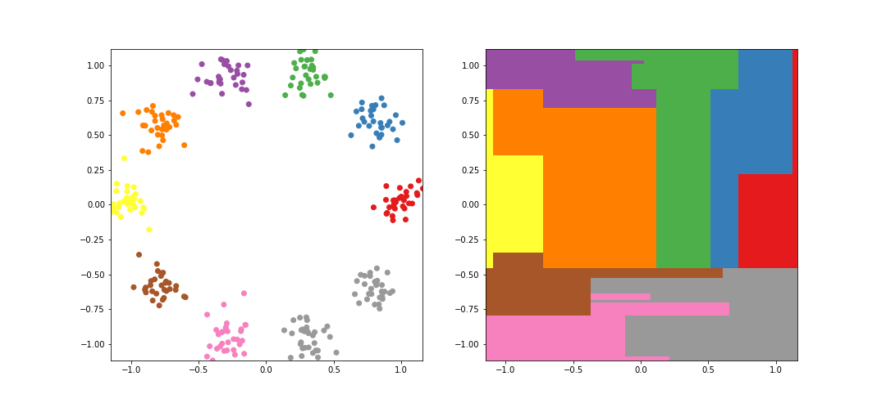
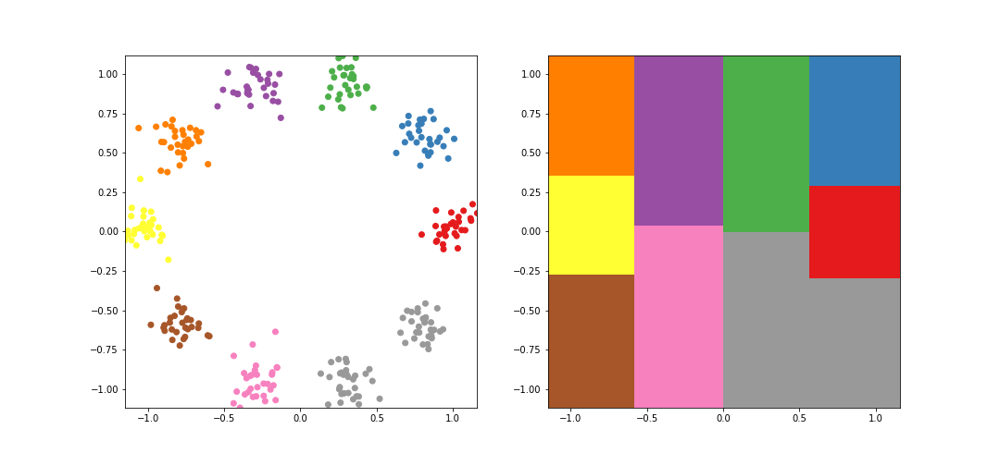
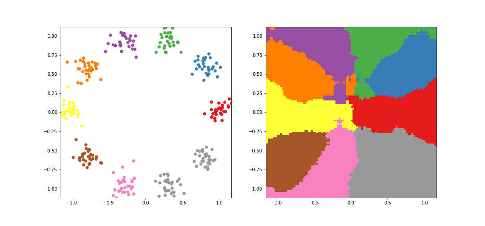
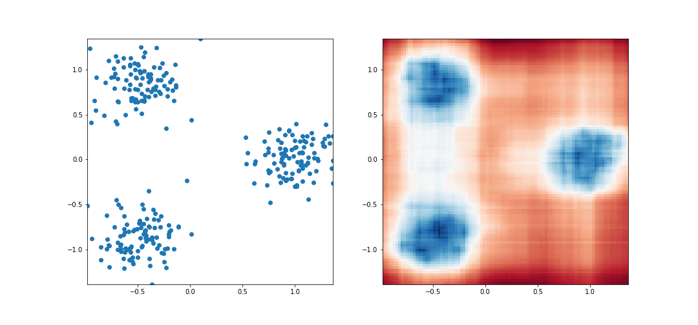

# Decision Tree & Random Forest
For this project, we expect you to look at these concepts:
* [What is a decision tree?](./WhatIs.md)
* [Decision_Tree.pred vs Decision_Tree.predict](./PredVsPredict.md)

## Resources
**Read of watch**
* (1) [Rokach and Maimon (2002) : Top-down induction of decision trees classifiers : a survey](./files/topdown_induction.pdf)
* (2) [Ho et al. (1995) : Random Decision Forests](./files/random_decision_forests.pdf)
* (3) [Fei et al. (2008) : Isolation forests](./files/isolation_forests.pdf)
* (4) [Gini and Entropy clearly explained : Handling Continuous features in Decision Trees by Pritish Jadhav](./files/gini_and_entropy.pdf)
* (5) [Abspoel and al. (2021) : Secure training of decision trees with continuous attributes](./files/secure_training_of_dts.pdf)
* (6) [Threshold Split Selection Algorithm for Continuous Features in Decision Tree](https://www.youtube.com/watch?v=asf1h2Onq4A)
* (7) [Splitting Continuous Attribute using Gini Index in Decision Tree](https://www.youtube.com/watch?v=41SHQjwuQ5o)
* (8) [How to handle Continuous Valued Attributes in Decision Tree](https://www.youtube.com/watch?v=2vIvM4zmyf4)
* (9) [Decision Tree problem based on the Continuous-valued attribute](https://www.youtube.com/watch?v=J_HEu5WqHao)
* (10) [How to Implement Decision Trees in Python using Scikit-Learn(sklearn)](https://www.youtube.com/watch?v=wxS5P7yDHRA)
* (11)[Matching and Prediction on the Principle of Biological Classification by William A. Belson](./files/matching_and_prediction.pdf)

**Notes**
* This project aims to implement decision trees from scratch. It is important for engineers to understand how the tools we use are built for two reasons. First, it gives us confidence in our skills. Second, it helps us when we need to build our own tools to solve unsolved problems.
* The first three references point to historical papers where the concepts were first studied.
* References 4 to 9 can help if you feel you need some more explanation about the way we split nodes.
* William A. Belson is usually credited for the invention of decision trees (read reference 11).
* Despite our efforts to make it efficient, we cannot compete with Sklearn’s implementations (since they are done in C). In real life, it is thus recommended to use Sklearn’s tools.
* In this regard, it is warmly recommended to watch the video referenced as (10) above. It shows how to use Sklearn’s decision trees and insists on the methodology.

## Tasks
We will progressively add methods in the following 3 classes :
```python
class Node:
    def __init__(self, feature=None, threshold=None, left_child=None, right_child=None, is_root=False, depth=0):
        self.feature                  = feature
        self.threshold                = threshold
        self.left_child               = left_child
        self.right_child              = right_child
        self.is_leaf                  = False
        self.is_root                  = is_root
        self.sub_population           = None    
        self.depth                    = depth
                
class Leaf(Node):
    def __init__(self, value, depth=None) :
        super().__init__()
        self.value   = value
        self.is_leaf = True
        self.depth   = depth

class Decision_Tree() :
    def __init__(self, max_depth=10, min_pop=1, seed=0,split_criterion="random", root=None) :
        self.rng               = np.random.default_rng(seed)
        if root :
            self.root          = root
        else :
            self.root          = Node(is_root=True)
        self.explanatory       = None
        self.target            = None
        self.max_depth         = max_depth
        self.min_pop           = min_pop
        self.split_criterion   = split_criterion
        self.predict           = None
```

* Once built, decision trees are binary trees : a node either is a leaf or has two children. It never happens that a node for which `is_leaf` is `False` has its `left_child` or `right_child` left unspecified.
* The first three tasks are a warm-up designed to review the basics of class inheritance and recursion (nevertheless, the functions coded in these tasks will be reused in the rest of the project).
* Our first objective will be to write a `Decision_Tree.predict` method that takes the explanatory features of a set of individuals and returns the predicted target value for these individuals.
* Then we will write a method `Decision_Tree.fit` that takes the explanatory features and the targets of a set of individuals, and grows the tree from the root to the leaves to make it in an efficient prediction tool.
* Once these tasks will be accomplished, we will introduce a new class `Random_Forest` that will also be a powerful prediction tool.
* Finally, we will write a variation on `Random_Forest`, called `Isolation_Random_forest`, that will be a tool to detect outliers.

# Tasks
## 0. Depth of a decision tree 
All the nodes of a decision tree have their depth attribute. The `depth` of the root is `0` , while the children of a node at depth `k` have a depth of `k+1`. We want to find the maximum of the depths of the nodes (including the leaves) in a decision tree. In order to do so, we added a method `def depth(self):` in the `Decision_Tree` class, a method `def max_depth_below(self):` in the `Leaf` class. 
**Task**: Update the class Node by adding the method `def max_depth_below(self):`
Down below is the content of the file `0-build_decision_tree.py`
```python
#!/usr/bin/env python3

import numpy as np

class Node:
    def __init__(self, feature=None, threshold=None, left_child=None, right_child=None, is_root=False, depth=0):
        self.feature = feature
        self.threshold = threshold
        self.left_child = left_child
        self.right_child = right_child
        self.is_leaf = False
        self.is_root = is_root
        self.sub_population = None
        self.depth = depth

    def max_depth_below(self) :

            ####### FILL IN THIS METHOD

class Leaf(Node):
    def __init__(self, value, depth=None):
        super().__init__()
        self.value = value
        self.is_leaf = True
        self.depth = depth

    def max_depth_below(self) :
        return self.depth

class Decision_Tree():
    def __init__(self, max_depth=10, min_pop=1, seed=0, split_criterion="random", root=None):
        self.rng = np.random.default_rng(seed)
        if root:
            self.root = root
        else:
            self.root = Node(is_root=True)
        self.explanatory = None
        self.target = None
        self.max_depth = max_depth
        self.min_pop = min_pop
        self.split_criterion = split_criterion
        self.predict = None

    def depth(self) :
        return self.root.max_depth_below()
```
**Main to test your work**
```python
#!/usr/bin/env python3

Node = __import__('0-build_decision_tree').Node
Leaf = __import__('0-build_decision_tree').Leaf
Decision_Tree = __import__('0-build_decision_tree').Decision_Tree

def example_0() :
    leaf0         = Leaf(0, depth=1)
    leaf1         = Leaf(0, depth=2)
    leaf2         = Leaf(1, depth=2)
    internal_node = Node( feature=1, threshold=30000, left_child=leaf1, right_child=leaf2,          depth=1 )
    root          = Node( feature=0, threshold=.5   , left_child=leaf0, right_child=internal_node , depth=0 , is_root=True)
    return Decision_Tree(root=root)


def example_1(depth):
    level = [Leaf(i, depth=depth) for i in range(2 ** depth)]
    level.reverse()

    def get_v(node):
        if node.is_leaf:
            return node.value
        else:
            return node.threshold

    for d in range(depth):
        level = [Node(feature=0,
                      threshold=(get_v(level[2 * i]) + get_v(level[2 * i + 1])) / 2,
                      left_child=level[2 * i],
                      right_child=level[2 * i + 1], depth=depth - d - 1) for i in range(2 ** (depth - d - 1))]
    root = level[0]
    root.is_root = True
    return Decision_Tree(root=root)

print(example_0().depth())
print(example_1(5).depth())
```
```bash
2
5
```
## 1. Number of nodes/leaves in a decision tree
We now want to count the number of nodes in a decision tree, potentially excluding the root and internal nodes to count only the leaves. In order to do so, we added a method `def count_nodes(self, only_leaves=False):` in the `Decision_Tree` class:
```python
def count_nodes(self, only_leaves=False) :
    return self.root.count_nodes_below(only_leaves=only_leaves)
```
we added a method `def count_nodes_below(self, only_leaves=False):` in the `Leaf` class:
```python
def count_nodes_below(self, only_leaves=False) :
    return 1
```
**Task**: Update the class Node by adding the method `def count_nodes_below(self, only_leaves=False):`
**MAIN**
```python
#!/usr/bin/env python3

Node = __import__('1-build_decision_tree').Node
Leaf = __import__('1-build_decision_tree').Leaf
Decision_Tree = __import__('1-build_decision_tree').Decision_Tree

def example_0():
    leaf0 = Leaf(0, depth=1)
    leaf1 = Leaf(0, depth=2)
    leaf2 = Leaf(1, depth=2)
    internal_node = Node(feature=1, threshold=30000, left_child=leaf1, right_child=leaf2, depth=1)
    root = Node(feature=0, threshold=.5, left_child=leaf0, right_child=internal_node, depth=0, is_root=True)
    return Decision_Tree(root=root)


def example_1(depth):
    level = [Leaf(i, depth=depth) for i in range(2 ** depth)]
    level.reverse()

    def get_v(node):
        if node.is_leaf:
            return node.value
        else:
            return node.threshold

    for d in range(depth):
        level = [Node(feature=0,
                      threshold=(get_v(level[2 * i]) + get_v(level[2 * i + 1])) / 2,
                      left_child=level[2 * i],
                      right_child=level[2 * i + 1], depth=depth - d - 1) for i in range(2 ** (depth - d - 1))]
    root = level[0]
    root.is_root = True
    return Decision_Tree(root=root)

print("Number of nodes  in example 0 :" , example_0().count_nodes())
print("Number of leaves in example 0 :" , example_0().count_nodes(only_leaves=True))
print("Number of nodes  in example 1 :" , example_1(4).count_nodes())
print("Number of leaves in example 1 :" , example_1(4).count_nodes(only_leaves=True))
```
```bash
Number of nodes  in example 0 : 5
Number of leaves in example 0 : 3
Number of nodes  in example 1 : 31
Number of leaves in example 1 : 16
```
## 2. Let's print our Tree 
In this task, we give you the `def __str__(self):` method for the `Decision_Tree` class:
```python
def __str__(self):
    return self.root.__str__()
```
and the `def __str__(self):` method for the `Leaf` class:
```python
def __str__(self):
    return (f"-> leaf [value={self.value}]")
```
**Task**: Insert the above declarations in the respective classes, and update the class `Node` by adding the method `def __str__(self):`
**Hint 1:** You might need some functions `def left_child_add_prefix(text):` and `def right_child_add_prefix(text):` at some point. 
**Hint 2:** In order to help you in this task, we gave you the function `def left_child_add_prefix(text):` and now your mission is to add the function `def right_child_add_prefix(text):` to be able to implement the method `def __str__(self):`
```python
def left_child_add_prefix(self,text):
    lines=text.split("\n")
    new_text="    +--"+lines[0]+"\n"
    for x in lines[1:] :
        new_text+=("    |  "+x)+"\n"
    return (new_text)
```
**Main**
```python
#!/usr/bin/env python3

Node = __import__('2-build_decision_tree').Node
Leaf = __import__('2-build_decision_tree').Leaf
Decision_Tree = __import__('2-build_decision_tree').Decision_Tree

def example_0():
    leaf0 = Leaf(0, depth=1)
    leaf1 = Leaf(0, depth=2)
    leaf2 = Leaf(1, depth=2)
    internal_node = Node(feature=1, threshold=30000, left_child=leaf1, right_child=leaf2, depth=1)
    root = Node(feature=0, threshold=.5, left_child=leaf0, right_child=internal_node, depth=0, is_root=True)
    return Decision_Tree(root=root)


def example_1(depth):
    level = [Leaf(i, depth=depth) for i in range(2 ** depth)]
    level.reverse()

    def get_v(node):
        if node.is_leaf:
            return node.value
        else:
            return node.threshold

    for d in range(depth):
        level = [Node(feature=0,
                      threshold=(get_v(level[2 * i]) + get_v(level[2 * i + 1])) / 2,
                      left_child=level[2 * i],
                      right_child=level[2 * i + 1], depth=depth - d - 1) for i in range(2 ** (depth - d - 1))]
    root = level[0]
    root.is_root = True
    return Decision_Tree(root=root)

#Print Tree example 0
print(example_0())
#Print Tree example 1
print(example_1(4))
```
```bash
root [feature=0, threshold=0.5]
    +---> leaf [value=0]
    +---> node [feature=1, threshold=30000]
           +---> leaf [value=0]
           +---> leaf [value=1]

root [feature=0, threshold=7.5]
    +---> node [feature=0, threshold=11.5]
    |      +---> node [feature=0, threshold=13.5]
    |      |      +---> node [feature=0, threshold=14.5]
    |      |      |      +---> leaf [value=15]
    |      |      |      +---> leaf [value=14]
    |      |      +---> node [feature=0, threshold=12.5]
    |      |             +---> leaf [value=13]
    |      |             +---> leaf [value=12]
    |      +---> node [feature=0, threshold=9.5]
    |             +---> node [feature=0, threshold=10.5]
    |             |      +---> leaf [value=11]
    |             |      +---> leaf [value=10]
    |             +---> node [feature=0, threshold=8.5]
    |                    +---> leaf [value=9]
    |                    +---> leaf [value=8]
    +---> node [feature=0, threshold=3.5]
           +---> node [feature=0, threshold=5.5]
           |      +---> node [feature=0, threshold=6.5]
           |      |      +---> leaf [value=7]
           |      |      +---> leaf [value=6]
           |      +---> node [feature=0, threshold=4.5]
           |             +---> leaf [value=5]
           |             +---> leaf [value=4]
           +---> node [feature=0, threshold=1.5]
                  +---> node [feature=0, threshold=2.5]
                  |      +---> leaf [value=3]
                  |      +---> leaf [value=2]
                  +---> node [feature=0, threshold=0.5]
                         +---> leaf [value=1]
                         +---> leaf [value=0]
```
## 3. Towards the predict function (1) : the get_leaves method 
**Task:** Insert the following declarations in their respective classes, and update the class `Node` by adding the method `def get_leaves_below(self):` that returns the list of all leaves of the tree.
* Add in class `Leaf`:
```python
def get_leaves_below(self) :
    return [self]
```
* Add in class `Decision_Tree`:
```python
def get_leaves(self) :
    return self.root.get_leaves_below()
```
**Main**
```python
#!/usr/bin/env python3

Node = __import__('3-build_decision_tree').Node
Leaf = __import__('3-build_decision_tree').Leaf
Decision_Tree = __import__('3-build_decision_tree').Decision_Tree

def example_0():
    leaf0 = Leaf(0, depth=1)
    leaf1 = Leaf(0, depth=2)
    leaf2 = Leaf(1, depth=2)
    internal_node = Node(feature=1, threshold=30000, left_child=leaf1, right_child=leaf2, depth=1)
    root = Node(feature=0, threshold=.5, left_child=leaf0, right_child=internal_node, depth=0, is_root=True)
    return Decision_Tree(root=root)


def example_1(depth):
    level = [Leaf(i, depth=depth) for i in range(2 ** depth)]
    level.reverse()

    def get_v(node):
        if node.is_leaf:
            return node.value
        else:
            return node.threshold

    for d in range(depth):
        level = [Node(feature=0,
                      threshold=(get_v(level[2 * i]) + get_v(level[2 * i + 1])) / 2,
                      left_child=level[2 * i],
                      right_child=level[2 * i + 1], depth=depth - d - 1) for i in range(2 ** (depth - d - 1))]
    root = level[0]
    root.is_root = True
    return Decision_Tree(root=root)

print('## Tree 1')
T=example_0() 
for leaf in T.get_leaves() :
    print(leaf)

print('## Tree 2')
T=example_1(3) 
for leaf in T.get_leaves() :
    print(leaf)
```
```bash
## Tree 1
-> leaf [value=0] 
-> leaf [value=0]
-> leaf [value=1]
## Tree 2
-> leaf [value=7]
-> leaf [value=6]
-> leaf [value=5]
-> leaf [value=4]
-> leaf [value=3]
-> leaf [value=2]
-> leaf [value=1]
-> leaf [value=0]
```
## 4. Towards the predict function (2) : the update_bounds method 
**Task**: Insert the following declarations in their respective classes, and update the class `Node` by completing the method `def get_leaves_below(self):`
* This method should recursively compute, for each node, two dictionaries stored as attributes `Node.lower` and `Node.upper`.
* These dictionaries should contain the bounds of the node for each feature.
* The lower and upper bounds represent the minimum and maximum values, respectively, observed in the data subset associated with that node.
* The keys in the dictionary represent the features.
* Add in class `Leaf`:
```python
def update_bounds_below(self) :
    pass 
```
* Add in class `Decision_Tree`:
```python
def update_bounds(self) :
    self.root.update_bounds_below() 
```
* Fill in `def update_bounds_below(self):` in class `Node`:
```python
    def update_bounds_below(self) :
        if self.is_root : 
            self.upper = { 0:np.inf }
            self.lower = {0 : -1*np.inf }

        for child in [self.left_child, self.right_child] :

                         # To Fill : compute and attach the lower and upper dictionaries to the children

        for child in [self.left_child, self.right_child] :
            child.update_bounds_below()
```
**Main**
```python
#!/usr/bin/env python3

Node = __import__('4-build_decision_tree').Node
Leaf = __import__('4-build_decision_tree').Leaf
Decision_Tree = __import__('4-build_decision_tree').Decision_Tree

def example_0():
    leaf0 = Leaf(0, depth=1)
    leaf1 = Leaf(0, depth=2)
    leaf2 = Leaf(1, depth=2)
    internal_node = Node(feature=1, threshold=30000, left_child=leaf1, right_child=leaf2, depth=1)
    root = Node(feature=0, threshold=.5, left_child=leaf0, right_child=internal_node, depth=0, is_root=True)
    return Decision_Tree(root=root)


def example_1(depth):
    level = [Leaf(i, depth=depth) for i in range(2 ** depth)]
    level.reverse()

    def get_v(node):
        if node.is_leaf:
            return node.value
        else:
            return node.threshold

    for d in range(depth):
        level = [Node(feature=0,
                      threshold=(get_v(level[2 * i]) + get_v(level[2 * i + 1])) / 2,
                      left_child=level[2 * i],
                      right_child=level[2 * i + 1], depth=depth - d - 1) for i in range(2 ** (depth - d - 1))]
    root = level[0]
    root.is_root = True
    return Decision_Tree(root=root)

def test_bounds():
    c = 0
    for T in [example_0(), example_1(5)]:
        print("example_", c)
        c += 1
        T.update_bounds()
        leaves = T.get_leaves()
        for i in range(len(leaves)):
            print("  leaf number ", i)
            print("    lower :", leaves[i].lower)
            print("    upper :", leaves[i].upper)

test_bounds()
```
```bash
example_ 0
  leaf number  0
    lower : {0: 0.5}
    upper : {0: inf}
  leaf number  1
    lower : {0: -inf, 1: 30000}
    upper : {0: 0.5}
  leaf number  2
    lower : {0: -inf}
    upper : {0: 0.5, 1: 30000}
example_ 1
  leaf number  0
    lower : {0: 30.5}
    upper : {0: inf}
  leaf number  1
    lower : {0: 29.5}
    upper : {0: 30.5}
  leaf number  2
    lower : {0: 28.5}
    upper : {0: 29.5}
  leaf number  3
    lower : {0: 27.5}
    upper : {0: 28.5}
  leaf number  4
    lower : {0: 26.5}
    upper : {0: 27.5}
  leaf number  5
    lower : {0: 25.5}
    upper : {0: 26.5}
  leaf number  6
    lower : {0: 24.5}
    upper : {0: 25.5}
  leaf number  7
    lower : {0: 23.5}
    upper : {0: 24.5}
  leaf number  8
    lower : {0: 22.5}
    upper : {0: 23.5}
  leaf number  9
    lower : {0: 21.5}
    upper : {0: 22.5}
  leaf number  10
    lower : {0: 20.5}
    upper : {0: 21.5}
  leaf number  11
    lower : {0: 19.5}
    upper : {0: 20.5}
  leaf number  12
    lower : {0: 18.5}
    upper : {0: 19.5}
  leaf number  13
    lower : {0: 17.5}
    upper : {0: 18.5}
  leaf number  14
    lower : {0: 16.5}
    upper : {0: 17.5}
  leaf number  15
    lower : {0: 15.5}
    upper : {0: 16.5}
  leaf number  16
    lower : {0: 14.5}
    upper : {0: 15.5}
  leaf number  17
    lower : {0: 13.5}
    upper : {0: 14.5}
  leaf number  18
    lower : {0: 12.5}
    upper : {0: 13.5}
  leaf number  19
    lower : {0: 11.5}
    upper : {0: 12.5}
  leaf number  20
    lower : {0: 10.5}
    upper : {0: 11.5}
  leaf number  21
    lower : {0: 9.5}
    upper : {0: 10.5}
  leaf number  22
    lower : {0: 8.5}
    upper : {0: 9.5}
  leaf number  23
    lower : {0: 7.5}
    upper : {0: 8.5}
  leaf number  24
    lower : {0: 6.5}
    upper : {0: 7.5}
  leaf number  25
    lower : {0: 5.5}
    upper : {0: 6.5}
  leaf number  26
    lower : {0: 4.5}
    upper : {0: 5.5}
  leaf number  27
    lower : {0: 3.5}
    upper : {0: 4.5}
  leaf number  28
    lower : {0: 2.5}
    upper : {0: 3.5}
  leaf number  29
    lower : {0: 1.5}
    upper : {0: 2.5}
  leaf number  30
    lower : {0: 0.5}
    upper : {0: 1.5}
  leaf number  31
    lower : {0: -inf}
    upper : {0: 0.5}
```
## 5. Towards the predict function (3): the update_indicator method 
Consider the indicator function for a given node, denoted as “n.” This function is defined as follows:
* It takes a 2D NumPy array, denoted as `A`, of shape`(n_individuals, n_features)`.
* The output of the indicator function is a 1D NumPy array, of size equals to the number of individuals (`n_individuals`), containing boolean values.
* The `i`-th element of this output array is set to `True` if the corresponding `i`-th individual meets the conditions specified by the node “n”; otherwise, it is set to `False`.
**Task**: Write a method `Node.update_indicator` that computes the indicator function from the `Node.lower` and `Node.upper` dictionaries and stores it in an attribute `Node.indicator`:

* Fill in `def update_indicator(self)`: in class `Node`:
```python
def update_indicator(self) :

        def is_large_enough(x):

                #<- fill the gap : this function returns a 1D numpy array of size 
                #`n_individuals` so that the `i`-th element of the later is `True` 
                # if the `i`-th individual has all its features > the lower bounds

        def is_small_enough(x):

                #<- fill the gap : this function returns a 1D numpy array of size 
                #`n_individuals` so that the `i`-th element of the later is `True` 
                # if the `i`-th individual has all its features <= the lower bounds

        self.indicator = lambda x : np.all(np.array([is_large_enough(x),is_small_enough(x)]),axis=0)
```
**Hint**: you might want to consider something like `np.array([np.greater(A[:,key],self.lower[key]) for key in list(self.lower.keys())]` at some point.
**Main**
```python
#!/usr/bin/env python3

Node = __import__('5-build_decision_tree').Node
Leaf = __import__('5-build_decision_tree').Leaf
Decision_Tree = __import__('5-build_decision_tree').Decision_Tree
import numpy as np

def example_0():
    leaf0 = Leaf(0, depth=1)
    leaf1 = Leaf(0, depth=2)
    leaf2 = Leaf(1, depth=2)
    internal_node = Node(feature=1, threshold=30000, left_child=leaf1, right_child=leaf2, depth=1)
    root = Node(feature=0, threshold=.5, left_child=leaf0, right_child=internal_node, depth=0, is_root=True)
    return Decision_Tree(root=root)


def example_1(depth):
    level = [Leaf(i, depth=depth) for i in range(2 ** depth)]
    level.reverse()

    def get_v(node):
        if node.is_leaf:
            return node.value
        else:
            return node.threshold

    for d in range(depth):
        level = [Node(feature=0,
                      threshold=(get_v(level[2 * i]) + get_v(level[2 * i + 1])) / 2,
                      left_child=level[2 * i],
                      right_child=level[2 * i + 1], depth=depth - d - 1) for i in range(2 ** (depth - d - 1))]
    root = level[0]
    root.is_root = True
    return Decision_Tree(root=root)

def print_indicator_values_on_leaves(T,A):
    leaves=T.get_leaves()
    T.update_bounds()
    for leaf in leaves :
        leaf.update_indicator()
    print ("values of indicators of leaves :\n",np.array([leaf.indicator(A) for leaf in leaves]))

T=example_0()
A=np.array([[1,22000],[1,44000],[0,22000],[0,44000]])
print("\n\nFor example_0()")
print("A=\n",A)
print_indicator_values_on_leaves(T,A)

T=example_1(4)
A=np.array([[11.65],[6.917]])
print("\n\nFor example_1(4)")
print("A=\n",A)
print_indicator_values_on_leaves(T,A)
```
```bash
For example_0()
A=
 [[    1 22000]
 [    1 44000]
 [    0 22000]
 [    0 44000]]
values of indicators of leaves :
 [[ True  True False False]
 [False False False  True]
 [False False  True False]]


For example_1(4)
A=
 [[11.65 ]
 [ 6.917]]
values of indicators of leaves :
 [[False False]
 [False False]
 [False False]
 [ True False]
 [False False]
 [False False]
 [False False]
 [False False]
 [False  True]
 [False False]
 [False False]
 [False False]
 [False False]
 [False False]
 [False False]
 [False False]]
```
**Note**: there is exactly one `True` in each column (corresponding to the leaf the individual falls in).
## 6. The predict function 
We are now in a position to write our efficient `Decision_Tree.predict` function.
**Task**: Write a method `Decision_Tree.update_predict `that computes the prediction function :
* Fill in `def update_predict(self): `in class `Decision_Tree`:
```python
def update_predict(self) :
        self.update_bounds()
        leaves=self.get_leaves()
        for leaf in leaves :
            leaf.update_indicator()          
        self.predict = lambda A: #<--- To be filled
```
**Main to test your work**
In this conept page: [DecisionTree.pred vs DecisionTree.predict](./PredVsPredict.md) , we introduced an additional approach for implementing a prediction function known as `Decision_Tree.pred` .
As part of the testing process, insert the following methods into their respective classes:
* add `def pred(self,x):` in class `Leaf`:
```python
    def pred(self,x) :
        return self.value
```
* add `def pred(self,x): `in class `Node`:
```python
    def pred(self,x) :
        if x[self.feature]>self.threshold :
            return self.left_child.pred(x)
        else :
            return self.right_child.pred(x)
```
* add `def pred(self,x):` in class `Decision_Tree`:
```python
    def pred(self,x) :
            return self.root.pred(x)
```
Now, to validate whether Decision_Tree.pred performs similarly to the existing `Decision_Tree.predict`, we are creating a generator for random trees. We will compare the behavior of `Decision_Tree.predict` and `Decision_Tree.pred `on a sample explanatory array.
```python
#!/usr/bin/env python3

Node = __import__('6-build_decision_tree').Node
Leaf = __import__('6-build_decision_tree').Leaf
Decision_Tree = __import__('6-build_decision_tree').Decision_Tree
import numpy as np

def random_tree(max_depth, n_classes,n_features,seed=0) :
    assert max_depth>0, "max_depth must be a strictly positive integer"
    rng=np.random.default_rng(seed)
    root=Node(is_root=True,depth=0)
    root.lower={i:-100 for i in range(n_features)}
    root.upper={i:100 for i in range(n_features)}

    def build_children(node) :
        feat=rng.integers(0,n_features)
        node.feature=feat
        node.threshold = np.round(rng.uniform(0,1)*(node.upper[feat]-node.lower[feat])+node.lower[feat],2)
        if node.depth==max_depth-1 :
            node.left_child=Leaf(depth=max_depth, value=rng.integers(0,n_classes))
            node.right_child=Leaf(depth=max_depth, value=rng.integers(0,n_classes))
        else :
            node.left_child=Node(depth=node.depth+1)
            node.left_child.lower=node.lower.copy()
            node.left_child.upper=node.upper.copy()
            node.left_child.lower[feat]=node.threshold
            node.right_child=Node(depth=node.depth+1)
            node.right_child.lower=node.lower.copy()
            node.right_child.upper=node.upper.copy()
            node.right_child.upper[feat]=node.threshold
            build_children(node.left_child)
            build_children(node.right_child)

    T=Decision_Tree(root=root)
    build_children(root)

    A=rng.uniform(0,1,size=100*n_features).reshape([100,n_features])*200-100
    return T, A

T,A=random_tree(4, 3 ,5,seed=1)
print(T)

T.update_predict()

print("T.pred(A) :\n",np.array([T.pred(x) for x in A]))
print("T.predict(A) :\n",T.predict(A))

test=np.all(np.equal(T.predict(A),np.array([T.pred(x) for x in A])))                         
print(f"Predictions are the same on the explanatory array A : {test}") 
```
```bash
root [feature=2, threshold=90.09]
    +---> node [feature=2, threshold=91.52]
    |      +---> node [feature=4, threshold=-37.63]
    |      |      +---> node [feature=4, threshold=20.63]
    |      |      |      +---> leaf [value=0]
    |      |      |      +---> leaf [value=2]
    |      |      +---> node [feature=1, threshold=9.92]
    |      |             +---> leaf [value=1]
    |      |             +---> leaf [value=0]
    |      +---> node [feature=0, threshold=50.7]
    |             +---> node [feature=4, threshold=-34.05]
    |             |      +---> leaf [value=1]
    |             |      +---> leaf [value=1]
    |             +---> node [feature=3, threshold=-39.36]
    |                    +---> leaf [value=0]
    |                    +---> leaf [value=1]
    +---> node [feature=4, threshold=-19.38]
           +---> node [feature=0, threshold=-59.31]
           |      +---> node [feature=2, threshold=42.64]
           |      |      +---> leaf [value=0]
           |      |      +---> leaf [value=0]
           |      +---> node [feature=1, threshold=-2.96]
           |             +---> leaf [value=0]
           |             +---> leaf [value=2]
           +---> node [feature=3, threshold=44.96]
                  +---> node [feature=4, threshold=-56.37]
                  |      +---> leaf [value=2]
                  |      +---> leaf [value=0]
                  +---> node [feature=3, threshold=40.6]
                         +---> leaf [value=0]
                         +---> leaf [value=1]

T.pred(A) :
 [0 0 0 0 1 1 2 0 1 0 0 0 2 0 2 0 1 0 1 1 0 1 0 0 0 2 1 0 0 0 1 0 0 0 0 1 0
 1 0 1 0 1 1 0 1 2 0 1 1 0 0 1 0 1 0 1 0 1 1 1 0 0 0 2 0 0 0 1 0 2 2 0 0 0
 0 0 1 0 0 1 0 1 0 1 1 0 0 0 0 0 0 1 0 0 1 1 0 0 0 1]
T.predict(A) :
 [0 0 0 0 1 1 2 0 1 0 0 0 2 0 2 0 1 0 1 1 0 1 0 0 0 2 1 0 0 0 1 0 0 0 0 1 0
 1 0 1 0 1 1 0 1 2 0 1 1 0 0 1 0 1 0 1 0 1 1 1 0 0 0 2 0 0 0 1 0 2 2 0 0 0
 0 0 1 0 0 1 0 1 0 1 1 0 0 0 0 0 0 1 0 0 1 1 0 0 0 1]
Predictions are the same on the explanatory array A : True
```
**NOTE**: Read the concept page [DecisionTree.pred vs DecisionTree.predict](./PredVsPredict.md) to understand how `Decision_Tree.predict` is better than `Decision_Tree.pred` when it comes to computational efficiency.
## 7. Training decision trees 
Now we want to make our trees trainable, so we will write a method `Decision_Tree.fit` so that, when given 
* a 2D numpy array `explanatory` of shape `(number of individuals, number of features)`.
* a 1D numpy array `target` of size `number of individuals`.
and evaluating the code below, should return a decision tree to make predictions.
```python
T=Decision_Tree()
T.fit(explanatory,target)
```
### The `fit` function
The code below showcases the fit function. As you can observe, we assign a value to the attribute `self.root.sub_population`. During the training, each node we build will have this attribute assigned with a 1D numpy array of booleans of size `target.size` (which is the number of individuals in the training set). The `i`-th value of this array is `True` if and only if the `i`-th individual visits the node (so for the root, all the values are `True` as you can see). 
* To be added in the `Decision_Tree` class :
```python
def fit(self,explanatory, target,verbose=0) :
        if self.split_criterion == "random" : 
                self.split_criterion = self.random_split_criterion
        else : 
                self.split_criterion = self.Gini_split_criterion     <--- to be defined later
        self.explanatory = explanatory
        self.target      = target
        self.root.sub_population = np.ones_like(self.target,dtype='bool')

        self.fit_node(self.root)     <--- to be defined later

        self.update_predict()     <--- defined in the previous task

        if verbose==1 :
                print(f"""  Training finished.
- Depth                     : { self.depth()       }
- Number of nodes           : { self.count_nodes() }
- Number of leaves          : { self.count_nodes(only_leaves=True) }
- Accuracy on training data : { self.accuracy(self.explanatory,self.target)    }""")     <--- to be defined later
```
### The split function
The training procedure consists in iteratively choosing splits from the root on, and the procedure to choose the splits depend on the situation, so, as you can see above, our training method will depend on an attribute `Decision_Tree.split_criterion`. For now, we will use a completely random way to split our nodes :
* To be added in the `Decision_Tree` class :
```python
    def np_extrema(self,arr):
        return np.min(arr), np.max(arr)

    def random_split_criterion(self,node) :
        diff=0
        while diff==0 :
            feature=self.rng.integers(0,self.explanatory.shape[1])
            feature_min,feature_max=self.np_extrema(self.explanatory[:,feature][node.sub_population])
            diff=feature_max-feature_min
        x=self.rng.uniform()
        threshold= (1-x)*feature_min + x*feature_max
        return feature,threshold
```
**Note**: As surprising as it may be, and as we will check, this randomized procedure already has an interesting predicting power.
### Task
Finally, as you see, the fit method just initializes some attributes of the tree and then calls a new method `Decision_Tree.fit_node `on the root. Your task is to update the class `Decision_Tree` by adding and completing the method `def fit_node(self,node):`

* A node is a leaf if either it contains less than `min_pop` individuals, or its depth equals `max_depth` or all the individuals of the training set that come to this node are in the same class (i.e. have the same `target` value)
* The value to be computed for a leaf is the most represented class among the individuals that finish their trip in this leaf.
* At a node, the splitting criterion furnishes a feature index and a threshold. If the value of the selected feature on an individual that crosses this node is greater (strictly) than the threshold, then the individual goes in the left child, otherwise it goes in the right child.
* No for loop on the individuals should appear in your code. Use numpy functions everywhere to get an efficient program.
```python
def fit_node(self,node) :
        node.feature, node.threshold = self.split_criterion(node)

        left_population  =      <--- to be filled
        right_population =      <--- to be filled

        # Is left node a leaf ?
        is_left_leaf =    <--- to be filled

        if is_left_leaf :
                node.left_child = self.get_leaf_child(node,left_population)                                                         
        else :
                node.left_child = self.get_node_child(node,left_population)
                self.fit_node(node.left_child)

        # Is right node a leaf ?
        is_right_leaf =    <--- to be filled

        if is_right_leaf :
                node.right_child = self.get_leaf_child(node,right_population)
        else :
                node.right_child = self.get_node_child(node,right_population)
                self.fit_node(node.right_child)    

def get_leaf_child(self, node, sub_population) :        
        value =    <-- to be filled
        leaf_child= Leaf( value )
        leaf_child.depth=node.depth+1
        leaf_child.subpopulation=sub_population
        return leaf_child

def get_node_child(self, node, sub_population) :        
        n= Node()
        n.depth=node.depth+1
        n.sub_population=sub_population
        return n

def accuracy(self, test_explanatory , test_target) :
        return np.sum(np.equal(self.predict(test_explanatory), test_target))/test_target.size

```
**Main 1**
```python
#!/usr/bin/env python3

Decision_Tree = __import__('7-build_decision_tree').Decision_Tree
import numpy as np
from sklearn import datasets


#                                     #########################
#                                     # Generating examples : #
#                                     #########################

def circle_of_clouds(n_clouds, n_objects_by_cloud, radius=1, sigma=None, seed=0, angle=0):
    """
    This function returns a dataset made of 'n_clouds' classes.
    Each class is a small gaussian cloud containing 'n_objects_by_cloud' points.
    The centers of the clouds are regularly disposed on a circle of radius 'radius' (and center (0,0)).
    The spreadth of the clouds is governed by 'sigma'.
    """
    rng = np.random.default_rng(seed)
    if not sigma:
        sigma = np.sqrt(2 - 2 * np.cos(2 * np.pi / n_clouds)) / 7

    def rotate(x, k):
        theta = 2 * k * np.pi / n_clouds + angle
        m = np.matrix([[np.cos(theta), np.sin(theta)], [-np.sin(theta), np.cos(theta)]])
        return np.matmul(x, m)

    def cloud():
        return (rng.normal(size=2 * n_objects_by_cloud) * sigma).reshape(n_objects_by_cloud, 2) + np.array([radius, 0])

    def target():
        return np.array(([[i] * n_objects_by_cloud for i in range(n_clouds)]), dtype="int32").ravel()

    return np.concatenate([np.array(rotate(cloud(), k)) for k in range(n_clouds)], axis=0), target()


def iris():
    """ Returns the explanatory features and the target of the famous iris dataset """
    iris = datasets.load_iris()
    return iris.data, iris.target


def wine():
    """ Returns the explanatory features and the target of the wine dataset """
    wine = datasets.load_wine()
    return wine.data, wine.target


#                                     #########################
#                                     #    Data preparation   #
#                                     #########################

def split(explanatory, target, seed=0, proportion=.1):
    """ Returns a dictionary containing a a training dataset and a test dataset """
    rng = np.random.default_rng(seed)
    test_indices = rng.choice(target.size, int(target.size * proportion), replace=False)
    test_filter = np.zeros_like(target, dtype="bool")
    test_filter[test_indices] = True

    return {"train_explanatory": explanatory[np.logical_not(test_filter), :],
            "train_target": target[np.logical_not(test_filter)],
            "test_explanatory": explanatory[test_filter, :],
            "test_target": target[test_filter]}

# Main 1

for d,name in zip([ split(*circle_of_clouds(10,30)) , split(*iris()), split(*wine()) ], ["circle of clouds", "iris dataset", "wine dataset"]) :
    print("-"*52+"\n"+name+" :")
    T=Decision_Tree(split_criterion="random",max_depth=20,seed=0)
    T.fit(d["train_explanatory"],d["train_target"],verbose=1)
    T.update_predict()
    print(f"    - Accuracy on test          : {T.accuracy(d['test_explanatory'],d['test_target'])}")
print("-"*52)
```
```bash
----------------------------------------------------
circle of clouds :
  Training finished.
    - Depth                     : 10
    - Number of nodes           : 81
    - Number of leaves          : 41
    - Accuracy on training data : 1.0
    - Accuracy on test          : 0.9666666666666667
----------------------------------------------------
iris dataset :
  Training finished.
    - Depth                     : 15
    - Number of nodes           : 43
    - Number of leaves          : 22
    - Accuracy on training data : 1.0
    - Accuracy on test          : 0.9333333333333333
----------------------------------------------------
wine dataset :
  Training finished.
    - Depth                     : 17
    - Number of nodes           : 137
    - Number of leaves          : 69
    - Accuracy on training data : 1.0
    - Accuracy on test          : 0.7058823529411765
----------------------------------------------------
```
**Main 2**
```python
#!/usr/bin/env python3

Decision_Tree = __import__('7-build_decision_tree').Decision_Tree
import numpy as np
import matplotlib.pyplot as plt

#                                     #########################
#                                     # Generating examples : #
#                                     #########################

def circle_of_clouds(n_clouds, n_objects_by_cloud, radius=1, sigma=None, seed=0, angle=0):
    """
    This function returns a dataset made of 'n_clouds' classes.
    Each class is a small gaussian cloud containing 'n_objects_by_cloud' points.
    The centers of the clouds are regularly disposed on a circle of radius 'radius' (and center (0,0)).
    The spreadth of the clouds is governed by 'sigma'.
    """
    rng = np.random.default_rng(seed)
    if not sigma:
        sigma = np.sqrt(2 - 2 * np.cos(2 * np.pi / n_clouds)) / 7

    def rotate(x, k):
        theta = 2 * k * np.pi / n_clouds + angle
        m = np.matrix([[np.cos(theta), np.sin(theta)], [-np.sin(theta), np.cos(theta)]])
        return np.matmul(x, m)

    def cloud():
        return (rng.normal(size=2 * n_objects_by_cloud) * sigma).reshape(n_objects_by_cloud, 2) + np.array([radius, 0])

    def target():
        return np.array(([[i] * n_objects_by_cloud for i in range(n_clouds)]), dtype="int32").ravel()

    return np.concatenate([np.array(rotate(cloud(), k)) for k in range(n_clouds)], axis=0), target()

#                                     #########################
#                                     #    2D Visualization   #
#                                     #########################

def np_extrema(arr):
    return np.min(arr), np.max(arr)


def visualize_bassins(ax, model, x_min, x_max, y_min, y_max, cmap):
    """ color the points of a box
    with the color corresponding to the class predicted by the model """
    assert T.explanatory.shape[1] == 2, "Not a 2D example"
    X = np.linspace(x_min, x_max, 100)
    Y = np.linspace(y_min, y_max, 100)
    XX, YY = np.meshgrid(X, Y)
    XX_flat = XX.ravel()
    YY_flat = YY.ravel()
    Z = model.predict(np.vstack([XX_flat, YY_flat]).T)
    ax.pcolormesh(XX, YY, Z.reshape([100, 100]), cmap=cmap, shading='auto')


def visualize_training_dataset_2D(ax, model, cmap):
    """ color the points of the 'explanatory' array
    with the color corresponding to the class stored in 'target' """
    ax.scatter(model.explanatory[:, 0], model.explanatory[:, 1], c=model.target, cmap=cmap)


def visualize_model_2D(model, cmap=plt.cm.Set1):
    """ gather the results of visualize_bassins and visualize_training_dataset_2D """
    assert model.explanatory.shape[1] == 2, "Not a 2D example"

    x_min, x_max = np_extrema(model.explanatory[:, 0])
    y_min, y_max = np_extrema(model.explanatory[:, 1])
    fig, axes = plt.subplots(1, 2, figsize=(15, 7))
    for ax in axes:
        ax.set_xlim(x_min, x_max)
        ax.set_ylim(y_min, y_max)
    visualize_training_dataset_2D(axes[0], model, cmap)
    visualize_bassins(axes[1], model, x_min, x_max, y_min, y_max, cmap)
    plt.savefig("bassins2.png")
    plt.show()

#Main 2
explanatory,target = circle_of_clouds(10,30)
T=Decision_Tree(split_criterion="random")
T.fit(explanatory,target,verbose=0)
visualize_model_2D(T)
```
Main 2 should show the following plots


## 8. Using Gini impurity function as a splitting criterion 
For a node $N $ containing a population $ P $  that is partitioned in $ k + 1$ classes : $ P=P_0\sqcup P_1\sqcup\cdots\sqcup P_k $,  the Gini impurity of $N $ is defined as
$$
\text{Gini}(N)=1 - \left(\frac {\text{card}(P_0)} {\text{card}(P)} \right)^2 - \cdots -  \left(\frac {\text{card}(P_k)} {\text{card}(P)} \right)^2
$$
The idea behind this definition is that

* if the population of a node is equally partitioned into many classes, the Gini impurity will be large
* if the population of a node comes mainly from one class, the Gini impurity will be small
So

* if the Gini impurity of a leaf is large, we cannot be very confident in the prediction function of this node
* if the Gini impurity of a leaf is small, we can have more confidence in the prediction function of this node
Hence the idea to split a node is to choose the feature and the threshold for which the average of the Gini impurities of the corresponding children is the smallest. 
$$
\text{Gini\_split}(N) = \frac {\text{card(left\_child)}} {\text{card}(P)} \text{Gini}(\text{left\_child}) + \frac {\text{card(right\_child)}} {\text{card}(P)} \text{Gini}(\text{right\_child})
$$
**Task**: To find this value : 
* Update the the `Decision_Tree` class by adding the new methods down below.
* Fill in the gap in the method `def Gini_split_criterion_one_feature(self,node,feature):`.
* No for or while loop allowed !
```python
def possible_thresholds(self,node,feature) :
        values = np.unique((self.explanatory[:,feature])[node.sub_population])
        return (values[1:]+values[:-1])/2

def Gini_split_criterion_one_feature(self,node,feature) :
        # Compute a numpy array of booleans Left_F of shape (n,t,c) where
        #    -> n is the number of individuals in the sub_population corresponding to node
        #    -> t is the number of possible thresholds
        #    -> c is the number of classes represented in node
        # such that Left_F[ i , j , k] is true iff 
        #    -> the i-th individual in node is of class k 
        #    -> the value of the chosen feature on the i-th individual 
        #                              is greater than the t-th possible threshold
        # then by squaring and summing along 2 of the axes of Left_F[ i , j , k], 
        #                     you can get the Gini impurities of the putative left childs
        #                    as a 1D numpy array of size t 
        #
        # Then do the same with the right child
        # Then compute the average sum of these Gini impurities
        #
        # Then  return the threshold and the Gini average  for which the Gini average is the smallest

def Gini_split_criterion(self,node) :
        X=np.array([self.Gini_split_criterion_one_feature(node,i) for i in range(self.explanatory.shape[1])])
        i =np.argmin(X[:,1])
        return i, X[i,0]
```
**Main**
```python
#!/usr/bin/env python3

Decision_Tree = __import__('8-build_decision_tree').Decision_Tree
import numpy as np
from sklearn import datasets


#                                     #########################
#                                     # Generating examples : #
#                                     #########################

def circle_of_clouds(n_clouds, n_objects_by_cloud, radius=1, sigma=None, seed=0, angle=0):
    """
    This function returns a dataset made of 'n_clouds' classes.
    Each class is a small gaussian cloud containing 'n_objects_by_cloud' points.
    The centers of the clouds are regularly disposed on a circle of radius 'radius' (and center (0,0)).
    The spreadth of the clouds is governed by 'sigma'.
    """
    rng = np.random.default_rng(seed)
    if not sigma:
        sigma = np.sqrt(2 - 2 * np.cos(2 * np.pi / n_clouds)) / 7

    def rotate(x, k):
        theta = 2 * k * np.pi / n_clouds + angle
        m = np.matrix([[np.cos(theta), np.sin(theta)], [-np.sin(theta), np.cos(theta)]])
        return np.matmul(x, m)

    def cloud():
        return (rng.normal(size=2 * n_objects_by_cloud) * sigma).reshape(n_objects_by_cloud, 2) + np.array([radius, 0])

    def target():
        return np.array(([[i] * n_objects_by_cloud for i in range(n_clouds)]), dtype="int32").ravel()

    return np.concatenate([np.array(rotate(cloud(), k)) for k in range(n_clouds)], axis=0), target()


def iris():
    """ Returns the explanatory features and the target of the famous iris dataset """
    iris = datasets.load_iris()
    return iris.data, iris.target


def wine():
    """ Returns the explanatory features and the target of the wine dataset """
    wine = datasets.load_wine()
    return wine.data, wine.target


#                                     #########################
#                                     #    Data preparation   #
#                                     #########################

def split(explanatory, target, seed=0, proportion=.1):
    """ Returns a dictionary containing a a training dataset and a test dataset """
    rng = np.random.default_rng(seed)
    test_indices = rng.choice(target.size, int(target.size * proportion), replace=False)
    test_filter = np.zeros_like(target, dtype="bool")
    test_filter[test_indices] = True

    return {"train_explanatory": explanatory[np.logical_not(test_filter), :],
            "train_target": target[np.logical_not(test_filter)],
            "test_explanatory": explanatory[test_filter, :],
            "test_target": target[test_filter]}

# Main 1
for d,name in zip([ split(*circle_of_clouds(10,30)) , split(*iris()), split(*wine()) ], ["circle of clouds", "iris dataset", "wine dataset"]) :
    print("-"*52+"\n"+name+" :")
    T=Decision_Tree(split_criterion="Gini",max_depth=20,seed=0)
    T.fit(d["train_explanatory"],d["train_target"],verbose=1)
    T.update_predict()
    print(f"    - Accuracy on test          : {T.accuracy(d['test_explanatory'],d['test_target'])}")
print("-"*52)
```
```bash
----------------------------------------------------
circle of clouds :
  Training finished.
    - Depth                     : 5
    - Number of nodes           : 19
    - Number of leaves          : 10
    - Accuracy on training data : 1.0
    - Accuracy on test          : 1.0
----------------------------------------------------
iris dataset :
  Training finished.
    - Depth                     : 5
    - Number of nodes           : 13
    - Number of leaves          : 7
    - Accuracy on training data : 1.0
    - Accuracy on test          : 0.9333333333333333
----------------------------------------------------
wine dataset :
  Training finished.
    - Depth                     : 5
    - Number of nodes           : 21
    - Number of leaves          : 11
    - Accuracy on training data : 1.0
    - Accuracy on test          : 0.9411764705882353
----------------------------------------------------
```
**Main**
```python
#!/usr/bin/env python3

Decision_Tree = __import__('8-build_decision_tree').Decision_Tree
import numpy as np
import matplotlib.pyplot as plt

#                                     #########################
#                                     # Generating examples : #
#                                     #########################

def circle_of_clouds(n_clouds, n_objects_by_cloud, radius=1, sigma=None, seed=0, angle=0):
    """
    This function returns a dataset made of 'n_clouds' classes.
    Each class is a small gaussian cloud containing 'n_objects_by_cloud' points.
    The centers of the clouds are regularly disposed on a circle of radius 'radius' (and center (0,0)).
    The spreadth of the clouds is governed by 'sigma'.
    """
    rng = np.random.default_rng(seed)
    if not sigma:
        sigma = np.sqrt(2 - 2 * np.cos(2 * np.pi / n_clouds)) / 7

    def rotate(x, k):
        theta = 2 * k * np.pi / n_clouds + angle
        m = np.matrix([[np.cos(theta), np.sin(theta)], [-np.sin(theta), np.cos(theta)]])
        return np.matmul(x, m)

    def cloud():
        return (rng.normal(size=2 * n_objects_by_cloud) * sigma).reshape(n_objects_by_cloud, 2) + np.array([radius, 0])

    def target():
        return np.array(([[i] * n_objects_by_cloud for i in range(n_clouds)]), dtype="int32").ravel()

    return np.concatenate([np.array(rotate(cloud(), k)) for k in range(n_clouds)], axis=0), target()

#                                     #########################
#                                     #    2D Visualization   #
#                                     #########################

def np_extrema(arr):
    return np.min(arr), np.max(arr)


def visualize_bassins(ax, model, x_min, x_max, y_min, y_max, cmap):
    """ color the points of a box
    with the color corresponding to the class predicted by the model """
    assert T.explanatory.shape[1] == 2, "Not a 2D example"
    X = np.linspace(x_min, x_max, 100)
    Y = np.linspace(y_min, y_max, 100)
    XX, YY = np.meshgrid(X, Y)
    XX_flat = XX.ravel()
    YY_flat = YY.ravel()
    Z = model.predict(np.vstack([XX_flat, YY_flat]).T)
    ax.pcolormesh(XX, YY, Z.reshape([100, 100]), cmap=cmap, shading='auto')


def visualize_training_dataset_2D(ax, model, cmap):
    """ color the points of the 'explanatory' array
    with the color corresponding to the class stored in 'target' """
    ax.scatter(model.explanatory[:, 0], model.explanatory[:, 1], c=model.target, cmap=cmap)


def visualize_model_2D(model, cmap=plt.cm.Set1):
    """ gather the results of visualize_bassins and visualize_training_dataset_2D """
    assert model.explanatory.shape[1] == 2, "Not a 2D example"

    x_min, x_max = np_extrema(model.explanatory[:, 0])
    y_min, y_max = np_extrema(model.explanatory[:, 1])
    fig, axes = plt.subplots(1, 2, figsize=(15, 7))
    for ax in axes:
        ax.set_xlim(x_min, x_max)
        ax.set_ylim(y_min, y_max)
    visualize_training_dataset_2D(axes[0], model, cmap)
    visualize_bassins(axes[1], model, x_min, x_max, y_min, y_max, cmap)
    plt.savefig("bassins2.png")
    plt.show()

#Main 2
explanatory,target = circle_of_clouds(10,30)
T=Decision_Tree(split_criterion="Gini")
T.fit(explanatory,target,verbose=0)

visualize_model_2D(T)
```
Main 2 should show the following plots.

**NOTE**: We observe that the decision trees constructed with the `Gini_split_criterion` are less prone to overfitting and have a smaller depth than the ones obtained with the `random_split_criterion`.
## 9. Random forests 
In this task, we will create a new class `Random_Forest`. 
When training an object of this class on a dataset, it will build a large list of decision trees with random splitting criterion. Then to predict the class of an individual, it will ask each of those trees its prediction, and will choose the prediction that is the most frequent.
**Pros** : this method has advantages over the use of the Gini criterion - when the training dataset is large : it can save CPU usage, - in terms of stability : the result of this method should be almost the same on the various training subsets of a cross-validation procedure while the Gini based decision trees can be very different for each of these training subsets.
**Cons** : The Gini-based decision tree furnishes a model that has a clear, elementary interpretation. This interpretation can be used, once the decision tree, to further understand (in a human sense) the dependence between the explanatory data and the target.
**Task**: In the class `Random_Forest`: 
* Insert the below declarations
* Add the method `def predict(self, explanatory):`
* You should use the following import:
    * `Decision_Tree = __import__('8-build_decision_tree').Decision_Tree`
    * `import numpy as np`
```python
class Random_Forest() :
    def __init__(self, n_trees=100, max_depth=10, min_pop=1, seed=0) :
        self.numpy_predicts  = []
        self.target          = None
        self.numpy_preds     = None
        self.n_trees         = n_trees
        self.max_depth       = max_depth
        self.min_pop         = min_pop
        self.seed            = seed

    def predict(self, explanatory):            <--    to be filled

        # Initialize an empty list to store predictions from individual trees

        # Generate predictions for each tree in the forest

        # Calculate the mode (most frequent) prediction for each example

    def fit(self,explanatory,target,n_trees=100,verbose=0) :
        self.target      = target
        self.explanatory = explanatory
        self.numpy_preds = []
        depths           = [] 
        nodes            = [] 
        leaves           = []
        accuracies =[]
        for i in range(n_trees) :
            T = Decision_Tree(max_depth=self.max_depth, min_pop=self.min_pop,seed=self.seed+i)
            T.fit(explanatory,target)
            self.numpy_preds.append(T.predict)
            depths.append(    T.depth()                         )
            nodes.append(     T.count_nodes()                   )
            leaves.append(    T.count_nodes(only_leaves=True)   )
            accuracies.append(T.accuracy(T.explanatory,T.target))
        if verbose==1 :
            print(f"""  Training finished.
    - Mean depth                     : { np.array(depths).mean()      }
    - Mean number of nodes           : { np.array(nodes).mean()       }
    - Mean number of leaves          : { np.array(leaves).mean()      }
    - Mean accuracy on training data : { np.array(accuracies).mean()  }
    - Accuracy of the forest on td   : {self.accuracy(self.explanatory,self.target)}""")

    def accuracy(self, test_explanatory , test_target) :
        return np.sum(np.equal(self.predict(test_explanatory), test_target))/test_target.size
```
**Main**
```python
#!/usr/bin/env python3

Random_Forest = __import__('9-random_forest').Random_Forest
import numpy as np
from sklearn import datasets


#                                     #########################
#                                     # Generating examples : #
#                                     #########################

def circle_of_clouds(n_clouds, n_objects_by_cloud, radius=1, sigma=None, seed=0, angle=0):
    """
    This function returns a dataset made of 'n_clouds' classes.
    Each class is a small gaussian cloud containing 'n_objects_by_cloud' points.
    The centers of the clouds are regularly disposed on a circle of radius 'radius' (and center (0,0)).
    The spreadth of the clouds is governed by 'sigma'.
    """
    rng = np.random.default_rng(seed)
    if not sigma:
        sigma = np.sqrt(2 - 2 * np.cos(2 * np.pi / n_clouds)) / 7

    def rotate(x, k):
        theta = 2 * k * np.pi / n_clouds + angle
        m = np.matrix([[np.cos(theta), np.sin(theta)], [-np.sin(theta), np.cos(theta)]])
        return np.matmul(x, m)

    def cloud():
        return (rng.normal(size=2 * n_objects_by_cloud) * sigma).reshape(n_objects_by_cloud, 2) + np.array([radius, 0])

    def target():
        return np.array(([[i] * n_objects_by_cloud for i in range(n_clouds)]), dtype="int32").ravel()

    return np.concatenate([np.array(rotate(cloud(), k)) for k in range(n_clouds)], axis=0), target()


def iris():
    """ Returns the explanatory features and the target of the famous iris dataset """
    iris = datasets.load_iris()
    return iris.data, iris.target


def wine():
    """ Returns the explanatory features and the target of the wine dataset """
    wine = datasets.load_wine()
    return wine.data, wine.target


#                                     #########################
#                                     #    Data preparation   #
#                                     #########################

def split(explanatory, target, seed=0, proportion=.1):
    """ Returns a dictionary containing a a training dataset and a test dataset """
    rng = np.random.default_rng(seed)
    test_indices = rng.choice(target.size, int(target.size * proportion), replace=False)
    test_filter = np.zeros_like(target, dtype="bool")
    test_filter[test_indices] = True

    return {"train_explanatory": explanatory[np.logical_not(test_filter), :],
            "train_target": target[np.logical_not(test_filter)],
            "test_explanatory": explanatory[test_filter, :],
            "test_target": target[test_filter]}

# Main 1
for d,name in zip([ split(*circle_of_clouds(10,30)) , split(*iris()), split(*wine()) ], ["circle of clouds", "iris dataset", "wine dataset"]) :
    print("-"*52+"\n"+name+" :")
    F=Random_Forest(max_depth=6)
    F.fit(d["train_explanatory"],d["train_target"],verbose=1)
    print(f"    - Accuracy on test          : {F.accuracy(d['test_explanatory'],d['test_target'])}")
print("-"*52)
```
```bash
----------------------------------------------------
circle of clouds :
  Training finished.
    - Mean depth                     : 6.0
    - Mean number of nodes           : 50.92
    - Mean number of leaves          : 25.96
    - Mean accuracy on training data : 0.8364814814814814
    - Accuracy of the forest on td   : 1.0
    - Accuracy on test          : 1.0
----------------------------------------------------
iris dataset :
  Training finished.
    - Mean depth                     : 6.0
    - Mean number of nodes           : 26.56
    - Mean number of leaves          : 13.78
    - Mean accuracy on training data : 0.884074074074074
    - Accuracy of the forest on td   : 0.9777777777777777
    - Accuracy on test          : 0.8666666666666667
----------------------------------------------------
wine dataset :
  Training finished.
    - Mean depth                     : 6.0
    - Mean number of nodes           : 37.08
    - Mean number of leaves          : 19.04
    - Mean accuracy on training data : 0.7626086956521739
    - Accuracy of the forest on td   : 1.0
    - Accuracy on test          : 0.9411764705882353
----------------------------------------------------
```
**Main 2**
```python
#!/usr/bin/env python3

Random_Forest = __import__('9-random_forest').Random_Forest
import numpy as np
import matplotlib.pyplot as plt

#                                     #########################
#                                     # Generating examples : #
#                                     #########################

def circle_of_clouds(n_clouds, n_objects_by_cloud, radius=1, sigma=None, seed=0, angle=0):
    """
    This function returns a dataset made of 'n_clouds' classes.
    Each class is a small gaussian cloud containing 'n_objects_by_cloud' points.
    The centers of the clouds are regularly disposed on a circle of radius 'radius' (and center (0,0)).
    The spreadth of the clouds is governed by 'sigma'.
    """
    rng = np.random.default_rng(seed)
    if not sigma:
        sigma = np.sqrt(2 - 2 * np.cos(2 * np.pi / n_clouds)) / 7

    def rotate(x, k):
        theta = 2 * k * np.pi / n_clouds + angle
        m = np.matrix([[np.cos(theta), np.sin(theta)], [-np.sin(theta), np.cos(theta)]])
        return np.matmul(x, m)

    def cloud():
        return (rng.normal(size=2 * n_objects_by_cloud) * sigma).reshape(n_objects_by_cloud, 2) + np.array([radius, 0])

    def target():
        return np.array(([[i] * n_objects_by_cloud for i in range(n_clouds)]), dtype="int32").ravel()

    return np.concatenate([np.array(rotate(cloud(), k)) for k in range(n_clouds)], axis=0), target()

#                                     #########################
#                                     #    2D Visualization   #
#                                     #########################

def np_extrema(arr):
    return np.min(arr), np.max(arr)


def visualize_bassins(ax, model, x_min, x_max, y_min, y_max,cmap) :
    """ color the points of a box
    with the color corresponding to the class predicted by the model """
    assert model.explanatory.shape[1]==2, "Not a 2D example"
    X       = np.linspace(x_min, x_max, 100)
    Y       = np.linspace(y_min, y_max, 100)
    XX,YY   = np.meshgrid(X, Y)
    XX_flat = XX.ravel()
    YY_flat = YY.ravel()
    Z       = model.predict(np.vstack([XX_flat, YY_flat]).T)
    ax.pcolormesh(XX, YY, Z.reshape([100,100]), cmap=cmap,shading='auto')


def visualize_training_dataset_2D(ax, model, cmap):
    """ color the points of the 'explanatory' array
    with the color corresponding to the class stored in 'target' """
    ax.scatter(model.explanatory[:, 0], model.explanatory[:, 1], c=model.target, cmap=cmap)


def visualize_model_2D(model, cmap=plt.cm.Set1):
    """ gather the results of visualize_bassins and visualize_training_dataset_2D """
    assert model.explanatory.shape[1] == 2, "Not a 2D example"

    x_min, x_max = np_extrema(model.explanatory[:, 0])
    y_min, y_max = np_extrema(model.explanatory[:, 1])
    fig, axes = plt.subplots(1, 2, figsize=(15, 7))
    for ax in axes:
        ax.set_xlim(x_min, x_max)
        ax.set_ylim(y_min, y_max)
    visualize_training_dataset_2D(axes[0], model, cmap)
    visualize_bassins(axes[1], model, x_min, x_max, y_min, y_max, cmap)
    plt.savefig("bassins2.png")
    plt.show()

#Main2
explanatory,target = circle_of_clouds(10,30)
F=Random_Forest()
F.fit(explanatory,target,verbose=0)

visualize_model_2D(F)
```
Main 2 should show the following plots.

## 10. IRF 1 : isolation random trees
A useful application that shares similar concepts involves utilizing random forests for detecting outliers.
Here we don’t have any target, just an array `A` of explanatory features describing a set of individuals. To identify the individuals that are the more likely to be outliers, we will train a random forest, but this time (since there isn’t any class) we won’t stop the splitting process when all the individuals in the node are in the same class. Instead we will rely on the `max_depth` attribute to stop the training. Once trained, the predict function of a random tree applied to an individual will return the depth of the leaf it falled into. Outliers are likely to finish their trip alone in a leaf that has a small depth, so, averaging these predictions on a forest, the individuals that minimize the mean depth will be our suspects.
**Task**: Implement the `Isolation_Random_Tree` class following the above directions.
* **NOTE**: When completing the gap in the above declaration , it’s important to observe that the same implementation will be employed in certain methods, akin to the approach adopted in the `Decision_Tree` class while different implementations will be applied to other methods.
* You should use the following imports: 
    * `Node = __import__('8-build_decision_tree').Node`
    * `Leaf = __import__('8-build_decision_tree').Leaf`
    * `import numpy as np`
```python
class Isolation_Random_Tree() :
    def __init__(self, max_depth=10, seed=0, root=None) :
        self.rng               = np.random.default_rng(seed)
        if root :
            self.root          = root
        else :
            self.root          = Node(is_root=True)
        self.explanatory       = None
        self.max_depth         = max_depth
        self.predict           = None
        self.min_pop=1

    def __str__(self) :
        pass           <--- same as in Decision_Tree

    def depth(self) :
        pass           <--- same as in Decision_Tree

    def count_nodes(self, only_leaves=False) :
        pass           <--- same as in Decision_Tree

    def update_bounds(self) :
        pass           <--- same as in Decision_Tree

    def get_leaves(self) :
        pass           <--- same as in Decision_Tree

    def update_predict(self) :
        pass           <--- same as in Decision_Tree

    def np_extrema(self,arr):
        return np.min(arr), np.max(arr)             

    def random_split_criterion(self,node) :
       pass           <--- same as in Decision_Tree

    def get_leaf_child(self, node, sub_population) :        
        leaf_child =          <--- to be filled (different from Decision_Tree)
        leaf_child.depth=node.depth+1
        leaf_child.subpopulation=sub_population
        return leaf_child

    def get_node_child(self, node, sub_population) :        
        pass           <--- same as in Decision_Tree

    def fit_node(self,node) :
        node.feature, node.threshold = self.random_split_criterion(node)

        left_population =          <--- to be filled (same as in Decision_Tree)
        right_population =          <--- to be filled (same as in Decision_Tree)

        # Is left node a leaf ?
        is_left_leaf =           <--- to be filled (different from Decision_Tree) 

        if is_left_leaf :
            node.left_child = self.get_leaf_child(node,left_population)                                                         
        else :
            node.left_child = self.get_node_child(node,left_population)
            self.fit_node(node.left_child)

        # Is right node a leaf ?
        is_right_leaf =           <--- to be filled (different from Decision_Tree) 

        if is_right_leaf :
            node.right_child = self.get_leaf_child(node,right_population)
        else :
            node.right_child = self.get_node_child(node,right_population)
            self.fit_node(node.right_child)


    def fit(self,explanatory,verbose=0) :

        self.split_criterion = self.random_split_criterion
        self.explanatory = explanatory
        self.root.sub_population=np.ones_like(explanatory.shape[0],dtype='bool')

        self.fit_node(self.root)
        self.update_predict()

        if verbose==1 :
            print(f"""  Training finished.
    - Depth                     : { self.depth()       }
    - Number of nodes           : { self.count_nodes() }
    - Number of leaves          : { self.count_nodes(only_leaves=True) }""")

```
**Main**
```python
#!/usr/bin/env python3

Isolation_Random_Tree = __import__('10-isolation_tree').Isolation_Random_Tree
import numpy as np
import matplotlib.pyplot as plt


#                                     #########################
#                                     # Generating examples : #
#                                     #########################

def circle_of_clouds(n_clouds, n_objects_by_cloud, radius=1, sigma=None, seed=0, angle=0):
    """
    This function returns a dataset made of 'n_clouds' classes.
    Each class is a small gaussian cloud containing 'n_objects_by_cloud' points.
    The centers of the clouds are regularly disposed on a circle of radius 'radius' (and center (0,0)).
    The spreadth of the clouds is governed by 'sigma'.
    """
    rng = np.random.default_rng(seed)
    if not sigma:
        sigma = np.sqrt(2 - 2 * np.cos(2 * np.pi / n_clouds)) / 7

    def rotate(x, k):
        theta = 2 * k * np.pi / n_clouds + angle
        m = np.matrix([[np.cos(theta), np.sin(theta)], [-np.sin(theta), np.cos(theta)]])
        return np.matmul(x, m)

    def cloud():
        return (rng.normal(size=2 * n_objects_by_cloud) * sigma).reshape(n_objects_by_cloud, 2) + np.array([radius, 0])

    def target():
        return np.array(([[i] * n_objects_by_cloud for i in range(n_clouds)]), dtype="int32").ravel()

    return np.concatenate([np.array(rotate(cloud(), k)) for k in range(n_clouds)], axis=0), target()

#                                     #########################
#                                     #    2D Visualization   #
#                                     #########################

def np_extrema(arr):
    return np.min(arr), np.max(arr)


def visualize_bassins(ax, model, x_min, x_max, y_min, y_max,cmap) :
    """ color the points of a box
    with the color corresponding to the class predicted by the model """
    assert model.explanatory.shape[1]==2, "Not a 2D example"
    X       = np.linspace(x_min, x_max, 100)
    Y       = np.linspace(y_min, y_max, 100)
    XX,YY   = np.meshgrid(X, Y)
    XX_flat = XX.ravel()
    YY_flat = YY.ravel()
    Z       = model.predict(np.vstack([XX_flat, YY_flat]).T)
    ax.pcolormesh(XX, YY, Z.reshape([100,100]), cmap=cmap,shading='auto')


def visualize_training_dataset_2D(ax, model, cmap):
    """ color the points of the 'explanatory' array
    with the color corresponding to the class stored in 'target' """
    ax.scatter(model.explanatory[:, 0], model.explanatory[:, 1], c=model.target, cmap=cmap)


def visualize_model_2D(model, cmap=plt.cm.Set1):
    """ gather the results of visualize_bassins and visualize_training_dataset_2D """
    assert model.explanatory.shape[1] == 2, "Not a 2D example"

    x_min, x_max = np_extrema(model.explanatory[:, 0])
    y_min, y_max = np_extrema(model.explanatory[:, 1])
    fig, axes = plt.subplots(1, 2, figsize=(15, 7))
    for ax in axes:
        ax.set_xlim(x_min, x_max)
        ax.set_ylim(y_min, y_max)
    visualize_training_dataset_2D(axes[0], model, cmap)
    visualize_bassins(axes[1], model, x_min, x_max, y_min, y_max, cmap)
    plt.savefig("bassins2.png")
    plt.show()

#Main
explanatory,_ = circle_of_clouds(1,100,sigma=.2)   # a cloud
explanatory[0]=[-1,0]                              # an outlier

fig,axes=plt.subplots(3,3,figsize=(12,12))
plt.subplots_adjust(hspace = 0.3,wspace=.3)
axes[0,0].scatter(explanatory[:,0],explanatory[:,1])
axes[0,0].set_title("a cloud and an outlier")
for i in range(1,9) :
        T = Isolation_Random_Tree( max_depth=8, seed=i, root=None)
        T.fit(explanatory)
        visualize_bassins(axes[i%3,i//3],T,-1.2,1.5,-.5,.5,cmap=plt.cm.RdBu)  
        axes[i%3,i//3].set_title(f"bassins of isolation tree for seed={i}")  
plt.show()
```

**NOTE**: The cmap used in the pictures above is RdBU : leaves with small values are colored in red, leaves with high values are colored in blue. We observe that the outlier is is always in a leaf with a low value if not in the leaf with the lowest value.
## 11. IRF 2 : isolation random forests 
Now we are in good position to implement the class `Isolation_Forest` following the above directions. : 
* Complete the method `def suspects(self,explanatory,n_suspects):`
* You should use the following imports:

    * `Isolation_Random_Tree = __import__('10-isolation_tree').Isolation_Random_Tree`
    * `import numpy as np`
```python
class Isolation_Random_Forest() :
    def __init__(self, n_trees=100, max_depth=10, min_pop=1, seed=0) :
        self.numpy_predicts  = []
        self.target          = None
        self.numpy_preds     = None
        self.n_trees         = n_trees
        self.max_depth       = max_depth
        self.seed            = seed

    def predict(self, explanatory):
        predictions = np.array([f(explanatory) for f in self.numpy_preds])
        return predictions.mean(axis=0)

    def fit(self,explanatory,n_trees=100,verbose=0) :
        self.explanatory = explanatory
        self.numpy_preds = []
        depths           = [] 
        nodes            = [] 
        leaves           = []
        for i in range(n_trees) :
            T = Isolation_Random_Tree(max_depth=self.max_depth,seed=self.seed+i)
            T.fit(explanatory)
            self.numpy_preds.append(T.predict)
            depths.append(    T.depth()                         )
            nodes.append(     T.count_nodes()                   )
            leaves.append(    T.count_nodes(only_leaves=True)   )
        if verbose==1 :
            print(f"""  Training finished.
    - Mean depth                     : { np.array(depths).mean()      }
    - Mean number of nodes           : { np.array(nodes).mean()       }
    - Mean number of leaves          : { np.array(leaves).mean()      }""")

    def suspects(self,explanatory,n_suspects) :
                """ returns the n_suspects rows in explanatory that have the smallest mean depth """
        depths=self.predict(explanatory)
                pass          <--- to be filled

```
**Main**
```python
#!/usr/bin/env python3

Isolation_Random_Forest = __import__('11-isolation_forest').Isolation_Random_Forest

import numpy as np
import matplotlib.pyplot as plt

#                                     #########################
#                                     # Generating examples : #
#                                     #########################

def circle_of_clouds(n_clouds, n_objects_by_cloud, radius=1, sigma=None, seed=0, angle=0):
    """
    This function returns a dataset made of 'n_clouds' classes.
    Each class is a small gaussian cloud containing 'n_objects_by_cloud' points.
    The centers of the clouds are regularly disposed on a circle of radius 'radius' (and center (0,0)).
    The spreadth of the clouds is governed by 'sigma'.
    """
    rng = np.random.default_rng(seed)
    if not sigma:
        sigma = np.sqrt(2 - 2 * np.cos(2 * np.pi / n_clouds)) / 7

    def rotate(x, k):
        theta = 2 * k * np.pi / n_clouds + angle
        m = np.matrix([[np.cos(theta), np.sin(theta)], [-np.sin(theta), np.cos(theta)]])
        return np.matmul(x, m)

    def cloud():
        return (rng.normal(size=2 * n_objects_by_cloud) * sigma).reshape(n_objects_by_cloud, 2) + np.array([radius, 0])

    def target():
        return np.array(([[i] * n_objects_by_cloud for i in range(n_clouds)]), dtype="int32").ravel()

    return np.concatenate([np.array(rotate(cloud(), k)) for k in range(n_clouds)], axis=0), target()

#                                     #########################
#                                     #    2D Visualization   #
#                                     #########################

def np_extrema(arr):
    return np.min(arr), np.max(arr)


def visualize_bassins(ax, model, x_min, x_max, y_min, y_max,cmap) :
    """ color the points of a box
    with the color corresponding to the class predicted by the model """
    assert model.explanatory.shape[1]==2, "Not a 2D example"
    X       = np.linspace(x_min, x_max, 100)
    Y       = np.linspace(y_min, y_max, 100)
    XX,YY   = np.meshgrid(X, Y)
    XX_flat = XX.ravel()
    YY_flat = YY.ravel()
    Z       = model.predict(np.vstack([XX_flat, YY_flat]).T)
    ax.pcolormesh(XX, YY, Z.reshape([100,100]), cmap=cmap,shading='auto')


def visualize_training_dataset_2D(ax, model, cmap):
    """ color the points of the 'explanatory' array
    with the color corresponding to the class stored in 'target' """
    ax.scatter(model.explanatory[:, 0], model.explanatory[:, 1], c=model.target, cmap=cmap)


def visualize_model_2D(model, cmap=plt.cm.Set1):
    """ gather the results of visualize_bassins and visualize_training_dataset_2D """
    assert model.explanatory.shape[1] == 2, "Not a 2D example"

    x_min, x_max = np_extrema(model.explanatory[:, 0])
    y_min, y_max = np_extrema(model.explanatory[:, 1])
    fig, axes = plt.subplots(1, 2, figsize=(15, 7))
    for ax in axes:
        ax.set_xlim(x_min, x_max)
        ax.set_ylim(y_min, y_max)
    visualize_training_dataset_2D(axes[0], model, cmap)
    visualize_bassins(axes[1], model, x_min, x_max, y_min, y_max, cmap)
    plt.savefig("bassins2.png")
    plt.show()

#Main
explanatory,_ = circle_of_clouds(3,100,sigma=.2)
IRF=Isolation_Random_Forest(max_depth=15)
IRF.fit(explanatory,verbose=1)
suspects,depths = IRF.suspects(explanatory,n_suspects=3)
print("suspects :",suspects)
print("depths of suspects :",depths)
#Visualization  
visualize_model_2D(IRF,cmap='RdBu')
```
```bash
  Training finished.
    - Mean depth                     : 15.0
    - Mean number of nodes           : 550.1
    - Mean number of leaves          : 275.55
suspects : [[ 0.09754323  1.33996024]
 [-0.95592937  1.23922096]
 [-0.36715428 -1.38766761]]
depths of suspects : [4.84 6.02 6.12]
```
The main should show the following plots.

**Warning**: Duplicates in dataset can cause the programs below to enter infinite loops. It is therefore important to check first that there are none.