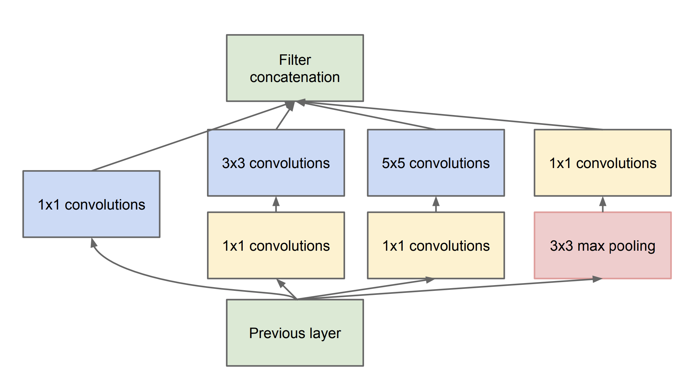
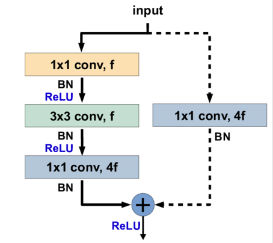

# Deep Convolutional Architectures
## Resources
* [Vanishing Gradient Problem](https://en.wikipedia.org/wiki/Vanishing_gradient_problem)
* [1x1 Convolutions](https://www.youtube.com/watch?v=SIpcirNNGAk)
* [What does 1x1 convolution mean in a neural network?](https://stats.stackexchange.com/questions/194142/what-does-1x1-convolution-mean-in-a-neural-network)
* [GoogLeNet Tutorial](https://www.youtube.com/watch?v=_XF7N6rp9Jw)
* [Review: GoogLeNet (Inception v1)— Winner of ILSVRC 2014 (Image Classification)](https://medium.com/coinmonks/paper-review-of-googlenet-inception-v1-winner-of-ilsvlc-2014-image-classification-c2b3565a64e7)
* [Residual Neural Network](https://en.wikipedia.org/wiki/Residual_neural_network)
* [An Overview of ResNet and its Variants](https://stephanosterburg.gitbook.io/scrapbook/coding/intro-to-tensorflow-for-ai-ml-and-dl/an-overview-of-resnet-and-its-variants)
* [Review: ResNet — Winner of ILSVRC 2015 (Image Classification, Localization, Detection)](https://towardsdatascience.com/review-resnet-winner-of-ilsvrc-2015-image-classification-localization-detection-e39402bfa5d8)
* [Deep Residual Learning for Image Recognition](https://www.youtube.com/watch?v=C6tLw-rPQ2o)
* [Review: ResNeXt — 1st Runner Up in ILSVRC 2016 (Image Classification)](https://towardsdatascience.com/review-resnext-1st-runner-up-of-ilsvrc-2016-image-classification-15d7f17b42ac)
* [Review: DenseNet — Dense Convolutional Network (Image Classification)](https://towardsdatascience.com/review-densenet-image-classification-b6631a8ef803)
* [Densely Connected Convolutional Networks](https://www.youtube.com/watch?v=-W6y8xnd--U)
* [Network In Network](https://www.youtube.com/watch?v=c1RBQzKsDCk&list=PLkDaE6sCZn6Gl29AoE31iwdVwSG-KnDzF&index=17)
* [Inception Network Motivation](https://www.youtube.com/watch?v=C86ZXvgpejM&list=PLkDaE6sCZn6Gl29AoE31iwdVwSG-KnDzF&index=18)
* [Inception Network](https://www.youtube.com/watch?v=KfV8CJh7hE0&list=PLkDaE6sCZn6Gl29AoE31iwdVwSG-KnDzF&index=19)
* [Resnets](https://www.youtube.com/watch?v=ZILIbUvp5lk&list=PLkDaE6sCZn6Gl29AoE31iwdVwSG-KnDzF&index=15)
* [Why ResNets Work](https://www.youtube.com/watch?v=RYth6EbBUqM&list=PLkDaE6sCZn6Gl29AoE31iwdVwSG-KnDzF&index=16)
* [Network in Network (2014) - paper](https://arxiv.org/pdf/1312.4400)
* [Going Deeper with Convolutions (2014) - paper](https://arxiv.org/pdf/1409.4842)
* [Highway Networks (2015) - paper](https://arxiv.org/pdf/1505.00387)
* [Deep Residual Learning for Image Recognition (2015)- paper](https://arxiv.org/pdf/1512.03385)
* [Aggregated Residual Transformations for Deep Neural Networks (2017) - paper](https://arxiv.org/pdf/1611.05431)
* [Densely Connected Convolutional Networks (2018) - paper](https://arxiv.org/pdf/1608.06993)
* [Multi-Scale Dense Networks for Resource Efficient Image Classification (2018)](https://arxiv.org/pdf/1703.09844)

## Learning Objectives
* What is a skip connection?
* What is a bottleneck layer?
* What is the Inception Network?
* What is ResNet? ResNeXt? DenseNet?
* How to replicate a network architecture by reading a journal article

# Tasks
## 0. Inception Block

### Function: `inception_block`

**Definition:**

`def inception_block(A_prev, filters):`

**Description:**

This function builds an inception block as described in the paper *Going Deeper with Convolutions* (2014).

**Parameters:**

- **A_prev**: The output from the previous layer.

- **filters**: A tuple or list containing the following values:
  - **F1**: Number of filters in the `1x1` convolution.
  - **F3R**: Number of filters in the `1x1` convolution before the `3x3` convolution.
  - **F3**: Number of filters in the `3x3` convolution.
  - **F5R**: Number of filters in the `1x1` convolution before the `5x5` convolution.
  - **F5**: Number of filters in the `5x5` convolution.
  - **FPP**: Number of filters in the `1x1` convolution after the max pooling.

**Inception Block Architecture:**

1. **1x1 Convolution**:
   - Number of filters: `F1`.
   - Activation: ReLU.

2. **1x1 Convolution followed by 3x3 Convolution**:
   - First layer: `1x1` convolution with `F3R` filters.
   - Second layer: `3x3` convolution with `F3` filters.
   - Activation: ReLU.

3. **1x1 Convolution followed by 5x5 Convolution**:
   - First layer: `1x1` convolution with `F5R` filters.
   - Second layer: `5x5` convolution with `F5` filters.
   - Activation: ReLU.

4. **Max Pooling followed by 1x1 Convolution**:
   - Max pooling with `FPP` filters.
   - `1x1` convolution with `FPP` filters.
   - Activation: ReLU.

5. **Concatenation**: The outputs from the above layers are concatenated into a single tensor.

**Returns:**

- The concatenated output of the inception block.
```python
#!/usr/bin/env python3

from tensorflow import keras as K
inception_block = __import__('0-inception_block').inception_block

if __name__ == '__main__':
    X = K.Input(shape=(224, 224, 3))
    Y = inception_block(X, [64, 96, 128, 16, 32, 32])
    model = K.models.Model(inputs=X, outputs=Y)
    model.summary()
```
```txt
Model: "model"
__________________________________________________________________________________________________
 Layer (type)                Output Shape                 Param #   Connected to
==================================================================================================
 input_1 (InputLayer)        [(None, 224, 224, 3)]        0         []

 conv2d_1 (Conv2D)           (None, 224, 224, 96)         384       ['input_1[0][0]']

 conv2d_3 (Conv2D)           (None, 224, 224, 16)         64        ['input_1[0][0]']

 max_pooling2d (MaxPooling2  (None, 224, 224, 3)          0         ['input_1[0][0]']
 D)

 conv2d (Conv2D)             (None, 224, 224, 64)         256       ['input_1[0][0]']

 conv2d_2 (Conv2D)           (None, 224, 224, 128)        110720    ['conv2d_1[0][0]']

 conv2d_4 (Conv2D)           (None, 224, 224, 32)         12832     ['conv2d_3[0][0]']

 conv2d_5 (Conv2D)           (None, 224, 224, 32)         128       ['max_pooling2d[0][0]']

 concatenate (Concatenate)   (None, 224, 224, 256)        0         ['conv2d[0][0]',
                                                                     'conv2d_2[0][0]',
                                                                     'conv2d_4[0][0]',
                                                                     'conv2d_5[0][0]']

==================================================================================================
Total params: 124384 (485.88 KB)
Trainable params: 124384 (485.88 KB)
Non-trainable params: 0 (0.00 Byte)
__________________________________________________________________________________________________
```
## 1. Inception Network

### Function: `inception_network`

**Definition:**

`def inception_network():`

**Description:**

This function builds the full Inception network as described in the paper *Going Deeper with Convolutions* (2014), including a dropout layer (40%) between the global average pooling layer and the fully connected layer.

**Assumptions:**

- The input data will have a shape of `(224, 224, 3)`.

**Inception Network Architecture:**

1. **Input Layer**:
   - Shape: `(224, 224, 3)`.

2. **First Convolutional Layer**:
   - `7x7` convolution with `64` filters, `2x2` strides, and **same** padding.
   - Activation: ReLU.
   - Followed by **max pooling** with `3x3` kernel and `2x2` strides.

3. **Second Convolutional Layer**:
   - `1x1` convolution with `64` filters.
   - `3x3` convolution with `192` filters, **same** padding.
   - Activation: ReLU.
   - Followed by **max pooling** with `3x3` kernel and `2x2` strides.

4. **First Inception Block**:
   - Number of filters for the block: `(64, 96, 128, 16, 32, 32)`.
   - ReLU activations.

5. **Second Inception Block**:
   - Number of filters for the block: `(128, 128, 192, 32, 96, 64)`.
   - ReLU activations.
   - Followed by **max pooling** with `3x3` kernel and `2x2` strides.

6. **Third Inception Block**:
   - Number of filters for the block: `(192, 96, 208, 16, 48, 64)`.
   - ReLU activations.

7. **Fourth Inception Block**:
   - Number of filters for the block: `(160, 112, 224, 24, 64, 64)`.
   - ReLU activations.

8. **Fifth Inception Block**:
   - Number of filters for the block: `(128, 128, 256, 24, 64, 64)`.
   - ReLU activations.

9. **Sixth Inception Block**:
   - Number of filters for the block: `(112, 144, 288, 32, 64, 64)`.
   - ReLU activations.
   - Followed by **max pooling** with `3x3` kernel and `2x2` strides.

10. **Seventh Inception Block**:
    - Number of filters for the block: `(256, 160, 320, 32, 128, 128)`.
    - ReLU activations.

11. **Eighth Inception Block**:
    - Number of filters for the block: `(384, 192, 384, 48, 128, 128)`.
    - ReLU activations.

12. **Global Average Pooling Layer**.

13. **Dropout Layer**:
    - Dropout rate: 40%.

14. **Fully Connected Layer**:
    - `1000` nodes (for 1000 classes).
    - Activation: Softmax.

**Returns:**

- The compiled Keras model, using Adam optimization and accuracy metrics.
```python
#!/usr/bin/env python3

from tensorflow import keras as K

inception_network = __import__('1-inception_network').inception_network

if __name__ == '__main__':
    model = inception_network()
    model.summary()
```
```txt
Model: "model"
__________________________________________________________________________________________________
 Layer (type)                Output Shape                 Param #   Connected to                  
==================================================================================================
 input_1 (InputLayer)        [(None, 224, 224, 3)]        0         []                            

 conv2d (Conv2D)             (None, 112, 112, 64)         9472      ['input_1[0][0]']             

 max_pooling2d (MaxPooling2  (None, 56, 56, 64)           0         ['conv2d[0][0]']              
 D)                                                                                               

 conv2d_1 (Conv2D)           (None, 56, 56, 64)           4160      ['max_pooling2d[0][0]']       

 conv2d_2 (Conv2D)           (None, 56, 56, 192)          110784    ['conv2d_1[0][0]']            

 max_pooling2d_1 (MaxPoolin  (None, 28, 28, 192)          0         ['conv2d_2[0][0]']            
 g2D)                                                                                             

 conv2d_4 (Conv2D)           (None, 28, 28, 96)           18528     ['max_pooling2d_1[0][0]']     

 conv2d_6 (Conv2D)           (None, 28, 28, 16)           3088      ['max_pooling2d_1[0][0]']     

 max_pooling2d_2 (MaxPoolin  (None, 28, 28, 192)          0         ['max_pooling2d_1[0][0]']     
 g2D)                                                                                             

 conv2d_3 (Conv2D)           (None, 28, 28, 64)           12352     ['max_pooling2d_1[0][0]']     

 conv2d_5 (Conv2D)           (None, 28, 28, 128)          110720    ['conv2d_4[0][0]']            

 conv2d_7 (Conv2D)           (None, 28, 28, 32)           12832     ['conv2d_6[0][0]']            

 conv2d_8 (Conv2D)           (None, 28, 28, 32)           6176      ['max_pooling2d_2[0][0]']     

 concatenate (Concatenate)   (None, 28, 28, 256)          0         ['conv2d_3[0][0]',            
                                                                     'conv2d_5[0][0]',            
                                                                     'conv2d_7[0][0]',            
                                                                     'conv2d_8[0][0]']            

 conv2d_10 (Conv2D)          (None, 28, 28, 128)          32896     ['concatenate[0][0]']         

 conv2d_12 (Conv2D)          (None, 28, 28, 32)           8224      ['concatenate[0][0]']         

 max_pooling2d_3 (MaxPoolin  (None, 28, 28, 256)          0         ['concatenate[0][0]']         
 g2D)                                                                                             

 conv2d_9 (Conv2D)           (None, 28, 28, 128)          32896     ['concatenate[0][0]']         

 conv2d_11 (Conv2D)          (None, 28, 28, 192)          221376    ['conv2d_10[0][0]']           

 conv2d_13 (Conv2D)          (None, 28, 28, 96)           76896     ['conv2d_12[0][0]']           

 conv2d_14 (Conv2D)          (None, 28, 28, 64)           16448     ['max_pooling2d_3[0][0]']     

 concatenate_1 (Concatenate  (None, 28, 28, 480)          0         ['conv2d_9[0][0]',            
 )                                                                   'conv2d_11[0][0]',           
                                                                     'conv2d_13[0][0]',           
                                                                     'conv2d_14[0][0]']           

 max_pooling2d_4 (MaxPoolin  (None, 14, 14, 480)          0         ['concatenate_1[0][0]']       
 g2D)                                                                                             

 conv2d_16 (Conv2D)          (None, 14, 14, 96)           46176     ['max_pooling2d_4[0][0]']     

 conv2d_18 (Conv2D)          (None, 14, 14, 16)           7696      ['max_pooling2d_4[0][0]']     

 max_pooling2d_5 (MaxPoolin  (None, 14, 14, 480)          0         ['max_pooling2d_4[0][0]']     
 g2D)                                                                                             

 conv2d_15 (Conv2D)          (None, 14, 14, 192)          92352     ['max_pooling2d_4[0][0]']     

 conv2d_17 (Conv2D)          (None, 14, 14, 208)          179920    ['conv2d_16[0][0]']           

 conv2d_19 (Conv2D)          (None, 14, 14, 48)           19248     ['conv2d_18[0][0]']           

 conv2d_20 (Conv2D)          (None, 14, 14, 64)           30784     ['max_pooling2d_5[0][0]']     

 concatenate_2 (Concatenate  (None, 14, 14, 512)          0         ['conv2d_15[0][0]',           
 )                                                                   'conv2d_17[0][0]',           
                                                                     'conv2d_19[0][0]',           
                                                                     'conv2d_20[0][0]']           

 conv2d_22 (Conv2D)          (None, 14, 14, 112)          57456     ['concatenate_2[0][0]']       

 conv2d_24 (Conv2D)          (None, 14, 14, 24)           12312     ['concatenate_2[0][0]']       

 max_pooling2d_6 (MaxPoolin  (None, 14, 14, 512)          0         ['concatenate_2[0][0]']       
 g2D)                                                                                             

 conv2d_21 (Conv2D)          (None, 14, 14, 160)          82080     ['concatenate_2[0][0]']       

 conv2d_23 (Conv2D)          (None, 14, 14, 224)          226016    ['conv2d_22[0][0]']           

 conv2d_25 (Conv2D)          (None, 14, 14, 64)           38464     ['conv2d_24[0][0]']           

 conv2d_26 (Conv2D)          (None, 14, 14, 64)           32832     ['max_pooling2d_6[0][0]']     

 concatenate_3 (Concatenate  (None, 14, 14, 512)          0         ['conv2d_21[0][0]',           
 )                                                                   'conv2d_23[0][0]',           
                                                                     'conv2d_25[0][0]',           
                                                                     'conv2d_26[0][0]']           

 conv2d_28 (Conv2D)          (None, 14, 14, 128)          65664     ['concatenate_3[0][0]']       

 conv2d_30 (Conv2D)          (None, 14, 14, 24)           12312     ['concatenate_3[0][0]']       

 max_pooling2d_7 (MaxPoolin  (None, 14, 14, 512)          0         ['concatenate_3[0][0]']       
 g2D)                                                                                             

 conv2d_27 (Conv2D)          (None, 14, 14, 128)          65664     ['concatenate_3[0][0]']       

 conv2d_29 (Conv2D)          (None, 14, 14, 256)          295168    ['conv2d_28[0][0]']           

 conv2d_31 (Conv2D)          (None, 14, 14, 64)           38464     ['conv2d_30[0][0]']           

 conv2d_32 (Conv2D)          (None, 14, 14, 64)           32832     ['max_pooling2d_7[0][0]']     

 concatenate_4 (Concatenate  (None, 14, 14, 512)          0         ['conv2d_27[0][0]',           
 )                                                                   'conv2d_29[0][0]',           
                                                                     'conv2d_31[0][0]',           
                                                                     'conv2d_32[0][0]']           

 conv2d_34 (Conv2D)          (None, 14, 14, 144)          73872     ['concatenate_4[0][0]']       

 conv2d_36 (Conv2D)          (None, 14, 14, 32)           16416     ['concatenate_4[0][0]']       

 max_pooling2d_8 (MaxPoolin  (None, 14, 14, 512)          0         ['concatenate_4[0][0]']       
 g2D)                                                                                             

 conv2d_33 (Conv2D)          (None, 14, 14, 112)          57456     ['concatenate_4[0][0]']       

 conv2d_35 (Conv2D)          (None, 14, 14, 288)          373536    ['conv2d_34[0][0]']           

 conv2d_37 (Conv2D)          (None, 14, 14, 64)           51264     ['conv2d_36[0][0]']           

 conv2d_38 (Conv2D)          (None, 14, 14, 64)           32832     ['max_pooling2d_8[0][0]']     

 concatenate_5 (Concatenate  (None, 14, 14, 528)          0         ['conv2d_33[0][0]',           
 )                                                                   'conv2d_35[0][0]',           
                                                                     'conv2d_37[0][0]',           
                                                                     'conv2d_38[0][0]']           

 conv2d_40 (Conv2D)          (None, 14, 14, 160)          84640     ['concatenate_5[0][0]']       

 conv2d_42 (Conv2D)          (None, 14, 14, 32)           16928     ['concatenate_5[0][0]']       

 max_pooling2d_9 (MaxPoolin  (None, 14, 14, 528)          0         ['concatenate_5[0][0]']       
 g2D)                                                                                             

 conv2d_39 (Conv2D)          (None, 14, 14, 256)          135424    ['concatenate_5[0][0]']       

 conv2d_41 (Conv2D)          (None, 14, 14, 320)          461120    ['conv2d_40[0][0]']           

 conv2d_43 (Conv2D)          (None, 14, 14, 128)          102528    ['conv2d_42[0][0]']           

 conv2d_44 (Conv2D)          (None, 14, 14, 128)          67712     ['max_pooling2d_9[0][0]']     

 concatenate_6 (Concatenate  (None, 14, 14, 832)          0         ['conv2d_39[0][0]',           
 )                                                                   'conv2d_41[0][0]',           
                                                                     'conv2d_43[0][0]',           
                                                                     'conv2d_44[0][0]']           

 max_pooling2d_10 (MaxPooli  (None, 7, 7, 832)            0         ['concatenate_6[0][0]']       
 ng2D)                                                                                            

 conv2d_46 (Conv2D)          (None, 7, 7, 160)            133280    ['max_pooling2d_10[0][0]']    

 conv2d_48 (Conv2D)          (None, 7, 7, 32)             26656     ['max_pooling2d_10[0][0]']    

 max_pooling2d_11 (MaxPooli  (None, 7, 7, 832)            0         ['max_pooling2d_10[0][0]']    
 ng2D)                                                                                            

 conv2d_45 (Conv2D)          (None, 7, 7, 256)            213248    ['max_pooling2d_10[0][0]']    

 conv2d_47 (Conv2D)          (None, 7, 7, 320)            461120    ['conv2d_46[0][0]']           

 conv2d_49 (Conv2D)          (None, 7, 7, 128)            102528    ['conv2d_48[0][0]']           

 conv2d_50 (Conv2D)          (None, 7, 7, 128)            106624    ['max_pooling2d_11[0][0]']    

 concatenate_7 (Concatenate  (None, 7, 7, 832)            0         ['conv2d_45[0][0]',           
 )                                                                   'conv2d_47[0][0]',           
                                                                     'conv2d_49[0][0]',           
                                                                     'conv2d_50[0][0]']           

 conv2d_52 (Conv2D)          (None, 7, 7, 192)            159936    ['concatenate_7[0][0]']       

 conv2d_54 (Conv2D)          (None, 7, 7, 48)             39984     ['concatenate_7[0][0]']       

 max_pooling2d_12 (MaxPooli  (None, 7, 7, 832)            0         ['concatenate_7[0][0]']       
 ng2D)                                                                                            

 conv2d_51 (Conv2D)          (None, 7, 7, 384)            319872    ['concatenate_7[0][0]']       

 conv2d_53 (Conv2D)          (None, 7, 7, 384)            663936    ['conv2d_52[0][0]']           

 conv2d_55 (Conv2D)          (None, 7, 7, 128)            153728    ['conv2d_54[0][0]']           

 conv2d_56 (Conv2D)          (None, 7, 7, 128)            106624    ['max_pooling2d_12[0][0]']    

 concatenate_8 (Concatenate  (None, 7, 7, 1024)           0         ['conv2d_51[0][0]',           
 )                                                                   'conv2d_53[0][0]',           
                                                                     'conv2d_55[0][0]',           
                                                                     'conv2d_56[0][0]']           

 average_pooling2d (Average  (None, 1, 1, 1024)           0         ['concatenate_8[0][0]']       
 Pooling2D)                                                                                       

 dropout (Dropout)           (None, 1, 1, 1024)           0         ['average_pooling2d[0][0]']   

 dense (Dense)               (None, 1, 1, 1000)           1025000   ['dropout[0][0]']             

==================================================================================================
Total params: 6998552 (26.70 MB)
Trainable params: 6998552 (26.70 MB)
Non-trainable params: 0 (0.00 Byte)
__________________________________________________________________________________________________
```
## 2. Identity Block

### Function: `identity_block`

**Definition:**

`def identity_block(A_prev, filters):`

**Description:**

This function builds an identity block as described in the paper *Deep Residual Learning for Image Recognition* (2015).

**Parameters:**

- **A_prev**: The output from the previous layer.

- **filters**: A tuple or list containing the following values:
  - **F11**: Number of filters in the first `1x1` convolution.
  - **F3**: Number of filters in the `3x3` convolution.
  - **F12**: Number of filters in the second `1x1` convolution.

**Identity Block Architecture:**

1. **First Layer**:
   - `1x1` convolution with `F11` filters.
   - Batch normalization along the channels axis.
   - Activation: ReLU.

2. **Second Layer**:
   - `3x3` convolution with `F3` filters.
   - Batch normalization along the channels axis.
   - Activation: ReLU.

3. **Third Layer**:
   - `1x1` convolution with `F12` filters.
   - Batch normalization along the channels axis.
   - No activation applied here (output is added to the original `A_prev`).

4. **Additive Identity Connection**:
   - The output of the third layer is added to the original `A_prev`.
   - Activation: ReLU applied after the addition.

**Notes:**

- All convolutions are followed by batch normalization along the channels axis.
- ReLU activation is applied after each batch normalization, except for the third layer, where it is applied after adding the identity connection.
- The **he normal initialization** is used for all weight initializations, with the seed set to zero to ensure reproducibility.

**Returns:**

- The activated output of the identity block.
```python
#!/usr/bin/env python3

from tensorflow import keras as K
identity_block = __import__('2-identity_block').identity_block

if __name__ == '__main__':
    X = K.Input(shape=(224, 224, 256))
    Y = identity_block(X, [64, 64, 256])
    model = K.models.Model(inputs=X, outputs=Y)
    model.summary()
```
```txt
Model: "model"
__________________________________________________________________________________________________
 Layer (type)                Output Shape                 Param #   Connected to                  
==================================================================================================
 input_1 (InputLayer)        [(None, 224, 224, 256)]      0         []                            

 conv2d (Conv2D)             (None, 224, 224, 64)         16448     ['input_1[0][0]']             

 batch_normalization (Batch  (None, 224, 224, 64)         256       ['conv2d[0][0]']              
 Normalization)                                                                                   

 activation (Activation)     (None, 224, 224, 64)         0         ['batch_normalization[0][0]'] 

 conv2d_1 (Conv2D)           (None, 224, 224, 64)         36928     ['activation[0][0]']          

 batch_normalization_1 (Bat  (None, 224, 224, 64)         256       ['conv2d_1[0][0]']            
 chNormalization)                                                                                 

 activation_1 (Activation)   (None, 224, 224, 64)         0         ['batch_normalization_1[0][0]'
                                                                    ]                             

 conv2d_2 (Conv2D)           (None, 224, 224, 256)        16640     ['activation_1[0][0]']        

 batch_normalization_2 (Bat  (None, 224, 224, 256)        1024      ['conv2d_2[0][0]']            
 chNormalization)                                                                                 

 add (Add)                   (None, 224, 224, 256)        0         ['batch_normalization_2[0][0]'
                                                                    , 'input_1[0][0]']            

 activation_2 (Activation)   (None, 224, 224, 256)        0         ['add[0][0]']                 

==================================================================================================
Total params: 71552 (279.50 KB)
Trainable params: 70784 (276.50 KB)
Non-trainable params: 768 (3.00 KB)
__________________________________________________________________________________________________
```

## 3. Projection Block

### Function: `projection_block`

**Definition:**

`def projection_block(A_prev, filters, s=2):`

**Description:**

This function builds a projection block as described in the paper *Deep Residual Learning for Image Recognition* (2015).

**Parameters:**

- **A_prev**: The output from the previous layer.

- **filters**: A tuple or list containing the following values:
  - **F11**: Number of filters in the first `1x1` convolution.
  - **F3**: Number of filters in the `3x3` convolution.
  - **F12**: Number of filters in the second `1x1` convolution (used in both the main path and the shortcut connection).

- **s**: The stride of the first convolution in both the main path and the shortcut connection. Defaults to `2`.

**Projection Block Architecture:**

1. **Main Path**:
   - **First Layer**:
     - `1x1` convolution with `F11` filters, using a stride of `s`.
     - Batch normalization along the channels axis.
     - Activation: ReLU.
   
   - **Second Layer**:
     - `3x3` convolution with `F3` filters, using a stride of `1` and **same** padding.
     - Batch normalization along the channels axis.
     - Activation: ReLU.

   - **Third Layer**:
     - `1x1` convolution with `F12` filters, using a stride of `1`.
     - Batch normalization along the channels axis.
     - No activation applied here (output is added to the shortcut connection).

2. **Shortcut Path**:
   - **1x1** convolution with `F12` filters, using a stride of `s`.
   - Batch normalization along the channels axis.
   - This path acts as the projection shortcut to match dimensions.

3. **Additive Projection Connection**:
   - The output of the third layer of the main path is added to the shortcut connection output.
   - Activation: ReLU applied after the addition.

**Notes:**

- All convolutions are followed by batch normalization along the channels axis.
- ReLU activation is applied after each batch normalization, except for the third layer of the main path and the shortcut connection, where ReLU is applied after adding the projection connection.
- The **he normal initialization** is used for all weight initializations, with the seed set to zero to ensure reproducibility.

**Returns:**

- The activated output of the projection block.
```python
#!/usr/bin/env python3

from tensorflow import keras as K
projection_block = __import__('3-projection_block').projection_block

if __name__ == '__main__':
    X = K.Input(shape=(224, 224, 3))
    Y = projection_block(X, [64, 64, 256])
    model = K.models.Model(inputs=X, outputs=Y)
    model.summary()
```
```txt
Model: "model"
__________________________________________________________________________________________________
 Layer (type)                Output Shape                 Param #   Connected to                  
==================================================================================================
 input_1 (InputLayer)        [(None, 224, 224, 3)]        0         []                            

 conv2d (Conv2D)             (None, 112, 112, 64)         256       ['input_1[0][0]']             

 batch_normalization (Batch  (None, 112, 112, 64)         256       ['conv2d[0][0]']              
 Normalization)                                                                                   

 activation (Activation)     (None, 112, 112, 64)         0         ['batch_normalization[0][0]'] 

 conv2d_1 (Conv2D)           (None, 112, 112, 64)         36928     ['activation[0][0]']          

 batch_normalization_1 (Bat  (None, 112, 112, 64)         256       ['conv2d_1[0][0]']            
 chNormalization)                                                                                 

 activation_1 (Activation)   (None, 112, 112, 64)         0         ['batch_normalization_1[0][0]'
                                                                    ]                             

 conv2d_2 (Conv2D)           (None, 112, 112, 256)        16640     ['activation_1[0][0]']        

 conv2d_3 (Conv2D)           (None, 112, 112, 256)        1024      ['input_1[0][0]']             

 batch_normalization_2 (Bat  (None, 112, 112, 256)        1024      ['conv2d_2[0][0]']            
 chNormalization)                                                                                 

 batch_normalization_3 (Bat  (None, 112, 112, 256)        1024      ['conv2d_3[0][0]']            
 chNormalization)                                                                                 

 add (Add)                   (None, 112, 112, 256)        0         ['batch_normalization_2[0][0]'
                                                                    , 'batch_normalization_3[0][0]
                                                                    ']                            

 activation_2 (Activation)   (None, 112, 112, 256)        0         ['add[0][0]']                 

==================================================================================================
Total params: 57408 (224.25 KB)
Trainable params: 56128 (219.25 KB)
Non-trainable params: 1280 (5.00 KB)
__________________________________________________________________________________________________
```
## 4. ResNet-50
### Function: `resnet50`

**Definition:**

`def resnet50():`

**Description:**

This function builds the ResNet-50 architecture as described in the paper *Deep Residual Learning for Image Recognition* (2015).

**Assumptions:**

- The input data will have a shape of `(224, 224, 3)`.

**ResNet-50 Architecture:**

1. **Input Layer**:
   - Shape: `(224, 224, 3)`.

2. **First Convolutional Layer**:
   - `7x7` convolution with `64` filters, `2x2` strides, and **same** padding.
   - Batch normalization along the channels axis.
   - Activation: ReLU.
   - Followed by **max pooling** with `3x3` kernel and `2x2` strides.

3. **First Stage**:
   - **Projection Block** with filters `(64, 64, 256)` and a stride of `1`.
   - **Two Identity Blocks** with filters `(64, 64, 256)`.

4. **Second Stage**:
   - **Projection Block** with filters `(128, 128, 512)` and a stride of `2`.
   - **Three Identity Blocks** with filters `(128, 128, 512)`.

5. **Third Stage**:
   - **Projection Block** with filters `(256, 256, 1024)` and a stride of `2`.
   - **Five Identity Blocks** with filters `(256, 256, 1024)`.

6. **Fourth Stage**:
   - **Projection Block** with filters `(512, 512, 2048)` and a stride of `2`.
   - **Two Identity Blocks** with filters `(512, 512, 2048)`.

7. **Global Average Pooling Layer**:
   - Reduces the spatial dimensions of the feature maps to `1x1`.

8. **Fully Connected Layer**:
   - `1000` nodes (for 1000 classes).
   - Activation: Softmax.

**Notes:**

- All convolutions are followed by batch normalization along the channels axis.
- ReLU activation is applied after each batch normalization.
- The **he normal initialization** is used for all weight initializations, with the seed set to zero to ensure reproducibility.
- You can use:
  - `identity_block = __import__('2-identity_block').identity_block`
  - `projection_block = __import__('3-projection_block').projection_block`

**Returns:**

- The compiled Keras model using Adam optimization and accuracy metrics.

```python
#!/usr/bin/env python3

from tensorflow import keras as K
resnet50 = __import__('4-resnet50').resnet50

if __name__ == '__main__':
    model = resnet50()
    model.summary()
```
```txt
Model: "model"
__________________________________________________________________________________________________
 Layer (type)                Output Shape                 Param #   Connected to                  
==================================================================================================
 input_1 (InputLayer)        [(None, 224, 224, 3)]        0         []                            

 conv2d (Conv2D)             (None, 112, 112, 64)         9472      ['input_1[0][0]']             

 batch_normalization (Batch  (None, 112, 112, 64)         256       ['conv2d[0][0]']              
 Normalization)                                                                                   

 activation (Activation)     (None, 112, 112, 64)         0         ['batch_normalization[0][0]'] 

 max_pooling2d (MaxPooling2  (None, 56, 56, 64)           0         ['activation[0][0]']          
 D)                                                                                               

 conv2d_1 (Conv2D)           (None, 56, 56, 64)           4160      ['max_pooling2d[0][0]']       

 batch_normalization_1 (Bat  (None, 56, 56, 64)           256       ['conv2d_1[0][0]']            
 chNormalization)                                                                                 

 activation_1 (Activation)   (None, 56, 56, 64)           0         ['batch_normalization_1[0][0]'
                                                                    ]                             

 conv2d_2 (Conv2D)           (None, 56, 56, 64)           36928     ['activation_1[0][0]']        

 batch_normalization_2 (Bat  (None, 56, 56, 64)           256       ['conv2d_2[0][0]']            
 chNormalization)                                                                                 

 activation_2 (Activation)   (None, 56, 56, 64)           0         ['batch_normalization_2[0][0]'
                                                                    ]                             

 conv2d_3 (Conv2D)           (None, 56, 56, 256)          16640     ['activation_2[0][0]']        

 conv2d_4 (Conv2D)           (None, 56, 56, 256)          16640     ['max_pooling2d[0][0]']       

 batch_normalization_3 (Bat  (None, 56, 56, 256)          1024      ['conv2d_3[0][0]']            
 chNormalization)                                                                                 

 batch_normalization_4 (Bat  (None, 56, 56, 256)          1024      ['conv2d_4[0][0]']            
 chNormalization)                                                                                 

 add (Add)                   (None, 56, 56, 256)          0         ['batch_normalization_3[0][0]'
                                                                    , 'batch_normalization_4[0][0]
                                                                    ']                            

 activation_3 (Activation)   (None, 56, 56, 256)          0         ['add[0][0]']                 

 conv2d_5 (Conv2D)           (None, 56, 56, 64)           16448     ['activation_3[0][0]']        

 batch_normalization_5 (Bat  (None, 56, 56, 64)           256       ['conv2d_5[0][0]']            
 chNormalization)                                                                                 

 activation_4 (Activation)   (None, 56, 56, 64)           0         ['batch_normalization_5[0][0]'
                                                                    ]                             

 conv2d_6 (Conv2D)           (None, 56, 56, 64)           36928     ['activation_4[0][0]']        

 batch_normalization_6 (Bat  (None, 56, 56, 64)           256       ['conv2d_6[0][0]']            
 chNormalization)                                                                                 

 activation_5 (Activation)   (None, 56, 56, 64)           0         ['batch_normalization_6[0][0]'
                                                                    ]                             

 conv2d_7 (Conv2D)           (None, 56, 56, 256)          16640     ['activation_5[0][0]']        

 batch_normalization_7 (Bat  (None, 56, 56, 256)          1024      ['conv2d_7[0][0]']            
 chNormalization)                                                                                 

 add_1 (Add)                 (None, 56, 56, 256)          0         ['batch_normalization_7[0][0]'
                                                                    , 'activation_3[0][0]']       

 activation_6 (Activation)   (None, 56, 56, 256)          0         ['add_1[0][0]']               

 conv2d_8 (Conv2D)           (None, 56, 56, 64)           16448     ['activation_6[0][0]']        

 batch_normalization_8 (Bat  (None, 56, 56, 64)           256       ['conv2d_8[0][0]']            
 chNormalization)                                                                                 

 activation_7 (Activation)   (None, 56, 56, 64)           0         ['batch_normalization_8[0][0]'
                                                                    ]                             

 conv2d_9 (Conv2D)           (None, 56, 56, 64)           36928     ['activation_7[0][0]']        

 batch_normalization_9 (Bat  (None, 56, 56, 64)           256       ['conv2d_9[0][0]']            
 chNormalization)                                                                                 

 activation_8 (Activation)   (None, 56, 56, 64)           0         ['batch_normalization_9[0][0]'
                                                                    ]                             

 conv2d_10 (Conv2D)          (None, 56, 56, 256)          16640     ['activation_8[0][0]']        

 batch_normalization_10 (Ba  (None, 56, 56, 256)          1024      ['conv2d_10[0][0]']           
 tchNormalization)                                                                                

 add_2 (Add)                 (None, 56, 56, 256)          0         ['batch_normalization_10[0][0]
                                                                    ',                            
                                                                     'activation_6[0][0]']        

 activation_9 (Activation)   (None, 56, 56, 256)          0         ['add_2[0][0]']               

 conv2d_11 (Conv2D)          (None, 28, 28, 128)          32896     ['activation_9[0][0]']        

 batch_normalization_11 (Ba  (None, 28, 28, 128)          512       ['conv2d_11[0][0]']           
 tchNormalization)                                                                                

 activation_10 (Activation)  (None, 28, 28, 128)          0         ['batch_normalization_11[0][0]
                                                                    ']                            

 conv2d_12 (Conv2D)          (None, 28, 28, 128)          147584    ['activation_10[0][0]']       

 batch_normalization_12 (Ba  (None, 28, 28, 128)          512       ['conv2d_12[0][0]']           
 tchNormalization)                                                                                

 activation_11 (Activation)  (None, 28, 28, 128)          0         ['batch_normalization_12[0][0]
                                                                    ']                            

 conv2d_13 (Conv2D)          (None, 28, 28, 512)          66048     ['activation_11[0][0]']       

 conv2d_14 (Conv2D)          (None, 28, 28, 512)          131584    ['activation_9[0][0]']        

 batch_normalization_13 (Ba  (None, 28, 28, 512)          2048      ['conv2d_13[0][0]']           
 tchNormalization)                                                                                

 batch_normalization_14 (Ba  (None, 28, 28, 512)          2048      ['conv2d_14[0][0]']           
 tchNormalization)                                                                                

 add_3 (Add)                 (None, 28, 28, 512)          0         ['batch_normalization_13[0][0]
                                                                    ',                            
                                                                     'batch_normalization_14[0][0]
                                                                    ']                            

 activation_12 (Activation)  (None, 28, 28, 512)          0         ['add_3[0][0]']               

 conv2d_15 (Conv2D)          (None, 28, 28, 128)          65664     ['activation_12[0][0]']       

 batch_normalization_15 (Ba  (None, 28, 28, 128)          512       ['conv2d_15[0][0]']           
 tchNormalization)                                                                                

 activation_13 (Activation)  (None, 28, 28, 128)          0         ['batch_normalization_15[0][0]
                                                                    ']                            

 conv2d_16 (Conv2D)          (None, 28, 28, 128)          147584    ['activation_13[0][0]']       

 batch_normalization_16 (Ba  (None, 28, 28, 128)          512       ['conv2d_16[0][0]']           
 tchNormalization)                                                                                

 activation_14 (Activation)  (None, 28, 28, 128)          0         ['batch_normalization_16[0][0]
                                                                    ']                            

 conv2d_17 (Conv2D)          (None, 28, 28, 512)          66048     ['activation_14[0][0]']       

 batch_normalization_17 (Ba  (None, 28, 28, 512)          2048      ['conv2d_17[0][0]']           
 tchNormalization)                                                                                

 add_4 (Add)                 (None, 28, 28, 512)          0         ['batch_normalization_17[0][0]
                                                                    ',                            
                                                                     'activation_12[0][0]']       

 activation_15 (Activation)  (None, 28, 28, 512)          0         ['add_4[0][0]']               

 conv2d_18 (Conv2D)          (None, 28, 28, 128)          65664     ['activation_15[0][0]']       

 batch_normalization_18 (Ba  (None, 28, 28, 128)          512       ['conv2d_18[0][0]']           
 tchNormalization)                                                                                

 activation_16 (Activation)  (None, 28, 28, 128)          0         ['batch_normalization_18[0][0]
                                                                    ']                            

 conv2d_19 (Conv2D)          (None, 28, 28, 128)          147584    ['activation_16[0][0]']       

 batch_normalization_19 (Ba  (None, 28, 28, 128)          512       ['conv2d_19[0][0]']           
 tchNormalization)                                                                                

 activation_17 (Activation)  (None, 28, 28, 128)          0         ['batch_normalization_19[0][0]
                                                                    ']                            

 conv2d_20 (Conv2D)          (None, 28, 28, 512)          66048     ['activation_17[0][0]']       

 batch_normalization_20 (Ba  (None, 28, 28, 512)          2048      ['conv2d_20[0][0]']           
 tchNormalization)                                                                                

 add_5 (Add)                 (None, 28, 28, 512)          0         ['batch_normalization_20[0][0]
                                                                    ',                            
                                                                     'activation_15[0][0]']       

 activation_18 (Activation)  (None, 28, 28, 512)          0         ['add_5[0][0]']               

 conv2d_21 (Conv2D)          (None, 28, 28, 128)          65664     ['activation_18[0][0]']       

 batch_normalization_21 (Ba  (None, 28, 28, 128)          512       ['conv2d_21[0][0]']           
 tchNormalization)                                                                                

 activation_19 (Activation)  (None, 28, 28, 128)          0         ['batch_normalization_21[0][0]
                                                                    ']                            

 conv2d_22 (Conv2D)          (None, 28, 28, 128)          147584    ['activation_19[0][0]']       

 batch_normalization_22 (Ba  (None, 28, 28, 128)          512       ['conv2d_22[0][0]']           
 tchNormalization)                                                                                

 activation_20 (Activation)  (None, 28, 28, 128)          0         ['batch_normalization_22[0][0]
                                                                    ']                            

 conv2d_23 (Conv2D)          (None, 28, 28, 512)          66048     ['activation_20[0][0]']       

 batch_normalization_23 (Ba  (None, 28, 28, 512)          2048      ['conv2d_23[0][0]']           
 tchNormalization)                                                                                

 add_6 (Add)                 (None, 28, 28, 512)          0         ['batch_normalization_23[0][0]
                                                                    ',                            
                                                                     'activation_18[0][0]']       

 activation_21 (Activation)  (None, 28, 28, 512)          0         ['add_6[0][0]']               

 conv2d_24 (Conv2D)          (None, 14, 14, 256)          131328    ['activation_21[0][0]']       

 batch_normalization_24 (Ba  (None, 14, 14, 256)          1024      ['conv2d_24[0][0]']           
 tchNormalization)                                                                                

 activation_22 (Activation)  (None, 14, 14, 256)          0         ['batch_normalization_24[0][0]
                                                                    ']                            

 conv2d_25 (Conv2D)          (None, 14, 14, 256)          590080    ['activation_22[0][0]']       

 batch_normalization_25 (Ba  (None, 14, 14, 256)          1024      ['conv2d_25[0][0]']           
 tchNormalization)                                                                                

 activation_23 (Activation)  (None, 14, 14, 256)          0         ['batch_normalization_25[0][0]
                                                                    ']                            

 conv2d_26 (Conv2D)          (None, 14, 14, 1024)         263168    ['activation_23[0][0]']       

 conv2d_27 (Conv2D)          (None, 14, 14, 1024)         525312    ['activation_21[0][0]']       

 batch_normalization_26 (Ba  (None, 14, 14, 1024)         4096      ['conv2d_26[0][0]']           
 tchNormalization)                                                                                

 batch_normalization_27 (Ba  (None, 14, 14, 1024)         4096      ['conv2d_27[0][0]']           
 tchNormalization)                                                                                

 add_7 (Add)                 (None, 14, 14, 1024)         0         ['batch_normalization_26[0][0]
                                                                    ',                            
                                                                     'batch_normalization_27[0][0]
                                                                    ']                            

 activation_24 (Activation)  (None, 14, 14, 1024)         0         ['add_7[0][0]']               

 conv2d_28 (Conv2D)          (None, 14, 14, 256)          262400    ['activation_24[0][0]']       

 batch_normalization_28 (Ba  (None, 14, 14, 256)          1024      ['conv2d_28[0][0]']           
 tchNormalization)                                                                                

 activation_25 (Activation)  (None, 14, 14, 256)          0         ['batch_normalization_28[0][0]
                                                                    ']                            

 conv2d_29 (Conv2D)          (None, 14, 14, 256)          590080    ['activation_25[0][0]']       

 batch_normalization_29 (Ba  (None, 14, 14, 256)          1024      ['conv2d_29[0][0]']           
 tchNormalization)                                                                                

 activation_26 (Activation)  (None, 14, 14, 256)          0         ['batch_normalization_29[0][0]
                                                                    ']                            

 conv2d_30 (Conv2D)          (None, 14, 14, 1024)         263168    ['activation_26[0][0]']       

 batch_normalization_30 (Ba  (None, 14, 14, 1024)         4096      ['conv2d_30[0][0]']           
 tchNormalization)                                                                                

 add_8 (Add)                 (None, 14, 14, 1024)         0         ['batch_normalization_30[0][0]
                                                                    ',                            
                                                                     'activation_24[0][0]']       

 activation_27 (Activation)  (None, 14, 14, 1024)         0         ['add_8[0][0]']               

 conv2d_31 (Conv2D)          (None, 14, 14, 256)          262400    ['activation_27[0][0]']       

 batch_normalization_31 (Ba  (None, 14, 14, 256)          1024      ['conv2d_31[0][0]']           
 tchNormalization)                                                                                

 activation_28 (Activation)  (None, 14, 14, 256)          0         ['batch_normalization_31[0][0]
                                                                    ']                            

 conv2d_32 (Conv2D)          (None, 14, 14, 256)          590080    ['activation_28[0][0]']       

 batch_normalization_32 (Ba  (None, 14, 14, 256)          1024      ['conv2d_32[0][0]']           
 tchNormalization)                                                                                

 activation_29 (Activation)  (None, 14, 14, 256)          0         ['batch_normalization_32[0][0]
                                                                    ']                            

 conv2d_33 (Conv2D)          (None, 14, 14, 1024)         263168    ['activation_29[0][0]']       

 batch_normalization_33 (Ba  (None, 14, 14, 1024)         4096      ['conv2d_33[0][0]']           
 tchNormalization)                                                                                

 add_9 (Add)                 (None, 14, 14, 1024)         0         ['batch_normalization_33[0][0]
                                                                    ',                            
                                                                     'activation_27[0][0]']       

 activation_30 (Activation)  (None, 14, 14, 1024)         0         ['add_9[0][0]']               

 conv2d_34 (Conv2D)          (None, 14, 14, 256)          262400    ['activation_30[0][0]']       

 batch_normalization_34 (Ba  (None, 14, 14, 256)          1024      ['conv2d_34[0][0]']           
 tchNormalization)                                                                                

 activation_31 (Activation)  (None, 14, 14, 256)          0         ['batch_normalization_34[0][0]
                                                                    ']                            

 conv2d_35 (Conv2D)          (None, 14, 14, 256)          590080    ['activation_31[0][0]']       

 batch_normalization_35 (Ba  (None, 14, 14, 256)          1024      ['conv2d_35[0][0]']           
 tchNormalization)                                                                                

 activation_32 (Activation)  (None, 14, 14, 256)          0         ['batch_normalization_35[0][0]
                                                                    ']                            

 conv2d_36 (Conv2D)          (None, 14, 14, 1024)         263168    ['activation_32[0][0]']       

 batch_normalization_36 (Ba  (None, 14, 14, 1024)         4096      ['conv2d_36[0][0]']           
 tchNormalization)                                                                                

 add_10 (Add)                (None, 14, 14, 1024)         0         ['batch_normalization_36[0][0]
                                                                    ',                            
                                                                     'activation_30[0][0]']       

 activation_33 (Activation)  (None, 14, 14, 1024)         0         ['add_10[0][0]']              

 conv2d_37 (Conv2D)          (None, 14, 14, 256)          262400    ['activation_33[0][0]']       

 batch_normalization_37 (Ba  (None, 14, 14, 256)          1024      ['conv2d_37[0][0]']           
 tchNormalization)                                                                                

 activation_34 (Activation)  (None, 14, 14, 256)          0         ['batch_normalization_37[0][0]
                                                                    ']                            

 conv2d_38 (Conv2D)          (None, 14, 14, 256)          590080    ['activation_34[0][0]']       

 batch_normalization_38 (Ba  (None, 14, 14, 256)          1024      ['conv2d_38[0][0]']           
 tchNormalization)                                                                                

 activation_35 (Activation)  (None, 14, 14, 256)          0         ['batch_normalization_38[0][0]
                                                                    ']                            

 conv2d_39 (Conv2D)          (None, 14, 14, 1024)         263168    ['activation_35[0][0]']       

 batch_normalization_39 (Ba  (None, 14, 14, 1024)         4096      ['conv2d_39[0][0]']           
 tchNormalization)                                                                                

 add_11 (Add)                (None, 14, 14, 1024)         0         ['batch_normalization_39[0][0]
                                                                    ',                            
                                                                     'activation_33[0][0]']       

 activation_36 (Activation)  (None, 14, 14, 1024)         0         ['add_11[0][0]']              

 conv2d_40 (Conv2D)          (None, 14, 14, 256)          262400    ['activation_36[0][0]']       

 batch_normalization_40 (Ba  (None, 14, 14, 256)          1024      ['conv2d_40[0][0]']           
 tchNormalization)                                                                                

 activation_37 (Activation)  (None, 14, 14, 256)          0         ['batch_normalization_40[0][0]
                                                                    ']                            

 conv2d_41 (Conv2D)          (None, 14, 14, 256)          590080    ['activation_37[0][0]']       

 batch_normalization_41 (Ba  (None, 14, 14, 256)          1024      ['conv2d_41[0][0]']           
 tchNormalization)                                                                                

 activation_38 (Activation)  (None, 14, 14, 256)          0         ['batch_normalization_41[0][0]
                                                                    ']                            

 conv2d_42 (Conv2D)          (None, 14, 14, 1024)         263168    ['activation_38[0][0]']       

 batch_normalization_42 (Ba  (None, 14, 14, 1024)         4096      ['conv2d_42[0][0]']           
 tchNormalization)                                                                                

 add_12 (Add)                (None, 14, 14, 1024)         0         ['batch_normalization_42[0][0]
                                                                    ',                            
                                                                     'activation_36[0][0]']       

 activation_39 (Activation)  (None, 14, 14, 1024)         0         ['add_12[0][0]']              

 conv2d_43 (Conv2D)          (None, 7, 7, 512)            524800    ['activation_39[0][0]']       

 batch_normalization_43 (Ba  (None, 7, 7, 512)            2048      ['conv2d_43[0][0]']           
 tchNormalization)                                                                                

 activation_40 (Activation)  (None, 7, 7, 512)            0         ['batch_normalization_43[0][0]
                                                                    ']                            

 conv2d_44 (Conv2D)          (None, 7, 7, 512)            2359808   ['activation_40[0][0]']       

 batch_normalization_44 (Ba  (None, 7, 7, 512)            2048      ['conv2d_44[0][0]']           
 tchNormalization)                                                                                

 activation_41 (Activation)  (None, 7, 7, 512)            0         ['batch_normalization_44[0][0]
                                                                    ']                            

 conv2d_45 (Conv2D)          (None, 7, 7, 2048)           1050624   ['activation_41[0][0]']       

 conv2d_46 (Conv2D)          (None, 7, 7, 2048)           2099200   ['activation_39[0][0]']       

 batch_normalization_45 (Ba  (None, 7, 7, 2048)           8192      ['conv2d_45[0][0]']           
 tchNormalization)                                                                                

 batch_normalization_46 (Ba  (None, 7, 7, 2048)           8192      ['conv2d_46[0][0]']           
 tchNormalization)                                                                                

 add_13 (Add)                (None, 7, 7, 2048)           0         ['batch_normalization_45[0][0]
                                                                    ',                            
                                                                     'batch_normalization_46[0][0]
                                                                    ']                            

 activation_42 (Activation)  (None, 7, 7, 2048)           0         ['add_13[0][0]']              

 conv2d_47 (Conv2D)          (None, 7, 7, 512)            1049088   ['activation_42[0][0]']       

 batch_normalization_47 (Ba  (None, 7, 7, 512)            2048      ['conv2d_47[0][0]']           
 tchNormalization)                                                                                

 activation_43 (Activation)  (None, 7, 7, 512)            0         ['batch_normalization_47[0][0]
                                                                    ']                            

 conv2d_48 (Conv2D)          (None, 7, 7, 512)            2359808   ['activation_43[0][0]']       

 batch_normalization_48 (Ba  (None, 7, 7, 512)            2048      ['conv2d_48[0][0]']           
 tchNormalization)                                                                                

 activation_44 (Activation)  (None, 7, 7, 512)            0         ['batch_normalization_48[0][0]
                                                                    ']                            

 conv2d_49 (Conv2D)          (None, 7, 7, 2048)           1050624   ['activation_44[0][0]']       

 batch_normalization_49 (Ba  (None, 7, 7, 2048)           8192      ['conv2d_49[0][0]']           
 tchNormalization)                                                                                

 add_14 (Add)                (None, 7, 7, 2048)           0         ['batch_normalization_49[0][0]
                                                                    ',                            
                                                                     'activation_42[0][0]']       

 activation_45 (Activation)  (None, 7, 7, 2048)           0         ['add_14[0][0]']              

 conv2d_50 (Conv2D)          (None, 7, 7, 512)            1049088   ['activation_45[0][0]']       

 batch_normalization_50 (Ba  (None, 7, 7, 512)            2048      ['conv2d_50[0][0]']           
 tchNormalization)                                                                                

 activation_46 (Activation)  (None, 7, 7, 512)            0         ['batch_normalization_50[0][0]
                                                                    ']                            

 conv2d_51 (Conv2D)          (None, 7, 7, 512)            2359808   ['activation_46[0][0]']       

 batch_normalization_51 (Ba  (None, 7, 7, 512)            2048      ['conv2d_51[0][0]']           
 tchNormalization)                                                                                

 activation_47 (Activation)  (None, 7, 7, 512)            0         ['batch_normalization_51[0][0]
                                                                    ']                            

 conv2d_52 (Conv2D)          (None, 7, 7, 2048)           1050624   ['activation_47[0][0]']       

 batch_normalization_52 (Ba  (None, 7, 7, 2048)           8192      ['conv2d_52[0][0]']           
 tchNormalization)                                                                                

 add_15 (Add)                (None, 7, 7, 2048)           0         ['batch_normalization_52[0][0]
                                                                    ',                            
                                                                     'activation_45[0][0]']       

 activation_48 (Activation)  (None, 7, 7, 2048)           0         ['add_15[0][0]']              

 average_pooling2d (Average  (None, 1, 1, 2048)           0         ['activation_48[0][0]']       
 Pooling2D)                                                                                       

 dense (Dense)               (None, 1, 1, 1000)           2049000   ['average_pooling2d[0][0]']   

==================================================================================================
Total params: 25636712 (97.80 MB)
Trainable params: 25583592 (97.59 MB)
Non-trainable params: 53120 (207.50 KB)
__________________________________________________________________________________________________
```
## 5. Dense Block
### Function: `dense_block`

**Definition:**

`def dense_block(X, nb_filters, growth_rate, layers):`

**Description:**

This function builds a dense block as described in the paper *Densely Connected Convolutional Networks* (DenseNet). The dense block consists of multiple layers where each layer's output is concatenated with the input of subsequent layers. The block uses bottleneck layers to reduce the computational cost.

**Parameters:**

- **X**: The output from the previous layer.
  
- **nb_filters**: An integer representing the number of filters in `X`.
  
- **growth_rate**: The growth rate for the dense block, which determines how many filters to add after each layer.

- **layers**: The number of layers in the dense block.

**Dense Block Architecture:**

- **Bottleneck Layers**:
  - Each layer in the dense block consists of the following:
    1. **Batch Normalization** along the channels axis.
    2. **ReLU Activation**.
    3. **1x1 Convolution** (to reduce the number of feature maps), with filters set to `4 * growth_rate` (bottleneck).
    4. **Batch Normalization** along the channels axis.
    5. **ReLU Activation**.
    6. **3x3 Convolution** with filters set to `growth_rate`, and **same** padding.
    7. The output of each layer is concatenated with the input to the next layer.

**Notes:**

- All convolutions are preceded by batch normalization and ReLU activation.
- The **he normal initialization** is used for all weight initializations, with the seed set to zero to ensure reproducibility.

**Returns:**

- The concatenated output of all layers within the dense block.
- The total number of filters in the concatenated output.

```python
#!/usr/bin/env python3

from tensorflow import keras as K
dense_block = __import__('5-dense_block').dense_block

if __name__ == '__main__':
    X = K.Input(shape=(56, 56, 64))
    Y, nb_filters = dense_block(X, 64, 32, 6)
    model = K.models.Model(inputs=X, outputs=Y)
    model.summary()
    print(nb_filters)
```
```txt
Model: "model"
__________________________________________________________________________________________________
 Layer (type)                Output Shape                 Param #   Connected to                  
==================================================================================================
 input_1 (InputLayer)        [(None, 56, 56, 64)]         0         []                            

 batch_normalization (Batch  (None, 56, 56, 64)           256       ['input_1[0][0]']             
 Normalization)                                                                                   

 activation (Activation)     (None, 56, 56, 64)           0         ['batch_normalization[0][0]'] 

 conv2d (Conv2D)             (None, 56, 56, 128)          8320      ['activation[0][0]']          

 batch_normalization_1 (Bat  (None, 56, 56, 128)          512       ['conv2d[0][0]']              
 chNormalization)                                                                                 

 activation_1 (Activation)   (None, 56, 56, 128)          0         ['batch_normalization_1[0][0]'
                                                                    ]                             

 conv2d_1 (Conv2D)           (None, 56, 56, 32)           36896     ['activation_1[0][0]']        

 concatenate (Concatenate)   (None, 56, 56, 96)           0         ['input_1[0][0]',             
                                                                     'conv2d_1[0][0]']            

 batch_normalization_2 (Bat  (None, 56, 56, 96)           384       ['concatenate[0][0]']         
 chNormalization)                                                                                 

 activation_2 (Activation)   (None, 56, 56, 96)           0         ['batch_normalization_2[0][0]'
                                                                    ]                             

 conv2d_2 (Conv2D)           (None, 56, 56, 128)          12416     ['activation_2[0][0]']        

 batch_normalization_3 (Bat  (None, 56, 56, 128)          512       ['conv2d_2[0][0]']            
 chNormalization)                                                                                 

 activation_3 (Activation)   (None, 56, 56, 128)          0         ['batch_normalization_3[0][0]'
                                                                    ]                             

 conv2d_3 (Conv2D)           (None, 56, 56, 32)           36896     ['activation_3[0][0]']        

 concatenate_1 (Concatenate  (None, 56, 56, 128)          0         ['concatenate[0][0]',         
 )                                                                   'conv2d_3[0][0]']            

 batch_normalization_4 (Bat  (None, 56, 56, 128)          512       ['concatenate_1[0][0]']       
 chNormalization)                                                                                 

 activation_4 (Activation)   (None, 56, 56, 128)          0         ['batch_normalization_4[0][0]'
                                                                    ]                             

 conv2d_4 (Conv2D)           (None, 56, 56, 128)          16512     ['activation_4[0][0]']        

 batch_normalization_5 (Bat  (None, 56, 56, 128)          512       ['conv2d_4[0][0]']            
 chNormalization)                                                                                 

 activation_5 (Activation)   (None, 56, 56, 128)          0         ['batch_normalization_5[0][0]'
                                                                    ]                             

 conv2d_5 (Conv2D)           (None, 56, 56, 32)           36896     ['activation_5[0][0]']        

 concatenate_2 (Concatenate  (None, 56, 56, 160)          0         ['concatenate_1[0][0]',       
 )                                                                   'conv2d_5[0][0]']            

 batch_normalization_6 (Bat  (None, 56, 56, 160)          640       ['concatenate_2[0][0]']       
 chNormalization)                                                                                 

 activation_6 (Activation)   (None, 56, 56, 160)          0         ['batch_normalization_6[0][0]'
                                                                    ]                             

 conv2d_6 (Conv2D)           (None, 56, 56, 128)          20608     ['activation_6[0][0]']        

 batch_normalization_7 (Bat  (None, 56, 56, 128)          512       ['conv2d_6[0][0]']            
 chNormalization)                                                                                 

 activation_7 (Activation)   (None, 56, 56, 128)          0         ['batch_normalization_7[0][0]'
                                                                    ]                             

 conv2d_7 (Conv2D)           (None, 56, 56, 32)           36896     ['activation_7[0][0]']        

 concatenate_3 (Concatenate  (None, 56, 56, 192)          0         ['concatenate_2[0][0]',       
 )                                                                   'conv2d_7[0][0]']            

 batch_normalization_8 (Bat  (None, 56, 56, 192)          768       ['concatenate_3[0][0]']       
 chNormalization)                                                                                 

 activation_8 (Activation)   (None, 56, 56, 192)          0         ['batch_normalization_8[0][0]'
                                                                    ]                             

 conv2d_8 (Conv2D)           (None, 56, 56, 128)          24704     ['activation_8[0][0]']        

 batch_normalization_9 (Bat  (None, 56, 56, 128)          512       ['conv2d_8[0][0]']            
 chNormalization)                                                                                 

 activation_9 (Activation)   (None, 56, 56, 128)          0         ['batch_normalization_9[0][0]'
                                                                    ]                             

 conv2d_9 (Conv2D)           (None, 56, 56, 32)           36896     ['activation_9[0][0]']        

 concatenate_4 (Concatenate  (None, 56, 56, 224)          0         ['concatenate_3[0][0]',       
 )                                                                   'conv2d_9[0][0]']            

 batch_normalization_10 (Ba  (None, 56, 56, 224)          896       ['concatenate_4[0][0]']       
 tchNormalization)                                                                                

 activation_10 (Activation)  (None, 56, 56, 224)          0         ['batch_normalization_10[0][0]
                                                                    ']                            

 conv2d_10 (Conv2D)          (None, 56, 56, 128)          28800     ['activation_10[0][0]']       

 batch_normalization_11 (Ba  (None, 56, 56, 128)          512       ['conv2d_10[0][0]']           
 tchNormalization)                                                                                

 activation_11 (Activation)  (None, 56, 56, 128)          0         ['batch_normalization_11[0][0]
                                                                    ']                            

 conv2d_11 (Conv2D)          (None, 56, 56, 32)           36896     ['activation_11[0][0]']       

 concatenate_5 (Concatenate  (None, 56, 56, 256)          0         ['concatenate_4[0][0]',       
 )                                                                   'conv2d_11[0][0]']           

==================================================================================================
Total params: 339264 (1.29 MB)
Trainable params: 336000 (1.28 MB)
Non-trainable params: 3264 (12.75 KB)
__________________________________________________________________________________________________
256
```
## 6. Transition Layer
### Function: `transition_layer`

**Definition:**

`def transition_layer(X, nb_filters, compression):`

**Description:**

This function builds a transition layer as described in the paper *Densely Connected Convolutional Networks* (DenseNet). Transition layers are used to downsample the feature maps between dense blocks, applying a compression factor to reduce the number of filters.

**Parameters:**

- **X**: The output from the previous layer.
  
- **nb_filters**: An integer representing the number of filters in `X`.
  
- **compression**: The compression factor for the transition layer, which reduces the number of filters. This is implemented as in DenseNet-C, where the number of filters after the transition is reduced by multiplying `nb_filters` by `compression` (a value less than 1).

**Transition Layer Architecture:**

1. **Batch Normalization** along the channels axis.
2. **ReLU Activation**.
3. **1x1 Convolution**:
   - The number of filters is reduced to `int(nb_filters * compression)`.
   - This layer serves to compress the feature maps.
4. **Average Pooling**:
   - Pooling layer with `2x2` kernel and `2x2` strides, used to downsample the spatial dimensions.

**Notes:**

- All convolutions are preceded by batch normalization and ReLU activation.
- The **he normal initialization** is used for all weight initializations, with the seed set to zero to ensure reproducibility.

**Returns:**

- The output of the transition layer after downsampling.
- The number of filters in the output after compression (`int(nb_filters * compression)`).

```python
#!/usr/bin/env python3

from tensorflow import keras as K

transition_layer = __import__('6-transition_layer').transition_layer

if __name__ == '__main__':
    X = K.Input(shape=(56, 56, 256))
    Y, nb_filters = transition_layer(X, 256, 0.5)
    model = K.models.Model(inputs=X, outputs=Y)
    model.summary()
    print(nb_filters)
```
```txt
Model: "model"
_________________________________________________________________
 Layer (type)                Output Shape              Param #   
=================================================================
 input_1 (InputLayer)        [(None, 56, 56, 256)]     0         

 batch_normalization (Batch  (None, 56, 56, 256)       1024      
 Normalization)                                                  

 activation (Activation)     (None, 56, 56, 256)       0         

 conv2d (Conv2D)             (None, 56, 56, 128)       32896     

 average_pooling2d (Average  (None, 28, 28, 128)       0         
 Pooling2D)                                                      

=================================================================
Total params: 33920 (132.50 KB)
Trainable params: 33408 (130.50 KB)
Non-trainable params: 512 (2.00 KB)
_________________________________________________________________
128
```
## 7. DenseNet-121
### Function: `densenet121`

**Definition:**

`def densenet121(growth_rate=32, compression=1.0):`

**Description:**

This function builds the DenseNet-121 architecture as described in the paper *Densely Connected Convolutional Networks* (DenseNet). DenseNet-121 consists of dense blocks connected by transition layers, and uses bottleneck layers and compression to reduce the computational complexity.

**Parameters:**

- **growth_rate**: The growth rate of the network, which determines how many filters to add after each layer within the dense block. The default value is `32`.
  
- **compression**: The compression factor for the transition layers, which reduces the number of filters after each dense block. The default value is `1.0` (no compression).

**DenseNet-121 Architecture:**

1. **Input Layer**:
   - Shape: `(224, 224, 3)`.

2. **Initial Convolution**:
   - `7x7` convolution with `64` filters, `2x2` strides, and **same** padding.
   - Batch normalization along the channels axis.
   - Activation: ReLU.
   - **Max pooling** with `3x3` kernel and `2x2` strides.

3. **First Dense Block**:
   - `6` layers with a growth rate of `32`.
   - Followed by a **transition layer** with compression.

4. **Second Dense Block**:
   - `12` layers with a growth rate of `32`.
   - Followed by a **transition layer** with compression.

5. **Third Dense Block**:
   - `24` layers with a growth rate of `32`.
   - Followed by a **transition layer** with compression.

6. **Fourth Dense Block**:
   - `16` layers with a growth rate of `32`.

7. **Global Average Pooling Layer**:
   - Reduces the spatial dimensions of the feature maps to `1x1`.

8. **Fully Connected Layer**:
   - `1000` nodes (for 1000 classes).
   - Activation: Softmax.

**Notes:**

- All convolutions are preceded by batch normalization and ReLU activation.
- The **he normal initialization** is used for all weight initializations, with the seed set to zero to ensure reproducibility.
- You may use:
  - `dense_block = __import__('5-dense_block').dense_block`
  - `transition_layer = __import__('6-transition_layer').transition_layer`

**Returns:**

- The compiled Keras model using Adam optimization and accuracy metrics.
```python
#!/usr/bin/env python3

densenet121 = __import__('7-densenet121').densenet121

if __name__ == '__main__':
    model = densenet121(32, 0.5)
    model.summary()
```
```txt
#!/usr/bin/env python3

densenet121 = __import__('7-densenet121').densenet121

if __name__ == '__main__':
    model = densenet121(32, 0.5)
    model.summary()
```