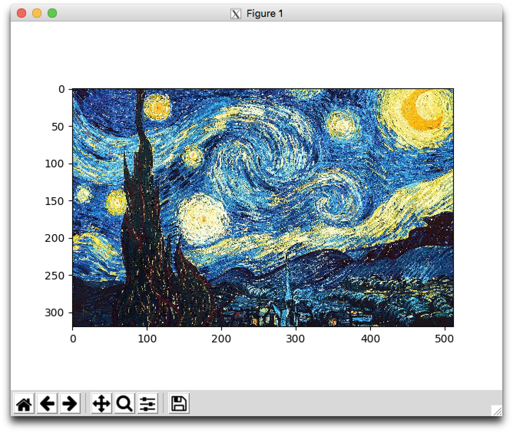
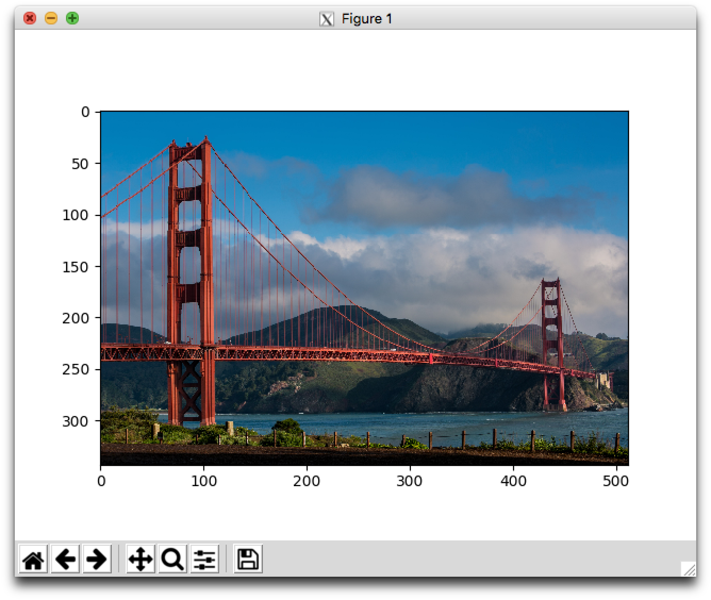
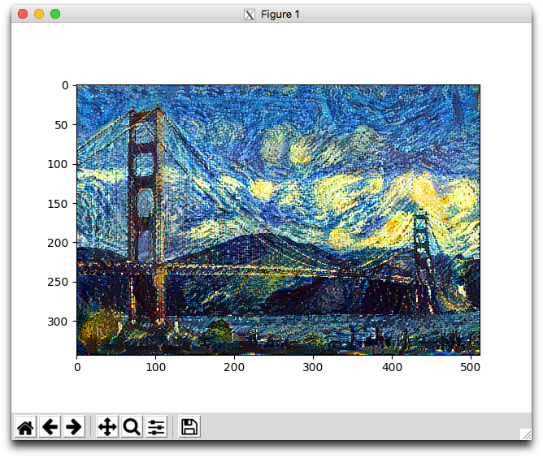
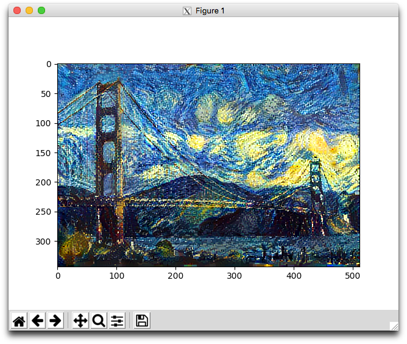
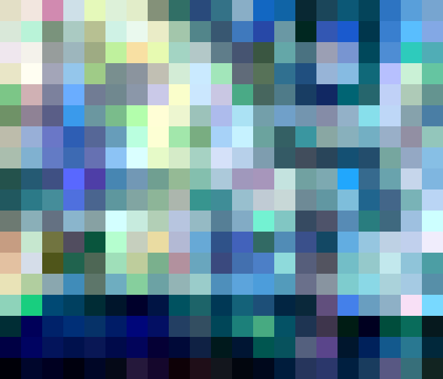
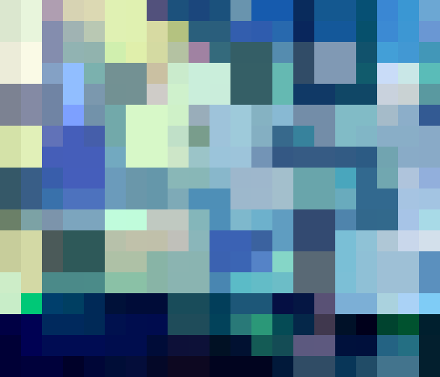

# Neural style transfer
## Resources
*   [Neural Style Transfer: Creating Art with Deep Learning using tf.keras and eager execution](https://medium.com/tensorflow/neural-style-transfer-creating-art-with-deep-learning-using-tf-keras-and-eager-execution-7d541ac31398 "Neural StyleTransfer: Creating Art with Deep Learning using tf.keras and eager execution")
*   [deeplearning.ai](https://www.deeplearning.ai/ "deeplearning.ai")
    *   [What is neural style transfer?](https://www.youtube.com/watch?v=R39tWYYKNcI&list=PLkDaE6sCZn6Gl29AoE31iwdVwSG-KnDzF&index=38 "What is neural style transfer?")
    *   [What are deep CNs learning?](https://www.youtube.com/watch?v=ChoV5h7tw5A&list=PLkDaE6sCZn6Gl29AoE31iwdVwSG-KnDzF&index=39 "What are deep CNs learning?")
    *   [Cost Function](https://www.youtube.com/watch?v=xY-DMAJpIP4&list=PLkDaE6sCZn6Gl29AoE31iwdVwSG-KnDzF&index=40 "Cost Function")
    *   [Content Cost Function](https://www.youtube.com/watch?v=b1I5X3UfEYI&list=PLkDaE6sCZn6Gl29AoE31iwdVwSG-KnDzF&index=41 "Content Cost Function")
    *   [Style Cost Function](https://www.youtube.com/watch?v=QgkLfjfGul8&list=PLkDaE6sCZn6Gl29AoE31iwdVwSG-KnDzF&index=42 "Style Cost Function")
*   [A Neural Algorithm of Artistic Style](https://arxiv.org/pdf/1508.06576 "A Neural Algorithm of Artistic Style")
*   [Image Style Transfer Using Convolutional Neural Networks](./files/3446e4f728cc758110ff36a7fcfafd3d754a9694.pdf "Image Style Transfer Using Convolutional Neural Networks")
*   [Total variation denoising](https://en.wikipedia.org/wiki/Total_variation_denoising "Total variation denoising")
*   [tf.image.total\_variation](https://www.tensorflow.org/api_docs/python/tf/image/total_variation "tf.image.total_variation")
*   [Nonlinear total variation based noise removal algorithms](https://citeseerx.ist.psu.edu/viewdoc/download?doi=10.1.1.117.1675&rep=rep1&type=pdf "Nonlinear total variation based noise removal algorithms")
*   [Neural Style Transfer: A Review](https://arxiv.org/pdf/1705.04058 "Neural Style Transfer: A Review")
*   [Deep Photo Style Transfer](https://arxiv.org/pdf/1703.07511 "Deep Photo Style Transfer")
*   [Controlling Perceptual Factors in Neural Style Transfer](https://arxiv.org/pdf/1611.07865 "Controlling Perceptual Factors in Neural Style Transfer")
*   [Instance Normalization: The Missing Ingredient for Fast Stylization](https://arxiv.org/pdf/1607.08022 "Instance Normalization: The Missing Ingredient for Fast Stylization")
*   [Perceptual Losses for Real-Time Style Transfer and Super-Resolution](https://arxiv.org/pdf/1603.08155 "Perceptual Losses for Real-Time Style Transfer and Super-Resolution")
*   [Perceptual Losses for Real-Time Style Transfer and Super-Resolution: Supplementary Material](https://cs.stanford.edu/people/jcjohns/papers/fast-style/fast-style-supp.pdf "Perceptual Losses for Real-Time Style Transfer and Super-Resolution: Supplementary Material")
*   [A Pragmatic AI Approach to Creating Artistic Visual Variations by Neural Style Transfer](https://arxiv.org/pdf/1805.10852 "A Pragmatic AI Approach to Creating Artistic Visual Variations by Neural Style Transfer")
## Learning Objectives
* What is Neural Style Transfer?
* What is a gram matrix?
* How to calculate style cost
* How to calculate content cost
* What is Gradient Tape and how do you use it?
* How to perform Neural Style Transfer
# Tasks
## 0.Initialize
Create a class `NST` that performs tasks for neural style transfer:

*   Public class attributes:
    *   `style_layers` = `['block1_conv1', 'block2_conv1', 'block3_conv1', 'block4_conv1', 'block5_conv1']`
    *   `content_layer` = `'block5_conv2'`
*   Class constructor: `def __init__(self, style_image, content_image, alpha=1e4, beta=1):`
    *   `style_image` - the image used as a style reference, stored as a `numpy.ndarray`
    *   `content_image` - the image used as a content reference, stored as a `numpy.ndarray`
    *   `alpha` - the weight for content cost
    *   `beta` - the weight for style cost
    *   if `style_image` is not a `np.ndarray` with the shape `(h, w, 3)`, raise a `TypeError` with the message `style_image must be a numpy.ndarray with shape (h, w, 3)`
    *   if `content_image` is not a `np.ndarray` with the shape `(h, w, 3)`, raise a `TypeError` with the message `content_image must be a numpy.ndarray with shape (h, w, 3)`
    *   if `alpha` is not a non-negative number, raise a `TypeError` with the message `alpha must be a non-negative number`
    *   if `beta` is not a non-negative number, raise a `TypeError` with the message `beta must be a non-negative number`
    *   Sets the instance attributes:
        *   `style_image` - the preprocessed style image
        *   `content_image` - the preprocessed content image
        *   `alpha` - the weight for content cost
        *   `beta` - the weight for style cost
*   Static Method: `def scale_image(image):` that rescales an image such that its pixels values are between 0 and 1 and its largest side is 512 pixels
    *   `image` - a `numpy.ndarray` of shape `(h, w, 3)` containing the image to be scaled
    *   if `image` is not a `np.ndarray` with the shape `(h, w, 3)`, raise a `TypeError` with the message `image must be a numpy.ndarray with shape (h, w, 3)`
    *   The scaled image should be a `tf.tensor` with the shape `(1, h_new, w_new, 3)` where `max(h_new, w_new)` == `512` and `min(h_new, w_new)` is scaled proportionately
    *   The image should be resized using bicubic interpolation
    *   After resizing, the image’s pixel values should be rescaled from the range `[0, 255]` to `[0, 1]`.
    *   Returns: the scaled image
```python
#!/usr/bin/env python3

import matplotlib.image as mpimg
import matplotlib.pyplot as plt
import numpy as np
import tensorflow as tf

NST = __import__('0-neural_style').NST


if __name__ == '__main__':
    style_image = mpimg.imread("starry_night.jpg")
    content_image = mpimg.imread("golden_gate.jpg")

    print(NST.style_layers)
    print(NST.content_layer)
    nst = NST(style_image, content_image)
    scaled_style = nst.scale_image(style_image)
    scaled_content = nst.scale_image(content_image)
    print(type(nst.style_image), nst.style_image.shape, np.min(nst.style_image),
               np.max(nst.style_image))
    print(type(nst.content_image), nst.content_image.shape, np.min(nst.content_image),
               np.max(nst.content_image))
    print(nst.alpha)
    print(nst.beta)
    print(tf.executing_eagerly())
    assert(np.array_equal(scaled_style, nst.style_image))
    assert(np.array_equal(scaled_content, nst.content_image))

    plt.imshow(nst.style_image[0])
    plt.show()
    plt.imshow(nst.content_image[0])
    plt.show()
```
```txt
['block1_conv1', 'block2_conv1', 'block3_conv1', 'block4_conv1', 'block5_conv1']
block5_conv2
<class 'tensorflow.python.framework.ops.EagerTensor'> (1, 320, 512, 3) 0.0 1.0
<class 'tensorflow.python.framework.ops.EagerTensor'> (1, 343, 512, 3) 0.0 1.0
10000.0
1
True
```


## 1. Load the Model 
Update the class `NST` to load the model for neural style transfer:

*   Update the class constructor: `def __init__(self, style_image, content_image, alpha=1e4, beta=1):`
    *   `style_image` - the image used as a style reference, stored as a `numpy.ndarray`
    *   `content_image` - the image used as a content reference, stored as a `numpy.ndarray`
    *   `alpha` - the weight for content cost
    *   `beta` - the weight for style cost
    *   if `style_image` is not a `np.ndarray` with the shape `(h, w, 3)`, raise a `TypeError` with the message `style_image must be a numpy.ndarray with shape (h, w, 3)`
    *   if `content_image` is not a `np.ndarray` with the shape `(h, w, 3)`, raise a `TypeError` with the message `content_image must be a numpy.ndarray with shape (h, w, 3)`
    *   if `alpha` is not a non-negative number, raise a `TypeError` with the message `alpha must be a non-negative number`
    *   if `beta` is not a non-negative number, raise a `TypeError` with the message `beta must be a non-negative number`
    *   Sets the instance attributes:
        *   `style_image` - the preprocessed style image
        *   `content_image` - the preprocessed content image
        *   `alpha` - the weight for content cost
        *   `beta` - the weight for style cost
        *   `model` - the `Keras` model used to calculate cost
*   Public Instance Method: `def load_model(self):`
    *   creates the model used to calculate cost
    *   the model should use the `VGG19` `Keras` model as a base
    *   the model’s input should be the same as the `VGG19` input
    *   the model’s output should be a list containing the outputs of the `VGG19` layers listed in `style_layers` followed by `content _layer`
    *   saves the model in the instance attribute `model`
```python
    #!/usr/bin/env python3

import matplotlib.image as mpimg
import matplotlib.pyplot as plt
import numpy as np
import tensorflow as tf

NST = __import__('1-neural_style').NST


if __name__ == '__main__':
    style_image = mpimg.imread("starry_night.jpg")
    content_image = mpimg.imread("golden_gate.jpg")

    nst = NST(style_image, content_image)
    nst.model.summary()
```
```txt
Model: "model"
_________________________________________________________________
 Layer (type)                Output Shape              Param #
=================================================================
 input_1 (InputLayer)        [(None, None, None, 3)]   0

 block1_conv1 (Conv2D)       (None, None, None, 64)    1792

 block1_conv2 (Conv2D)       (None, None, None, 64)    36928

 block1_pool (AveragePoolin  (None, None, None, 64)    0
 g2D)

 block2_conv1 (Conv2D)       (None, None, None, 128)   73856

 block2_conv2 (Conv2D)       (None, None, None, 128)   147584

 block2_pool (AveragePoolin  (None, None, None, 128)   0
 g2D)

 block3_conv1 (Conv2D)       (None, None, None, 256)   295168

 block3_conv2 (Conv2D)       (None, None, None, 256)   590080

 block3_conv3 (Conv2D)       (None, None, None, 256)   590080

 block3_conv4 (Conv2D)       (None, None, None, 256)   590080

 block3_pool (AveragePoolin  (None, None, None, 256)   0
 g2D)

 block4_conv1 (Conv2D)       (None, None, None, 512)   1180160

 block4_conv2 (Conv2D)       (None, None, None, 512)   2359808

 block4_conv3 (Conv2D)       (None, None, None, 512)   2359808

 block4_conv4 (Conv2D)       (None, None, None, 512)   2359808

 block4_pool (AveragePoolin  (None, None, None, 512)   0
 g2D)

 block5_conv1 (Conv2D)       (None, None, None, 512)   2359808

 block5_conv2 (Conv2D)       (None, None, None, 512)   2359808

=================================================================
Total params: 15304768 (58.38 MB)
Trainable params: 0 (0.00 Byte)
Non-trainable params: 15304768 (58.38 MB)
_________________________________________________________________
```
## 2. Gram Matrix 
$$
G^{l}_{ij}=\frac{1}{H_{l}W_{l}}\sum_{h}^{H_{l}}\sum_{w}^{W_{l}}F^{l}_{hwi}F^{l}_{hwj}
$$
See [A Neural Algorithm of Artistic Style](https://arxiv.org/pdf/1508.06576)

Update the class `NST` to be able to calculate gram matrices:

*   Static Method: `def gram_matrix(input_layer):`
    *   `input_layer` - an instance of `tf.Tensor` or `tf.Variable` of shape `(1, h, w, c)`containing the layer output whose gram matrix should be calculated
    *   if `input_layer` is not an instance of `tf.Tensor` or `tf.Variable` of rank 4, raise a `TypeError` with the message `input_layer must be a tensor of rank 4`
    *   Returns: a `tf.Tensor` of shape `(1, c, c)` containing the gram matrix of `input_layer`

```python
#!/usr/bin/env python3

import matplotlib.image as mpimg
import os
import random
import numpy as np
import tensorflow as tf

NST = __import__('2-neural_style').NST


if __name__ == '__main__':
    style_image = mpimg.imread("starry_night.jpg")
    content_image = mpimg.imread("golden_gate.jpg")

    # Reproducibility
    SEED = 0
    os.environ['PYTHONHASHSEED'] = str(SEED)
    os.environ['TF_ENABLE_ONEDNN_OPTS']= '0'
    random.seed(SEED)
    np.random.seed(SEED)
    tf.random.set_seed(SEED)

    nst = NST(style_image, content_image)
    input_layer = tf.constant(np.random.randn(1, 28, 30, 3), dtype=tf.float32)
    print(input_layer)
    gram_matrix = nst.gram_matrix(input_layer)
    print(gram_matrix)
```
```txt
tf.Tensor(
[[[ 0.92385924 -0.04459445  0.01773123]
  [-0.04459445  0.99180317 -0.0303772 ]
  [ 0.01773123 -0.0303772   0.9517653 ]]], shape=(1, 3, 3), dtype=float32)
root@e791b64eba88:/neural_style_transfer# nano 2-main.py
root@e791b64eba88:/neural_style_transfer# ./2-main.py
tf.Tensor(
[[[[ 1.7640524e+00  4.0015721e-01  9.7873801e-01]
   [ 2.2408931e+00  1.8675580e+00 -9.7727787e-01]
   [ 9.5008844e-01 -1.5135720e-01 -1.0321885e-01]
   ...
   [ 9.0082651e-01  4.6566245e-01 -1.5362437e+00]
   [ 1.4882522e+00  1.8958892e+00  1.1787796e+00]
   [-1.7992483e-01 -1.0707526e+00  1.0544517e+00]]

  [[-4.0317693e-01  1.2224450e+00  2.0827498e-01]
   [ 9.7663903e-01  3.5636640e-01  7.0657319e-01]
   [ 1.0500020e-02  1.7858706e+00  1.2691209e-01]
   ...
   [ 3.1872764e-01  8.5683060e-01 -6.5102559e-01]
   [-1.0342429e+00  6.8159449e-01 -8.0340964e-01]
   [-6.8954980e-01 -4.5553249e-01  1.7479159e-02]]

  [[-3.5399392e-01 -1.3749512e+00 -6.4361840e-01]
   [-2.2234032e+00  6.2523144e-01 -1.6020577e+00]
   [-1.1043833e+00  5.2165080e-02 -7.3956299e-01]
   ...
   [-5.0681633e-01 -5.9631401e-01 -5.2567296e-02]
   [-1.9362798e+00  1.8877859e-01  5.2389103e-01]
   [ 8.8422090e-02 -3.1088617e-01  9.7400166e-02]]

  ...

  [[ 5.9530032e-01  1.1641518e+00 -2.3229401e-01]
   [ 7.2892988e-01 -2.5790508e+00 -9.3750936e-01]
   [-3.2125893e-01 -4.8856622e-01  3.3279821e-01]
   ...
   [ 3.9710623e-01  4.9964696e-01 -1.2186838e+00]
   [ 2.4622276e-01 -9.1798431e-01 -6.5185648e-01]
   [-1.7747449e+00 -4.7336093e-01 -2.0357068e-01]]

  [[ 5.4985684e-01  8.9992664e-04 -1.5422882e+00]
   [ 8.6214805e-01 -1.1858662e-01  4.8837060e-01]
   [ 9.6593612e-01  1.4226048e+00  1.9612269e+00]
   ...
   [-3.5911658e-01 -1.0585719e+00 -5.0900584e-01]
   [ 1.1566507e-01 -5.4735559e-01 -5.5079943e-01]
   [ 7.9204148e-01  1.4410649e-01  2.3345809e-01]]

  [[ 1.1187240e-01 -6.7570317e-01 -1.3705720e+00]
   [ 3.1056470e-01 -5.0703663e-01 -2.0107822e+00]
   [-3.9256725e-01 -1.0922179e+00  6.9865024e-01]
   ...
   [-4.7962302e-01 -3.0109480e-01  5.3698790e-01]
   [-4.1380399e-01 -1.0969250e+00 -9.2736292e-01]
   [ 8.8833886e-01 -5.2474195e-01 -1.3852776e+00]]]], shape=(1, 28, 30, 3), dtype=float32)
tf.Tensor(
[[[ 0.92385924 -0.04459445  0.01773123]
  [-0.04459445  0.99180317 -0.0303772 ]
  [ 0.01773123 -0.0303772   0.9517653 ]]], shape=(1, 3, 3), dtype=float32)
```
##  3. Extract Features 
Update the class `NST` to extract the style and content features:

*   Public Instance Method: `def generate_features(self):`
    *   extracts the features used to calculate neural style cost
    *   Sets the public instance attributes:
        *   `gram_style_features` - a list of gram matrices calculated from the style layer outputs of the style image
        *   `content_feature` - the content layer output of the content image
*   Update the class constructor: `def __init__(self, style_image, content_image, alpha=1e4, beta=1):`
    *   `style_image` - the image used as a style reference, stored as a `numpy.ndarray`
    *   `content_image` - the image used as a content reference, stored as a `numpy.ndarray`
    *   `alpha` - the weight for content cost
    *   `beta` - the weight for style cost
    *   if `style_image` is not a `np.ndarray` with the shape `(h, w, 3)`, raise a `TypeError` with the message `style_image must be a numpy.ndarray with shape (h, w, 3)`
    *   if `content_image` is not a `np.ndarray` with the shape `(h, w, 3)`, raise a `TypeError` with the message `content_image must be a numpy.ndarray with shape (h, w, 3)`
    *   if `alpha` is not a non-negative number, raise a `TypeError` with the message `alpha must be a non-negative number`
    *   if `beta` is not a non-negative number, raise a `TypeError` with the message `beta must be a non-negative number`
    *   Sets the instance attributes:
        *   `style_image` - the preprocessed style image
        *   `content_image` - the preprocessed content image
        *   `alpha` - the weight for content cost
        *   `beta` - the weight for style cost
        *   `model` - the Keras model used to calculate cost
        *   `gram_style_features` - a list of gram matrices calculated from the style layer outputs of the style image
        *   `content_feature` - the content layer output of the content image
```python
#!/usr/bin/env python3

import matplotlib.image as mpimg
import os
import random
import numpy as np
import tensorflow as tf

NST = __import__('3-neural_style').NST


if __name__ == '__main__':
    style_image = mpimg.imread("starry_night.jpg")
    content_image = mpimg.imread("golden_gate.jpg")

    # Reproducibility
    SEED = 0
    os.environ['PYTHONHASHSEED'] = str(SEED)
    os.environ['TF_ENABLE_ONEDNN_OPTS']= '0'
    random.seed(SEED)
    np.random.seed(SEED)
    tf.random.set_seed(SEED)

    nst = NST(style_image, content_image)
    print(nst.gram_style_features)
    print(nst.content_feature)
```
```txt
[<tf.Tensor: shape=(1, 64, 64), dtype=float32, numpy=
array([[[ 5861.4473 ,  2485.1216 ,  1758.6276 , ...,  1804.6599 ,
          1460.2955 ,  2325.287  ],
        [ 2485.1216 ,  5960.47   ,  2506.0317 , ...,  1400.129  ,
          1912.238  ,  1597.3096 ],
        [ 1758.6276 ,  2506.0317 ,  1830.7305 , ...,   269.54004,
          1514.858  ,  1742.1213 ],
        ...,
        [ 1804.6599 ,  1400.129  ,   269.54004, ..., 11061.521  ,
          1230.0105 ,   724.5747 ],
        [ 1460.2955 ,  1912.238  ,  1514.858  , ...,  1230.0105 ,
          2910.0447 ,  2511.2175 ],
        [ 2325.287  ,  1597.3096 ,  1742.1213 , ...,   724.5747 ,
          2511.2175 ,  2976.1106 ]]], dtype=float32)>, <tf.Tensor: shape=(1, 128, 128), dtype=float32, numpy=
array([[[1.59399438e+03, 2.09635544e+02, 4.49136639e+00, ...,
         1.29623218e+03, 9.64062195e+02, 3.64543243e+02],
        [2.09635544e+02, 1.98981562e+04, 6.31298047e+03, ...,
         2.41243281e+04, 1.76497598e+04, 8.42706738e+03],
        [4.49136639e+00, 6.31298047e+03, 2.70172246e+04, ...,
         2.52926543e+04, 5.34599512e+03, 7.07212891e+03],
        ...,
        [1.29623218e+03, 2.41243281e+04, 2.52926543e+04, ...,
         1.05454375e+05, 3.74536641e+04, 2.22019473e+04],
        [9.64062195e+02, 1.76497617e+04, 5.34599512e+03, ...,
         3.74536641e+04, 3.86093477e+04, 8.23721680e+03],
        [3.64543243e+02, 8.42706738e+03, 7.07212891e+03, ...,
         2.22019453e+04, 8.23721680e+03, 2.58277852e+04]]], dtype=float32)>, <tf.Tensor: shape=(1, 256, 256), dtype=float32, numpy=
array([[[ 34644.94  ,   9113.763 ,   3341.9185, ...,   5720.801 ,
          39429.164 ,  21961.754 ],
        [  9113.763 ,  64574.3   ,   2791.782 , ...,   2267.4358,
          47596.773 ,  30364.943 ],
        [  3341.9185,   2791.782 ,   4721.1387, ...,    776.339 ,
           8112.6055,   4139.8447],
        ...,
        [  5720.801 ,   2267.4358,    776.339 , ...,   7411.46  ,
           8426.674 ,   7287.8037],
        [ 39429.164 ,  47596.773 ,   8112.6055, ...,   8426.674 ,
         196446.03  ,  58342.086 ],
        [ 21961.754 ,  30364.943 ,   4139.8447, ...,   7287.8037,
          58342.086 ,  91063.84  ]]], dtype=float32)>, <tf.Tensor: shape=(1, 512, 512), dtype=float32, numpy=
array([[[351586.66 ,  35218.523,  57502.875, ...,  41738.305,
         123681.21 , 227712.22 ],
        [ 35218.523,  58841.47 ,  45614.65 , ...,   8326.732,
          44292.867,  62545.855],
        [ 57502.875,  45614.65 , 213202.34 , ...,  20612.701,
          82172.52 , 168277.03 ],
        ...,
        [ 41738.305,   8326.732,  20612.701, ...,  71741.3  ,
          37695.977,  52711.586],
        [123681.23 ,  44292.867,  82172.516, ...,  37695.977,
         247929.8  , 185449.77 ],
        [227712.25 ,  62545.855, 168277.02 , ...,  52711.586,
         185449.77 , 550289.1  ]]], dtype=float32)>, <tf.Tensor: shape=(1, 512, 512), dtype=float32, numpy=
array([[[5.7612439e+02, 6.2125807e+00, 1.2534774e+02, ...,
         2.5615826e+01, 1.1442587e+01, 2.1760116e+00],
        [6.2125807e+00, 2.1107797e+02, 5.8851410e+01, ...,
         1.3096888e+01, 3.8602417e+01, 2.4318756e-03],
        [1.2534774e+02, 5.8851410e+01, 1.5362864e+03, ...,
         1.2882443e+02, 2.3420215e+02, 1.4063199e+01],
        ...,
        [2.5615826e+01, 1.3096888e+01, 1.2882443e+02, ...,
         4.0261636e+02, 6.0244957e+01, 1.1500341e+01],
        [1.1442587e+01, 3.8602417e+01, 2.3420212e+02, ...,
         6.0244957e+01, 4.0231808e+02, 1.0899710e+01],
        [2.1760116e+00, 2.4318756e-03, 1.4063199e+01, ...,
         1.1500342e+01, 1.0899710e+01, 1.2655368e+01]]], dtype=float32)>]
tf.Tensor(
[[[[ 0.         0.        19.733795  ...  0.        11.78145
     5.2299285]
   [ 0.         0.         0.        ...  0.        25.192293
     0.       ]
   [ 0.         0.         0.        ...  0.        20.169605
     0.       ]
   ...
   [ 0.         0.         0.        ...  0.        29.540258
     0.       ]
   [ 0.         0.         0.        ...  0.        26.545834
     0.       ]
   [ 0.         0.         0.        ...  0.        12.67502
     0.       ]]

  [[ 0.         0.        20.057325  ...  0.         0.
     0.       ]
   [ 0.         0.         0.        ...  0.         0.
     0.       ]
   [ 0.         0.         0.        ...  0.         0.
     0.       ]
   ...
   [ 0.         0.         0.        ...  0.         0.
     0.       ]
   [ 0.         0.         0.        ...  0.         0.
     0.       ]
   [ 0.         0.         0.        ...  0.         0.
     0.       ]]

  [[ 0.         0.         8.540508  ...  0.         0.
     0.       ]
   [ 0.         0.         0.        ...  0.         0.
     0.       ]
   [ 0.         0.         0.        ...  0.         0.
     0.       ]
   ...
   [ 0.         0.         0.        ...  0.         0.
     0.       ]
   [ 0.         0.         0.        ...  0.         0.
     0.       ]
   [ 0.         0.         0.        ...  0.         0.
     0.       ]]

  ...

  [[ 0.         0.        61.630623  ...  0.        32.282326
    22.305807 ]
   [ 0.         1.084091  11.590843  ...  0.        28.079046
     7.8357077]
   [ 0.         0.         0.        ...  0.         0.
     0.       ]
   ...
   [ 0.         0.         0.        ...  0.         0.
     0.       ]
   [ 0.         0.         0.        ...  0.         0.
     0.       ]
   [ 0.         0.         0.        ...  0.         0.
     0.       ]]

  [[ 0.         0.        32.139286  ...  0.         5.374389
     9.40108  ]
   [ 0.         0.         0.        ...  0.         0.
     0.       ]
   [ 0.         0.         0.        ...  0.         0.
     0.       ]
   ...
   [ 0.         0.        10.862193  ...  0.         0.
     0.       ]
   [ 0.         0.         0.        ...  0.         0.
     0.       ]
   [ 0.         0.         0.        ...  0.         0.
     0.       ]]

  [[ 0.         0.        21.64856   ...  0.         0.
    11.990297 ]
   [ 0.         0.         3.6711998 ...  0.7958352  0.
     0.       ]
   [ 0.         0.         0.        ... 10.641433   0.
     0.       ]
   ...
   [ 0.         0.        24.133038  ...  0.         0.
     0.       ]
   [ 0.         0.         0.        ...  0.         0.
     0.       ]
   [ 0.         0.         0.        ...  1.7129475  0.
     0.       ]]]], shape=(1, 21, 32, 512), dtype=float32)
```
## 4. Layer Style Cost
$$
E_{l}=\frac{1}{C_{l}^{2}}\sum_{i}^{C_{l}}\sum_{j}^{C_{l}}(G^{l}_{ij}-A^{l}_{ij})^{2}
$$
See [A Neural Algorithm of Artistic Style](https://arxiv.org/pdf/1508.06576)
Update the class `NST` to calculate the style cost for a single layer:

*   Public Instance Method: `def layer_style_cost(self, style_output, gram_target):`
    *   Calculates the style cost for a single layer
    *   `style_output` - `tf.Tensor` of shape `(1, h, w, c)` containing the layer style output of the generated image
    *   `gram_target` - `tf.Tensor` of shape `(1, c, c)` the gram matrix of the target style output for that layer
    *   if `style_output` is not an instance of `tf.Tensor` or `tf.Variable` of rank 4, raise a `TypeError` with the message `style_output must be a tensor of rank 4`
    *   if `gram_target` is not an instance of `tf.Tensor` or `tf.Variable` with shape `(1, c, c)`, raise a `TypeError` with the message `gram_target must be a tensor of shape [1, {c}, {c}]` where `{c}` is the number of channels in `style_output`
    *   Returns: the layer’s style cost

```python
#!/usr/bin/env python3

import matplotlib.image as mpimg
import os
import random
import numpy as np
import tensorflow as tf

NST = __import__('4-neural_style').NST


if __name__ == '__main__':
    style_image = mpimg.imread("starry_night.jpg")
    content_image = mpimg.imread("golden_gate.jpg")

    nst = NST(style_image, content_image)

    # Reproducibility
    SEED = 0
    os.environ['PYTHONHASHSEED'] = str(SEED)
    os.environ['TF_ENABLE_ONEDNN_OPTS']= '0'
    random.seed(SEED)
    np.random.seed(SEED)
    tf.random.set_seed(SEED)

    vgg19 = tf.keras.applications.vgg19
    preprocecced = vgg19.preprocess_input(nst.content_image * 255)
    outputs = nst.model(preprocecced)
    layer_style_cost = nst.layer_style_cost(outputs[0], nst.gram_style_features[0])
    print(layer_style_cost)
```
```txt
tf.Tensor(1248908.5, shape=(), dtype=float32)
```
## 5. Style Cost 
$$
L_{style}=\sum_{l}w_{l}E_{l}
$$
See [A Neural Algorithm of Artistic Style](https://arxiv.org/pdf/1508.06576)
Update the class `NST` to calculate the style cost:

*   Public Instance Method: `def style_cost(self, style_outputs):`
    *   Calculates the style cost for generated image
    *   `style_outputs` - a list of `tf.Tensor` style outputs for the generated image
    *   if `style_outputs` is not a list with the same length as `self.style_layers`, raise a `TypeError` with the message `style_outputs must be a list with a length of {l}` where `{l}` is the length of `self.style_layers`
    *   each layer should be weighted evenly with all weights summing to `1`
    *   Returns: the style cost
```python
#!/usr/bin/env python3

import matplotlib.image as mpimg
import os
import random
import numpy as np
import tensorflow as tf

NST = __import__('5-neural_style').NST


if __name__ == '__main__':
    style_image = mpimg.imread("starry_night.jpg")
    content_image = mpimg.imread("golden_gate.jpg")

    # Reproducibility
    SEED = 0
    os.environ['PYTHONHASHSEED'] = str(SEED)
    os.environ['TF_ENABLE_ONEDNN_OPTS']= '0'
    random.seed(SEED)
    np.random.seed(SEED)
    tf.random.set_seed(SEED)

    nst = NST(style_image, content_image)
    vgg19 = tf.keras.applications.vgg19
    preprocecced = vgg19.preprocess_input(nst.content_image * 255)
    style_outputs = nst.model(preprocecced)[:-1]
    style_cost = nst.style_cost(style_outputs)
    print(style_cost)
```
```txt
tf.Tensor(1365784700.0, shape=(), dtype=float32)
```
## 6. Content Cost
$$
L_{content}=\frac{1}{H_{l}W_{l}C_{l}}\sum_{i}^{H_{l}}\sum_{j}^{W_{l}}\sum_{k}^{C_{l}}(F_{ijk}^{l}-P_{ijk}^{l})^2
$$
See [A Neural Algorithm of Artistic Style](https://arxiv.org/pdf/1508.06576)
Update the class `NST` to calculate the content cost:

*   Public Instance Method: `def content_cost(self, content_output):`
    *   Calculates the content cost for the generated image
    *   `content_output` - a `tf.Tensor` containing the content output for the generated image
    *   if `content_output` is not an instance of `tf.Tensor` or `tf.Variable` with the same shape as `self.content_feature`, raise a `TypeError` with the message `content_output must be a tensor of shape {s}` where `{s}` is the shape of `self.content_feature`
    *   Returns: the content cost

```python
#!/usr/bin/env python3

import matplotlib.image as mpimg
import os
import random
import numpy as np
import tensorflow as tf

NST = __import__('6-neural_style').NST


if __name__ == '__main__':
    style_image = mpimg.imread("starry_night.jpg")
    content_image = mpimg.imread("golden_gate.jpg")

    # Reproducibility
    SEED = 0
    os.environ['PYTHONHASHSEED'] = str(SEED)
    os.environ['TF_ENABLE_ONEDNN_OPTS']= '0'
    random.seed(SEED)
    np.random.seed(SEED)
    tf.random.set_seed(SEED)

    nst = NST(style_image, content_image)
    generated_image = np.random.uniform(size=nst.content_image.shape)
    generated_image = generated_image.astype('float32')
    vgg19 = tf.keras.applications.vgg19
    preprocecced = vgg19.preprocess_input(generated_image * 255)
    outputs = nst.model(preprocecced)
    content_output = outputs[-1]
    content_cost = nst.content_cost(content_output)
    print(content_cost)
```
```txt
tf.Tensor(109.07064, shape=(), dtype=float32)
```
## 7. Total Cost 
$$
L_{total}=\alpha L_{content}+\beta L_{style}
$$
See [A Neural Algorithm of Artistic Style](https://arxiv.org/pdf/1508.06576)
Update the class `NST` to calculate the total cost:

*   Public Instance Method: `def total_cost(self, generated_image):`
    *   Calculates the total cost for the generated image
    *   `generated_image` - a `tf.Tensor` of shape `(1, nh, nw, 3)` containing the generated image
    *   if `generated_image` is not an instance of `tf.Tensor` or `tf.Variable` with the same shape as `self.content_image`, raise a `TypeError` with the message `generated_image must be a tensor of shape {s}` where `{s}` is the shape of `self.content_image`
    *   Returns: `(J, J_content, J_style)`
        *   `J` is the total cost
        *   `J_content` is the content cost
        *   `J_style` is the style cost

```python
#!/usr/bin/env python3

import matplotlib.image as mpimg
import os
import random
import numpy as np
import tensorflow as tf

NST = __import__('7-neural_style').NST


if __name__ == '__main__':
    style_image = mpimg.imread("starry_night.jpg")
    content_image = mpimg.imread("golden_gate.jpg")

    # Reproducibility
    SEED = 0
    os.environ['PYTHONHASHSEED'] = str(SEED)
    os.environ['TF_ENABLE_ONEDNN_OPTS']= '0'
    random.seed(SEED)
    np.random.seed(SEED)
    tf.random.set_seed(SEED)

    nst = NST(style_image, content_image)
    generated_image = np.random.uniform(size=nst.content_image.shape)
    generated_image = tf.cast(generated_image, tf.float32)
    J_total, J_content, J_style = nst.total_cost(generated_image)
    print(J_total)
    print(J_content)
    print(J_style)
```
```txt
tf.Tensor(1567402200.0, shape=(), dtype=float32)
tf.Tensor(109.07064, shape=(), dtype=float32)
tf.Tensor(1566311600.0, shape=(), dtype=float32)
```
##  8. Compute Gradients 
Update the class `NST` to compute the gradients for the generated image:

*   Public Instance Method: `def compute_grads(self, generated_image):`
    *   Calculates the gradients for the `tf.Tensor` generated image of shape `(1, nh, nw, 3)`
    *   if `generated_image` is not an instance of `tf.Tensor` or `tf.Variable` with the same shape as `self.content_image`, raise a `TypeError` with the message `generated_image must be a tensor of shape {s}` where `{s}` is the shape of `self.content_image`
    *   Returns: `gradients, J_total, J_content, J_style`
        *   `gradients` is a `tf.Tensor` containing the gradients for the generated image
        *   `J_total` is the total cost for the generated image
        *   `J_content` is the content cost for the generated image
        *   `J_style` is the style cost for the generated image
```python
#!/usr/bin/env python3

import matplotlib.image as mpimg
import os
import random
import numpy as np
import tensorflow as tf

NST = __import__('8-neural_style').NST


if __name__ == '__main__':
    style_image = mpimg.imread("starry_night.jpg")
    content_image = mpimg.imread("golden_gate.jpg")

    # Reproducibility
    SEED = 0
    os.environ['PYTHONHASHSEED'] = str(SEED)
    os.environ['TF_ENABLE_ONEDNN_OPTS']= '0'
    random.seed(SEED)
    np.random.seed(SEED)
    tf.random.set_seed(SEED)

    nst = NST(style_image, content_image)
    generated_image = tf.Variable(nst.content_image)
    grads, J_total, J_content, J_style = nst.compute_grads(generated_image)
    print(J_total)
    print(J_content)
    print(J_style)
    print(grads)
```
```txt
tf.Tensor(1365784700.0, shape=(), dtype=float32)
tf.Tensor(0.0, shape=(), dtype=float32)
tf.Tensor(1365784700.0, shape=(), dtype=float32)
tf.Tensor(
[[[[-2.9919330e+04 -3.0800414e+04 -5.3444473e+03]
   [-4.7211219e+04 -4.9446863e+04 -6.4593486e+03]
   [-4.6684562e+04 -4.9273172e+04 -2.5330109e+01]
   ...
   [-4.3652246e+04 -2.2902918e+04 -2.5509048e+03]
   [-4.9510617e+04 -3.4883836e+04 -9.1956934e+03]
   [-2.4445816e+04 -1.6017164e+04  4.5445135e+02]]

  [[-4.2048664e+04 -4.0123770e+04 -4.4759595e+03]
   [-5.7852535e+04 -5.6068551e+04  3.7549995e+03]
   [-6.1391484e+04 -6.1596035e+04  1.0031195e+04]
   ...
   [-2.1620965e+04  2.1929490e+04  3.5886949e+04]
   [-4.7816672e+04 -1.7598314e+04  1.1333531e+04]
   [-2.9716771e+04 -1.3403220e+04  8.1160586e+03]]

  [[-2.0670762e+04 -1.1994852e+04  1.5828710e+04]
   [-2.8760414e+04 -1.8245064e+04  3.1975170e+04]
   [-3.4502945e+04 -2.8798094e+04  3.7399777e+04]
   ...
   [ 1.6034990e+04  6.8936422e+04  7.4507938e+04]
   [-2.1832799e+04  1.3748216e+04  4.0900238e+04]
   [-1.7277299e+04  1.7339264e+03  2.3677865e+04]]

  ...

  [[-7.4210211e+02 -1.0557803e+04 -4.2700024e+03]
   [-7.3438262e+03 -2.3294039e+04 -1.4157991e+04]
   [ 7.7749115e+02 -1.4412724e+04 -1.0972592e+04]
   ...
   [-1.1246921e+04  1.2870951e+04 -2.0301918e+04]
   [-9.9554600e+03  7.9745176e+03 -1.8681627e+04]
   [-3.6299395e+03  6.6933433e+03 -9.2691709e+03]]

  [[-3.5170369e+03 -1.0002878e+04 -3.5338818e+03]
   [-1.2891329e+04 -2.4058486e+04 -1.2601319e+04]
   [-1.1432503e+04 -2.2827854e+04 -1.2860341e+04]
   ...
   [-3.2116191e+03  1.4402878e+04 -9.5756406e+03]
   [-2.4255977e+03  1.0493084e+04 -8.4538896e+03]
   [ 2.0594458e+02  7.4518379e+03 -3.8087400e+03]]

  [[ 9.5129898e+01 -1.9326799e+03 -1.7074318e+02]
   [-2.5449648e+03 -6.2126875e+03 -2.7680627e+03]
   [-1.6893500e+03 -5.4725850e+03 -2.5541187e+03]
   ...
   [-3.1475930e+03  5.3045503e+03 -5.5664204e+03]
   [-2.3913826e+03  3.6547227e+03 -4.7395288e+03]
   [-4.1572455e+02  2.8547322e+03 -2.0337349e+03]]]], shape=(1, 343, 512, 3), dtype=float32)
```
**NOTE: Due to floating point errors , your gradient array may be _slightly_ off from the one listed above. It should, however, round to the same integer**
## 9. Generate Image 
Update the class `NST` to generate the neural style transfered image:

*   Public Instance Method: `def generate_image(self, iterations=1000, step=None, lr=0.01, beta1=0.9, beta2=0.99)`
    *   `iterations` - the number of iterations to perform gradient descent over
    *   `step` - if not `None`, the step at which you should print information about the training, including the final iteration:
        *   print `Cost at iteration {i}: {J_total}, content {J_content}, style {J_style}`
        *   `i` is the iteration
        *   `J_total` is the total cost
        *   `J_content` is the content cost
        *   `J_style` is the style cost
    *   `lr` - the learning rate for gradient descent
    *   `beta1` - the beta1 parameter for gradient descent
    *   `beta2` - the beta2 parameter for gradient descent
    *   if `iterations` is not an integer, raise a `TypeError` with the message `iterations must be an integer`
    *   if `iterations` is not positive, raise a `ValueError` with the message `iterations must be positive`
    *   if `step` is not `None` and not an integer, raise a `TypeError` with the message `step must be an integer`
    *   if `step` is not `None` and not positive or less than `iterations` , raise a `ValueError` with the message `step must be positive and less than iterations`
    *   if `lr` is not a float or an integer, raise a `TypeError` with the message `lr must be a number`
    *   if `lr` is not positive, raise a `ValueError` with the message `lr must be positive`
    *   if `beta1` is not a float, raise a `TypeError` with the message `beta1 must be a float`
    *   if `beta1` is not in the range `[0, 1]`, raise a `ValueError` with the message `beta1 must be in the range [0, 1]`
    *   if `beta2` is not a float, raise a `TypeError` with the message `beta2 must be a float`
    *   if `beta2` is not in the range `[0, 1]`, raise a `ValueError` with the message `beta2 must be in the range [0, 1]`
    *   gradient descent should be performed using Adam optimization
    *   the generated image should be initialized as the content image
    *   keep track of the best cost and the image associated with that cost
    *   Returns: `generated_image, cost`
        *   `generated_image` is the best generated image
        *   `cost` is the best cost
```python
#!/usr/bin/env python3

import matplotlib.image as mpimg
import matplotlib.pyplot as plt
import os
import random
import numpy as np
import tensorflow as tf


NST = __import__('9-neural_style').NST


if __name__ == '__main__':
    style_image = mpimg.imread("starry_night.jpg")
    content_image = mpimg.imread("golden_gate.jpg")

    # Reproducibility
    SEED = 0
    os.environ['PYTHONHASHSEED'] = str(SEED)
    os.environ['TF_ENABLE_ONEDNN_OPTS']= '0'
    random.seed(SEED)
    np.random.seed(SEED)
    tf.random.set_seed(SEED)

    nst = NST(style_image, content_image)
    image, cost = nst.generate_image(iterations=2000, step=100, lr=0.002)
    print("Best cost:", cost)
    plt.imshow(image)
    plt.show()
```
```txt
Cost at iteration 0: 1365784576.0, content 0.0, style 1365784576.0
Cost at iteration 100: 51518248.0, content 122.45201873779297, style 50293728.0
Cost at iteration 200: 20949570.0, content 131.10227966308594, style 19638548.0
Cost at iteration 300: 11194261.0, content 130.9467010498047, style 9884794.0
Cost at iteration 400: 7075974.5, content 127.90771484375, style 5796897.5
Cost at iteration 500: 4958212.0, content 122.36969757080078, style 3734515.25
Cost at iteration 600: 3664275.5, content 115.56781005859375, style 2508597.25
Cost at iteration 700: 2818177.5, content 107.78585052490234, style 1740319.0
Cost at iteration 800: 2260075.5, content 100.0879135131836, style 1259196.5
Cost at iteration 900: 1911106.5, content 93.45850372314453, style 976521.375
Cost at iteration 1000: 1681996.5, content 87.83658599853516, style 803630.625
Cost at iteration 1100: 1544110.875, content 83.1955795288086, style 712155.0625
Cost at iteration 1200: 1422816.0, content 79.62913513183594, style 626524.625
Cost at iteration 1300: 1347477.0, content 77.04367065429688, style 577040.25
Cost at iteration 1400: 1324026.25, content 75.00267028808594, style 573999.5625
Cost at iteration 1500: 1309141.0, content 73.19036865234375, style 577237.375
Cost at iteration 1600: 1209391.0, content 71.64559936523438, style 492935.0625
Cost at iteration 1700: 1174988.5, content 70.31912994384766, style 471797.1875
Cost at iteration 1800: 1149188.375, content 69.24934387207031, style 456694.9375
Cost at iteration 1900: 1126691.0, content 68.32464599609375, style 443444.5625
Cost at iteration 2000: 1112058.75, content 67.4729232788086, style 437329.5625
Best cost: 1107764.5
```

**NOTE: Due to floating point errors , your gradient array may be _slightly_ off from the one listed above. It should, however, round to the same integer**
## 10. Variational Cost 
Update the class `NST` to account for variational cost:

*   Update the class constructor: `def __init__(self, style_image, content_image, alpha=1e4, beta=1, var=10):`
    *   `style_image` - the image used as a style reference, stored as a `numpy.ndarray`
    *   `content_image` - the image used as a content reference, stored as a `numpy.ndarray`
    *   `alpha` - the weight for content cost
    *   `beta` - the weight for style cost
    *   `var` is the weight for the variational cost
    *   if `style_image` is not a `np.ndarray` with the shape `(h, w, 3)`, raise a `TypeError` with the message `style_image must be a numpy.ndarray with shape (h, w, 3)`
    *   if `content_image` is not a `np.ndarray` with the shape `(h, w, 3)`, raise a `TypeError` with the message `content_image must be a numpy.ndarray with shape (h, w, 3)`
    *   if `alpha` is not a non-negative number, raise a `TypeError` with the message `alpha must be a non-negative number`
    *   if `beta` is not a non-negative number, raise a `TypeError` with the message `beta must be a non-negative number`
    *   if `var` is not a non-negative number, raise a `TypeError` with the message `var must be a non-negative number`
    *   Sets the instance attributes:
        *   `style_image` - the preprocessed style image
        *   `content_image` - the preprocessed content image
        *   `alpha` - the weight for content cost
        *   `beta` - the weight for style cost
        *   `model` - the Keras model used to calculate cost
        *   `gram_style_features` - a list of gram matrices calculated from the style layer outputs of the style image
        *   `content_feature` - the content layer output of the content image
*   Static Method: `def variational_cost(generated_image):`
    *   Calculates the variational cost for the generated image
    *   `generated_image` - a `tf.Tensor` of shape `(1, nh, nw, 3)` containing the generated image
    *   Returns: the variational cost
*   Public Instance Method: `def total_cost(self, generated_image):`
    *   Calculates the total cost for the generated image
    *   `generated_image` - a `tf.Tensor` of shape `(1, nh, nw, 3)` containing the generated image
    *   Returns: `(J, J_content, J_style, J_var)`
        *   `J` is the total cost
        *   `J_content` is the content cost
        *   `J_style` is the style cost
        *   `J_var` is the variational cost
*   Public Instance Method: `def generate_image(self, iterations=1000, step=None, lr=0.01, beta1=0.9, beta2=0.99)`
    *   `iterations` - the number of iterations to perform gradient descent over
    *   `step` - if not `None`, the step at which you should print information about the training, including the final iteration:
        *   print `Cost at iteration {i}: {J_total}, content {J_content}, style {J_style}, var {J_var}`
        *   `i` is the iteration
        *   `J_total` is the total cost
        *   `J_content` is the content cost
        *   `J_style` is the style cost
        *   `J_var` is the variational cost
    *   `lr` - the learning rate for gradient descent
    *   `beta1` - the beta1 parameter for gradient descent
    *   `beta2` - the beta2 parameter for gradient descent
    *   if `iterations` is not an integer, raise a `TypeError` with the message `iterations must be an integer`
    *   if `iterations` is not positive, raise a `ValueError` with the message `iterations must be positive`
    *   if `step` is not `None` and not an integer, raise a `TypeError` with the message `step must be an integer`
    *   if `step` is not `None` and not positive or less than `iterations` , raise a `ValueError` with the message `iterations must be positive and less than iterations`
    *   if `lr` is not a float or an integer, raise a `TypeError` with the message `lr must be a number`
    *   if `lr` is not positive, raise a `ValueError` with the message `lr must be positive`
    *   if `beta1` is not a float, raise a `TypeError` with the message `beta1 must be a float`
    *   if `beta1` is not in the range `[0, 1]`, raise a `ValueError` with the message `beta1 must be in the range [0, 1]`
    *   if `beta2` is not a float, raise a `TypeError` with the message `beta2 must be a float`
    *   if `beta2` is not in the range `[0, 1]`, raise a `ValueError` with the message `beta2 must be in the range [0, 1]`
    *   gradient descent should be performed using Adam optimization
    *   the generated image should be initialized as the content image
    *   keep track of the best cost and the image associated with that cost
    *   Returns: `generated_image, cost`
        *   `generated_image` is the best generated image
        *   `cost` is the best cost
```python
#!/usr/bin/env python3

import matplotlib.image as mpimg
import matplotlib.pyplot as plt
import os
import random
import numpy as np
import tensorflow as tf

NST = __import__('10-neural_style').NST


if __name__ == '__main__':
    style_image = mpimg.imread("starry_night.jpg")
    content_image = mpimg.imread("golden_gate.jpg")

    # Reproducibility
    SEED = 0
    os.environ['PYTHONHASHSEED'] = str(SEED)
    os.environ['TF_ENABLE_ONEDNN_OPTS']= '0'
    random.seed(SEED)
    np.random.seed(SEED)
    tf.random.set_seed(SEED)

    nst = NST(style_image, content_image)
    generated_image, cost = nst.generate_image(iterations=2000, step=100, lr=0.002)
    print("Best cost:", cost)
    plt.imshow(generated_image)
    plt.show()
    mpimg.imsave("starry_gate2.jpg", generated_image)
```
```
Cost at iteration 0: 1366124032.0, content 0.0, style 1365784576.0, var 33941.015625
Cost at iteration 100: 52160112.0, content 122.42252349853516, style 50303108.0, var 63277.96875
Cost at iteration 200: 21696424.0, content 131.09669494628906, style 19668236.0, var 71722.0625
Cost at iteration 300: 12009190.0, content 130.9893798828125, style 9920202.0, var 77909.359375
Cost at iteration 400: 7936933.5, content 127.88832092285156, style 5831771.5, var 82627.84375
Cost at iteration 500: 5845208.0, content 122.38203430175781, style 3763099.5, var 85828.8125
Cost at iteration 600: 4564508.5, content 115.4485092163086, style 2534155.25, var 87586.8203125
Cost at iteration 700: 3719237.5, content 107.55998992919922, style 1763838.625, var 87979.890625
Cost at iteration 800: 3153797.5, content 100.07334899902344, style 1283130.25, var 86993.375
Cost at iteration 900: 2816415.5, content 93.53053283691406, style 1030670.0, var 85044.0390625
Cost at iteration 1000: 2540265.25, content 88.23026275634766, style 829884.25, var 82807.84375
Cost at iteration 1100: 2380469.5, content 83.89472198486328, style 735034.5, var 80648.765625
Cost at iteration 1200: 2261378.0, content 80.76402282714844, style 665580.5, var 78815.7109375
Cost at iteration 1300: 2199901.25, content 78.10784912109375, style 646690.3125, var 77213.2578125
Cost at iteration 1400: 2109205.75, content 76.27371978759766, style 587785.5, var 75868.296875
Cost at iteration 1500: 2072338.75, content 74.64974975585938, style 578892.125, var 74694.90625
Cost at iteration 1600: 2030659.5, content 73.49830627441406, style 558567.875, var 73710.84375
Cost at iteration 1700: 1980955.25, content 72.27127838134766, style 530608.6875, var 72763.3671875
Cost at iteration 1800: 2009279.25, content 71.2098159790039, style 578060.9375, var 71912.015625
Cost at iteration 1900: 1905724.375, content 70.5137710571289, style 488369.9375, var 71221.671875
Cost at iteration 2000: 1899100.75, content 69.72589111328125, style 496654.6875, var 70518.71875
Best cost: 1881178.2
**NOTE: Due to floating point errors , your gradient array may be _slightly_ off from the one listed above. It should, however, round to the same integer**
```

**If you zoom in, you can see the pixel variation has significantly decreased:**

Without Variational Cost:


With Variational Cost:

Replace the content and style images with your own to create your own artwork!


