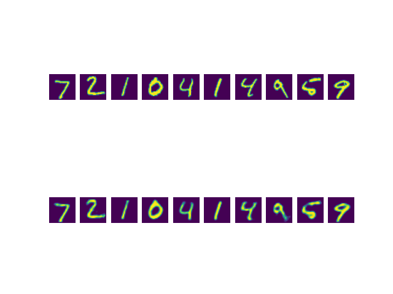
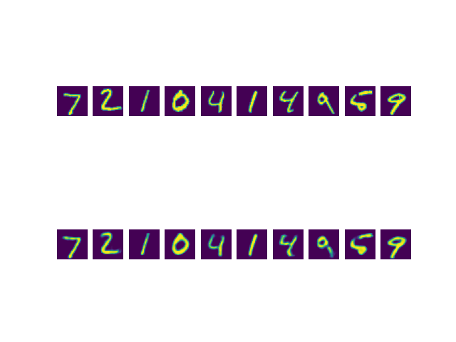
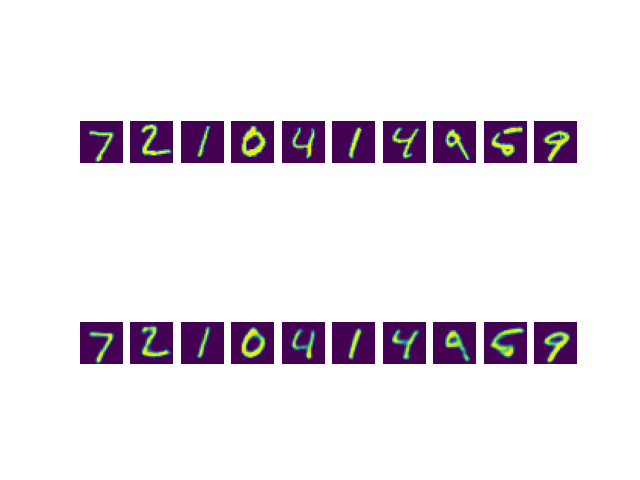
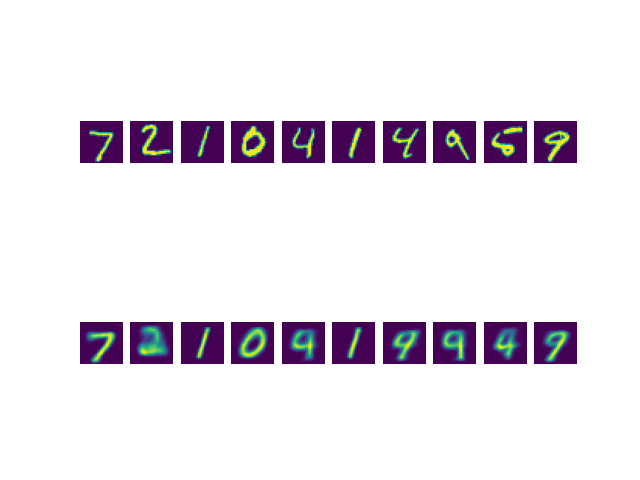
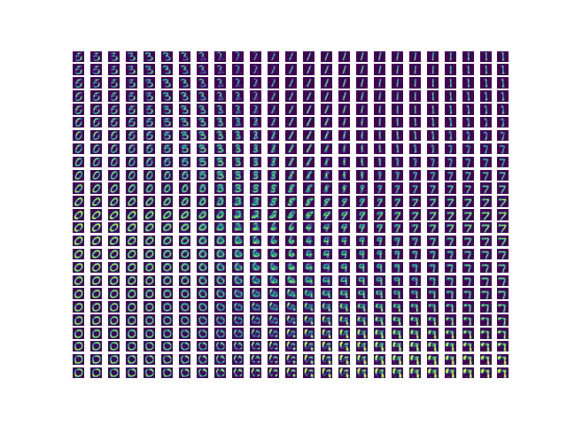

# Autoencoders

## Resources
**Read or watch**:


* [Autoencoder \- definition](https://www.youtube.com/watch?v=FzS3tMl4Nsc&t=73s "Autoencoder - definition")
* [Autoencoder \- loss function](https://www.youtube.com/watch?v=xTU79Zs4XKY "Autoencoder - loss function")
* [Deep learning \- deep autoencoder](https://www.youtube.com/watch?v=z5ZYm_wJ37c "Deep learning - deep autoencoder")
* [Introduction to autoencoders](https://www.jeremyjordan.me/autoencoders/ "Introduction to autoencoders")
* [Variational Autoencoders \- EXPLAINED!](https://www.youtube.com/watch?v=fcvYpzHmhvA "Variational Autoencoders - EXPLAINED!") *up to* **12:55**
* [Variational Autoencoders](https://www.youtube.com/watch?v=9zKuYvjFFS8 "Variational Autoencoders")
* [Intuitively Understanding Variational Autoencoders](https://towardsdatascience.com/intuitively-understanding-variational-autoencoders-1bfe67eb5daf "Intuitively Understanding Variational Autoencoders")
* [Deep Generative Models](https://towardsdatascience.com/deep-generative-models-25ab2821afd3 "Deep Generative Models") *up to* **Generative Adversarial Networks**


**Definitions to skim**:


* [Kullback–Leibler divergence](https://en.wikipedia.org/wiki/Kullback%E2%80%93Leibler_divergence "Kullback–Leibler divergence") *recall its use in t\-SNE*
* [Autoencoder](https://en.wikipedia.org/wiki/Autoencoder "Autoencoder")
* [Generative model](https://en.wikipedia.org/wiki/Generative_model "Generative model")


**References**:


* [The Deep Learning textbook \- Chapter 14: Autoencoders](https://www.deeplearningbook.org/contents/autoencoders.html "The Deep Learning textbook - Chapter 14: Autoencoders")
* [Reducing the Dimensionality of Data with Neural Networks 2006](https://www.cs.toronto.edu/~hinton/absps/science.pdf "Reducing the Dimensionality of Data with Neural Networks 2006")


## Learning Objectives


* What is an autoencoder?
* What is latent space?
* What is a bottleneck?
* What is a sparse autoencoder?
* What is a convolutional autoencoder?
* What is a generative model?
* What is a variational autoencoder?
* What is the Kullback\-Leibler divergence?


**Great!**
 You've completed the quiz successfully! Keep going!
 (Hide quiz)


#### Question \#0


What is a “vanilla” autoencoder?


* **A compression model**
* **Composed of an encoder and decoder**
* A generative model
* **Learns a latent space representation**


#### Question \#1


What is a bottleneck?


* When you can no longer train your model
* The latent space representation
* The compressed input
* **A layer that is smaller than the previous and next layers**


#### Question \#2


What is a VAE?


* An adversarial network
* **A generative model**
* **Composed of an encoder and decoder**
* A compression model


#### Question \#3


What loss function(s) is/are used for training `vanilla` autoencoders?


* **Mean Squared Error**
* L2 Normalization
* **Cross Entropy**
* **Kullback\-Leibler Divergence**


#### Question \#4


What loss function(s) is/are used for training variational autoencoders?


* **Mean Squared Error**
* L2 Normalization
* **Cross Entropy**
* **Kullback\-Leibler Divergence**

## Tasks

### 0\. "Vanilla" Autoencoder


Write a function `def autoencoder(input_dims, hidden_layers, latent_dims):` that creates an autoencoder:


* `input_dims` is an integer containing the dimensions of the model input
* `hidden_layers` is a list containing the number of nodes for each hidden layer in the encoder, respectively
  + the hidden layers should be reversed for the decoder
* `latent_dims` is an integer containing the dimensions of the latent space representation
* Returns: `encoder, decoder, auto`
  + `encoder` is the encoder model
  + `decoder` is the decoder model
  + `auto` is the full autoencoder model
* The autoencoder model should be compiled using adam optimization and binary cross\-entropy loss
* All layers should use a `relu` activation except for the last layer in the decoder, which should use `sigmoid`


```
$ cat 0-main.py
    #!/usr/bin/env python3
    
    import matplotlib.pyplot as plt
    import numpy as np
    import tensorflow as tf
    
    autoencoder = __import__('0-vanilla').autoencoder
    
    SEED = 0
    
    import os
    os.environ['PYTHONHASHSEED'] = str(SEED)
    os.environ['TF_ENABLE_ONEDNN_OPTS']= '0'
    import random
    random.seed(SEED)
    import numpy as np
    np.random.seed(SEED)
    import tensorflow as tf
    tf.random.set_seed(SEED)
    
    (x_train, _), (x_test, _) = tf.keras.datasets.mnist.load_data()
    x_train = x_train.astype('float32') / 255.
    x_test = x_test.astype('float32') / 255.
    x_train = x_train.reshape((-1, 784))
    x_test = x_test.reshape((-1, 784))
    
    encoder, decoder, auto = autoencoder(784, [128, 64], 32)
    auto.fit(x_train, x_train, epochs=50,batch_size=256, shuffle=True,
                    validation_data=(x_test, x_test))
    encoded = encoder.predict(x_test[:10])
    print(np.mean(encoded))
    reconstructed = decoder.predict(encoded)
    
    for i in range(10):
        ax = plt.subplot(2, 10, i + 1)
        ax.axis('off')
        plt.imshow(x_test[i].reshape((28, 28)))
        ax = plt.subplot(2, 10, i + 11)
        ax.axis('off')
        plt.imshow(reconstructed[i].reshape((28, 28)))
    plt.show()
    $ ./0-main.py
    Epoch 1/50
    235/235 [==============================] - 3s 10ms/step - loss: 0.2462 - val_loss: 0.1704
    Epoch 2/50
    235/235 [==============================] - 2s 10ms/step - loss: 0.1526 - val_loss: 0.1370
    Epoch 3/50
    235/235 [==============================] - 3s 11ms/step - loss: 0.1319 - val_loss: 0.1242
    Epoch 4/50
    235/235 [==============================] - 2s 10ms/step - loss: 0.1216 - val_loss: 0.1165
    Epoch 5/50
    235/235 [==============================] - 3s 11ms/step - loss: 0.1157 - val_loss: 0.1119
    
    ...
    
    Epoch 46/50
    235/235 [==============================] - 2s 11ms/step - loss: 0.0851 - val_loss: 0.0845
    Epoch 47/50
    235/235 [==============================] - 2s 11ms/step - loss: 0.0849 - val_loss: 0.0845
    Epoch 48/50
    235/235 [==============================] - 3s 12ms/step - loss: 0.0848 - val_loss: 0.0842
    Epoch 49/50
    235/235 [==============================] - 3s 13ms/step - loss: 0.0847 - val_loss: 0.0842
    Epoch 50/50
    235/235 [==============================] - 3s 12ms/step - loss: 0.0846 - val_loss: 0.0842
    1/1 [==============================] - 0s 76ms/step
    8.311438
    1/1 [==============================] - 0s 80ms/step
    
```




### 1\. Sparse Autoencoder

Write a function `def autoencoder(input_dims, hidden_layers, latent_dims, lambtha):` that creates a sparse autoencoder:


* `input_dims` is an integer containing the dimensions of the model input
* `hidden_layers` is a list containing the number of nodes for each hidden layer in the encoder, respectively
  + the hidden layers should be reversed for the decoder
* `latent_dims` is an integer containing the dimensions of the latent space representation
* `lambtha` is the regularization parameter used for L1 regularization on the encoded output
* Returns: `encoder, decoder, auto`
  + `encoder` is the encoder model
  + `decoder` is the decoder model
  + `auto` is the sparse autoencoder model
* The sparse autoencoder model should be compiled using adam optimization and binary cross\-entropy loss
* All layers should use a `relu` activation except for the last layer in the decoder, which should use `sigmoid`


```
$ cat 1-main.py
    #!/usr/bin/env python3
    
    import matplotlib.pyplot as plt
    import numpy as np
    import tensorflow as tf
    
    autoencoder = __import__('1-sparse').autoencoder
    
    SEED = 0
    
    import os
    os.environ['PYTHONHASHSEED'] = str(SEED)
    os.environ['TF_ENABLE_ONEDNN_OPTS']= '0'
    import random
    random.seed(SEED)
    import numpy as np
    np.random.seed(SEED)
    import tensorflow as tf
    tf.random.set_seed(SEED)
    
    (x_train, _), (x_test, _) = tf.keras.datasets.mnist.load_data()
    x_train = x_train.astype('float32') / 255.
    x_test = x_test.astype('float32') / 255.
    x_train = x_train.reshape((-1, 784))
    x_test = x_test.reshape((-1, 784))
    
    encoder, decoder, auto = autoencoder(784, [128, 64], 32, 10e-6)
    auto.fit(x_train, x_train, epochs=50,batch_size=256, shuffle=True,
                    validation_data=(x_test, x_test))
    encoded = encoder.predict(x_test[:10])
    print(np.mean(encoded))
    reconstructed = decoder.predict(encoded)
    
    for i in range(10):
        ax = plt.subplot(2, 10, i + 1)
        ax.axis('off')
        plt.imshow(x_test[i].reshape((28, 28)))
        ax = plt.subplot(2, 10, i + 11)
        ax.axis('off')
        plt.imshow(reconstructed[i].reshape((28, 28)))
    plt.show()
    $ ./1-main.py
    Epoch 1/50
    235/235 [==============================] - 4s 15ms/step - loss: 0.2467 - val_loss: 0.1715
    Epoch 2/50
    235/235 [==============================] - 3s 14ms/step - loss: 0.1539 - val_loss: 0.1372
    Epoch 3/50
    235/235 [==============================] - 2s 9ms/step - loss: 0.1316 - val_loss: 0.1242
    Epoch 4/50
    235/235 [==============================] - 2s 9ms/step - loss: 0.1218 - val_loss: 0.1166
    Epoch 5/50
    235/235 [==============================] - 2s 9ms/step - loss: 0.1157 - val_loss: 0.1122
    
    ...
    
    Epoch 46/50
    235/235 [==============================] - 3s 11ms/step - loss: 0.0844 - val_loss: 0.0844
    Epoch 47/50
    235/235 [==============================] - 3s 11ms/step - loss: 0.0843 - val_loss: 0.0840
    Epoch 48/50
    235/235 [==============================] - 3s 11ms/step - loss: 0.0842 - val_loss: 0.0837
    Epoch 49/50
    235/235 [==============================] - 3s 11ms/step - loss: 0.0841 - val_loss: 0.0837
    Epoch 50/50
    235/235 [==============================] - 3s 12ms/step - loss: 0.0839 - val_loss: 0.0835
    1/1 [==============================] - 0s 85ms/step
    3.0174155
    1/1 [==============================] - 0s 46ms/step
    
```




### 2\. Convolutional Autoencoder


Write a function `def autoencoder(input_dims, filters, latent_dims):` that creates a convolutional autoencoder:


* `input_dims` is a tuple of integers containing the dimensions of the model input
* `filters` is a list containing the number of filters for each convolutional layer in the encoder, respectively
  + the filters should be reversed for the decoder
* `latent_dims` is a tuple of integers containing the dimensions of the latent space representation
* Each convolution in the encoder should use a kernel size of `(3, 3)` with same padding and `relu` activation, followed by max pooling of size `(2, 2)`
* Each convolution in the decoder, except for the last two, should use a filter size of `(3, 3)` with same padding and `relu` activation, followed by upsampling of size `(2, 2)`
  + The second to last convolution should instead use valid padding
  + The last convolution should have the same number of filters as the number of channels in `input_dims` with `sigmoid` activation and no upsampling
* Returns: `encoder, decoder, auto`
  + `encoder` is the encoder model
  + `decoder` is the decoder model
  + `auto` is the full autoencoder model
* The autoencoder model should be compiled using adam optimization and binary cross\-entropy loss


```
$ cat 2-main.py
    #!/usr/bin/env python3
    
    import matplotlib.pyplot as plt
    import numpy as np
    import tensorflow as tf
    
    autoencoder = __import__('2-convolutional').autoencoder
    
    SEED = 0
    
    import os
    os.environ['PYTHONHASHSEED'] = str(SEED)
    os.environ['TF_ENABLE_ONEDNN_OPTS']= '0'
    import random
    random.seed(SEED)
    import numpy as np
    np.random.seed(SEED)
    import tensorflow as tf
    tf.random.set_seed(SEED)
    
    (x_train, _), (x_test, _) = tf.keras.datasets.mnist.load_data()
    x_train = x_train.astype('float32') / 255.
    x_test = x_test.astype('float32') / 255.
    x_train = np.expand_dims(x_train, axis=3)
    x_test = np.expand_dims(x_test, axis=3)
    print(x_train.shape)
    print(x_test.shape)
    
    encoder, decoder, auto = autoencoder((28, 28, 1), [16, 8, 8], (4, 4, 8))
    auto.fit(x_train, x_train, epochs=50, batch_size=256, shuffle=True,
                    validation_data=(x_test, x_test))
    encoded = encoder.predict(x_test[:10])
    print(np.mean(encoded))
    reconstructed = decoder.predict(encoded)[:,:,:,0]
    
    for i in range(10):
        ax = plt.subplot(2, 10, i + 1)
        ax.axis('off')
        plt.imshow(x_test[i,:,:,0])
        ax = plt.subplot(2, 10, i + 11)
        ax.axis('off')
        plt.imshow(reconstructed[i])
    plt.show()
    $ ./2-main.py
    (60000, 28, 28, 1)
    (10000, 28, 28, 1)
    Epoch 1/50
    235/235 [==============================] - 117s 457ms/step - loss: 0.2466 - val_loss: 0.1597
    Epoch 2/50
    235/235 [==============================] - 107s 457ms/step - loss: 0.1470 - val_loss: 0.1358
    Epoch 3/50
    235/235 [==============================] - 114s 485ms/step - loss: 0.1320 - val_loss: 0.1271
    Epoch 4/50
    235/235 [==============================] - 104s 442ms/step - loss: 0.1252 - val_loss: 0.1216
    Epoch 5/50
    235/235 [==============================] - 99s 421ms/step - loss: 0.1208 - val_loss: 0.1179
    
    ...
    
    Epoch 46/50
    235/235 [==============================] - 72s 307ms/step - loss: 0.0943 - val_loss: 0.0933
    Epoch 47/50
    235/235 [==============================] - 80s 339ms/step - loss: 0.0942 - val_loss: 0.0929
    Epoch 48/50
    235/235 [==============================] - 65s 279ms/step - loss: 0.0940 - val_loss: 0.0932
    Epoch 49/50
    235/235 [==============================] - 53s 225ms/step - loss: 0.0939 - val_loss: 0.0927
    Epoch 50/50
    235/235 [==============================] - 39s 165ms/step - loss: 0.0938 - val_loss: 0.0926
    1/1 [==============================] - 0s 235ms/step
    3.4141076
    1/1 [==============================] - 0s 85ms/step
    
```



### 3\. Variational Autoencoder


Write a function `def autoencoder(input_dims, hidden_layers, latent_dims):` that creates a variational autoencoder:


* `input_dims` is an integer containing the dimensions of the model input
* `hidden_layers` is a list containing the number of nodes for each hidden layer in the encoder, respectively
  + the hidden layers should be reversed for the decoder
* `latent_dims` is an integer containing the dimensions of the latent space representation
* Returns: `encoder, decoder, auto`
  + `encoder` is the encoder model, which should output the latent representation, the mean, and the log variance, respectively
  + `decoder` is the decoder model
  + `auto` is the full autoencoder model
* The autoencoder model should be compiled using adam optimization and binary cross\-entropy loss
* All layers should use a `relu` activation except for the mean and log variance layers in the encoder, which should use `None`, and the last layer in the decoder, which should use `sigmoid`


```
$ cat 3-main.py
    #!/usr/bin/env python3
    
    import matplotlib.pyplot as plt
    import numpy as np
    import tensorflow as tf
    
    autoencoder = __import__('3-variational').autoencoder
    
    SEED = 0
    
    import os
    os.environ['PYTHONHASHSEED'] = str(SEED)
    os.environ['TF_ENABLE_ONEDNN_OPTS']= '0'
    import random
    random.seed(SEED)
    import numpy as np
    np.random.seed(SEED)
    import tensorflow as tf
    tf.random.set_seed(SEED)
    
    (x_train, _), (x_test, _) = tf.keras.datasets.mnist.load_data()
    x_train = x_train.astype('float32') / 255.
    x_test = x_test.astype('float32') / 255.
    x_train = x_train.reshape((-1, 784))
    x_test = x_test.reshape((-1, 784))
    
    encoder, decoder, auto = autoencoder(784, [512], 2)
    auto.fit(x_train, x_train, epochs=50, batch_size=256, shuffle=True,
                    validation_data=(x_test, x_test))
    encoded, mu, log_sig = encoder.predict(x_test[:10])
    print(mu)
    print(np.exp(log_sig / 2))
    reconstructed = decoder.predict(encoded).reshape((-1, 28, 28))
    x_test = x_test.reshape((-1, 28, 28))
    
    for i in range(10):
        ax = plt.subplot(2, 10, i + 1)
        ax.axis('off')
        plt.imshow(x_test[i])
        ax = plt.subplot(2, 10, i + 11)
        ax.axis('off')
        plt.imshow(reconstructed[i])
    plt.show()
    
    
    l1 = np.linspace(-3, 3, 25)
    l2 = np.linspace(-3, 3, 25)
    L = np.stack(np.meshgrid(l1, l2, sparse=False, indexing='ij'), axis=2)
    G = decoder.predict(L.reshape((-1, 2)), batch_size=125)
    
    for i in range(25*25):
        ax = plt.subplot(25, 25, i + 1)
        ax.axis('off')
        plt.imshow(G[i].reshape((28, 28)))
    plt.show()
    $ ./3-main.py
    Epoch 1/50
    235/235 [==============================] - 5s 17ms/step - loss: 212.1680 - val_loss: 175.3891
    Epoch 2/50
    235/235 [==============================] - 4s 17ms/step - loss: 170.0067 - val_loss: 164.9127
    Epoch 3/50
    235/235 [==============================] - 4s 18ms/step - loss: 163.6800 - val_loss: 161.2009
    Epoch 4/50
    235/235 [==============================] - 5s 21ms/step - loss: 160.5563 - val_loss: 159.1755
    Epoch 5/50
    235/235 [==============================] - 5s 22ms/step - loss: 158.5609 - val_loss: 157.5874
    
    ...
    
    Epoch 46/50
    235/235 [==============================] - 4s 19ms/step - loss: 143.8559 - val_loss: 148.1236
    Epoch 47/50
    235/235 [==============================] - 4s 19ms/step - loss: 143.7759 - val_loss: 148.0166
    Epoch 48/50
    235/235 [==============================] - 4s 19ms/step - loss: 143.6073 - val_loss: 147.9645
    Epoch 49/50
    235/235 [==============================] - 5s 19ms/step - loss: 143.5385 - val_loss: 148.1294
    Epoch 50/50
    235/235 [==============================] - 5s 20ms/step - loss: 143.3937 - val_loss: 147.9027
    1/1 [==============================] - 0s 124ms/step
    [[-4.4424314e-04  3.7557125e-05]
     [-2.3759568e-04  3.6484184e-04]
     [ 3.6569734e-05 -7.3342602e-04]
     [-5.5730779e-04 -6.3699216e-04]
     [-5.8648770e-04  8.7332644e-04]
     [ 1.7586297e-04 -8.7016745e-04]
     [-5.4950645e-04  6.9131691e-04]
     [-5.1684811e-04  3.8412266e-04]
     [-2.7567835e-04  5.2892545e-04]
     [-5.0945382e-04  1.0410405e-03]]
    [[0.9501978  3.0150387 ]
     [1.1207044  0.6665632 ]
     [0.19164634 1.5250858 ]
     [0.9454097  0.45243642]
     [1.5451298  1.2251403 ]
     [0.28436017 1.3658737 ]
     [0.97746277 1.234872  ]
     [1.7042938  1.5537287 ]
     [1.2055128  1.1579443 ]
     [0.9644342  1.6614302 ]]
    1/1 [==============================] - 0s 46ms/step
    5/5 [==============================] - 0s 3ms/step
    
```







