# GANs


## Resources


  

**Read or watch**:
   


* [GoodFellow et al. (2014\)](https://proceedings.neurips.cc/paper_files/paper/2014/file/5ca3e9b122f61f8f06494c97b1afccf3-Paper.pdf "GoodFellow et al. (2014)")
* [Arjovsky et al. (2017\)](https://arxiv.org/pdf/1701.07875 "Arjovsky et al. (2017)")
* [Gulrajani et al. (2017\)](https://arxiv.org/pdf/1704.00028 "Gulrajani et al. (2017)")
* [Introduction to the Wasserstein distance](https://www.youtube.com/watch?v=CDiol4LG2Ao "Introduction to the Wasserstein distance")
* [This person does not exist](https://thispersondoesnotexist.com/ "This person does not exist")


## Basics about GANs


 Since their appearance around 2014, GANs have attracted a lot of attention due to their potential to  **generate**  fake models that can fool anybody.
   
  

 For example, you can visit the page[This person does not exist](https://thispersondoesnotexist.com/) to see pictures of fake persons. Each time you refresh your browser, a new picture that seems quite realistic appears, but the person on this picture does not exist :
   


*These persons do not exist*


  
  

 The  **generator**  is in fact a continuous function from a (relatively small) space of  **latent vectors**  to the space of all pictures. 
   
  

 So if a given latent vector ℓ0 furnishes a realistic picture person0\=generator(ℓ0), then for a small latent vector ε, the new latent vector ℓ0 \+ ε will furnish a picture person1\=generator(ℓ0\+ε) that is very close from person0. 
   
  

 If ε is wisely chosen, then person1 will be the same as person0, but smiling :
 
 


*person*0 \= Generator (l*0\) on the left, person*1 \= Generator (l*0\+ε) on the right*


  

 With these kinds of perturbations, you can make your model older, or change its sex, or make its hair longer and so on :
   
  


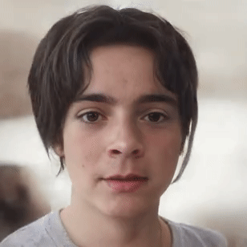


*Walk in a star shape to and from a picture*


  

 You can also walk along circle in the space of latent vectors, and look at the corresponding persons furnished by the generator, thus producing results like
   
  


*Cyclic walk from and to a picture*


  
  

 **Our aim**  in this project is to explain the basics of GANs, and convince you that you have understood how they work.
   
  

 **Beyond this project:**  A large family of image generators has grown since then:
   
  


* Pro\-GANs allow to have a far better quality of images
* SR\-GANs take a blurry picture as input and return the same picture, unblurred
* Style\-GANs have been popularized by their ability to modify one character of a picture. For example you can give them a picture of a young person and it will return the picture of the same person at age 60\.


## Tasks


  


This project about GANs is organized as follows :


* The description contains a crash course about GANs. The fundamentals ideas behind GANs are exposed as fast as possible.
* Task 0 : the class `Simple_GAN` : as they were introduced, GANs are a game played by two adversary players.
* Task 1 : the class `WGAN_clip` : later it appeared that in fact the two players can collaborate.
* Task 2 : the class `WGANGP` *: a more natural version of the latter, which outperforms `Simple`*`GAN`s and `WGAN_clip`s in higher dimensions, as will be illustrated in the main program.
* Task 3 : convolutional generators and discriminators : to work with pictures we need to use convolutional neural networks.
* Task 4 : our own face generator : we will use a `WGAN_GP` model to produce faces of persons that don’t exist.
* Appendix : at the end of task 4 there is a short digression explaining why GANs are superior to the older generators of fake pictures that were based on PCA.


*For this project, we expect you to look at these concepts:*


* Introduction to GANs (Generative Adversarial Networks
* Simple GANs
* Wasserstein GANs
* Wasserstein GANs with gradient penalty
* Generating Faces


## Tasks


### 0\. Simple GAN


 In this task we will define a class `Simple_GAN` and test it on some examples. The instruction text is quite long, since we explain the context in details, but the exercise in itself is short : it consists in filling in the `train_step` method. 
   
  


## **The generator and the discriminator networks**

  


 
 We will assume the generator network, the discriminator network, and a generator of latent vectors are already fixed. For example, as the result of the following function :
   
  


```
def spheric_generator(nb_points, dim) :
        u=tf.random.normal(shape=(nb_points, dim))
        return u/tf.reshape(tf.sqrt(tf.reduce_sum(tf.square(u),axis=[1])+10**-8),[nb_points,1])
    
    def fully_connected_GenDiscr(gen_shape, real_examples, latent_type="normal" ) :
        
        #   Latent generator   
        if latent_type   == "uniform" :
            latent_generator  =  lambda k : tf.random.uniform(shape=(k, gen_shape[0]))
        elif latent_type == "normal" :
            latent_generator  =  lambda k : tf.random.normal(shape=(k, gen_shape[0])) 
        elif latent_type == "spheric" :
            latent_generator  = lambda k : spheric_generator(k,gen_shape[0]) 
        
        #   Generator  
        inputs     = keras.Input(shape=( gen_shape[0] , ))
        hidden     = keras.layers.Dense( gen_shape[1] , activation = 'tanh'    )(inputs)
        for i in range(2,len(gen_shape)-1) :
            hidden = keras.layers.Dense( gen_shape[i] , activation = 'tanh'    )(hidden)
        outputs    = keras.layers.Dense( gen_shape[-1], activation = 'sigmoid' )(hidden)
        generator  = keras.Model(inputs, outputs, name="generator")
        
        #   Discriminator     
        inputs        = keras.Input(shape=( gen_shape[-1], ))
        hidden        = keras.layers.Dense( gen_shape[-2],   activation = 'tanh' )(inputs)
        for i in range(2,len(gen_shape)-1) :
            hidden    = keras.layers.Dense( gen_shape[-1*i], activation = 'tanh' )(hidden)
        outputs       = keras.layers.Dense( 1 ,              activation = 'tanh' )(hidden)
        discriminator = keras.Model(inputs, outputs, name="discriminator")
        
        return generator, discriminator, latent_generator
    
```


 The code above produces two networks that are almost symmetric (the first layer of the generator and the last layer of the discriminator differ). 
   
  

 Note that the last layer of the discriminator has the sigmoid for activation function, thus takes values in \[0,1], while all the others activation functions are the hyperbolic tangent, which takes values in \[−1,1].
   
  

 For example :
 


```
generator, discriminator, latent_generator = fully_connected_GenDiscr([1,100,100,2], None)
    print(generator.summary())
    print(discriminator.summary())
    
```


 
 produces :
 


```

    Model: "generator"
    _________________________________________________________________
    Layer (type)                 Output Shape              Param #   
    =================================================================
    input_1 (InputLayer)         [(None, 1)]               0         
    _________________________________________________________________
    dense (Dense)                (None, 100)               200       
    _________________________________________________________________
    dense_1 (Dense)              (None, 100)               10100     
    _________________________________________________________________
    dense_2 (Dense)              (None, 2)                 202       
    =================================================================
    Total params: 10,502
    Trainable params: 10,502
    Non-trainable params: 0
    _________________________________________________________________
    
    
    
    Model: "discriminator"
    _________________________________________________________________
    Layer (type)                 Output Shape              Param #   
    =================================================================
    input_2 (InputLayer)         [(None, 2)]               0         
    _________________________________________________________________
    dense_3 (Dense)              (None, 100)               300       
    _________________________________________________________________
    dense_4 (Dense)              (None, 100)               10100     
    _________________________________________________________________
    dense_5 (Dense)              (None, 1)                 101       
    =================================================================
    Total params: 10,501
    Trainable params: 10,501
    Non-trainable params: 0
    _________________________________________________________________
    
```


  
  


## **The Simple\_GAN model**

  


 The simple GAN model looks as follows :
 


```
class Simple_GAN(keras.Model) :
        
        def __init__(self, generator , discriminator , latent_generator, real_examples, 
                     batch_size=200, disc_iter=2, learning_rate=.005):
            pass
        
        # generator of real samples of size batch_size
        def get_real_sample(self):
            pass
        
        # generator of fake samples of size batch_size
        def get_fake_sample(self, training=True):
            pass
                 
        # overloading train_step()
        def train_step(self,useless_argument): 
            pass
    
```


  
  

 The goal of the exercise is to fill in the train\_step method. But before we do so, let us fill in the other methods.
   
  

  
  


## **The \_\_init\_\_ method, the loss functions and the optimizers**

  


 
 Here is the code for the `__init__` method:
 


```
    def __init( self, generator , discriminator , latent_generator, real_examples, 
                    batch_size=200, disc_iter=2, learning_rate=.005):
                    
            super().__init__()                         # run the __init__ of Keras.Model first. 
            self.latent_generator = latent_generator
            self.real_examples    = real_examples
            self.generator        = generator
            self.discriminator    = discriminator
            self.batch_size       = batch_size
            self.disc_iter        = disc_iter
            
            self.learning_rate=learning_rate
            self.beta1=.5                               # standard value, but can be changed if necessary
            self.beta2=.9                               # standard value, but can be changed if necessary
            
            # define the generator loss and optimizer:
            self.generator.loss      = lambda x : tf.keras.losses.MeanSquaredError()(x, tf.ones(x.shape))
            self.generator.optimizer = keras.optimizers.Adam(learning_rate=learning_rate, beta_1=beta_1, beta_2=beta_2)
            self.generator.compile(optimizer=generator.optimizer , loss=generator.loss )
            
            # define the discriminator loss and optimizer:
            self.discriminator.loss      = lambda x , y : tf.keras.losses.MeanSquaredError()(x, tf.ones(x.shape)) + tf.keras.losses.MeanSquaredError()(y, -1*tf.ones(y.shape))
            self.discriminator.optimizer = keras.optimizers.Adam(learning_rate=learning_rate, beta_1=beta_1, beta_2=beta_2)
            self.discriminator.compile(optimizer=discriminator.optimizer , loss=discriminator.loss )
           
    
```


 The `super.__init__()` instruction instanciates some attributes of the model like for example `self.history` .  
  

 The loss of the generator is the mean squared error between `discriminator(generator(latent_sample))` and the (generator) objective value 1.  
  

 The loss of the discriminator is the mean squared error between `discriminator(fake_sample)` and the (discriminator) objective value −1, summed with the mean squared error between `discriminator(real_sample)` and the (discriminator) objective value 1.  
  

 The optimizers are standard Adam optimizers.
   
  


## **The get\_X\_sample methods**

  


 
 A fake sample is just the image of the generator applied to a latent sample :
 


```
     def get_fake_sample(self, training=False):
            self.generator(self.latent_generator(self.batch_size), training=training)
    
```


  
  

 
 A real sample is a random subset of the set of `real_examples` :
 


```
    def get_real_sample(self):
            sorted_indices = tf.range(tf.shape(self.real_examples)[0])
            random_indices  = tf.random.shuffle(sorted_indices)[:self.batch_size]
            return tf.gather(self.real_examples, random_indices)
    
```


  
  


## **The train\_step method (your shot)**

  


 
 Recall from the lesson on Keras models that to compute a gradient relatively to some variables the scheme is as follows :
 


```
x = tf.constant([.1, .2, .3, .4])                # x is a tensor 
    with tf.GradientTape() as g:
      g.watch( x )                                   # we want to compute the gradient w/r to x
      y = f(x)                                       # y is 1-dimensional, f is a tensorflow function
    gradient = g.gradient(y, x)                      # gradient is the gradient of f as at x
    
```


 For example, if we want to train a model `M` to minimize a function `f` the scheme for one step looks like 
 


```
with tf.GradientTape() as g:
      g.watch( M.trainable_variables )                
      y = f(M)                                        # y is 1-dimensional, f is a tensorflow function
    gradient = g.gradient(y, M.trainable_variables)   # get the gradient of f at M
    M.optimizer.apply_gradients(zip(gradient, M.trainable_variables))
    
```


 Now one training step of our GANs consists in applying `discr_iter` times the gradient descent for the discriminator and then once for the generator.
   
  

 Thus you are asked to fill in this method:
 


```
    def train_step(self,useless_argument): 
            pass
            #for _ in range(self.disc_iter) :
                
                # compute the loss for the discriminator in a tape watching the discriminator's weights
                    # get a real sample
                    # get a fake sample
                    # compute the loss discr_loss of the discriminator on real and fake samples
                # apply gradient descent once to the discriminator
    
            # compute the loss for the generator in a tape watching the generator's weights 
                # get a fake sample 
                # compute the loss gen_loss of the generator on this sample
            # apply gradient descent to the discriminator
            
            # return {"discr_loss": discr_loss, "gen_loss": gen_loss}
    
```


 Finally the whole class declaration (with the hole you have to fill in) of the class is :
 


```
import tensorflow as tf
    from tensorflow import keras
    import numpy as np
    import matplotlib.pyplot as plt
    
    class Simple_GAN(keras.Model) :
        
        def __init__( self, generator , discriminator , latent_generator, real_examples, batch_size=200, disc_iter=2, learning_rate=.005):
            super().__init__()                         # run the __init__ of keras.Model first. 
            self.latent_generator = latent_generator
            self.real_examples    = real_examples
            self.generator        = generator
            self.discriminator    = discriminator
            self.batch_size       = batch_size
            self.disc_iter        = disc_iter
            
            self.learning_rate    = learning_rate
            self.beta_1=.5                               # standard value, but can be changed if necessary
            self.beta_2=.9                               # standard value, but can be changed if necessary
            
            # define the generator loss and optimizer:
            self.generator.loss      = lambda x : tf.keras.losses.MeanSquaredError()(x, tf.ones(x.shape))
            self.generator.optimizer = keras.optimizers.Adam(learning_rate=self.learning_rate, beta_1=self.beta_1, beta_2=self.beta_2)
            self.generator.compile(optimizer=generator.optimizer , loss=generator.loss )
            
            # define the discriminator loss and optimizer:
            self.discriminator.loss      = lambda x,y : tf.keras.losses.MeanSquaredError()(x, tf.ones(x.shape)) + tf.keras.losses.MeanSquaredError()(y, -1*tf.ones(y.shape))
            self.discriminator.optimizer = keras.optimizers.Adam(learning_rate=self.learning_rate, beta_1=self.beta_1, beta_2=self.beta_2)
            self.discriminator.compile(optimizer=discriminator.optimizer , loss=discriminator.loss )
           
        
        # generator of real samples of size batch_size
        def get_fake_sample(self, size=None, training=False):
            if not size :
                size= self.batch_size
            return self.generator(self.latent_generator(size), training=training)
    
        # generator of fake samples of size batch_size
        def get_real_sample(self, size=None):
            if not size :
                size= self.batch_size
            sorted_indices = tf.range(tf.shape(self.real_examples)[0])
            random_indices  = tf.random.shuffle(sorted_indices)[:size]
            return tf.gather(self.real_examples, random_indices)
                 
        # overloading train_step()    
        def train_step(self,useless_argument):
            pass
            #for _ in range(self.disc_iter) :
                
                # compute the loss for the discriminator in a tape watching the discriminator's weights
                    # get a real sample
                    # get a fake sample
                    # compute the loss discr_loss of the discriminator on real and fake samples
                # apply gradient descent once to the discriminator
    
            # compute the loss for the generator in a tape watching the generator's weights 
                # get a fake sample 
                # compute the loss gen_loss of the generator on this sample
            # apply gradient descent to the discriminator
            
            # return {"discr_loss": discr_loss, "gen_loss": gen_loss}
    
```


  
  


## **Main 1**

  


 
 Once you will have filled in the `train_step` method, you will be able to test your GANs on as many examples as you wish. 
 
 


```
$ cat 0-main_01.py
    
    #!/usr/bin/env python3
    
    import numpy as np
    import tensorflow as tf
    from tensorflow import keras
    import random
    
    Simple_GAN = __import__('0-simple_gan').Simple_GAN
    
    ## Regulating the seed
    
    def set_seeds(seed) :
        random.seed(seed)
        np.random.seed(seed)
        tf.random.set_seed(seed)
    
    
    def hash_tensor(tensor) :
        return np.sum(np.array([hash(x)%2**30 for x in tensor.numpy().flatten()]))%2**30
    
    
    def spheric_generator(nb_points, dim) :
        u=tf.random.normal(shape=(nb_points, dim))
        return u/tf.reshape(tf.sqrt(tf.reduce_sum(tf.square(u),axis=[1])+10**-8),[nb_points,1])
    
    def normal_generator(nb_points, dim) :
        return tf.random.normal(shape=(nb_points, dim))
    
    def uniform_generator(nb_points, dim) :
        return tf.random.uniform(shape=(nb_points, dim))
    
    
    ## Building Generator and Discriminator
    
    def fully_connected_GenDiscr(gen_shape, real_examples, latent_type="normal" ) :
    
        #   Latent generator
        if latent_type   == "uniform" :
            latent_generator  =  lambda k : uniform_generator(k,gen_shape[0])
        elif latent_type == "normal" :
            latent_generator  =  lambda k : normal_generator(k,gen_shape[0])
        elif latent_type == "spheric" :
            latent_generator  =  lambda k : spheric_generator(k,gen_shape[0])
    
        #   Generator
        inputs     = keras.Input(shape=( gen_shape[0] , ))
        hidden     = keras.layers.Dense( gen_shape[1] , activation = 'tanh'    )(inputs)
        for i in range(2,len(gen_shape)-1) :
            hidden = keras.layers.Dense( gen_shape[i] , activation = 'tanh'    )(hidden)
        outputs    = keras.layers.Dense( gen_shape[-1], activation = 'sigmoid' )(hidden)
        generator  = keras.Model(inputs, outputs, name="generator")
    
        #   Discriminator
        inputs        = keras.Input(shape=( gen_shape[-1], ))
        hidden        = keras.layers.Dense( gen_shape[-2],   activation = 'tanh' )(inputs)
        for i in range(2,len(gen_shape)-1) :
            hidden    = keras.layers.Dense( gen_shape[-1*i], activation = 'tanh' )(hidden)
        outputs       = keras.layers.Dense( 1 ,              activation = 'tanh' )(hidden)
        discriminator = keras.Model(inputs, outputs, name="discriminator")
    
        return generator, discriminator, latent_generator
    
    # illustration:
    def illustr_fully_connected_GenDiscr() :
        generator, discriminator, latent_generator = fully_connected_GenDiscr([1,100,100,2], None)
        print(generator.summary())
        print(discriminator.summary())
    
    
    ## Training a fully connected GAN (Simple GAN)
    
    def example_fully_connected_GAN(chosen_type ,real_examples, gen_shape, epochs,  batch_size=200, steps_per_epoch=250, latent_type="normal", learning_rate=.005):
        generator, discriminator, latent_generator = fully_connected_GenDiscr(gen_shape, real_examples, latent_type=latent_type )
        G=chosen_type( generator , discriminator , latent_generator, real_examples, learning_rate=learning_rate)
        G.compile()
        G.fit(real_examples, epochs=epochs, steps_per_epoch=steps_per_epoch, verbose=1)
        return G
    
    
    ## An example of a large real sample
    
    circle_example = lambda k : spheric_generator(k, 2)*.3+.5
    
    ## LET'S GO !
    
    set_seeds(0)
    G=example_fully_connected_GAN(Simple_GAN,circle_example(1000), [1,10,10,2], 16, steps_per_epoch=100, learning_rate=.001)
    
    $ ./0-main_01.py
    
    Epoch 1/16
    100/100 [==============================] - 2s 3ms/step - discr_loss: 2.0414 - gen_loss: 1.1100
    Epoch 2/16
    100/100 [==============================] - 0s 4ms/step - discr_loss: 1.9627 - gen_loss: 1.0197
    Epoch 3/16
    100/100 [==============================] - 0s 4ms/step - discr_loss: 1.9614 - gen_loss: 1.0231
    Epoch 4/16
    100/100 [==============================] - 0s 5ms/step - discr_loss: 1.9925 - gen_loss: 1.0188
    Epoch 5/16
    100/100 [==============================] - 0s 5ms/step - discr_loss: 1.9071 - gen_loss: 1.0597
    Epoch 6/16
    100/100 [==============================] - 0s 5ms/step - discr_loss: 1.9449 - gen_loss: 1.0523
    Epoch 7/16
    100/100 [==============================] - 0s 5ms/step - discr_loss: 1.9851 - gen_loss: 1.0132
    Epoch 8/16
    100/100 [==============================] - 0s 4ms/step - discr_loss: 1.9390 - gen_loss: 1.0371
    Epoch 9/16
    100/100 [==============================] - 0s 3ms/step - discr_loss: 1.8984 - gen_loss: 1.0652
    Epoch 10/16
    100/100 [==============================] - 0s 3ms/step - discr_loss: 1.9244 - gen_loss: 1.0728
    Epoch 11/16
    100/100 [==============================] - 0s 3ms/step - discr_loss: 1.9159 - gen_loss: 1.0516
    Epoch 12/16
    100/100 [==============================] - 0s 3ms/step - discr_loss: 1.7697 - gen_loss: 1.1881
    Epoch 13/16
    100/100 [==============================] - 0s 3ms/step - discr_loss: 2.0509 - gen_loss: 1.0060
    Epoch 14/16
    100/100 [==============================] - 0s 3ms/step - discr_loss: 1.8757 - gen_loss: 1.0894
    Epoch 15/16
    100/100 [==============================] - 0s 3ms/step - discr_loss: 1.9985 - gen_loss: 1.0575
    Epoch 16/16
    100/100 [==============================] - 0s 3ms/step - discr_loss: 2.1392 - gen_loss: 0.9491
    
    
```

## **Main 2 (with 2D visualization)**

  


 You can visualize the result of this training using the following function:
 


```
$ cat 0-main_02.py
    
    #!/usr/bin/env python3
    
    import numpy as np
    import tensorflow as tf
    from tensorflow import keras
    import random
    import matplotlib.pyplot as plt
    import matplotlib.gridspec as gridspec
    Simple_GAN = __import__('0-simple_gan').Simple_GAN
    
    ## Regulating the seed
    
    def set_seeds(seed) :
        random.seed(seed)
        np.random.seed(seed)
        tf.random.set_seed(seed)
    
    
    def hash_tensor(tensor) :
        return np.sum(np.array([hash(x)%2**30 for x in tensor.numpy().flatten()]))%2**30
    
    
    def spheric_generator(nb_points, dim) :
        u=tf.random.normal(shape=(nb_points, dim))
        return u/tf.reshape(tf.sqrt(tf.reduce_sum(tf.square(u),axis=[1])+10**-8),[nb_points,1])
    
    def normal_generator(nb_points, dim) :
        return tf.random.normal(shape=(nb_points, dim))
    
    def uniform_generator(nb_points, dim) :
        return tf.random.uniform(shape=(nb_points, dim))
    
    
    ## Building Generator and Discriminator
    
    def fully_connected_GenDiscr(gen_shape, real_examples, latent_type="normal" ) :
    
        #   Latent generator
        if latent_type   == "uniform" :
            latent_generator  =  lambda k : uniform_generator(k,gen_shape[0])
        elif latent_type == "normal" :
            latent_generator  =  lambda k : normal_generator(k,gen_shape[0])
        elif latent_type == "spheric" :
            latent_generator  =  lambda k : spheric_generator(k,gen_shape[0])
    
        #   Generator
        inputs     = keras.Input(shape=( gen_shape[0] , ))
        hidden     = keras.layers.Dense( gen_shape[1] , activation = 'tanh'    )(inputs)
        for i in range(2,len(gen_shape)-1) :
            hidden = keras.layers.Dense( gen_shape[i] , activation = 'tanh'    )(hidden)
        outputs    = keras.layers.Dense( gen_shape[-1], activation = 'sigmoid' )(hidden)
        generator  = keras.Model(inputs, outputs, name="generator")
    
        #   Discriminator
        inputs        = keras.Input(shape=( gen_shape[-1], ))
        hidden        = keras.layers.Dense( gen_shape[-2],   activation = 'tanh' )(inputs)
        for i in range(2,len(gen_shape)-1) :
            hidden    = keras.layers.Dense( gen_shape[-1*i], activation = 'tanh' )(hidden)
        outputs       = keras.layers.Dense( 1 ,              activation = 'tanh' )(hidden)
        discriminator = keras.Model(inputs, outputs, name="discriminator")
    
        return generator, discriminator, latent_generator
    
    # illustration:
    def illustr_fully_connected_GenDiscr() :
        generator, discriminator, latent_generator = fully_connected_GenDiscr([1,100,100,2], None)
        print(generator.summary())
        print(discriminator.summary())
    
    
    ## Training a fully connected GAN (Simple GAN)
    
    def example_fully_connected_GAN(chosen_type ,real_examples, gen_shape, epochs,  batch_size=200, steps_per_epoch=250, latent_type="normal", learning_rate=.005):
        generator, discriminator, latent_generator = fully_connected_GenDiscr(gen_shape, real_examples, latent_type=latent_type )
        G=chosen_type( generator , discriminator , latent_generator, real_examples, learning_rate=learning_rate)
        G.compile()
        G.fit(real_examples, epochs=epochs, steps_per_epoch=steps_per_epoch, verbose=1)
        return G
    
    
    ## An example of a large real sample
    
    circle_example = lambda k : spheric_generator(k, 2)*.3+.5
    
    ## Visualize 2D the result of G
    
    def visualize_2D(G, show=True, title=None, filename=None, dpi=200):
        fig = plt.figure(figsize=(16, 4))
        wax = 6  # width of ax
        gs = gridspec.GridSpec(wax, wax * 3 + 2)
        axes = [fig.add_subplot(gs[:, :wax]),
                fig.add_subplot(gs[:, wax + 1:2 * wax + 2]),
                fig.add_subplot(gs[:, 2 * wax + 2:])]
    
        # draw a real and a fake sample on axis 0:
        axes[0].set_xlim(-.1, 1.1)
        axes[0].set_ylim(-.1, 1.1)
    
        X = G.get_real_sample(size=200).numpy()
        axes[0].scatter(X[:, 0], X[:, 1], s=1)
    
        X = G.get_fake_sample(size=200).numpy()
        axes[0].scatter(X[:, 0], X[:, 1], s=1)
    
        axes[0].set_title("real sample (blue) vs fake sample (orange)")
    
        # draw the values of the discriminator on [-1,1]x[-1,1] on axis 1:
        axes[1].set_xlim(-.1, 1.1)
        axes[1].set_ylim(-.1, 1.1)
    
        A = np.linspace(-.1, 1.1, 150)
        B = np.linspace(-.1, 1.1, 150)
        X, Y = np.meshgrid(A, B)
        U = tf.convert_to_tensor(np.vstack([X.ravel(), Y.ravel()]).T)
    
        X = G.discriminator(U, training=False).numpy()
        u = axes[1].pcolormesh(A, B, X[:, 0].reshape([150, 150]), shading='gouraud')
    
        axes[1].set_title("values of the discriminator")
    
        sci = lambda x: "{:.2E}".format(.99 * x * (x > 0) + 1.01 * x * (x < 0))
        cb = fig.colorbar(u, ax=axes[1])
        # cb.set_ticks([sci(np.min(X[:,0])), 0, sci(np.max(X[:,0]))])
        cb.ax.tick_params(labelsize=5)
    
        # draw the training history on axis 3:
        HGL = G.history.history["gen_loss"]
        HDL = G.history.history["discr_loss"]
    
        axes[2].plot(np.arange(1, len(HGL) + 1), HGL)
        axes[2].plot(np.arange(1, len(HGL) + 1), HDL)
        axes[2].set_title("generator loss (blue) and discriminator loss (orange)")
    
        # some more tuning:
        for a in axes:
            a.tick_params(axis='both', which='major', labelsize=5)
            a.tick_params(axis='both', which='minor', labelsize=5)
    
        if title:
            fig.suptitle(title)
    
        if filename:
            plt.savefig(filename, dpi=dpi)
            plt.close()
    
        if show:
            plt.show()
                    
    ## LET'S GO !
    
    set_seeds(0)
    G=example_fully_connected_GAN(Simple_GAN,circle_example(1000), [1,10,10,2], 16, steps_per_epoch=100, learning_rate=.001)
    visualize_2D(G)
    
    $ ./0-main_02.py
    
    
```


 should produce the following picture:
 


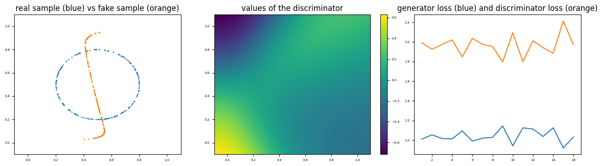


 which is part of the following gif 
 


## **Main 3 (with 5D visualization)**

  


```
$ cat 0-main_03.py
    
    #!/usr/bin/env python3
    
    import numpy as np
    import tensorflow as tf
    from tensorflow import keras
    import random
    import matplotlib.pyplot as plt
    Simple_GAN = __import__('0-simple_gan').Simple_GAN
    
    ## Regulating the seed
    
    def set_seeds(seed) :
        random.seed(seed)
        np.random.seed(seed)
        tf.random.set_seed(seed)
    
    
    def hash_tensor(tensor) :
        return np.sum(np.array([hash(x)%2**30 for x in tensor.numpy().flatten()]))%2**30
    
    
    def spheric_generator(nb_points, dim) :
        u=tf.random.normal(shape=(nb_points, dim))
        return u/tf.reshape(tf.sqrt(tf.reduce_sum(tf.square(u),axis=[1])+10**-8),[nb_points,1])
    
    def normal_generator(nb_points, dim) :
        return tf.random.normal(shape=(nb_points, dim))
    
    def uniform_generator(nb_points, dim) :
        return tf.random.uniform(shape=(nb_points, dim))
    
    
    ## Building Generator and Discriminator
    
    def fully_connected_GenDiscr(gen_shape, real_examples, latent_type="normal" ) :
    
        #   Latent generator
        if latent_type   == "uniform" :
            latent_generator  =  lambda k : uniform_generator(k,gen_shape[0])
        elif latent_type == "normal" :
            latent_generator  =  lambda k : normal_generator(k,gen_shape[0])
        elif latent_type == "spheric" :
            latent_generator  =  lambda k : spheric_generator(k,gen_shape[0])
    
        #   Generator
        inputs     = keras.Input(shape=( gen_shape[0] , ))
        hidden     = keras.layers.Dense( gen_shape[1] , activation = 'tanh'    )(inputs)
        for i in range(2,len(gen_shape)-1) :
            hidden = keras.layers.Dense( gen_shape[i] , activation = 'tanh'    )(hidden)
        outputs    = keras.layers.Dense( gen_shape[-1], activation = 'sigmoid' )(hidden)
        generator  = keras.Model(inputs, outputs, name="generator")
    
        #   Discriminator
        inputs        = keras.Input(shape=( gen_shape[-1], ))
        hidden        = keras.layers.Dense( gen_shape[-2],   activation = 'tanh' )(inputs)
        for i in range(2,len(gen_shape)-1) :
            hidden    = keras.layers.Dense( gen_shape[-1*i], activation = 'tanh' )(hidden)
        outputs       = keras.layers.Dense( 1 ,              activation = 'tanh' )(hidden)
        discriminator = keras.Model(inputs, outputs, name="discriminator")
    
        return generator, discriminator, latent_generator
    
    # illustration:
    def illustr_fully_connected_GenDiscr() :
        generator, discriminator, latent_generator = fully_connected_GenDiscr([1,100,100,2], None)
        print(generator.summary())
        print(discriminator.summary())
    
    
    ## Training a fully connected GAN (Simple GAN)
    
    def example_fully_connected_GAN(chosen_type ,real_examples, gen_shape, epochs,  batch_size=200, steps_per_epoch=250, latent_type="normal", learning_rate=.005):
        generator, discriminator, latent_generator = fully_connected_GenDiscr(gen_shape, real_examples, latent_type=latent_type )
        G=chosen_type( generator , discriminator , latent_generator, real_examples, learning_rate=learning_rate)
        G.compile()
        G.fit(real_examples, epochs=epochs, steps_per_epoch=steps_per_epoch, verbose=1)
        return G
    
    
    ## An example of a large real sample
    
    def four_clouds_example(N_real):
        X   = np.random.randn( N_real)*.05
        Y   = np.random.randn( N_real)*.05
        X[:N_real//2]+=.75
        X[N_real//2:]+=.25
        Y[N_real//4:N_real//2]+=.25
        Y[:N_real//4]+=.75
        Y[N_real//2:3*N_real//4]+=.75
        Y[3*N_real//4:]+=.25
        R   = np.minimum(X*X,1)
        G   = np.minimum(Y*Y,1)
        B   = np.maximum(1-R-G,0)
        return tf.convert_to_tensor(np.vstack([X,Y,R,G,B]).T)
    
    ## Visualize 5D the result of G
    
    def visualize_5D(G, show=True, title=None, filename=None, dpi=200):
        fig, axes = plt.subplots(2, 3, figsize=(12, 8))
        for ax in axes.flatten():
            ax.set_xlim(-.1, 1.1)
            ax.set_ylim(-.1, 1.1)
    
        X_tf = G.real_examples
        X = X_tf.numpy()
        axes[0, 0].scatter(X[:, 0], X[:, 1], c=X[:, 2:], s=1)
        axes[0, 0].set_title("real")
    
        lat = G.latent_generator(10000)
        Y_tf = G.generator(lat)
        Y = Y_tf.numpy()
        axes[0, 1].scatter(Y[:, 0], Y[:, 1], c=Y[:, 2:], s=1)
        axes[0, 1].set_title("fake = generator(latent sample) ")
    
        cX = G.discriminator(X_tf).numpy()
        cY = G.discriminator(Y_tf).numpy()
        m = min(np.min(cX), np.min(cY))
        M = max(np.max(cX), np.max(cY))
    
        axes[1, 0].scatter(X[:, 0], X[:, 1], c=cX, s=1, vmin=m, vmax=M)
        axes[1, 0].set_title("discriminator(real)")
    
        Y = G.generator(G.latent_generator(10000)).numpy()
        axes[1, 1].scatter(Y[:, 0], Y[:, 1], c=cY, s=1, vmin=m, vmax=M)
        axes[1, 1].set_title("discriminator(fake)")
    
        for i in range(2):
            axes[i, 2].set_xlim(-3, 3)
            axes[i, 2].set_ylim(-3, 3)
    
        A = np.linspace(-3, 3, 150)
        B = np.linspace(-3, 3, 150)
        X, Y = np.meshgrid(A, B)
        U = tf.convert_to_tensor(np.vstack([X.ravel(), Y.ravel()]).T)
    
        X = G.discriminator(G.generator(U)).numpy()
        u = axes[0, 2].pcolormesh(A, B, X[:, 0].reshape([150, 150]), shading='gouraud')
    
        axes[0, 2].set_title(r"discriminator $\circ$ generator on latent space")
    
        axes[1, 2].scatter(lat.numpy()[:, 0], lat.numpy()[:, 1], c=cY, s=1)
        axes[1, 2].set_title(r"discriminator $\circ$ generator on latent sample")
        # sci = lambda x : "{:.2E}".format(.99*x*(x>0)+1.01*x*(x<0))
        # cb=fig.colorbar(u, ax=axes[1])
        ##cb.set_ticks([sci(np.min(X[:,0])), 0, sci(np.max(X[:,0]))])
        # cb.ax.tick_params(labelsize=5)
    
        # some more tuning:
        for a in axes.flatten():
            a.tick_params(axis='both', which='major', labelsize=5)
            a.tick_params(axis='both', which='minor', labelsize=5)
    
        if title:
            fig.suptitle(title)
    
        if filename:
            plt.savefig(filename, dpi=dpi)
            if show:
                plt.show()
            plt.close()
    
        elif show:
            plt.show()
    
    ## LET'S GO !
    
    set_seeds(0)
    G = example_fully_connected_GAN(Simple_GAN ,four_clouds_example(1000), [2,10,10,5], 16, steps_per_epoch=100, learning_rate=.001)
    visualize_5D(G,show=True, title=f"after 16 epochs")
    
    $ ./0-main_03.py
    
    
```

 should produce the following picture: 


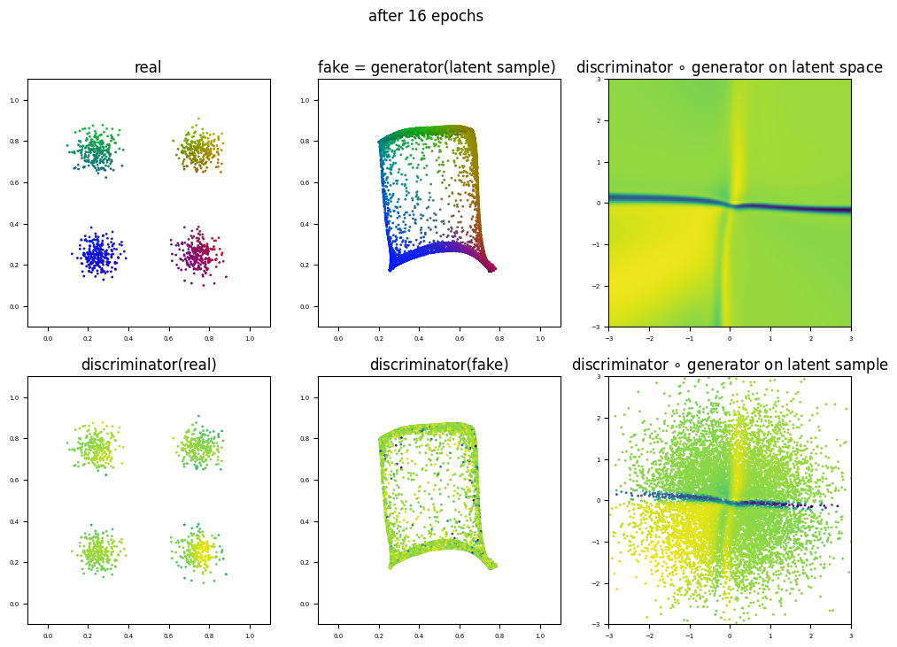


### 1\. Wasserstein GANs


In this task we will define a class `WGAN_clip` and test it on some examples. Almost all of what we need is already explained in the presentation or in task 0\. We just have to modify the losses of the generator and the discriminator, and to clip the weights of the discriminator in \[\-1,1].
 

## **The code to be filled in**

  


 Basically we keep the same structure :
 


```
import tensorflow as tf
    from tensorflow import keras
    import numpy as np
    import matplotlib.pyplot as plt
    
    class WGAN_clip(keras.Model) :
        
        def __init__( self, generator , discriminator , latent_generator, real_examples, batch_size=200, disc_iter=2, learning_rate=.005):
            super().__init__()                         # run the __init__ of keras.Model first. 
            self.latent_generator = latent_generator
            self.real_examples    = real_examples
            self.generator        = generator
            self.discriminator    = discriminator
            self.batch_size       = batch_size
            self.disc_iter        = disc_iter
            
            self.learning_rate    = learning_rate
            self.beta_1=.5                               # standard value, but can be changed if necessary
            self.beta_2=.9                               # standard value, but can be changed if necessary
            
            # define the generator loss and optimizer:
            self.generator.loss      = lambda x : pass           # <----- new !
            self.generator.optimizer = keras.optimizers.Adam(learning_rate=self.learning_rate, beta_1=self.beta_1, beta_2=self.beta_2)
            self.generator.compile(optimizer=generator.optimizer , loss=generator.loss )
            
            # define the discriminator loss and optimizer:
            self.discriminator.loss      = lambda x,y : pass   # <----- new !
            self.discriminator.optimizer = keras.optimizers.Adam(learning_rate=self.learning_rate, beta_1=self.beta_1, beta_2=self.beta_2)
            self.discriminator.compile(optimizer=discriminator.optimizer , loss=discriminator.loss )
           
        
        # generator of real samples of size batch_size
        def get_fake_sample(self, size=None, training=False):
            if not size :
                size= self.batch_size
            return self.generator(self.latent_generator(size), training=training)
    
        # generator of fake samples of size batch_size
        def get_real_sample(self, size=None):
            if not size :
                size= self.batch_size
            sorted_indices = tf.range(tf.shape(self.real_examples)[0])
            random_indices  = tf.random.shuffle(sorted_indices)[:size]
            return tf.gather(self.real_examples, random_indices)
            
                 
        # overloading train_step()    
        def train_step(self,useless_argument):
            pass
            #for _ in range(self.disc_iter) :
                
                # compute the loss for the discriminator in a tape watching the discriminator's weights
                    # get a real sample
                    # get a fake sample
                    # compute the loss discr_loss of the discriminator on real and fake samples
                # apply gradient descent once to the discriminator
                
                # clip the weights (of the discriminator) between -1 and 1    # <----- new !
    
            # compute the loss for the generator in a tape watching the generator's weights 
                # get a fake sample 
                # compute the loss gen_loss of the generator on this sample
            # apply gradient descent to the generator
            
            
            
            # return {"discr_loss": discr_loss, "gen_loss": gen_loss}
    
```

## **Your task:**

  


 It consists in filling in three holes :
 


* fill in the `generator_loss` function in the `__init__` method
* fill in the `discriminator_loss` function in the `__init__` method
* fill in the `train_step` method


## **Reminder:**

  


 In the presentation we have seen that for a Wasserstein GAN,
 


* `generator_loss(x)` is the opposite of the mean value of the image `x` of the discriminator on the
 image by the generator of a batch of latent vectors
* `discriminator_loss(x,y)` is the difference between
    + the mean value of the image `y`
     of a batch of real examples by the discriminator and
    + the mean value of the image `x` by the discriminator of the image by the generator of a batch of latent vectors
* The weights of the discriminator must be clipped in \[\-1,1].


## **Hints:**

  

* to compute the losses you should use the function [tf.math.reduce\_mean](https://www.tensorflow.org/api_docs/python/tf/math/reduce_mean)
* note that list discriminator.trainable\_variables is a list containing the weights and the biases under the form of tensors
* to clip a tensor you should use the function [tf.clip\_by\_value](https://www.tensorflow.org/api_docs/python/tf/clip_by_value)


## **Main**

  


```
$ cat 0-main.py
    
    #!/usr/bin/env python3
    
    import numpy as np
    import tensorflow as tf
    from tensorflow import keras
    import random
    import matplotlib.pyplot as plt
    
    WGAN_clip = __import__('1-wgan_clip').WGAN_clip
    
    
    ## Regulating the seed
    
    def set_seeds(seed) :
        random.seed(seed)
        np.random.seed(seed)
        tf.random.set_seed(seed)
    
    
    def hash_tensor(tensor) :
        return np.sum(np.array([hash(x)%2**30 for x in tensor.numpy().flatten()]))%2**30
    
    
    def spheric_generator(nb_points, dim) :
        u=tf.random.normal(shape=(nb_points, dim))
        return u/tf.reshape(tf.sqrt(tf.reduce_sum(tf.square(u),axis=[1])+10**-8),[nb_points,1])
    
    def normal_generator(nb_points, dim) :
        return tf.random.normal(shape=(nb_points, dim))
    
    def uniform_generator(nb_points, dim) :
        return tf.random.uniform(shape=(nb_points, dim))
    
    
    ## Building Generator and Discriminator
    
    def fully_connected_GenDiscr(gen_shape, real_examples, latent_type="normal" ) :
    
        #   Latent generator
        if latent_type   == "uniform" :
            latent_generator  =  lambda k : uniform_generator(k,gen_shape[0])
        elif latent_type == "normal" :
            latent_generator  =  lambda k : normal_generator(k,gen_shape[0])
        elif latent_type == "spheric" :
            latent_generator  =  lambda k : spheric_generator(k,gen_shape[0])
    
        #   Generator
        inputs     = keras.Input(shape=( gen_shape[0] , ))
        hidden     = keras.layers.Dense( gen_shape[1] , activation = 'tanh'    )(inputs)
        for i in range(2,len(gen_shape)-1) :
            hidden = keras.layers.Dense( gen_shape[i] , activation = 'tanh'    )(hidden)
        outputs    = keras.layers.Dense( gen_shape[-1], activation = 'sigmoid' )(hidden)
        generator  = keras.Model(inputs, outputs, name="generator")
    
        #   Discriminator
        inputs        = keras.Input(shape=( gen_shape[-1], ))
        hidden        = keras.layers.Dense( gen_shape[-2],   activation = 'tanh' )(inputs)
        for i in range(2,len(gen_shape)-1) :
            hidden    = keras.layers.Dense( gen_shape[-1*i], activation = 'tanh' )(hidden)
        outputs       = keras.layers.Dense( 1 ,              activation = 'tanh' )(hidden)
        discriminator = keras.Model(inputs, outputs, name="discriminator")
    
        return generator, discriminator, latent_generator
    
    # illustration:
    def illustr_fully_connected_GenDiscr() :
        generator, discriminator, latent_generator = fully_connected_GenDiscr([1,100,100,2], None)
        print(generator.summary())
        print(discriminator.summary())
    
    
    ## Training a fully connected GAN (Simple GAN)
    
    def example_fully_connected_GAN(chosen_type ,real_examples, gen_shape, epochs,  batch_size=200, steps_per_epoch=250, latent_type="normal", learning_rate=.005):
        generator, discriminator, latent_generator = fully_connected_GenDiscr(gen_shape, real_examples, latent_type=latent_type )
        G=chosen_type( generator , discriminator , latent_generator, real_examples, learning_rate=learning_rate)
        G.compile()
        G.fit(real_examples, epochs=epochs, steps_per_epoch=steps_per_epoch, verbose=1)
        return G
    
    
    ## An example of a large real sample
    
    def four_clouds_example(N_real):
        X   = np.random.randn( N_real)*.05
        Y   = np.random.randn( N_real)*.05
        X[:N_real//2]+=.75
        X[N_real//2:]+=.25
        Y[N_real//4:N_real//2]+=.25
        Y[:N_real//4]+=.75
        Y[N_real//2:3*N_real//4]+=.75
        Y[3*N_real//4:]+=.25
        R   = np.minimum(X*X,1)
        G   = np.minimum(Y*Y,1)
        B   = np.maximum(1-R-G,0)
        return tf.convert_to_tensor(np.vstack([X,Y,R,G,B]).T)
    
    
    ## Visualize 5D the result of G
    
    def visualize_5D(G, show=True, title=None, filename=None, dpi=200):
        fig, axes = plt.subplots(2, 3, figsize=(12, 8))
        for ax in axes.flatten():
            ax.set_xlim(-.1, 1.1)
            ax.set_ylim(-.1, 1.1)
    
        X_tf = G.real_examples
        X = X_tf.numpy()
        axes[0, 0].scatter(X[:, 0], X[:, 1], c=X[:, 2:], s=1)
        axes[0, 0].set_title("real")
    
        lat = G.latent_generator(10000)
        Y_tf = G.generator(lat)
        Y = Y_tf.numpy()
        axes[0, 1].scatter(Y[:, 0], Y[:, 1], c=Y[:, 2:], s=1)
        axes[0, 1].set_title("fake = generator(latent sample) ")
    
        cX = G.discriminator(X_tf).numpy()
        cY = G.discriminator(Y_tf).numpy()
        m = min(np.min(cX), np.min(cY))
        M = max(np.max(cX), np.max(cY))
    
        axes[1, 0].scatter(X[:, 0], X[:, 1], c=cX, s=1, vmin=m, vmax=M)
        axes[1, 0].set_title("discriminator(real)")
    
        Y = G.generator(G.latent_generator(10000)).numpy()
        axes[1, 1].scatter(Y[:, 0], Y[:, 1], c=cY, s=1, vmin=m, vmax=M)
        axes[1, 1].set_title("discriminator(fake)")
    
        for i in range(2):
            axes[i, 2].set_xlim(-3, 3)
            axes[i, 2].set_ylim(-3, 3)
    
        A = np.linspace(-3, 3, 150)
        B = np.linspace(-3, 3, 150)
        X, Y = np.meshgrid(A, B)
        U = tf.convert_to_tensor(np.vstack([X.ravel(), Y.ravel()]).T)
    
        X = G.discriminator(G.generator(U)).numpy()
        u = axes[0, 2].pcolormesh(A, B, X[:, 0].reshape([150, 150]), shading='gouraud')
    
        axes[0, 2].set_title(r"discriminator $\circ$ generator on latent space")
    
        axes[1, 2].scatter(lat.numpy()[:, 0], lat.numpy()[:, 1], c=cY, s=1)
        axes[1, 2].set_title(r"discriminator $\circ$ generator on latent sample")
        # sci = lambda x : "{:.2E}".format(.99*x*(x>0)+1.01*x*(x<0))
        # cb=fig.colorbar(u, ax=axes[1])
        ##cb.set_ticks([sci(np.min(X[:,0])), 0, sci(np.max(X[:,0]))])
        # cb.ax.tick_params(labelsize=5)
    
        # some more tuning:
        for a in axes.flatten():
            a.tick_params(axis='both', which='major', labelsize=5)
            a.tick_params(axis='both', which='minor', labelsize=5)
    
        if title:
            fig.suptitle(title)
    
        if filename:
            plt.savefig(filename, dpi=dpi)
            if show:
                plt.show()
            plt.close()
    
        elif show:
            plt.show()
    
    ## LET'S GO !
    
    set_seeds(0)
    G = example_fully_connected_GAN(WGAN_clip ,four_clouds_example(1000), [2,10,10,5], 16, steps_per_epoch=100, learning_rate=.001)
    visualize_5D(G,show=True, title=f"after 16 epochs")
    
    
    $ ./0-main.py
    
```

should produce the following picture:


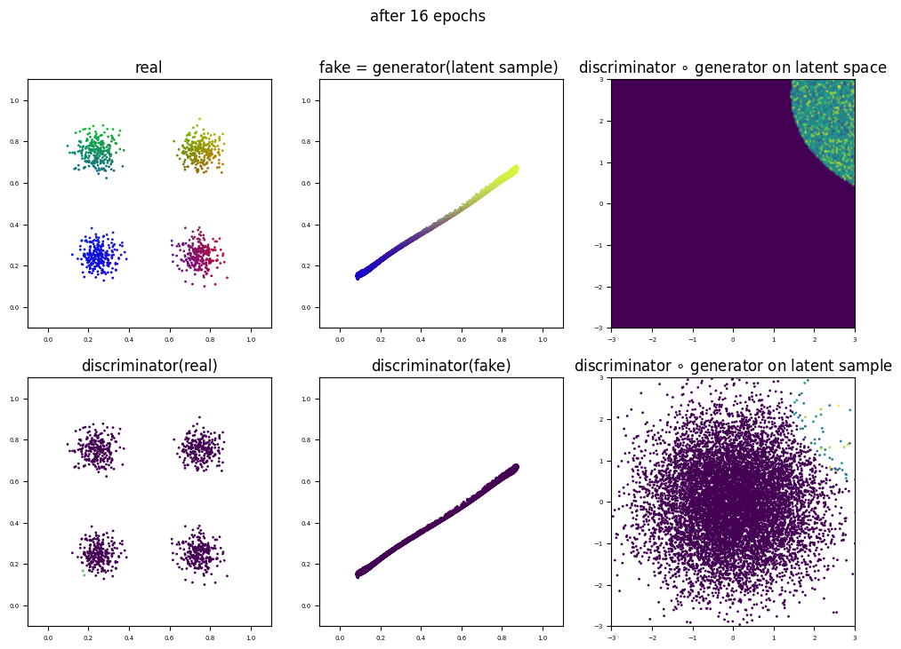


### 2\. Wasserstein GANs with gradient penalty


In this task we will define a class `WGAN_GP` and test it on some examples. Almost all of what we need is already explained in the presentation or in tasks 0 and 1\. We just have to modify the loss of the discriminator, and forget about clipping.


## **The code to be filled in**

  


  
 So we keep the same structure :


```
class WGAN_GP(keras.Model) :    
        def __init__( self, generator , discriminator , latent_generator, real_examples, batch_size=200, disc_iter=2, learning_rate=.005,lambda_gp=10):
            super().__init__()                         # run the __init__ of keras.Model first. 
            self.latent_generator = latent_generator
            self.real_examples    = real_examples
            self.generator        = generator
            self.discriminator    = discriminator
            self.batch_size       = batch_size
            self.disc_iter        = disc_iter
            
            self.learning_rate    = learning_rate
            self.beta_1=.3                              # standard value, but can be changed if necessary
            self.beta_2=.9                              # standard value, but can be changed if necessary
            
            self.lambda_gp        = lambda_gp                                # <---- New !
            self.dims = self.real_examples.shape                             # <---- New !
            self.len_dims=tf.size(self.dims)                                 # <---- New !
            self.axis = tf.range(1, self.len_dims, delta=1, dtype='int32')   # <---- New !
            self.scal_shape=self.dims.as_list()                              # <---- New !
            self.scal_shape[0]=self.batch_size                               # <---- New !
            for i in range(1,self.len_dims):                                 # <---- New !
                self.scal_shape[i]=1                                         # <---- New !
            self.scal_shape=tf.convert_to_tensor(self.scal_shape)            # <---- New !
            
            # define the generator loss and optimizer:
            self.generator.loss  = lambda x : pass                                  # <---- to be filled in                 
            self.generator.optimizer = keras.optimizers.Adam(learning_rate=self.learning_rate, beta_1=self.beta_1, beta_2=self.beta_2)
            self.generator.compile(optimizer=generator.optimizer , loss=generator.loss )
            
            # define the discriminator loss and optimizer:
            self.discriminator.loss      = lambda x , y :pass                         # <---- to be filled in  
            self.discriminator.optimizer = keras.optimizers.Adam(learning_rate=self.learning_rate, beta_1=self.beta_1, beta_2=self.beta_2)
            self.discriminator.compile(optimizer=discriminator.optimizer , loss=discriminator.loss )
    
        # generator of real samples of size batch_size
        def get_fake_sample(self, size=None, training=False):
            if not size :
                size= self.batch_size
            return self.generator(self.latent_generator(size), training=training)
    
        # generator of fake samples of size batch_size
        def get_real_sample(self, size=None):
            if not size :
                size= self.batch_size
            sorted_indices = tf.range(tf.shape(self.real_examples)[0])
            random_indices  = tf.random.shuffle(sorted_indices)[:size]
            return tf.gather(self.real_examples, random_indices)
        
        # generator of interpolating samples of size batch_size              # <---- New !
        def get_interpolated_sample(self,real_sample,fake_sample):
            u = tf.random.uniform(self.scal_shape)
            v=tf.ones(self.scal_shape)-u
            return u*real_sample+v*fake_sample
        
        # computing the gradient penalty                                     # <---- New !
        def gradient_penalty(self,interpolated_sample):
            with tf.GradientTape() as gp_tape:
                    gp_tape.watch(interpolated_sample)
                    pred = self.discriminator(interpolated_sample, training=True)
            grads = gp_tape.gradient(pred, [interpolated_sample])[0]
            norm = tf.sqrt(tf.reduce_sum(tf.square(grads), axis=self.axis))
            return tf.reduce_mean((norm - 1.0) ** 2)      
         
             # overloading train_step()    
        def train_step(self,useless_argument):
            pass
            #for _ in range(self.disc_iter) :
                
                # compute the penalized loss for the discriminator in a tape watching the discriminator's weights
                
                    # get a real sample
                    # get a fake sample
                    # get the interpolated sample (between real and fake computed above)
                                    
                    # compute the old loss discr_loss of the discriminator on real and fake samples        
                    # compute the gradient penalty gp
                    # compute the sum new_discr_loss = discr_loss + self.lambda_gp * gp                     
                                    
                # apply gradient descent with respect to new_discr_loss once to the discriminator 
    
            # compute the loss for the generator in a tape watching the generator's weights 
            
                # get a fake sample 
                # compute the loss gen_loss of the generator on this sample
                
            # apply gradient descent to the discriminator (gp is the gradient penalty)
            
            # return {"discr_loss": discr_loss, "gen_loss": gen_loss, "gp":gp}        
    
```

## **Your task:**

  


 It consists in filling in three holes :
 


* fill in the `generator_loss` function in the `__init__` method
* fill in the `discriminator_loss` function in the `__init__` method
* fill in the `train_step` method


The two losses are the same as in the `WGAN_clip` class, and in the training, you just have to add the gradient penalty to the generator loss (inside the tape) as indicated in the commented pseudo code.


## **Main 1**

  


```
$ cat 0-main_20.py
    
    #!/usr/bin/env python3
    
    import numpy as np
    import tensorflow as tf
    from tensorflow import keras
    import random
    import matplotlib.pyplot as plt
    
    WGAN_GP = __import__('2-wgan_gp').WGAN_GP
    
    ## Regulating the seed
    
    def set_seeds(seed) :
        random.seed(seed)
        np.random.seed(seed)
        tf.random.set_seed(seed)
    
    def spheric_generator(nb_points, dim) :
        u=tf.random.normal(shape=(nb_points, dim))
        return u/tf.reshape(tf.sqrt(tf.reduce_sum(tf.square(u),axis=[1])+10**-8),[nb_points,1])
    
    def normal_generator(nb_points, dim) :
        return tf.random.normal(shape=(nb_points, dim))
    
    def uniform_generator(nb_points, dim) :
        return tf.random.uniform(shape=(nb_points, dim))
    
    
    ## Building Generator and Discriminator
    
    def fully_connected_GenDiscr(gen_shape, real_examples, latent_type="normal" ) :
    
        #   Latent generator
        if latent_type   == "uniform" :
            latent_generator  =  lambda k : uniform_generator(k,gen_shape[0])
        elif latent_type == "normal" :
            latent_generator  =  lambda k : normal_generator(k,gen_shape[0])
        elif latent_type == "spheric" :
            latent_generator  =  lambda k : spheric_generator(k,gen_shape[0])
    
        #   Generator
        inputs     = keras.Input(shape=( gen_shape[0] , ))
        hidden     = keras.layers.Dense( gen_shape[1] , activation = 'tanh'    )(inputs)
        for i in range(2,len(gen_shape)-1) :
            hidden = keras.layers.Dense( gen_shape[i] , activation = 'tanh'    )(hidden)
        outputs    = keras.layers.Dense( gen_shape[-1], activation = 'sigmoid' )(hidden)
        generator  = keras.Model(inputs, outputs, name="generator")
    
        #   Discriminator
        inputs        = keras.Input(shape=( gen_shape[-1], ))
        hidden        = keras.layers.Dense( gen_shape[-2],   activation = 'tanh' )(inputs)
        for i in range(2,len(gen_shape)-1) :
            hidden    = keras.layers.Dense( gen_shape[-1*i], activation = 'tanh' )(hidden)
        outputs       = keras.layers.Dense( 1 ,              activation = 'tanh' )(hidden)
        discriminator = keras.Model(inputs, outputs, name="discriminator")
    
        return generator, discriminator, latent_generator
    
    # illustration:
    def illustr_fully_connected_GenDiscr() :
        generator, discriminator, latent_generator = fully_connected_GenDiscr([1,100,100,2], None)
        print(generator.summary())
        print(discriminator.summary())
    
    
    ## Training a fully connected GAN (Simple GAN)
    
    def example_fully_connected_GAN(chosen_type ,real_examples, gen_shape, epochs,  batch_size=200, steps_per_epoch=250, latent_type="normal", learning_rate=.005):
        generator, discriminator, latent_generator = fully_connected_GenDiscr(gen_shape, real_examples, latent_type=latent_type )
        G=chosen_type( generator , discriminator , latent_generator, real_examples, learning_rate=learning_rate)
        G.compile()
        G.fit(real_examples, epochs=epochs, steps_per_epoch=steps_per_epoch, verbose=1)
        return G
    
    
    ## An example of a large real sample
    
    def four_clouds_example(N_real):
        X   = np.random.randn( N_real)*.05
        Y   = np.random.randn( N_real)*.05
        X[:N_real//2]+=.75
        X[N_real//2:]+=.25
        Y[N_real//4:N_real//2]+=.25
        Y[:N_real//4]+=.75
        Y[N_real//2:3*N_real//4]+=.75
        Y[3*N_real//4:]+=.25
        R   = np.minimum(X*X,1)
        G   = np.minimum(Y*Y,1)
        B   = np.maximum(1-R-G,0)
        return tf.convert_to_tensor(np.vstack([X,Y,R,G,B]).T,dtype="float32")
    
    
    ## Visualize 5D the result of G
    
    def visualize_5D(G, show=True, title=None, filename=None, dpi=200):
        fig, axes = plt.subplots(2, 3, figsize=(12, 8))
        for ax in axes.flatten():
            ax.set_xlim(-.1, 1.1)
            ax.set_ylim(-.1, 1.1)
    
        X_tf = G.real_examples
        X = X_tf.numpy()
        axes[0, 0].scatter(X[:, 0], X[:, 1], c=X[:, 2:], s=1)
        axes[0, 0].set_title("real")
    
        lat = G.latent_generator(10000)
        Y_tf = G.generator(lat)
        Y = Y_tf.numpy()
        axes[0, 1].scatter(Y[:, 0], Y[:, 1], c=Y[:, 2:], s=1)
        axes[0, 1].set_title("fake = generator(latent sample) ")
    
        cX = G.discriminator(X_tf).numpy()
        cY = G.discriminator(Y_tf).numpy()
        m = min(np.min(cX), np.min(cY))
        M = max(np.max(cX), np.max(cY))
    
        axes[1, 0].scatter(X[:, 0], X[:, 1], c=cX, s=1, vmin=m, vmax=M)
        axes[1, 0].set_title("discriminator(real)")
    
        Y = G.generator(G.latent_generator(10000)).numpy()
        axes[1, 1].scatter(Y[:, 0], Y[:, 1], c=cY, s=1, vmin=m, vmax=M)
        axes[1, 1].set_title("discriminator(fake)")
    
        for i in range(2):
            axes[i, 2].set_xlim(-3, 3)
            axes[i, 2].set_ylim(-3, 3)
    
        A = np.linspace(-3, 3, 150)
        B = np.linspace(-3, 3, 150)
        X, Y = np.meshgrid(A, B)
        U = tf.convert_to_tensor(np.vstack([X.ravel(), Y.ravel()]).T)
    
        X = G.discriminator(G.generator(U)).numpy()
        u = axes[0, 2].pcolormesh(A, B, X[:, 0].reshape([150, 150]), shading='gouraud')
    
        axes[0, 2].set_title(r"discriminator $\circ$ generator on latent space")
    
        axes[1, 2].scatter(lat.numpy()[:, 0], lat.numpy()[:, 1], c=cY, s=1)
        axes[1, 2].set_title(r"discriminator $\circ$ generator on latent sample")
        # sci = lambda x : "{:.2E}".format(.99*x*(x>0)+1.01*x*(x<0))
        # cb=fig.colorbar(u, ax=axes[1])
        ##cb.set_ticks([sci(np.min(X[:,0])), 0, sci(np.max(X[:,0]))])
        # cb.ax.tick_params(labelsize=5)
    
        # some more tuning:
        for a in axes.flatten():
            a.tick_params(axis='both', which='major', labelsize=5)
            a.tick_params(axis='both', which='minor', labelsize=5)
    
        if title:
            fig.suptitle(title)
    
        if filename:
            plt.savefig(filename, dpi=dpi)
            if show:
                plt.show()
            plt.close()
    
        elif show:
            plt.show()
    
    ## LET'S GO !
    
    set_seeds(0)
    G = example_fully_connected_GAN(WGAN_GP ,four_clouds_example(1000), [2,10,10,5], 16, steps_per_epoch=100, learning_rate=.001)
    visualize_5D(G,show=True, title=f"after 16 epochs")
    
    $ ./0-main_20.py
    
```

should produce the following picture:


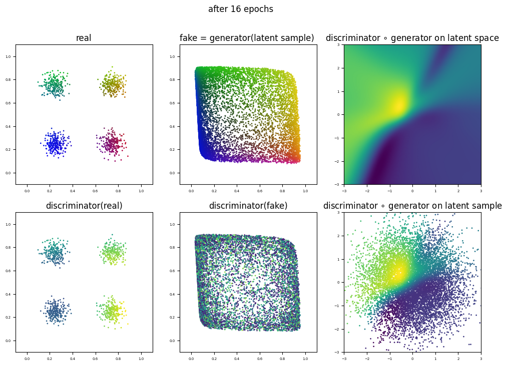


## **Main 2 : an example where WGAN\_GP outperforms both Simple\_GAN and WGAN\_clip**

  


 Most often in small dimensions, `Simple_GAN` models will outperform both `WGAN_clip` and `WGAN_gp` models.  
  
 In high dimensions, both `Simple_GAN` models and `WGAN_clip` models tend to have vanishing gradient issues, while `WGAN_GP` models oscillate slightly around an acceptable distribution. 
   
   

 Here we provide an example where this phenomenon is easy to interpret despite the lack of visualization.
 
   
  

 First we define a function furnishing a gaussian cloud sitting in a corner of \[0,1]N :
 


```
def cloud_in_the_corner_numpy(N,sigma,S) :
        arr=np.random.randn(S*N).reshape(S,N)
        return arr*sigma+.8
    
    def cloud_in_the_corner(C,sigma,S) :
        return tf.convert_to_tensor(cloud_in_the_corner_numpy(C,sigma,S),dtype="float32")
    
```


 This cloud is centered at C\=(.8,.8,…,.8). Each coordinate of the points of the cloud is of the form .8\+σ×ε where ε is chosen as a sample of a standard normal random variable.


 It follows that the expectation of norm2(X−C) for X in the cloud is Nσ2. 


 Let us check on an example :
 


```
def mean_squared_dist_cloud_to_center(cloud) :
        return np.mean((np.sum(np.square(cloud-.8),axis=1)))
    
    def expected_mean_squared_dist_cloud_to_center(N,sigma,S):
        return sigma*sigma*N
    
    def verif_mean_squared_dist_cloud_to_center(N,sigma,S) :
        mean_squared_dists=[]
        for i in range(10000) :
            cloud=cloud_in_the_corner_numpy(N,sigma,S)
            mean_squared_dists.append(mean_squared_dist_cloud_to_center(cloud))
        print(f"""Among 10000 clouds of {S} points, the distribution of the mean squared distance 
              from the points of the cloud to the center has the following shape :""")
        a=plt.hist(mean_squared_dists,bins=50,density=True)
        expected = expected_mean_squared_dist_cloud_to_center(N,sigma,S)
        plt.plot([expected,expected],[0,np.max(a[0])])
        plt.text(expected, np.max(a[0])*1.1, r'$N\sigma^2$', dict(size=10))
        plt.ylim(0,np.max(a[0])*1.2)
        plt.show()
            
    np.random.seed(0)  
    verif_mean_squared_dist_cloud_to_center(10,.1,100)
    
```

returns:


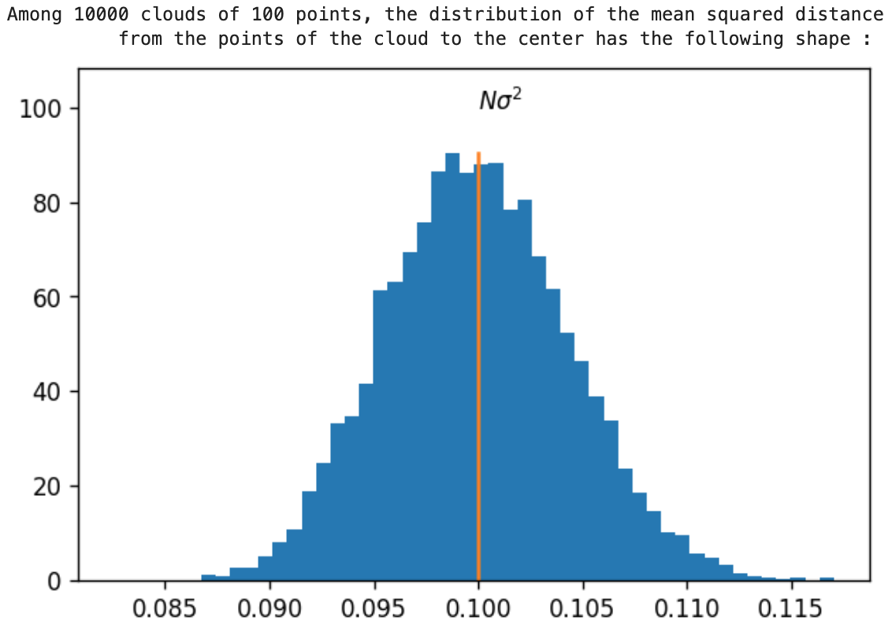


As another indicator, we can compute the distance from the barycenter B of a sample to C. 


 For a sample of the cloud of size S, we know that each coordinate of 1SB−C will be a centered normal random variable of variance σ2S, so the expectation of the sum of the squares of the coordinates of 1SB−C is Nσ2S.
   
  

 Let us check on an example :


```
def squared_dist_barycenter_to_center(cloud) :
        S=cloud.shape[0]
        N=cloud.shape[1]
        barycenter = 1/S*np.sum(cloud,axis=0)
        diff= barycenter - .8
        return np.sum(np.square(diff))
    
    def expected_squared_dist_barycenter_to_center(N,sigma,S) :
        return sigma*sigma*N/S
    
    def verif_squared_dist_barycenter_to_center(N,sigma,S) :
        squared_dists=[]
        for i in range(10000) :
            cloud=cloud_in_the_corner_numpy(N,sigma,S)
            squared_dists.append(squared_dist_barycenter_to_center(cloud))
        print(f"""Among 10000 clouds of {S} points, the distribution of the squared distance 
              from the barycenter of the cloud to the center has the following shape :""")
        a=plt.hist(squared_dists,bins=50,density=True)
        expected = expected_squared_dist_barycenter_to_center(N,sigma,S)
        plt.plot([expected,expected],[0,np.max(a[0])])
        plt.text(expected, np.max(a[0])*1.1, r'$\frac{N\sigma^2}{S}$', dict(size=10))
        plt.ylim(0,np.max(a[0])*1.2)
        plt.show()
    
    np.random.seed(0) 
    verif_squared_dist_barycenter_to_center(10,.1,100) 
    
```

returns


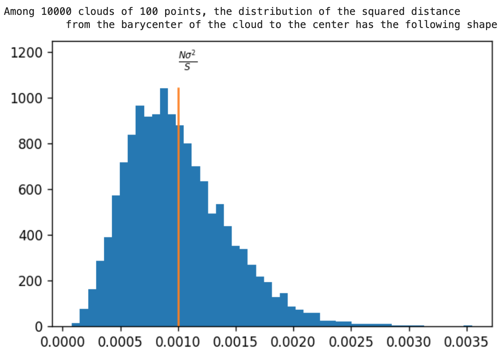


Armed with these indicators, we are now in a position to judge the quality of a generator whose job would be to approximate such a cloud:   
 copy and paste this main and see the result


```
 $ cat 0-main_21.py
    
    #!/usr/bin/env python3
    
    import tensorflow as tf
    from tensorflow import keras
    import numpy as np
    import matplotlib.pyplot as plt
    import random
    
    Simple_GAN = __import__('0-simple_gan').Simple_GAN
    WGAN_clip = __import__('1-wgan_clip').WGAN_clip
    WGAN_GP = __import__('2-wgan_gp').WGAN_GP
    
    N=49
    sigma=.05
    shape=[N, 2*N , 2*N , N]
    lr=.00003
    S=500
    
    ## Regulating the seed
    
    def set_seeds(seed) :
        random.seed(seed)
        np.random.seed(seed)
        tf.random.set_seed(seed)
    
    def spheric_generator(nb_points, dim) :
        u=tf.random.normal(shape=(nb_points, dim))
        return u/tf.reshape(tf.sqrt(tf.reduce_sum(tf.square(u),axis=[1])+10**-8),[nb_points,1])
    
    def normal_generator(nb_points, dim) :
        return tf.random.normal(shape=(nb_points, dim))
    
    def uniform_generator(nb_points, dim) :
        return tf.random.uniform(shape=(nb_points, dim))
    
    
    ## Code taken from above examples
    def cloud_in_the_corner_numpy(N,sigma,S) :
        arr=np.random.randn(S*N).reshape(S,N)
        return arr*sigma+.8
    
    def cloud_in_the_corner(C,sigma,S) :
        return tf.convert_to_tensor(cloud_in_the_corner_numpy(C,sigma,S),dtype="float32")
    
    def mean_squared_dist_cloud_to_center(cloud) :
        return np.mean((np.sum(np.square(cloud-.8),axis=1)))
    
    def expected_mean_squared_dist_cloud_to_center(N,sigma,S):
        return sigma*sigma*N
    def squared_dist_barycenter_to_center(cloud) :
        S=cloud.shape[0]
        N=cloud.shape[1]
        barycenter = 1/S*np.sum(cloud,axis=0)
        diff= barycenter - .8
        return np.sum(np.square(diff))
    def expected_squared_dist_barycenter_to_center(N,sigma,S) :
        return sigma*sigma*N/S
    
    def verif_squared_dist_barycenter_to_center(N,sigma,S) :
        squared_dists=[]
        for i in range(10000) :
            cloud=cloud_in_the_corner_numpy(N,sigma,S)
            squared_dists.append(squared_dist_barycenter_to_center(cloud))
        print(f"""Among 10000 clouds of {S} points, the distribution of the squared distance 
              from the barycenter of the cloud to the center has the following shape :""")
        a=plt.hist(squared_dists,bins=50,density=True)
        expected = expected_squared_dist_barycenter_to_center(N,sigma,S)
        plt.plot([expected,expected],[0,np.max(a[0])])
        plt.text(expected, np.max(a[0])*1.1, r'$\frac{N\sigma^2}{S}$', dict(size=10))
        plt.ylim(0,np.max(a[0])*1.2)
        plt.show()
    
    ## Building Generator and Discriminator
    
    def fully_connected_GenDiscr(gen_shape, real_examples, latent_type="normal" ) :
    
        #   Latent generator
        if latent_type   == "uniform" :
            latent_generator  =  lambda k : uniform_generator(k,gen_shape[0])
        elif latent_type == "normal" :
            latent_generator  =  lambda k : normal_generator(k,gen_shape[0])
        elif latent_type == "spheric" :
            latent_generator  =  lambda k : spheric_generator(k,gen_shape[0])
    
        #   Generator
        inputs     = keras.Input(shape=( gen_shape[0] , ))
        hidden     = keras.layers.Dense( gen_shape[1] , activation = 'tanh'    )(inputs)
        for i in range(2,len(gen_shape)-1) :
            hidden = keras.layers.Dense( gen_shape[i] , activation = 'tanh'    )(hidden)
        outputs    = keras.layers.Dense( gen_shape[-1], activation = 'sigmoid' )(hidden)
        generator  = keras.Model(inputs, outputs, name="generator")
    
        #   Discriminator
        inputs        = keras.Input(shape=( gen_shape[-1], ))
        hidden        = keras.layers.Dense( gen_shape[-2],   activation = 'tanh' )(inputs)
        for i in range(2,len(gen_shape)-1) :
            hidden    = keras.layers.Dense( gen_shape[-1*i], activation = 'tanh' )(hidden)
        outputs       = keras.layers.Dense( 1 ,              activation = 'tanh' )(hidden)
        discriminator = keras.Model(inputs, outputs, name="discriminator")
    
        return generator, discriminator, latent_generator
    
    # illustration:
    def illustr_fully_connected_GenDiscr() :
        generator, discriminator, latent_generator = fully_connected_GenDiscr([1,100,100,2], None)
        print(generator.summary())
        print(discriminator.summary())
    
    
    ## Training a fully connected GAN (Simple GAN)
    
    def example_fully_connected_GAN(chosen_type ,real_examples, gen_shape, epochs,  batch_size=200, steps_per_epoch=250, latent_type="normal", learning_rate=.005):
        generator, discriminator, latent_generator = fully_connected_GenDiscr(gen_shape, real_examples, latent_type=latent_type )
        G=chosen_type( generator , discriminator , latent_generator, real_examples, learning_rate=learning_rate)
        G.compile()
        G.fit(real_examples, epochs=epochs, steps_per_epoch=steps_per_epoch, verbose=1)
        return G
    
    
    ## An example of a large real sample
    
    real=cloud_in_the_corner(N,sigma,10000)
    
    
    ## LET'S GO !
    
    set_seeds(0)
    Gs=[example_fully_connected_GAN(chosen_type, real, shape, 100, learning_rate=lr) for chosen_type in [Simple_GAN, WGAN_clip, WGAN_GP]]
    
    ## Plotting
    fig,axes = plt.subplots(1,3,figsize=(12,3))
    names=["Simple_GAN","WGAN_clip","WGAN_GP"]
    from math import sqrt
    for G,i,name in zip(Gs, range(3),names) :
        axes[i].plot(G.history.history["discr_loss"])
        axes[i].plot(G.history.history["gen_loss"])
        axes[i].set_title(name)
        cloud=G.get_fake_sample(S).numpy()
        fmsdcc = mean_squared_dist_cloud_to_center(cloud)
        fdbc   = squared_dist_barycenter_to_center(cloud)
        expected_msdcc = expected_mean_squared_dist_cloud_to_center(N,sigma,S)
        expected_dbc = expected_squared_dist_barycenter_to_center(N,sigma,S)
        axes[i].set_xlabel("msdcc : {:.4f} , dbc : {:.4f}".format(fmsdcc,fdbc))
    fig.suptitle("expected msdcc : {:.4f} , expected dbc : {:.4f}".format( expected_msdcc , expected_dbc ))
    plt.tight_layout()
    plt.savefig("tests.png")
    plt.show()
     $ ./0-main_21.py
    
```

results in


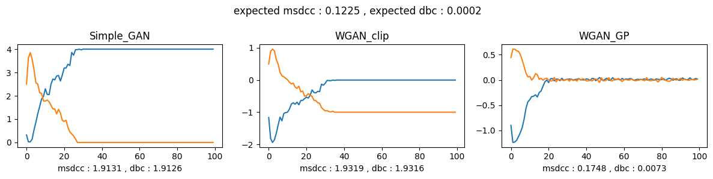


 The indicators `mean_squared_dist_cloud_to_center` and `squared_distance_barycenter_to_center` are recorded under the pictures. 
 We clearly see that the `WGAN_GP` model is the one whose generator does the best job. 
   

  

**NOTE:** It’s important to note that there may be variation in the  **msdcc**  and **dbc** values between individual experiments. However, a common observation is that WGAN\_GP tends to outperform WGAN\_Clip, and WGAN\_Clip tends to outperform Simple\_GAN, though the exact numerical values can differ between your results and the one shown in this task.
 
   
  

 Since the vectors of the objective space are 49\-dimensional with coordinates in \[0,1], we can wiew each of them as a small (7,7\)\-picture. Here are the pictures corresponding to each of the 100 vectors of


* a real sample
* a sample generated by each of our models.


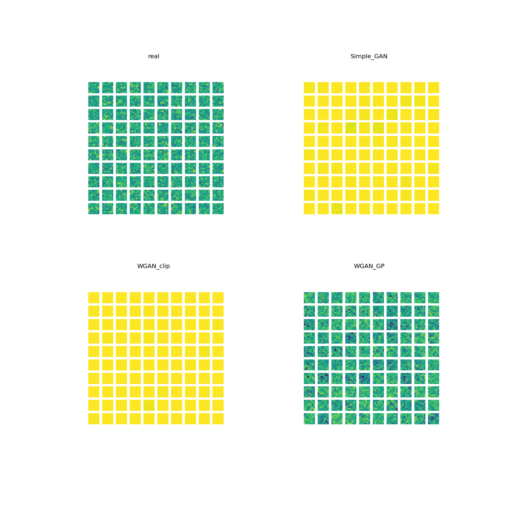


We note that the `Simple_GAN` and `WGAN_clip` models have a very small variability in their production, while the `WGAN_GP` model furnishes pictures that are quite close from the ones coming from the real sample.


In conclusion we are now convinced that in higher dimensions the `WGAN_GP` model can outperform both of the `Simple_GAN` and `WGAN_clip` models.


### 3\. Generating faces

Here we will convince ourselves that gans can be trained into generators of faces. In order to do so, we first need a large enough sample of real faces.


## **Real faces**

  

 A sample of 10000 pictures of real faces is available in the file [small\_res\_faces\_10000\.npy](./data/small_res_faces_10000.npy). Each of these is a greyscale 16x16 picture, encoded as a (16,16\)\-array of bytes (`np.int8`)


```
# load the pictures
    import matplotlib.pyplot as plt 
    array_of_pictures=np.load("faces/small_res_faces_10000.npy")
    array_of_pictures=array_of_pictures.astype("float32")/255
    
    fig,axes=plt.subplots(10,10,figsize=(10,10))
    fig.suptitle("real faces")
    for i in range(100) :
        axes[i//10,i%10].imshow(array_of_pictures[i,:,:])
        axes[i//10,i%10].axis("off")
    plt.show()
    
```

 produces:


[](./data/3b84cl.png)


Let us have a look at the mean face :


```
mean_face=array_of_pictures.mean(axis=0)
    plt.imshow(mean_face)
    
```


[](./data/bf3os1.png)


In order to center our dataset, we substract the mean face to all our faces:
 


```
centered_array = array_of_pictures - mean_face
```

and normalize it to have all of the coefficients spread over \[\-1,1] :


```
multiplier=np.max(np.abs(array_of_pictures),axis=0)
    normalized_array = centered_array/multiplier
```

 So in order to recover an image from this normalized array, we can use the following function :


```
def recover(normalized) :
        return normalized*multiplier+mean_face
    
```

This normalized array contains 10000 arrays of shape (16,16\) with coefficients in \[\-1,1]. It will be our set of real examples, the one with which we will train our GAN. Let us have a look at the distribution of the values, pixel by pixel :


[](./data/kcs4m7.jpg)


(You can zoom in the picture to have a better view of each distribution).
 


## **Task : Build a Generator and a Discriminator**


Write a function  `def convolutional_GenDiscr()`  just like the function  `fully_connected_GenDiscr()` of task 0 that builds a generator and discriminator as described here under :
   


* For the generator, the input data will have shape (16\)
* For the discriminator, the input data will have shape (16,16,1\)
* Use a hyperbolic tangent activation function “tanh” (even in Dense layers)
* In every Conv2D, the padding\=“same”
* Returns: the concatenated output of the generator and discriminator


  


 Copy this code and fill in the method  `def convolutional_GenDiscr()`  


```
def convolutional_GenDiscr() :
    
    
        def generator() :
            #generator model
    
    
    
        def get_discriminator():
            #discriminator model
            
    
        return get_generator() , get_discriminator()
    
    
```


 `def convolutional_GenDiscr()`  returns two Keras models  `gen`  and `discr`


```
gen, discr = convolutional_GenDiscr( ) 
    print( gen.summary(line_length = 100)   )
    print( discr.summary(line_length = 100) )
    
```


result in 


```
Model: "generator"
    ____________________________________________________________________________________________________
    Layer (type)                                 Output Shape                            Param #        
    ====================================================================================================
    input_1 (InputLayer)                         [(None, 16)]                            0              
    ____________________________________________________________________________________________________
    dense (Dense)                                (None, 2048)                            34816          
    ____________________________________________________________________________________________________
    reshape (Reshape)                            (None, 2, 2, 512)                       0              
    ____________________________________________________________________________________________________
    up_sampling2d (UpSampling2D)                 (None, 4, 4, 512)                       0              
    ____________________________________________________________________________________________________
    conv2d (Conv2D)                              (None, 4, 4, 64)                        294976         
    ____________________________________________________________________________________________________
    batch_normalization (BatchNormalization)     (None, 4, 4, 64)                        256            
    ____________________________________________________________________________________________________
    activation_1 (Activation)                    (None, 4, 4, 64)                        0              
    ____________________________________________________________________________________________________
    up_sampling2d_1 (UpSampling2D)               (None, 8, 8, 64)                        0              
    ____________________________________________________________________________________________________
    conv2d_1 (Conv2D)                            (None, 8, 8, 16)                        9232           
    ____________________________________________________________________________________________________
    batch_normalization_1 (BatchNormalization)   (None, 8, 8, 16)                        64             
    ____________________________________________________________________________________________________
    activation_2 (Activation)                    (None, 8, 8, 16)                        0              
    ____________________________________________________________________________________________________
    up_sampling2d_2 (UpSampling2D)               (None, 16, 16, 16)                      0              
    ____________________________________________________________________________________________________
    conv2d_2 (Conv2D)                            (None, 16, 16, 1)                       145            
    ____________________________________________________________________________________________________
    batch_normalization_2 (BatchNormalization)   (None, 16, 16, 1)                       4              
    ____________________________________________________________________________________________________
    activation_3 (Activation)                    (None, 16, 16, 1)                       0              
    ====================================================================================================
    Total params: 339,493
    Trainable params: 339,331
    Non-trainable params: 162
    ____________________________________________________________________________________________________
    None
    Model: "discriminator"
    ____________________________________________________________________________________________________
    Layer (type)                                 Output Shape                            Param #        
    ====================================================================================================
    input_2 (InputLayer)                         [(None, 16, 16, 1)]                     0              
    ____________________________________________________________________________________________________
    conv2d_3 (Conv2D)                            (None, 16, 16, 32)                      320            
    ____________________________________________________________________________________________________
    max_pooling2d (MaxPooling2D)                 (None, 8, 8, 32)                        0              
    ____________________________________________________________________________________________________
    activation_4 (Activation)                    (None, 8, 8, 32)                        0              
    ____________________________________________________________________________________________________
    conv2d_4 (Conv2D)                            (None, 8, 8, 64)                        18496          
    ____________________________________________________________________________________________________
    max_pooling2d_1 (MaxPooling2D)               (None, 4, 4, 64)                        0              
    ____________________________________________________________________________________________________
    activation_5 (Activation)                    (None, 4, 4, 64)                        0              
    ____________________________________________________________________________________________________
    conv2d_5 (Conv2D)                            (None, 4, 4, 128)                       73856          
    ____________________________________________________________________________________________________
    max_pooling2d_2 (MaxPooling2D)               (None, 2, 2, 128)                       0              
    ____________________________________________________________________________________________________
    activation_6 (Activation)                    (None, 2, 2, 128)                       0              
    ____________________________________________________________________________________________________
    conv2d_6 (Conv2D)                            (None, 2, 2, 256)                       295168         
    ____________________________________________________________________________________________________
    max_pooling2d_3 (MaxPooling2D)               (None, 1, 1, 256)                       0              
    ____________________________________________________________________________________________________
    activation_7 (Activation)                    (None, 1, 1, 256)                       0              
    ____________________________________________________________________________________________________
    flatten (Flatten)                            (None, 256)                             0              
    ____________________________________________________________________________________________________
    dense_1 (Dense)                              (None, 1)                               257            
    ====================================================================================================
    Total params: 388,097
    Trainable params: 388,097
    Non-trainable params: 0
    ____________________________________________________________________________________________________
    None
    
```

## **Main**


Let ‘s check your work. Copy this main and see the results.


```
$ cat 0-main.py
    #!/usr/bin/env python3
    
    import numpy as np
    import tensorflow as tf
    import matplotlib.pyplot as plt
    import matplotlib.gridspec as gridspec
    import random
    
    convolutional_GenDiscr = __import__('3-generate_faces').convolutional_GenDiscr
    Simple_GAN = __import__('0-simple_gan').Simple_GAN
    
    ## Regulating the seed
    
    def set_seeds(seed) :
        random.seed(seed)
        np.random.seed(seed)
        tf.random.set_seed(seed)
    
    def spheric_generator(nb_points, dim) :
        u=tf.random.normal(shape=(nb_points, dim))
        return u/tf.reshape(tf.sqrt(tf.reduce_sum(tf.square(u),axis=[1])+10**-8),[nb_points,1])
    
    ## Load the pictures from small_res_faces_10000
    
    array_of_pictures=np.load("small_res_faces_10000.npy")
    array_of_pictures=array_of_pictures.astype("float32")/255
    
    ## Center and Normalize the data
    
    mean_face=array_of_pictures.mean(axis=0)
    centered_array = array_of_pictures - mean_face
    multiplier=np.max(np.abs(array_of_pictures),axis=0)
    normalized_array = centered_array/multiplier
    
    ## An example of a large real sample
    
    lat_gen = lambda k : spheric_generator(k, 16)*.3+.5
    real_ex = tf.convert_to_tensor(normalized_array,dtype="float32")
    
    ## Visualize the faces
    
    def recover(normalized) :
        return normalized*multiplier+mean_face
    
    def visualize_faces(G, lat_vecs, show_history=True):
        fig = plt.figure(figsize=(20, 4))
        wax = 4
        gs = gridspec.GridSpec(wax * 2, wax * 10)
        axes1 = [fig.add_subplot(gs[:wax - 1, i * wax:(i + 1) * wax - 1]) for i in range(10)]
        axes2 = [fig.add_subplot(gs[wax:, 0:3 * wax]), fig.add_subplot(gs[wax:, 3 * wax + 1:6 * wax + 1]),
                 fig.add_subplot(gs[wax:, 6 * wax + 2:9 * wax + 3])]
    
        generated_images = recover(G.generator(lat_vecs))
    
        for i in range(10):
            axes1[i].axis("off")
            axes1[i].imshow(generated_images[i, :, :, 0])
    
        b = G.discriminator(G.get_fake_sample(400)).numpy()
        a = G.discriminator(G.get_real_sample(400)).numpy()
        axes2[0].hist(a, bins=20)
        axes2[0].set_title("values of disc on real")
        axes2[1].hist(b, bins=20)
        axes2[1].set_title("values of disc on fake")
        if show_history:
            axes2[2].plot(G.history.history["discr_loss"])
            axes2[2].plot(G.history.history["gen_loss"])
            axes2[2].set_title("losses")
    
        plt.show()
    
    ## LET'S GO !
    
    # Train
    set_seeds(0)
    gen, discr = convolutional_GenDiscr()
    G=Simple_GAN(gen,discr, lat_gen, real_ex, disc_iter=1, batch_size=10,learning_rate=.001)
    G.compile()
    G.fit(real_ex,epochs=5,steps_per_epoch=5)
    
    # Visualize
    lat_vecs = lat_gen(10)
    visualize_faces(G,lat_vecs)
    
    $ ./0-main_01.py
    
    
```

produces:


```
Epoch 1/5
    5/5 [==============================] - 7s 62ms/step - discr_loss: 1.5087 - gen_loss: 3.1936
    Epoch 2/5
    5/5 [==============================] - 0s 67ms/step - discr_loss: 0.8711 - gen_loss: 3.7550
    Epoch 3/5
    5/5 [==============================] - 0s 61ms/step - discr_loss: 0.4360 - gen_loss: 3.7666
    Epoch 4/5
    5/5 [==============================] - 0s 66ms/step - discr_loss: 0.5145 - gen_loss: 3.9955
    Epoch 5/5
    5/5 [==============================] - 0s 66ms/step - discr_loss: 0.6509 - gen_loss: 3.9306
    
```

**NOTE:**  Loss values can sometimes display small variations
 

and then produces:


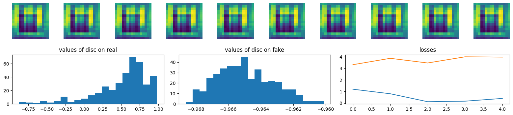


 Of course after such a poor training the results are not even close to look like real faces, but we can see that the discriminator has already learned something, since it almost pefectly classifies the real and fake images. In the next task we will play with a model that has been trained for a longer time. 


### 4\. Our own "This person does not exist" : Playing with a pre\-trained model


The developers of this project have trained a  `WGAN_GP`  model just as you did in the last task, but for a larger number of epoch (150\), of a larger number of steps (200\) with a small learning rate (.0001\) and stored 


* The weights of the generator in a file  [generator.h5](.//data/generator.h5)
* The weights of the discriminator in a file  [discriminator.h5](./data/discriminator.h5)


The aim of this task is to recover the  `WGAN_GP`  model from these weights, and then to play a little bit in the main with this model.
 


## **Replace the weights**


 Update your class  `WGAN_GP`  by adding a method  `replace_weight(self,gen_h5,disc_h5)`  that allows you to : 


* replace the weights of the generator by the ones that have been stored in the `.h5` file `gen_h5`
* replace the weights of the discriminator by the ones that have been stored in the `.h5` file `gen_h5`


  

## **Main 1**


```
$ cat 0-main.py
    #!/usr/bin/env python3
    
    import numpy as np
    import tensorflow as tf
    import random
    import matplotlib.pyplot as plt
    
    WGAN_GP = __import__('4-wgan_gp').WGAN_GP
    convolutional_GenDiscr = __import__('3-generate_faces').convolutional_GenDiscr
    
    
    ## Regulating the seed
    
    def set_seeds(seed) :
        random.seed(seed)
        np.random.seed(seed)
        tf.random.set_seed(seed)
    
    def normal_generator(nb_points, dim) :
        return tf.random.normal(shape=(nb_points, dim))
    
    
    ## Load the pictures from small_res_faces_10000
    
    array_of_pictures=np.load("small_res_faces_10000.npy")
    array_of_pictures=array_of_pictures.astype("float32")/255
    
    ## Center and Normalize the data
    
    mean_face=array_of_pictures.mean(axis=0)
    centered_array = array_of_pictures - mean_face
    multiplier=np.max(np.abs(array_of_pictures),axis=0)
    normalized_array = centered_array/multiplier
    
    ## An example of a large real sample
    
    latent_generator  =  lambda k : normal_generator(k, 16)
    
    real_ex = tf.convert_to_tensor(normalized_array,dtype="float32")
    
    ## Visualize the fake faces : Code to generate the first picture
    
    def recover(normalized) :
        return normalized*multiplier+mean_face
    
    def plot_400(G) :
        Y=G.get_fake_sample(400)
        Z=G.discriminator(Y)
        Znu=Z.numpy()
        Ynu=Y.numpy()
        inds=np.argsort(Znu[:,0])
        H=Ynu[inds,:,:,0]
        fig,axes=plt.subplots(20,20,figsize=(20,20))
        fig.subplots_adjust(top=0.95)
        fig.suptitle("fake faces")
        for i in range(400) :
            axes[i//20,i%20].imshow(recover(H[i,:,:]))
            axes[i//20,i%20].axis("off")
        plt.show()
    
    ## LET'S GO
    
    set_seeds(0)
    generator,discriminator = convolutional_GenDiscr()
    G=WGAN_GP(generator,discriminator,latent_generator, real_ex,batch_size=200, disc_iter=2,learning_rate=.001)
    G.replace_weights("generator.h5","discriminator.h5")
    plot_400(G)
    
    $ ./0-main.py
    
```

should produce :


[](./data/xv1vdz.png)


## **Main 2**


```
$ cat 1-main.py
    #!/usr/bin/env python3
    
    import numpy as np
    import tensorflow as tf
    import random
    import matplotlib.pyplot as plt
    
    WGAN_GP = __import__('4-wgan_gp').WGAN_GP
    convolutional_GenDiscr = __import__('3-generate_faces').convolutional_GenDiscr
    
    
    ## Regulating the seed
    
    def set_seeds(seed) :
        random.seed(seed)
        np.random.seed(seed)
        tf.random.set_seed(seed)
    
    def normal_generator(nb_points, dim) :
        return tf.random.normal(shape=(nb_points, dim))
    
    
    ## Load the pictures from small_res_faces_10000
    
    array_of_pictures=np.load("small_res_faces_10000.npy")
    array_of_pictures=array_of_pictures.astype("float32")/255
    
    ## Center and Normalize the data
    
    mean_face=array_of_pictures.mean(axis=0)
    centered_array = array_of_pictures - mean_face
    multiplier=np.max(np.abs(array_of_pictures),axis=0)
    normalized_array = centered_array/multiplier
    
    ## An example of a large real sample
    
    latent_generator  =  lambda k : normal_generator(k, 16)
    
    real_ex = tf.convert_to_tensor(normalized_array,dtype="float32")
    
    ## Visualize the fake faces : Code to generate the first picture
    
    def recover(normalized) :
        return normalized*multiplier+mean_face
    
    def segment(ab,n):
        x=np.linspace(0,1,n)
        return (1-x)[:,None]*ab[0,:][None,:]+x[:,None]*ab[1,:][None,:]
    
    
    def plot_segment(G,ab,n) :
        lats=tf.convert_to_tensor(segment(ab,n))
        Y=G.generator(lats)[:,:,:,0]
        fig,axes=plt.subplots(1,n,figsize=(n+1,1))
        fig.subplots_adjust(top=0.8)
        fig.suptitle("segment")
        for i in range(n) :
            axes[i].imshow(recover(Y[i,:,:]))
            axes[i].axis("off")
        plt.savefig("segment.png")
        plt.show()
    
    
    ## LET'S GO
    
    set_seeds(18)
    generator,discriminator = convolutional_GenDiscr()
    G=WGAN_GP(generator,discriminator,latent_generator, real_ex,batch_size=200, disc_iter=2,learning_rate=.001)
    G.replace_weights("generator.h5","discriminator.h5")
    
    ab=np.random.randn(32).reshape([2,16])
    plot_segment(G,ab,20)
    
    $ ./1-main.py
    
```

should produce :


[](./data/c3i5ji.png)


  
  

  

 Then we can project the cloud on the orthogonal complement V1 to I0. We get a cloud in V1, and we can iterate the procedure : we find the unitary vector I1 and so on.
   

 If we pursue this procedure, we obtain an orthonormal basis (I0,…,I255) of V.
   

 In general, these vectors Ik are called the principal components of the cloud.
   

 Each vector I∈V has a unique decomposition I\=x0(I)⋅I0\+⋯\+x255(I)⋅I255, where xk(I) is the scalar product of I with Ik.
   

 The xk‘s are features of our dataset. These features are called the principal coordinates, and are by construction uncorrelated (in the sense that their covariance cov(xi,xj)\=E(xixj)−E(xi)E(xj)is null).
 
  


 **The distribution of the principal coordinates**   
  


Let’s have a look at the 49 first principal coordinates. In order to make the comparison with the normal distribution easier we will rescale these coordinates by their standard deviation (so after this modification the principal coordinates will satisfy E(xi)\=0 and std(xi)\=1, just as the standard normal distribution does). 


```
flat=array_of_pictures.reshape(10000,256)
    from sklearn.decomposition import PCA
    pca = PCA(n_components=49)
    pca.fit(flat)
    X=pca.transform(flat)
    X/=np.std(X,axis=0)
    
    from scipy.stats import norm
    x=np.linspace(-5,5,50)
    y=norm.pdf(x)
    
    fig,axes=plt.subplots(7,7,figsize=(21,11))
    for i in range(49) :
        axes[i//7,i%7].hist(X[:,i],density=True, bins=40)
        axes[i//7,i%7].plot(x,y, color="magenta")
    plt.show()
    
```


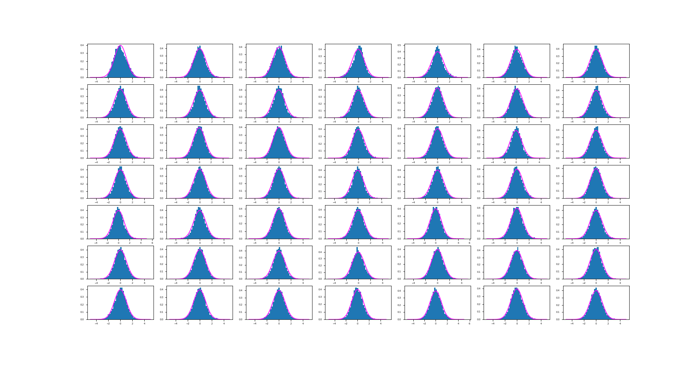


 We observe that all the principal coordinates are close to have a normal distribution. So our cloud of faces might well be a gaussian cloud (in other words, a sample for a gaussian random vector), and we might create fake faces by just sampling from this gaussian random vector:


  
  


**The PCA generator**


```
class PCA_generator() :
        def __init__(self,array_of_pictures,depth):
            self.arr    = array_of_pictures
            self.depth  = depth
           
            self.n_ims        = self.arr.shape[0]
            self.im_dims      = self.arr.shape[1:]
            self.prod_im_dims = np.prod(self.im_dims)
           
            self.mean_face   = self.arr.mean(axis=0)
            self.centered    = self.arr-self.mean_face
            self.flat        = self.centered.reshape(self.n_ims, self.prod_im_dims)
            self.pca         = PCA(n_components=self.depth)
            self.transformed = self.pca.fit_transform(self.flat)
            self.stds        = np.std(self.transformed,axis=0)
           
        def get_centered_sample_from_coords(self,coords) :
            return self.pca.inverse_transform(coords).reshape([coords.shape[0]]+list(self.im_dims))
       
        def get_fake_sample(self,k) :        
            return self.get_centered_sample_from_coords(np.random.randn(k,self.depth)*self.stds)+self.mean_face
       
        def plot_100_fake(self):
            plot_100(self.get_fake_sample(100),f"PCA fake faces (depth={self.depth})")
           
        def plot_100_reconstructed_real(self) :
            H=self.get_centered_sample_from_coords(self.transformed[:100])+self.mean_face
            plot_100(H,f"PCA reconstructed real faces (depth={self.depth})")
                 
    array_of_pictures=np.load("faces/small_res_faces_10000.npy")
    array_of_pictures=array_of_pictures.astype("float32")/255
    
    G=PCA_generator(array_of_pictures,128)
    G.plot_100_fake()
    G.plot_100_reconstructed_real()
    
```


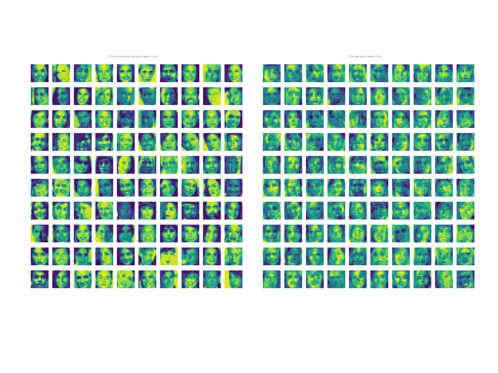


 While the reconstruction is quite faithful, the generated fake faces are unsatisfactory compared to the ones generated by our GAN. Even when choosing larger depths, the phenomenon persists. So there is something we have to understand, there.


  
  


**Distribution of sum of squares**


It is well known that the sum of squares of k uncorrelated standard normal random variables should follow a χk2 distribution. Let’s check:


```
plt.hist(np.sum(np.square(X),axis=1),bins=100,density=True)
    from scipy.stats import chi2
    x=np.linspace(0,200,100)
    plt.plot(x, chi2.pdf(x, 49))
    plt.savefig("not_chi2.png")
    plt.show()
    
```


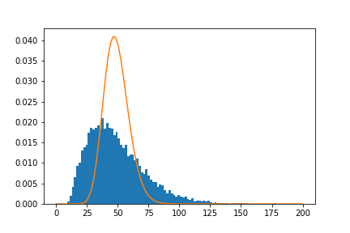


 Surprise !!! It doesn’t work !!! What is the problem ? Let’s check the theorem on the [wikipedia page](https://en.wikipedia.org/wiki/Chi-squared_distribution) for this distribution:
   

  


**Theorem** *The sum of k **independent** standard normal random variables follows a χk2 distribution.*


  


 So, even if they are uncorrelated, the principal coordinates are not independent ! To give further evidence for this fact, let us now shuffle the values in each of our columns, thus enforcing the columns to be independent. If the original columns were independent, the distribution of the sum of the squares of the lines should be very close before and after this shuffling.


```
Y=X.copy()
    for i in range(49) :
        np.random.shuffle(Y[:,i])
    plt.hist(np.sum(np.square(Y),axis=1),bins=100,density=True)
    from scipy.stats import chi2
    x=np.linspace(0,200,100)
    plt.plot(x, chi2.pdf(x, 49))
    plt.savefig("chi2.png")
    plt.show()
    
```


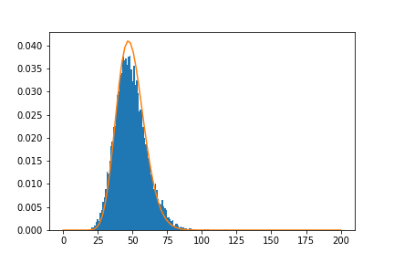


 So we are now convinced : the principal coordinates are not independent. And this is the exact reason why even in the simple case of (16,16\) greyscale pictures, GANs are superior to PCA : they are able to **detect** and **respect** the dependencies between these principal coordinates. As an evidence for this last affirmation, let us draw the same graph for a fake sample:


```
G.replace_weights("generator.h5","discriminator.h5")
    
    from sklearn.decomposition import PCA
    H=G.get_fake_sample(10000).numpy()[:,:,:,0]
    flat=H.reshape(10000,256)
    pca = PCA(n_components=49)
    pca.fit(flat)
    X=pca.transform(flat)
    X=X/np.std(X,axis=0)
    
    plt.hist(np.sum(np.square(X),axis=1),bins=100,density=True)
    from scipy.stats import chi2
    x=np.linspace(0,200,100)
    plt.plot(x, chi2.pdf(x, 49))
    plt.savefig("not_chi2.png")
    plt.show()
    
```


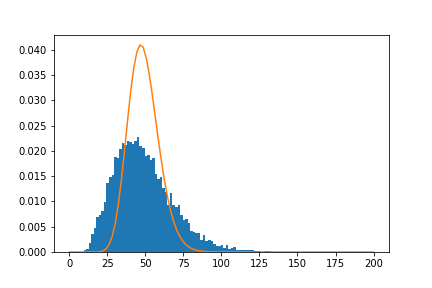


That’s all !!!


